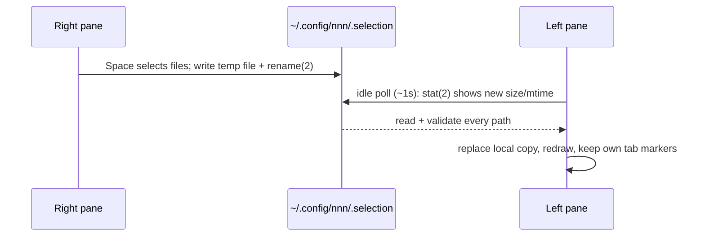

<h3 align="center"><br>nnn - <i>Supercharge your productivity!</i></h3>

<p align="center">
<a href="https://github.com/jarun/nnn/releases/latest"></a>
<a href="https://repology.org/project/nnn/versions"></a>
<a href="https://circleci.com/gh/jarun/workflows/nnn"></a>
<a href="https://github.com/jarun/nnn/actions"></a>
<a href="https://en.wikipedia.org/wiki/Privacy-invasive_software"></a>
<a href="https://github.com/jarun/nnn/blob/master/LICENSE"></a>
</p>

<p align="center"><a href="https://github.com/user-attachments/assets/541ca36d-ae26-49fb-97da-d1f7a12d4b9a"></a></p>

<h3 align="center">[<a
href="https://github.com/jarun/nnn#features">Features</a>] [<a
href="https://github.com/jarun/nnn#quickstart">Quickstart</a>] [<a
href="https://github.com/jarun/nnn/tree/master/plugins#nnn-plugins">Plugins</a>] [<a
href="https://github.com/jarun/nnn/wiki">Wiki</a>]</h3>

`nnn` (_n³_) is a full-featured terminal file manager. It's tiny, nearly 0-config and [incredibly fast](https://github.com/jarun/nnn/wiki/Performance).

It is designed to be unobtrusive with smart workflows to match the trains of thought.

`nnn` can analyze disk usage, batch rename, launch apps and pick files. The plugin repository has tons of plugins to extend the capabilities further e.g. [live previews](https://github.com/jarun/nnn/wiki/Live-previews), (un)mount disks, find & list, file/dir diff, upload files. A [patch framework](https://github.com/jarun/nnn/tree/master/patches) hosts sizable user-submitted patches which are subjective in nature.

Independent (neo)vim plugins - [nnn.vim](https://github.com/mcchrish/nnn.vim), [vim-floaterm nnn wrapper](https://github.com/voldikss/vim-floaterm#nnn) and [nnn.nvim](https://github.com/luukvbaal/nnn.nvim) (neovim exclusive).

Runs on the Pi, [Termux](https://www.youtube.com/embed/AbaauM7gUJw) (Android), Linux, macOS, BSD, Haiku, Cygwin, WSL, across DEs or a strictly CLI env.

[_(more use cases)_](https://github.com/jarun/nnn/wiki/Basic-use-cases#the_nnn-magic)

## Features

- Quality
  - Privacy-aware (no unconfirmed user data collection)
  - POSIX-compliant, follows Linux kernel coding style
  - Highly optimized, static analysis integrated code
- Frugal
  - Typically needs less than 3.5MB resident memory
  - Works with 8 colors (and xterm 256 colors)
  - Disk-IO sensitive (few disk reads and writes)
  - No FPU usage (all integer maths, even for file size)
  - Minimizes screen refresh with fast line redraws
  - Tiny binary (typically around 100KB)
  - 1-column mode for smaller terminals and form factors
  - Hackable - compile in/out features and dependencies
- Portable
  - Language-agnostic plugins
  - Static binary available (no need to install)
  - Minimal library deps, easy to compile
  - No config file, minimal config with sensible defaults
  - Plugin to backup configuration
  - Widely available on many packagers
  - Touch enabled, handheld-friendly shortcuts
  - Unicode support
- Modes
  - Light (default), detail
  - Disk usage analyzer (block/apparent)
  - File picker, (neo)vim plugin
- Navigation
  - Filter with automatic dir entry on unique match
  - *Type-to-nav* (turbo navigation/always filter) mode
  - Jump to an entry with visible relative offset
  - Contexts (_aka_ tabs/workspaces) with custom colors
  - Sessions, bookmarks, mark and visit a dir
  - Remote mounts (needs `sshfs`, `rclone`)
  - Familiar shortcuts (arrows, <kbd>~</kbd>, <kbd>-</kbd>, <kbd>@</kbd>), quick look-up
  - `cd` on quit (*easy* shell integration)
  - Proceed to next file on file open and selection
- Search
  - Instant filtering with *search-as-you-type*
  - Fuzzy, regex (POSIX/PCRE2) and string (default) filters
  - Subtree search plugin to open or edit files
- Sort
  - Ordered pure numeric names by default (visit `/proc`)
  - Case-insensitive version (_aka_ natural) sort
  - By name, access/change/mod (default) time, size, extn
  - Reverse sort
  - Directory-specific ordering
- Mimes
  - Preview hovered files in FIFO-based previewer
  - Open with desktop opener or specify a custom opener
  - File-specific colors (or minimal _dirs in context color_)
  - Icons and Emojis support (customize and compile-in)
  - Plugin for image, video and audio thumbnails
  - Create, list, extract (to), mount (FUSE based) archives
  - Option to open all text files in `$EDITOR`
- Convenience
  - Detailed file stats and mime information
  - Run plugins and custom commands with hotkeys
  - FreeDesktop compliant trash utility integration
  - Cross-dir file/all/range selection
  - Create (with parents), rename, duplicate files and dirs
  - Create new file or directory (tree) on startup
  - Batch renamer for selection or dir
  - List input stream of file paths from stdin or plugin
  - Copy (as), move (as), delete, archive, link selection
  - Easily copy, move paths in system clipboard to current dir
  - Dir updates, notification on `cp`, `mv`, `rm` completion
  - Copy file paths to system clipboard on select
  - Launch apps, run commands, spawn a shell, toggle exe
  - Access context paths/files at prompt or spawned shell
  - Lock terminal after configurable idle timeout
  - Capture and show output of a program in help screen
  - Basic support for screen readers and braille displays

## Quickstart

1. [Install](https://github.com/jarun/nnn/wiki/Usage) `nnn` and the dependencies you need.
2. The desktop opener is default. Use `-e` to open text files in the terminal. Optionally [open detached](https://github.com/jarun/nnn/wiki/Basic-use-cases#detached-text).
3. Configure [`cd` on quit](https://github.com/jarun/nnn/wiki/Basic-use-cases#configure-cd-on-quit).
4. [Sync subshell `$PWD`](https://github.com/jarun/nnn/wiki/Basic-use-cases#sync-subshell-pwd) to `nnn`.
5. [Install plugins](https://github.com/jarun/nnn/tree/master/plugins#installation).
6. Use `-x` to sync selection to clipboard, show notis on `cp`, `mv`, `rm` and set xterm title.
7. For a CLI-only environment, set [`NNN_OPENER`](https://github.com/jarun/nnn/wiki/Usage#configuration) to [`nuke`](https://github.com/jarun/nnn/blob/master/plugins/nuke). Use option `-c`.
8. Bid `ls` goodbye! `alias ls='nnn -de'` :sunglasses:
9. Visit the [Live previews](https://github.com/jarun/nnn/wiki/Live-previews) and [Troubleshooting](https://github.com/jarun/nnn/wiki/Troubleshooting) Wiki pages.

Don't memorize! Arrows, <kbd>/</kbd>, <kbd>q</kbd> suffice. <kbd>Tab</kbd> creates and/or cycles contexts. <kbd>?</kbd> lists shortcuts.

[](https://www.youtube.com/embed/-knZwdd1ScU)

[](https://github.com/jarun/nnn/wiki)

## Videos

- [nnn file manager on Termux (Android)](https://www.youtube.com/embed/AbaauM7gUJw)
- [NNN File Manager](https://www.youtube.com/embed/1QXU4XSqXNo)
- [This Week in Linux 114 - TuxDigital](https://www.youtube.com/watch?v=5W9ja0DQjSY&t=2059s)
- [nnn file manager basics - Linux](https://www.youtube.com/embed/il2Fm-KJJfM)
- [I'M GOING TO USE THE NNN FILE BROWSER! 😮](https://www.youtube.com/embed/U2n5aGqou9E)
- [NNN: Is This Terminal File Manager As Good As People Say?](https://www.youtube.com/embed/KuJHo-aO_FA)
- [nnn - A File Manager (By Uoou, again.)](https://www.youtube.com/embed/cnzuzcCPYsk)

## Elsewhere

- [AddictiveTips](https://www.addictivetips.com/ubuntu-linux-tips/navigate-linux-filesystem/)
- [ArchWiki](https://wiki.archlinux.org/index.php/Nnn)
- [FOSSMint](https://www.fossmint.com/nnn-linux-terminal-file-browser/)
- [gHacks Tech News](https://www.ghacks.net/2019/11/01/nnn-is-an-excellent-command-line-based-file-manager-for-linux-macos-and-bsds/)
- Hacker News [[1](https://news.ycombinator.com/item?id=18520898)] [[2](https://news.ycombinator.com/item?id=19850656)]
- [It's FOSS](https://itsfoss.com/nnn-file-browser-linux/)
- [Linux Format Issue 265; Manage files with nnn](https://linuxformat.com/archives?issue=265)
- LinuxLinks [[1](https://www.linuxlinks.com/nnn-fast-and-flexible-file-manager/)] [[2](https://www.linuxlinks.com/bestconsolefilemanagers/)] [[3](https://www.linuxlinks.com/excellent-system-tools-nnn-portable-terminal-file-manager/)]
- [Linux Magazine; FOSSPicks](https://www.linux-magazine.com/Issues/2017/205/FOSSPicks/(offset)/15)
- [Make Tech Easier](https://www.maketecheasier.com/nnn-file-manager-terminal/)
- [Opensource.com](https://opensource.com/article/22/12/linux-file-manager-nnn)
- [Open Source For You](https://www.opensourceforu.com/2019/12/nnn-this-feature-rich-terminal-file-manager-will-enhance-your-productivity/)
- [PCLinuxOS Magazine Issue June 2021](https://pclosmag.com/html/Issues/202106/page08.html)
- [Suckless Rocks](https://suckless.org/rocks/)
- [Ubuntu Full Circle Magazine Issue 135; Review: nnn](https://fullcirclemagazine.org/issue-135/)
- [Using and Administering Linux: Volume 2: Zero to SysAdmin: Advanced Topics](https://books.google.com/books?id=MqjDDwAAQBAJ&pg=PA32)
- [Wikipedia](https://en.wikipedia.org/wiki/Nnn_(file_manager))

## Developers

- [Arun Prakash Jana](https://github.com/jarun) (Copyright © 2016-2026)
- [0xACE](https://github.com/0xACE)
- [Anna Arad](https://github.com/annagrram)
- [KlzXS](https://github.com/KlzXS)
- [Léo Villeveygoux](https://github.com/leovilok)
- [Luuk van Baal](https://github.com/luukvbaal)
- [NRK](https://codeberg.org/NRK)
- [Sijmen J. Mulder](https://github.com/sjmulder)
- and other contributors

Visit the [Tracker](https://github.com/jarun/nnn/issues/1546) thread for a list of features in progress and anything up for grabs. Feel free to [discuss](https://github.com/jarun/nnn/discussions) new ideas or enhancement requests.

---

# 🚀 Fork Enhancements

This fork adds five major features on top of upstream nnn: **Drag-and-Drop** (via `dragon` and the kitty OSC-72 protocol), an **unlimited cross-instance directory history**, **session backup/restore and management**, a **CWD guard** that protects against a subtle Unix shell trap, and a **shared selection across panes and tabs** (editable, live-synced, with a per-tab marker). The first four are designed to minimize merge friction with upstream: each is either behind a build flag or compiled in but inert until you set its env var, so a default build behaves like upstream. The shared-selection work is different: it is always compiled in **and** active by default (it changes how the selection file is read and written), and it is turned off at runtime with `NNN_NO_SELSYNC=1`.

---

## ◈ Drag-and-Drop (DnD)

Drag files **OUT** of nnn into GUI apps (browsers, file managers, chat uploads, image editors), and drop files **IN** from GUI apps. A TUI owns no window, so drag-and-drop must be delegated.

Two paths are supported, and they are **not** alternatives that get auto-selected — they are triggered by **different user actions** and you pick between them by *how you start the drag*:

| Path | You trigger it with | What performs the drag |
|------|---------------------|------------------------|
| **dragon** — external GUI helper | the <kbd>D</kbd> key (or `;d`) | [`dragon`](https://github.com/mwh/dragon), a small GTK3 window |
| **kitty OSC-72** — in-terminal protocol | a **mouse drag** directly on the pane | kitty itself, over escape codes |

> **Decision (2026-08-03): `nnn-dnd` is retired.**
> This fork used to ship `nnn-dnd`, a bundled libX11 XDND helper ([src/nnn-dnd.c](src/nnn-dnd.c)). It is **no longer the preferred path and is not installed**. The source stays in-tree and `build.sh` still passes `O_DND=1`, so the binary is still produced next to `nnn` — but because it is not on `$PATH`, both `getutil("nnn-dnd")` in [src/nnn.c](src/nnn.c) and the `type nnn-dnd` probe in [plugins/dragdrop](plugins/dragdrop) fail, and every <kbd>D</kbd> drag falls through to `dragon`. That fall-through **is** the supported configuration now. To make the retirement explicit you may drop `O_DND=1` from `build.sh`; nothing else changes.

### Why a TUI Cannot "Just Drag" by Itself

Drag-and-drop on X11 (XDND) and Wayland (`wl_data_device`) is a window-to-window conversation — the display server delivers DnD messages to the window under the pointer. That window belongs to the **terminal emulator**, not to nnn. nnn is a pty-bound process: everything it receives arrives as bytes through the pty, and it has no drawing surface the display server can address. So a TUI must delegate DnD to something that *does* own a window — either a helper GUI process (`dragon`) or the terminal emulator itself via escape codes (OSC-72).

### Path 1 — `dragon` (the <kbd>D</kbd> key)

<kbd>D</kbd> (`SEL_DRAGDROP`) prompts **drag out (d) / receive (r)**, then hands off to the [`dragdrop`](plugins/dragdrop) plugin, which opens a `dragon` window.

| Direction | Flow |
|-----------|------|
| **Drag OUT** | nnn sets `NNN_DND_MODE=drag` and runs the plugin, which launches `dragon` in the background with the selection (or, with nothing selected, the hovered file). A small GTK window appears; you drag **from that window** into the target app. nnn never blocks. |
| **Drop IN** | nnn sets `NNN_DND_MODE=receive`; the plugin runs `dragon -x --print-path --target` in the **foreground**. Drag files from a GUI app onto that window; the received paths are appended to the selection and shown back in nnn as a fresh list via `$NNN_PIPE`. Web URLs are fetched with `curl` into the current directory. |

**Helper resolution order** in [plugins/dragdrop](plugins/dragdrop) is `nnn-dnd` → `dragon-drag-and-drop` → `dragon-drop` → `dragon` → `ripdrag`. With `nnn-dnd` retired, `dragon` wins.

**Notes and known rough edges:**

- The drag-out window for a **single hovered file** is spawned without `-x`, so it stays open until you close it. Repeated drags accumulate windows (`wmctrl -lx | grep -i dragon` to list them).
- The **receive** branch truncates the shared selection file before listening, so a pending cross-pane selection is cleared when you press <kbd>D</kbd> <kbd>r</kbd>. See § Shared Selection Across Panes and Tabs.
- `dragon` is GTK3 and needs `$DISPLAY` (or XWayland). It is unrelated to `NNN_DND_OSC72` and works whether or not that variable is set.

### Path 2 — kitty OSC-72 Terminal Protocol (in-process, no helper)

An in-process escape-code protocol. nnn writes OSC 72 sequences to the terminal, and **kitty** performs the real window-system drag on its behalf. **Zero helper, zero libX11, works over SSH and inside tmux.**

> **There is no key binding for this path.** OSC-72 drag-out is started **only** by a mouse drag on the pane. Pressing <kbd>D</kbd> will *never* exercise it — <kbd>D</kbd> always goes to `dragon`. This is the single most common source of "OSC-72 doesn't work" reports; see § Troubleshooting Drag-and-Drop.

**Protocol overview (drag-OUT direction):**

```
EnableDrag (once at startup) -> user mouse-drags on the pane
-> kitty sends an inbound OFFER (t=o) -> nnn answers agree + present + start
-> kitty replies t=E;OK and performs the OS drag -> kitty reports t=e:x=4 when done
```

The protocol is **mouse-gesture-driven and bidirectional**: nnn declares itself a drag source once; the **user's mouse gesture** triggers the drag; the terminal sends nnn an inbound offer that nnn must answer.

**Prerequisites:**

- **kitty ≥ 0.47.0** — the version that introduced the protocol, per kitty's own spec (`.. versionadded:: 0.47.0` in `dnd-protocol.rst`). Verified working here on **kitty 0.47.4**.
- **Opt-in** via `NNN_DND_OSC72=1` (enabling it changes the terminal's mouse-gesture handling, and costs a 100 ms <kbd>Esc</kbd> peek — see below).
- Inside **tmux**: `set -g allow-passthrough on` (tmux 3.3+). Verified working here on **tmux 3.7b**, in both directions, with `mouse on`.
- **Debug log:** `NNN_DND_DEBUG=/tmp/nnn-dnd.log` (or `=1` for that default path) traces every inbound and outbound OSC-72 event to a file without corrupting the curses screen.

**Cost of the opt-in.** While the drag source is registered, nnn waits **100 ms** after a bare <kbd>Esc</kbd> instead of 0 ms, so that a `ESC ] 72 ; … ST` event split across reads is not mistaken for a lone Escape ([src/nnn.c](src/nnn.c), `nextsel()`). <kbd>Esc</kbd> therefore feels slightly less immediate with `NNN_DND_OSC72=1` than without it.

**Five bugs discovered and fixed during implementation (see [docs/nnn_Problems_And_Solutions.md](docs/nnn_Problems_And_Solutions.md) Problems 2–7):**

| # | Mistake | Effect | Fix |
|---|---------|--------|-----|
| 1 | Emitted drag on keypress instead of mouse gesture | Garbage + EPERM | Reimplemented as gesture-driven (bidirectional) |
| 2 | Wrote agree/present/start as separate writes | Interleaved bytes corrupt the drag build | Single atomic write |
| 3 | Emitted padded base64 (`=`) | kitty rejects padding; "error decoding base64" | Unpadded base64 |
| 4 | Advertised real hostname as machine-id | kitty treats drag as remote, asks for file contents → stall | Empty machine-id (local) |
| 5 | No drag icon | No visual feedback | Text icon label |

**Additional fixes for robustness:**

- **Post-subprocess resync** — a curses-suspending subprocess (`F_NORMAL` spawns: opener, pager, editor, plugins) makes kitty forget nnn is a drag source; a `g_dnd_resync` flag re-sends EnableDrag on return. Detached GUI openers (`F_NOWAIT`) never suspend curses and so never need it.
- **tmux pane-border protection, with a crash-proof restore** — dragging across a tmux pane boundary would resize panes, so nnn turns tmux's mouse off for the duration of the drag. But `mouse` is a **global tmux server option**, so that toggle is a lock only nnn knows how to release: a `kill -9` mid-drag (no `atexit`), or a drag whose end the terminal never reports, would leave **every session, window and pane of that tmux server without a mouse, indefinitely**. So the grab is recorded *in tmux*, not only in the process:

  | Mechanism | Purpose |
  |-----------|---------|
  | `@nnn_dnd_mouse = "<pid>.<token>:<value before the grab>"` | The grab is visible to anything that can talk to the tmux server, and the **actual** previous value is restored — a user running with `mouse off` no longer has it silently switched on |
  | Watchdog armed with `tmux run-shell -b` | Runs **inside the tmux server**, so it outlives nnn. Restores within ~1 s of the owner disappearing (`kill -0` poll), and unconditionally after 60 s |
  | `<token>` in the marker | Distinguishes successive grabs by the same pid, so a stale watchdog cannot cancel a newer drag |
  | Ownership check on every restore path | Exactly one restore wins; the other pane never releases a grab it does not hold |
  | Startup repair | On the first `EnableDrag`, a marker naming a dead pid is restored and cleared — covers a crash where the watchdog itself never ran |

  Regression test: [misc/test/test-dnd-tmux-mouse.sh](misc/test/test-dnd-tmux-mouse.sh) (isolated tmux server, 21 assertions). See [docs/nnn_Problems_And_Solutions.md](docs/nnn_Problems_And_Solutions.md) Problem 13.
- **Self-drop prevention** — dropping a drag back onto nnn's own pane is a no-op for 600 ms after the drag ends (suppressed click, consumed bare `]` OSC-72 events).
- **Window focus** — on drop, emits BEL (urgency hint, always works) + attempts `kitten @ focus-window` (if kitty remote control is enabled).

### Drop-IN (Files INTO nnn from GUI apps)

Two capture paths converge on one copy/move handler:

| Mechanism | Works in tmux? | Notes |
|-----------|---------------|-------|
| **Native OSC-72** (`EnableDrop`, `t=a`) | No | Only sent when nnn is **not** inside tmux. Through tmux it would make kitty stop pasting dropped paths (killing the fallback) while the structured events are not routed back, so drops would vanish. |
| **Bracketed-paste capture** (always active) | Yes | kitty wraps the drop-paste in `ESC[200~`…`ESC[201~`; tmux forwards it. Portable. |

On drop, nnn parses paths (handles `file://` URI percent-decoding, newline/space separated, quotes, backslash escapes), keeps only existing paths, asks **c**opy or **m**ove, then reuses the exact NUL-separated `xargs -0 cp/mv ... .` command that selection copy uses. A paste with **no** real files is silently swallowed — plain text pastes no longer leak as keystrokes.

### Environment Variables

| Variable | Purpose |
|----------|---------|
| `NNN_DND_OSC72=1` | Enable kitty OSC-72 drag-and-drop (opt-in; changes terminal mouse gestures, adds a 100 ms Esc peek) |
| `NNN_DND_DEBUG=1` or `NNN_DND_DEBUG=/path/to/log` | Log all inbound/outbound OSC-72 events for diagnosis |
| `NNN_DND_MODE` | Set by nnn around the <kbd>D</kbd> key to tell the `dragdrop` plugin `drag` or `receive` and skip its own prompt. Not for manual use. |
| `O_DND=1` (build flag) | Builds the retired `nnn-dnd` helper alongside nnn. Optional; the helper is not installed or used. |

### How the Dual-Pane Setup Wires It Up

Both DnD paths are configured outside this repo, in the two scripts that start the dual-pane layout:

**`~/.dotfiles/nnn/nnn_config.sh`** — sourced by the shell, sets the shared environment for both panes:

```sh
# `d:dragdrop` binds the plugin to ;d in addition to the built-in D key
export NNN_PLUG='...;d:dragdrop;...'

export NNN_DND_OSC72=1
export NNN_DND_DEBUG=/tmp/nnn-dnd.log

alias nnn_left='/home/tripham/bin/nnn -e -a -o -r -R -i -d -H -P a -P p -s left  -S -f'
alias nnn_right='/home/tripham/bin/nnn -e -a -o -r -R -i -d -H -P a -P p -s right -S -f'
```

**`~/bin/start_dual_nnn.sh`** — splits the current tmux window and starts both panes:

```sh
export NNN_DND_OSC72=1
tmux kill-pane -a -t $TMUX_PANE
tmux split-window -h -d
tmux select-pane -t "{right-of}"; tmux send-keys 'nnn_right' Enter
tmux select-pane -t "{left-of}";  tmux send-keys 'nnn_left'  Enter
```

Both instances therefore register as OSC-72 drag sources independently and write to the **same** debug log, so `/tmp/nnn-dnd.log` interleaves events from the left and right panes. The `X=`/`Y=` pixel coordinates in an inbound offer tell you which pane the gesture landed in.

`allow-passthrough` lives in the tmux config, not in these scripts:

```sh
# ~/.config/tmux/tmux.conf.local
set -g allow-passthrough on
```

> **`on` vs `all`:** with `on`, tmux only forwards a pane's passthrough escapes while that pane is **visible**. Both dual-pane instances are in the same window, so both qualify. A pane in a background window would be silently unable to register as a drag source until you switch to it; `set -g allow-passthrough all` removes that restriction.

---

## ◈ Troubleshooting Drag-and-Drop

Work top-down. Step 0 resolves most reports on its own.

### Step 0 — Confirm which path you are actually testing

This is the most common failure, and it is not a bug:

| Symptom | Cause | Action |
|---------|-------|--------|
| Pressed <kbd>D</kbd>, a small GTK window appeared, `/tmp/nnn-dnd.log` gained nothing | You exercised **dragon**, not OSC-72. <kbd>D</kbd> never emits OSC-72. | Working as designed. To test OSC-72, **mouse-drag on the pane** instead. |
| Mouse-dragged on the pane, nothing happened, log gained nothing | OSC-72 offer never arrived | Continue to Step 1 |
| Pressed <kbd>D</kbd>, no window appeared at all | dragon problem | Jump to § Diagnosing the dragon path |

### Step 1 — Confirm the opt-in reached the running process

Environment variables cannot be injected into a process after it starts, so check the **live process**, not your shell:

```sh
pgrep -af 'nnn .*-s (left|right)'
tr '\0' '\n' < /proc/$(pgrep -f 'nnn .*-s left' | head -1)/environ \
  | grep -E 'NNN_DND|TERM=|DISPLAY'
```

Expect `NNN_DND_OSC72=1`, `NNN_DND_DEBUG=…`, `TERM=tmux-256color` (or `xterm-kitty` outside tmux), `DISPLAY=:N`. If `NNN_DND_OSC72` is missing, the instance was started before the export existed — restart it; editing `nnn_config.sh` does not affect running panes.

### Step 2 — Confirm the terminal supports the protocol

```sh
kitty --version        # need >= 0.47.0
```

### Step 3 — Probe the transport in both directions (no mouse needed)

The protocol defines its own support query, `OSC 72 ; t=q:i=<id> ST`, which a supporting terminal must answer with `OSC 72 ; t=q:i=<id> ; … ST`. That makes it possible to test the **whole round trip** without performing any gesture. Save this as `osc72_probe.py`:

```python
#!/usr/bin/env python3
"""Probe the kitty OSC-72 DnD protocol round trip. Run inside the pane you care about."""
import os, sys, termios, time

def tmux_wrap(seq):                       # tmux DCS passthrough, ESC doubled
    return "\x1bPtmux;" + seq.replace("\x1b", "\x1b\x1b") + "\x1b\\"

tty = open("/dev/tty", "r+b", buffering=0)
fd = tty.fileno()
old = termios.tcgetattr(fd); new = termios.tcgetattr(fd)
new[3] &= ~(termios.ICANON | termios.ECHO)
new[6][termios.VMIN] = 0; new[6][termios.VTIME] = 0
termios.tcsetattr(fd, termios.TCSANOW, new)
try:
    query = "\x1b]72;t=q:i=7\x1b\\"
    tty.write((tmux_wrap(query) if os.environ.get("TMUX") else query).encode())
    tty.write(b"\x1b[c")                  # DA1, deliberately unwrapped
    buf = b""; deadline = time.time() + 2.0
    while time.time() < deadline:
        chunk = os.read(fd, 4096)
        if chunk:
            buf += chunk; deadline = time.time() + 0.35
        else:
            time.sleep(0.02)
finally:
    termios.tcsetattr(fd, termios.TCSANOW, old)

print("raw reply:", buf)
print("OSC-72 answered:", b"t=q" in buf)
```

Run it **in the pane you are debugging** (it needs that pane's real tty):

```sh
python3 osc72_probe.py
```

| Reply | Meaning |
|-------|---------|
| `b'\x1b]72;t=q:i=7\x1b\\\x1b[?62;52;c'` | Healthy in bare kitty — the DnD answer arrives **before** DA1 |
| `b'\x1b[?1;2c\x1b]72;t=q:i=7\x1b\\'` | Healthy through tmux — tmux answers DA1 itself first, kitty's DnD answer follows |
| DA1 only, no `t=q` | The protocol is not reachable on this path: wrong terminal, or `allow-passthrough` off, or the pane is in a background window with `allow-passthrough on` |
| Nothing at all | Nothing is answering — check you ran it on the right tty |

> **Caveat:** kitty's spec says "if a DA1 response arrives before the query response, the terminal does not support the protocol". **That heuristic gives a false negative under tmux**, because tmux answers DA1 itself, instantly, without consulting kitty. Judge by *presence* of the `t=q` answer, not by ordering.

### Step 4 — Read the debug log signatures

```sh
: > /tmp/nnn-dnd.log      # clear, then reproduce
tail -f /tmp/nnn-dnd.log
```

A healthy drag-out is exactly four beats:

```
72;t=o:x=65:y=26:X=1186:Y=969                     <- kitty: gesture -> offer (cell + pixel coords)
out: \e]72;t=o:o=3;text/uri-list\e\ … t=p … t=P:x=-1\e\
offer -> agree + present + start (batched)        <- nnn: one atomic answer
72;t=E:m=0;OK                                     <- kitty: drag started
72;t=e:x=4:y=0                                    <- kitty: finished (y=1 = user cancelled)
drag finished
```

| Log line | Meaning | What to do |
|----------|---------|------------|
| `enable sent (drag offering on)` and nothing else, ever | nnn registered as a drag source but **no gesture was ever recognised** | You are almost certainly pressing <kbd>D</kbd> instead of mouse-dragging. See Step 0. |
| No `enable sent` at all | `NNN_DND_OSC72` is not `1` in the process | Step 1 |
| `offer -> nothing to drag` | Empty directory and nothing selected | Hover a file or select some |
| `offer ignored (just ended)` | Within 600 ms of the previous drag — the self-drop guard | Wait a moment and drag again |
| `offer ignored (drag already active)` | A previous drag never received its `t=e:x=4` end event | Open any file and return (forces a resync), or restart the pane |
| `status t=E (OK or error)` with a payload that is not `OK` | kitty refused: `EPERM` (gesture already over, or self-drop), `EFBIG`/`ENOMEM` (payload too large) | Read the raw line above it for the error name |
| `72;t=e:x=4:y=1` | The drag was **cancelled by the user** — released over nothing that accepts the drop | Drop onto an app that accepts `text/uri-list` |
| `72;t=e:x=5:y=0` then `data request -> sent` | kitty asked for the data separately instead of using the pre-sent copy | Normal; not an error |

To decode what was actually offered:

```sh
b64=$(grep -o 'ZmlsZTov[A-Za-z0-9+/]*' /tmp/nnn-dnd.log | tail -1)
pad=$(( (4 - ${#b64} % 4) % 4 ))            # nnn emits UNPADDED base64 by design
printf '%s%*s' "$b64" $pad '' | tr ' ' '=' | base64 -d
```

### Step 5 — Environment-level checks

```sh
tmux -V                                    # need >= 3.3 for allow-passthrough
tmux show -p allow-passthrough             # expect: allow-passthrough on
tmux show -g mouse                         # 'on' is fine, kitty still detects the gesture
tmux show -gv @nnn_dnd_mouse               # expect: "invalid option" (no drag holds the mouse)
echo "$XDG_SESSION_TYPE $DISPLAY $WAYLAND_DISPLAY"
```

**If the mouse stopped working in tmux entirely** (no pane selection, no scroll, in *any* window), a drag grabbed it and the grab was not released:

```sh
tmux show -gv @nnn_dnd_mouse       # e.g. "38608.1:on" -> pid 38608 holds it, it was 'on' before
tmux set -g mouse on               # manual escape hatch
tmux set -gu @nnn_dnd_mouse
```

This should now self-heal: the watchdog restores within ~1 s of the owning nnn dying and after 60 s regardless, and the next nnn start repairs a marker whose pid is gone. If you ever have to run the commands above by hand, that is a bug worth reporting — note whether `@nnn_dnd_mouse` was set and which pid it named.

Verified-good reference environment for this setup:

| Component | Version / value |
|-----------|-----------------|
| kitty | 0.47.4 |
| tmux | 3.7b, `allow-passthrough on`, `mouse on` |
| Session | X11 (`XDG_SESSION_TYPE=x11`, `DISPLAY=:1`), GNOME Shell |
| nnn | this fork, built by `build.sh` |

> **`mouse on` is not a blocker.** It is reasonable to assume that tmux's mouse tracking would swallow the drag gesture before kitty could see it. Measured here, it does not: inbound offers arrive with `mouse on`, carrying correct cell coordinates. nnn only turns tmux's mouse off *after* an offer arrives, to stop pane-border resizes mid-drag.

### Diagnosing the dragon path

```sh
type dragon dragon-drop dragon-drag-and-drop ripdrag 2>&1   # which helper wins
type nnn-dnd                                                 # expected: not found (retired)
DISPLAY=:1 wmctrl -lx | grep -i dragon                       # is a window actually mapped?
ps -ef | grep '[d]ragon'                                     # leftover windows from earlier drags
```

| Symptom | Cause | Fix |
|---------|-------|-----|
| No window appears | `$DISPLAY` unset in the nnn process, or no helper found | Check Step 1's `DISPLAY`; install `dragon` |
| Windows pile up | The single-file drag-out branch spawns without `-x`, by design | Close them, or select the file first so the `--all` branch runs |
| Selection vanished after <kbd>D</kbd> <kbd>r</kbd> | The receive branch truncates the shared selection file first | Expected; re-select after receiving |
| Plugin runs but nothing happens | Errors are hidden by `2>/dev/null` in the plugin | Run the helper by hand: `dragon --verbose <file>` |

### Quick decision table

| Question | Answer |
|----------|--------|
| I want a drag I can aim carefully, or I am not on kitty | Use <kbd>D</kbd> → dragon |
| I want to drag straight out of the listing with no extra window | Use the mouse on the pane → OSC-72 |
| I am on SSH | OSC-72 (dragon needs a local X display) |
| I need to drop files **into** nnn | Either: <kbd>D</kbd> <kbd>r</kbd> (dragon target window), or just drop onto the pane (bracketed-paste capture) |

---

## ◈ Unlimited Cross-Instance Directory History

An **append-only shared visit log** that records every directory change across **all 8 contexts (tabs), both tmux panes, and across sessions**. Navigable via an fzf picker plugin.

### How It Works

- **One C hook** at the `begin:` choke point in `browse()` appends a TSV record (`timestamp | instance_id | session | ctx | path`) to `~/.config/nnn/.dirhistory` on every real directory change.
- **All nnn instances** write to the **same file** → the history is global across panes and restarts.
- **Lockless append** (single `write()` in `O_APPEND` mode, atomic for records < `PIPE_BUF`).

### The Picker Plugin — `nnn-history` (bound to `;h`)

1. Reads the shared log, deduplicates by path (keeping newest visit).
2. Labels entries by source: `[live L ctx3]` / `[past R ctx1]`.
3. Shows newest at the bottom (fzf), lets the user filter by pane/session/context.
4. On selection, writes `0c<path>` to `$NNN_PIPE` → instance jumps there.

### Compaction

Run `nnn-history --compact` (opportunistically when the file exceeds a threshold): takes `flock` on `.dirhistory.lock`, keeps the last N unique paths, atomic `rename()`.

### Build and Config

- **Build:** `make O_HIST=1` enables the visit-recorder C hook.
- **Env:** `NNN_HIST=global` turns it on; unset = off (upstream behaviour).
- **Plugin binding:** add `;h:nnn-history` to `NNN_PLUG`.
- **Path:** `~/.config/nnn/.dirhistory` (file mode `0600` for privacy).

For the full design, see [docs/Brainstorm_nnn_Support_Unlimited_History.md](docs/Brainstorm_nnn_Support_Unlimited_History.md).

---

## ◈ Session Backup, Restore and Management

Upstream nnn can *save*, *load* and *restore* one session at a time — and `save_session()` opens the file with `O_TRUNC`, so **every save silently overwrites the previous state** with no history. There is no way to list sessions, see what is inside one, rename or delete them, or roll back a session you just clobbered.

This fork adds the missing management layer: an fzf-driven manager (<kbd>;</kbd><kbd>S</kbd>) over a **versioned backup store**, plus **whole-workspace** capture of the dual-pane setup.

### The Key Insight

Because this fork builds with `O_SSN_ON_CD` (auto-save on every directory change), the on-disk session file is a **live mirror** of the running instance. So:

- a plain **file copy is an accurate point-in-time backup** — no IPC, no cooperation from the running process;
- **swapping the file and reloading is an accurate restore**.

That is why the whole feature needs almost no C: only *faithful reload* does, and even that is one small gated pipe op.

### The Manager — `nnn-sessions` (bound to `;S`)

Lists every session with its context count, save time, and markers for the **active** session and the one the **other pane** owns.

| Key | Action |
|-----|--------|
| <kbd>Enter</kbd> | **Activate** the session (full fidelity — see below) |
| <kbd>Ctrl</kbd>+<kbd>s</kbd> | **Snapshot** it into the versioned backup store |
| <kbd>Ctrl</kbd>+<kbd>b</kbd> | Browse its **snapshot history** (drill in; <kbd>Enter</kbd> restores, <kbd>Ctrl</kbd>+<kbd>d</kbd> deletes) |
| <kbd>Ctrl</kbd>+<kbd>r</kbd> | **Rename** (moves its backups too) |
| <kbd>Ctrl</kbd>+<kbd>y</kbd> | **Duplicate** under a new name |
| <kbd>Ctrl</kbd>+<kbd>d</kbd> | **Delete** (snapshots first, so it is never lost outright) |
| <kbd>Ctrl</kbd>+<kbd>x</kbd> | **cd** into that session's current directory (borrow it, don't adopt it) |
| <kbd>Ctrl</kbd>+<kbd>w</kbd> | Capture the **whole workspace** (left + right + @) under a label |
| <kbd>Esc</kbd> | Quit |

### Preview — All 8 Contexts at a Glance

The preview decodes the binary session and prints **all 8 context paths as one block at the top**, so they are visible without scrolling; the per-context details follow underneath. `$HOME` is shortened to `~`, `*` marks the context that was current, and directories that no longer exist are flagged `[missing]` (a restore would land nowhere).

```
session : left
file    : ~/.config/nnn/sessions/left
saved   : 2026-07-16 15:58:05  (1472 bytes)

contexts (8 of 8 active, * = current):
   1  ~/Downloads
   2  ~/Dev
   3  ~/Dev/acme/widget-platform/WIP/Documents/Concepts_Diagrams
   4  ~/Dev/acme/widget-platform/Sources/tooling/com.acme.architecture.adl
   5  ~/Dev/Playground_Mermaid/mermaid-to-drawio
 * 6  ~/Dev/Playground_Terminal/nnn/docs
   7  ~/Dev/old-experiment              [missing]
   8  ~

details (alt-j/k line, alt-u/d half-page, alt-g/G ends):
  ctx 1
      cursor: some-download.deb
      last  : ~
      filter: n
  ctx 2
      cursor: scrcpy
      last  : ~/Dev/scrcpy
      filter: ndou
  ...
```

A session preview is taller than the pane (which is usually already half a tmux split), so the preview scrolls:

| Key | Action |
|-----|--------|
| <kbd>Alt</kbd>+<kbd>j</kbd> / <kbd>Alt</kbd>+<kbd>k</kbd> | Scroll one line down / up |
| <kbd>Alt</kbd>+<kbd>u</kbd> / <kbd>Alt</kbd>+<kbd>d</kbd> | Half page up / down |
| <kbd>Alt</kbd>+<kbd>b</kbd> / <kbd>Alt</kbd>+<kbd>f</kbd> | Full page up / down |
| <kbd>Alt</kbd>+<kbd>g</kbd> / <kbd>Alt</kbd>+<kbd>G</kbd> | Jump to top / bottom |
| <kbd>Alt</kbd>+<kbd>p</kbd> | Cycle preview size (tall-bottom → wide-right → default) |
| <kbd>Alt</kbd>+<kbd>z</kbd> | Toggle line wrap |
| <kbd>Alt</kbd>+<kbd>h</kbd> | Hide / show the preview |

`Alt`-based because <kbd>Ctrl</kbd>+<kbd>s/d/r/y/b/x/w</kbd> are taken by the actions, and <kbd>Shift</kbd>+arrows are unreliable through tmux. fzf's own <kbd>Shift</kbd>+<kbd>↑</kbd>/<kbd>↓</kbd> and mouse wheel still work where the terminal passes them through.

### Activate: Faithful vs Quick

| Aspect | **Faithful** (<kbd>Enter</kbd>) | **Quick cd** (<kbd>Ctrl</kbd>+<kbd>x</kbd>) |
|--------|---------------------------------|---------------------------------------------|
| Restores directories | all 8 contexts | current context only |
| Restores sort / hidden / filter / cursor / colors | yes | no |
| Adopts the session name | yes (`curssn` ← name) | no (you stay on yours) |
| Needs a build flag | `O_SSN_PIPE=1` | no — works on any build |

Faithful activate writes `0s<name>` to `$NNN_PIPE`; nnn then runs the very same `load_session()` the built-in <kbd>^S</kbd> <kbd>l</kbd> menu uses. Without `O_SSN_PIPE` the manager says so in its header and degrades to the quick cd.

> **Note — one op per plugin run.** nnn reads **exactly one** pipe message per plugin invocation; a second write *deadlocks* it. That is why quick cd moves only the current context (resolved from `settings.curctx` in the saved session) instead of replaying all eight.

### The Backup Store

```
~/.config/nnn/sessions/
  left, right, @                     live sessions (mirror the instances)
  .backups/
    left/
      2026-07-16T15-48-12            timestamped snapshot (binary blob)
      2026-07-16T15-48-12.txt        decoded, greppable mirror
      2026-07-15T18-02-40            ... older snapshots, pruned to NNN_SSN_KEEP
      2026-07-15T18-02-40.txt
    right/
      ...
  .snapshots/
    before-refactor.tar              whole workspace: left + right + @
    daily-2026-07-16.tar
```

- **Atomic writes** — everything is written as `.tmp` in the same directory then `rename()`d, so a crash never leaves a half-written snapshot.
- **Decoded `.txt` mirror** — each snapshot is stored beside a human-readable decode, so backups are greppable and survive the binary format being opaque.
- **Retention** — the newest `NNN_SSN_KEEP` snapshots per session are kept (blob and mirror pruned as a pair).
- **Git backend (optional)** — the nnn config dir is already a git submodule, so `NNN_SSN_GIT=1` commits `sessions/` after each snapshot for unlimited, diffable history (the `.txt` mirrors make the diffs meaningful).

### Whole-Workspace Snapshots

The dual-pane setup is really *one* workspace: `left` + `right` + `@`. <kbd>Ctrl</kbd>+<kbd>w</kbd> captures all three into a single labelled tar; selecting a workspace row and pressing <kbd>Enter</kbd> lays them back and reloads **both** tmux panes (via each pane's own pipe, falling back to `^S l` keystrokes).

### Safety Rails

- **Restore snapshots the current state first** — restoring is itself undoable.
- **Delete snapshots first** — a deleted session is always recoverable from its history.
- **Warns before adopting the other pane's session** — with `O_SSN_ON_CD`, both panes would otherwise auto-save onto the same file.
- **Rejects non-session files** by checking the format version (your `load_nnn_session.sh` in `sessions/` is correctly ignored).
- **Never hangs automation** — the confirm prompt no-ops without a controlling terminal.

### Scripting / Cron

| Command | Purpose |
|---------|---------|
| `nnn-sessions --list` | `<name> <ctx-count> <snapshots>` per session |
| `nnn-sessions --snapshot [name]` | Snapshot a session (defaults to `$NNN_SESSION`) |
| `nnn-sessions --prune [name]` | Apply the retention limit now |
| `nnn-sessions --workspace-save <label>` | Capture left + right + @ as one tar |
| `nnn-sessions --cd <session>` | cd into a session's current directory |
| `nnn-sessions --activate <session>` | Faithfully load a session |

```sh
# Daily workspace backup from cron (no terminal needed):
0 9 * * *  NNN_SSN_KEEP=30 ~/.config/nnn/plugins/nnn-sessions --workspace-save "daily-$(date +\%F)"
```

### Environment Variables

| Variable | Default | Purpose |
|----------|---------|---------|
| `NNN_SSN_KEEP` | `20` | Snapshots kept per session (`0` = keep everything) |
| `NNN_SSN_GIT` | `0` | `1` = git-commit `sessions/` after each snapshot |
| `NNN_SSN_PREVIEW` | `right,60%,wrap` | Preview geometry (any fzf `--preview-window` spec, e.g. `down,70%,wrap`) |
| `NNN_SSN_PIPE` | *(set by nnn)* | Exported when built with `O_SSN_PIPE=1`; the plugin feature-detects on it |
| `NNN_SESSION` | *(set by nnn)* | Exported active session name; used for the `[active]` marker and warnings |

### Build and Config

- **Build:** `make O_SSN_PIPE=1` adds the `s` pipe op (58 lines of C, entirely `#ifdef`-gated). Pair it with `O_SSN_ON_CD=1` — the live-mirror behaviour the backups rely on.
- **Plugin binding:** add `S:nnn-sessions` to `NNN_PLUG` (invoke with `;S`).
- **Store:** `~/.config/nnn/sessions/.backups/` and `.snapshots/`.

For the full design — approach scorecard, the binary session format, class/collaboration diagrams and the phased plan — see [docs/Brainstorm_nnn_Support_Sessions_Management.md](docs/Brainstorm_nnn_Support_Sessions_Management.md) and §3.5.13 of [docs/nnn_Software_Design.md](docs/nnn_Software_Design.md).

---

## ◈ CWD Guard — Shell Protection Against the Trash Displacement Trap

A **shell prompt hook** that detects when your terminal's real working directory has been silently moved (e.g., into the Trash after an nnn delete and re-create) and auto-repairs it.

### The Problem (Unix quirk, not an nnn bug)

A shell's "current directory" is an **open handle to a directory inode**, not a path string. When `NNN_TRASH=1` routes deletes through `trash-put`, the directory is **moved** (renamed) into the Trash. On the same filesystem this preserves the inode — and the terminal's CWD **silently follows it into the Trash**. Re-creating the directory at the original path creates a new inode; the old terminal is still attached to the trashed inode, so everything it writes lands in the Trash. The bash/fish builtin `pwd -P` does not call `getcwd()` when the `$PWD` string names a valid directory — it looks correct but is wrong.

### The Fix

A guard that runs **before every prompt**, compares the inode the shell is really in against the inode `$PWD` names, and on mismatch **warns** and (by default) **re-attaches** to `$PWD` via `cd "$PWD"`.

**Installed:**

| File | Shell | Role |
|------|-------|------|
| `~/.config/fish/conf.d/nnn_cwd_guard.fish` | fish | Primary fix, runs on `fish_prompt` event |
| `~/.dotfiles/nnn/nnn_config.sh` (appended block) | bash | Via `PROMPT_COMMAND`; no-op when imported through `bass` |

**Toggles:**

| Variable | Effect |
|----------|--------|
| `NNN_CWD_GUARD=0` | Disable the guard entirely |
| `NNN_CWD_GUARD_AUTOCD=0` | Warn only — do NOT auto re-attach |
| (unset / default) | Enabled, with auto re-attach |

The guard uses `stat -c '%d:%i'` inode comparison with `stat -L` on `$PWD` (symlink-safe), so normal navigation and symlinked directories never trigger it. It only acts on a genuine inode mismatch. For the full investigation, see [docs/nnn_Problems_And_Solutions.md](docs/nnn_Problems_And_Solutions.md) Problem 1.

---

## ◈ Shared Selection Across Panes and Tabs

Two nnn instances that do not set their own `NNN_SEL` (the default in this fork's dual-pane setup) read and write the **same** selection file, `~/.config/nnn/.selection`. That sharing is deliberate: it is what makes "select on the left, paste on the right" work. Upstream never reads that file back into its own selection though: it only writes it, and at most dumps it read-only for you to look at. So each pane kept drifting away from the file it shares.

This fork makes the shared file the **single source of truth**: it can be edited from either pane, changes propagate live, and each pane shows you which of *its own* tabs still holds files you selected.

### Behavior Change Worth Knowing

Both panes now share **one** selection, not two independent ones. Select 2 files on the left and 2 on the right, and both panes show **4** selected. Clearing from either pane clears it for both. If you want two genuinely independent selections, give each instance its own file (`NNN_SEL=/tmp/sel.left`, `NNN_SEL=/tmp/sel.right`). `NNN_NO_SELSYNC=1` is a weaker opt-out: it only stops a pane from picking up the file's changes, the panes still write the same file, so a selection made in one pane still replaces the file the other one wrote.

### <kbd>E</kbd> Now Edits an External Selection

Previously, pressing <kbd>E</kbd> in a pane that had nothing selected locally showed a **read-only dump** of whatever the other pane had selected: you could look at the list but not change it. Now that pane loads the on-disk selection into your editor and lets you edit it normally.

Peek and commit are distinguished:

| What you do in the editor | Result |
|---------------------------|--------|
| Save changes | The edited list is written out and becomes the selection for both panes, and this pane now holds it locally, so a paste, a delete or a drag from here acts on it. It does not light up a tab for files this pane never selected itself (see The Per-Tab Marker below). |
| Quit without changing anything | Nothing happens. The adoption is rolled back, the shared file is left exactly as it was, and this pane goes back to having nothing selected. |

So a peek has **no side effects**. Only a saved edit writes.

### Live Sync Between Panes

A selection change made in one pane shows up in the other within about a second, with **no keypress** in the receiving pane (the input loop already wakes on a 1-second timeout, so the poll happens while the pane sits idle). The check is one `stat(2)` per wake, so an unchanged file costs essentially nothing.

The rule is simple: **the file is authoritative**. When the file's contents differ from what a pane holds in memory, the pane throws away its own copy and takes the file's. A pane never writes the file during a sync, only during a real selection action of yours. The two exceptions (the other pane quitting, and a half-finished operation in progress) are in the table below.

**Sequence: a select in the right pane reaching the left pane**



Each pane polls the shared file while idle. The writer replaces the file atomically, the reader validates before adopting, and the reader re-derives its on-screen markers from the new list.

### Safety

| Situation | What happens |
|-----------|--------------|
| A pane writes the selection | Written to a sibling temp file and `rename(2)`d over the real one, so any reader (the other pane, `xargs`, a plugin) sees either the whole old list or the whole new one, never a half-written file. |
| The other pane **quits** | Your selection is kept. nnn deletes the selection file on exit, and "file gone" is treated as "the peer left", not as "the selection was cleared". |
| The other pane **clears** its selection | Your pane clears too. That is the shared selection actually being emptied, and it is distinguished from the case above. |
| Something writes garbage to the file | Refused. Every entry must be a non-empty absolute path, and a short read is rejected outright rather than adopting a truncated path (a truncated absolute path is often still a valid path to a parent **directory**, which is exactly the kind of thing you do not want to hand to `rm` later). |
| You are mid-operation (range select, a listing view, a drag, disk-usage mode) | The sync waits and retries, so nothing changes under a half-finished action. |

### The Per-Tab Marker

Each nnn instance has 8 contexts ("tabs", keys <kbd>1</kbd>-<kbd>8</kbd>, <kbd>Tab</kbd> to cycle). It is easy to select files on tab 1, move to tab 3, and forget. So **any tab other than the one you are on lights up (red, bold, underlined) when it holds files you selected**. No extra character is drawn, the digit itself just changes color, so the context bar keeps its exact width.

The ownership rule is precise, and it is the part that took the most work to get right:

| Case | Is the tab marked? |
|------|--------------------|
| You selected the files while on that tab, in **this** pane | Yes |
| The files came from the **other** pane | No tab is marked here, but the files still count in this pane's status-bar selection total and are fully usable (paste, delete, edit with <kbd>E</kbd>) |
| The tab you are currently sitting on | No. You can already see its selection in the listing. |
| You selected on tab 1, then the other pane adds more files | Tab 1 stays marked. The other pane adding to the shared list does not erase what you selected. |
| You re-select the same file while on a different tab | The marker moves to the new tab. |
| You deselect the files, or clear the selection | The marker goes away. |

In short: the marker answers "**which of my tabs did I select these on**", and it never guesses. Files with no local answer simply mark nothing.

### Keys and Toggles

| Key / Variable | Effect |
|----------------|--------|
| <kbd>E</kbd> | Edit the selection in `$EDITOR`, including a selection made by the other pane. Quitting without saving changes nothing. |
| `NNN_NO_SELSYNC=1` | Turn off cross-instance live sync for that instance. It keeps its own in-memory selection and only re-reads the file when you press <kbd>E</kbd> with nothing selected locally. Its own writes still land in the shared file. |
| `NNN_SEL=<path>` | Give this instance a private selection file, so it shares nothing at all. |

Live sync is also off in picker mode (`-p`), where nnn's output is the selection file.

For the design notes behind the editable-selection change, see [docs/design/fix-edit-selection-implementation-plan.md](docs/design/fix-edit-selection-implementation-plan.md).

---

## ◈ Build Scripts

This fork provides two convenience build scripts in the project root that encode the preferred feature set. Run `./build.sh` from the repo root to produce the full-featured `nnn` binary described throughout this README.

> **Fact:** an earlier revision of `build.sh` carried three dead flags — `0_NERD=1` (digit `0`, not letter `O`), `O_PCRE=1` (the production `Makefile` names the variable `O_PCRE2`), and `O_CTX8=1` (removed from the production `Makefile`; 8 contexts is now unconditional, see `CTX_MAX` in `src/nnn.c`). `make` silently ignores unknown variables, so the binary built by that script never actually linked PCRE2 and never used Nerd Font icons — it only got emoji icons, POSIX regex, and (harmlessly) 8 contexts anyway. The script below is corrected and verified: `ldd nnn` now shows `libpcre2-8.so`.

### `build.sh` — Production Build

```sh
#!/usr/bin/env bash
set -e

make -j$(($(nproc) - 2)) \
	O_EMOJI=1 \
	O_PCRE2=1 \
	O_QSORT=1 \
	O_SSN_ON_CD=1 \
	O_SSN_PIPE=1 \
	O_FZ_CPMV=1 \
	O_HIST=1 \
	O_DND=1
```

**What each flag enables:**

| Flag | Feature | What it does |
|------|---------|--------------|
| `O_EMOJI=1` | Emoji icons | File-type icons using emoji characters. Mutually exclusive with `O_ICONS` and `O_NERD` — swap to `O_NERD=1` instead if you want Nerd Font glyphs (requires a Nerd Font installed in your terminal). |
| `O_PCRE2=1` | PCRE2 regex | Links with PCRE2 for Perl-compatible regex in filters (`/` search). Without it, nnn uses POSIX regex (BRE/ERE). |
| `O_QSORT=1` | Quick sort | Uses Alexey Tourbin's optimized QSORT implementation for faster sorting of large directories. |
| `O_SSN_ON_CD=1` | Session auto-save | Automatically saves the session on every directory change, so nnn always restores to the last state after a crash or restart. Also what makes the on-disk session a **live mirror**, which the session backups rely on. |
| `O_SSN_PIPE=1` | Session load via pipe | Adds the `NNN_PIPE` op `<ctx>s<name>` → `load_session()`, so the `nnn-sessions` plugin can activate/restore a session at full fidelity (sort, filter, cursor, colors across all 8 contexts). Exports `NNN_SSN_PIPE=1` and `NNN_SESSION` for plugins. Without it the plugin degrades to a directory-only `cd`. See § Session Backup, Restore and Management. |
| `O_FZ_CPMV=1` | FileZilla-style copy/move | Enables conflict-resolution prompts (overwrite/skip/rename) during copy/move via the `cpmv` plugin. |
| `O_HIST=1` | Shared directory history | Enables the visit-recorder C hook — appends every directory change to the shared `.dirhistory` log used by the `nnn-history` plugin. See § Unlimited Cross-Instance Directory History. |
| `O_DND=1` | Retired DnD helper | Builds the `nnn-dnd` XDND helper binary alongside nnn (links `-lX11`). **Optional as of 2026-08-03**: `nnn-dnd` is retired in favour of `dragon` plus kitty OSC-72, and is not installed on `$PATH`, so the binary it produces is never invoked. Drop the flag if you want a smaller build. See § Drag-and-Drop. |

8 contexts (tabs) and the shared-selection feature need no flag — both are unconditional in this fork's `src/nnn.c` (`CTX_MAX 8`, and the selection-sync code described in § Shared Selection Across Panes and Tabs).

**Additional parameters:**
- `-j$(($(nproc) - 2))` — parallel build using all but 2 CPU cores (leaves headroom for the desktop).
- `set -e` — the script stops on the first failed command instead of silently continuing past a broken build.

**Runtime environment variables (not build flags — no rebuild needed to change these):**

| Variable | Purpose |
|----------|---------|
| `NNN_DND_OSC72=1` | Enables the kitty OSC-72 drag-and-drop protocol, which is **already compiled in** by every build (always-on code path, no link dependency). |
| `NNN_DND_DEBUG=1` or `NNN_DND_DEBUG=/path/to/log` | Logs DnD debug output (default path `/tmp/nnn-dnd.log`, or a custom path). |

**Prerequisites:**
- **C compiler** (gcc/clang) with `-std=c11` support.
- **libX11** (for `O_DND=1`): `libx11-dev` (Debian/Ubuntu) or `libX11-devel` (Fedora).
- **libpcre2** (for `O_PCRE2=1`, `build.sh`): `libpcre2-dev` (Debian/Ubuntu) or `pcre2-devel` (Fedora).
- **libpcre** (for `O_PCRE=1`, `build_debug.sh` only — `Makefile_debug` links the legacy PCRE library, not PCRE2): `libpcre3-dev` (Debian/Ubuntu) or `pcre-devel` (Fedora).
- **libreadline** (default, unless `O_NORL=1`): `libreadline-dev`.
- **Nerd Font** (for `O_NERD=1`, an alternative to `O_EMOJI=1`): e.g., `ttf-firacode-nerd` or `fonts-nerd-fonts`.

### `build_debug.sh` — Debug Build

```sh
#!/usr/bin/env bash
set -e

make -j$(($(nproc) - 2)) \
	O_EMOJI=1 \
	O_PCRE=1 \
	O_QSORT=1 \
	O_SSN_ON_CD=1 \
	O_SSN_PIPE=1 \
	O_FZ_CPMV=1 \
	O_HIST=1 \
	O_DEBUG=1 \
	-f Makefile_debug
```

**Differences from `build.sh`:**

| Aspect | `build.sh` (production) | `build_debug.sh` (debug) |
|--------|------------------------|--------------------------|
| Makefile | `Makefile` | `Makefile_debug` |
| Regex flag | `O_PCRE2=1` (PCRE2) | `O_PCRE=1` (legacy PCRE — `Makefile_debug` has not been renamed to match) |
| `O_DEBUG` | not set | `O_DEBUG=1` → `-DDEBUG` + `-g3` |
| `O_DND` | `=1` (builds nnn-dnd) | not set (DnD helper excluded — `Makefile_debug` has no `O_DND`) |
| Binary size | stripped, optimized (`-O3`) | unstripped, debug symbols (`-g3`), with `-DDEBUG` preprocessor flag |
| Use case | Everyday use, full features | gdb/valgrind debugging, core dumps, development |

**Usage:**
```sh
# Production (full-featured, optimized):
./build.sh

# Debug (with debug symbols, no DnD helper):
./build_debug.sh

# Run with DnD enabled at runtime (either build can do this):
NNN_DND_OSC72=1 ./nnn

# Run with DnD debug tracing:
NNN_DND_OSC72=1 NNN_DND_DEBUG=/tmp/nnn-dnd.log ./nnn

# Run with shared history:
NNN_HIST=global ./nnn

# Run with session management (keep 50 snapshots per session, git-backed):
NNN_SSN_KEEP=50 NNN_SSN_GIT=1 ./nnn
```

**Clean builds:**
```sh
make clean              # Clean the production Makefile
make -f Makefile_debug clean  # Clean the debug Makefile
```

---

## ◈ Dual-Pane tmux Setup

The dual-pane tmux layout is driven by two scripts kept **outside** this repo, in the user's dotfiles:

| Script | Role |
|--------|------|
| `~/.dotfiles/nnn/nnn_config.sh` | Sourced by the shell. Exports `NNN_PLUG`, `NNN_FIFO`, `NNN_TRASH`, `NNN_HIST`, `NNN_SSN_KEEP`, `NNN_DND_OSC72`, `NNN_DND_DEBUG`, the bash `cwd-guard` hook, and the `nnn_left` / `nnn_right` aliases. |
| `~/bin/start_dual_nnn.sh` | Run from inside a tmux window: kills the other panes, splits horizontally, and starts `nnn_right` then `nnn_left`. |

They launch two nnn instances side-by-side — `nnn_left` (`-s left`) and `nnn_right` (`-s right`) — sharing a common `NNN_FIFO` (`/tmp/nnn.fifo`) and `NNN_PLUG` configuration, enabling:

- **Cross-pane directory history** — both panes record to the same `.dirhistory`; the `nnn-history` picker can jump to a directory visited by the other pane.
- **Cross-pane DnD** — both panes register as OSC-72 drag sources independently and share one `/tmp/nnn-dnd.log`; drag-out works inside tmux with `allow-passthrough on` (the outbound escapes reach kitty through tmux's DCS passthrough wrapper, and kitty's inbound offers are forwarded back to the focused pane). The <kbd>D</kbd> key opens a `dragon` window from whichever pane you pressed it in. See § Drag-and-Drop and § Troubleshooting Drag-and-Drop.
- **Cross-pane context switching** — `ctx_switcher` (`Alt-w`) lists the contexts of *both* panes and switches to any of them.
- **Shared live selection**: neither pane sets `NNN_SEL`, so both read and write `~/.config/nnn/.selection`. Select on the left, paste on the right. A change in one pane appears in the other within about a second with no keypress, <kbd>E</kbd> edits the shared list from either side, and each pane marks its own tabs that still hold a selection you made. See § Shared Selection Across Panes and Tabs.
- **Workspace snapshots** — because each pane auto-saves its session on every `cd`, `nnn-sessions` (`;S`, <kbd>Ctrl</kbd>+<kbd>w</kbd>) captures `left` + `right` + `@` as **one** labelled unit and restores both panes together. See § Session Backup, Restore and Management.

Since both panes auto-save to the *same* session names, the manager warns before letting one pane adopt the other's session (they would otherwise fight over the file).

---

## ◈ Problem & Solution Log

A running log of real problems hit while using this nnn setup, with investigations and fixes, is kept in [docs/nnn_Problems_And_Solutions.md](docs/nnn_Problems_And_Solutions.md). Covered issues:

1. **New files silently land inside the Trash** after deleting and re-creating a directory (CWD guard fix)
2. **Native drag-and-drop never produced a drag** (5 protocol-level bugs: keypress-vs-gesture, interleaved writes, padded base64, machine-id, no icon)
3. **Drag stops working after opening a file** (EnableDrag lost on curses suspend)
4. **Dragging across tmux pane border resizes panes** (mouse grab conflict)
5. **Dropping files INTO nnn typed strange key sequences** (bracketed paste + native drop paths)
6. **Dropped file doesn't bring nnn to front** (pty cannot focus own window; BEL + kitten fallback)
7. **Self-drop opened the `>>>` prompt** (bare `]` consumed by ncurses before OSC-72 parser)
8. **"Too many open files" on fresh start** (exhausted `fs.inotify.max_user_instances`, not fd limit)
9. **The per-tab selection marker pointed at the wrong tab** (two connected bugs: a pane first credited the *other* pane's selection to whatever tab it happened to be sitting on, then the fix for that made a pane lose its own still-valid markers as soon as the peer selected anything; both came from a running counter that held numbers with no record of *which* paths they referred to, and both went away by switching to a tally derived from per-path ownership)
10. **Some file-type icons rendered as blank space in only one of the two panes** (Unicode variation selectors)
11. **Long filenames cut off in the narrow dual-pane column** (3-line bottom status, wrapped file-stat path)
12. **"Drag-and-drop doesn't work" in the dual-pane setup** — no defect: `nnn-dnd` was never installed (so <kbd>D</kbd> always used `dragon`, correctly), and OSC-72 has **no key binding** at all, so pressing <kbd>D</kbd> can never exercise it. Includes the non-interactive `t=q` transport probe, a log-signature reference, and the measured facts that tmux forwards inbound OSC-72 to the pane and that `mouse on` does not suppress the gesture.
13. **A drag that dies mid-flight can leave the whole tmux server without a mouse** (`set -g mouse off` is a global lock only nnn released; fixed with a tmux-side marker, a `run-shell -b` watchdog that outlives nnn, per-grab ownership tokens, and a startup repair)
14. **"Too many open files" for the third time** — the `fs.inotify.max_user_instances` fix written down in Problem 8.5 had never been applied, and 110 idle Gradle daemons (67 wrapper versions, 15.5 GB RSS) had taken the cap to *zero* free instances. Includes why the usual `find /proc/*/fd -lname anon_inode:inotify | wc -l` recipe measures the wrong thing, and [misc/test/inotify-headroom.py](misc/test/inotify-headroom.py), which asks the kernel directly.

---

## ◈ Design Documents

- [docs/Brainstorm_nnn_Support_Drag_and_Drop.md](docs/Brainstorm_nnn_Support_Drag_and_Drop.md) — Full brainstorm, protocol deep-dives, XDND state machines, OSC-72 implementation guide.
- [docs/Brainstorm_nnn_Support_Unlimited_History.md](docs/Brainstorm_nnn_Support_Unlimited_History.md) — Shared visit log design, plugin architecture, compaction strategy.
- [docs/Brainstorm_nnn_Support_Sessions_Management.md](docs/Brainstorm_nnn_Support_Sessions_Management.md) — Session backup/restore/management: approach scorecard, the byte-level binary session format, class/collaboration diagrams, the backup store, faithful-vs-quick restore, and the phased implementation plan.
- [docs/nnn_Software_Design.md](docs/nnn_Software_Design.md) — HLD/LLD of nnn as built here (event loop, plugin protocol, input pipeline, DnD, and §3.5.13 session management).
- [docs/Brainstorm_nnn_Update.md](docs/Brainstorm_nnn_Update.md) — General fork update notes.
- [docs/nnn_Problems_And_Solutions.md](docs/nnn_Problems_And_Solutions.md) — Running log of real problems and their fixes.
