# nnn -- Brainstorm: Native Drag-and-Drop Support

> Brainstorm + comprehensive design for adding **drag-and-drop (DnD)** to
> [nnn](https://github.com/jarun/nnn) 5.2 (the terminal file manager), so a user
> can drag files OUT of nnn into GUI apps (browser, GIMP, Slack, chat upload
> dialogs) and drop files IN from GUI apps. Ground truth is the source at
> [src/nnn.c](../src/nnn.c) and [src/nnn.h](../src/nnn.h), the bundled
> [plugins/dragdrop](../plugins/dragdrop) plugin, and a study of how
> [Yazi](https://github.com/sxyazi/yazi) implements DnD.
>
> **Target priority (per project owner): support X11 primarily, Wayland
> optionally.** The recommended design reflects that: a small, dependency-light
> X11 (XDND) helper that nnn drives natively, with documented Wayland fallbacks.

---

## Table of Contents

- 1. Goal and Scope
  - 1.1 Goal Statement
  - 1.2 The Hard Truth: Why a TUI Cannot Do DnD By Itself
  - 1.3 How nnn Works Today (Ground Truth From the Source)
  - 1.4 How Yazi Does It (Two Stories)
  - 1.5 The DnD Protocol Landscape (X11, Wayland, helpers, terminal drop)
  - 1.6 Requirements and Constraints
- 2. Brainstorm of Approaches
  - 2.1 Approach A: Enhance the Existing `dragdrop` Plugin
  - 2.2 Approach B: Bundle a Native XDND Helper + Core Integration (RECOMMENDED)
  - 2.3 Approach C: Bundle a GTK3 Helper
  - 2.4 Approach D: kitty OSC-72 Terminal Protocol in Core
  - 2.5 Approach E: In-TUI Mouse-Drag Gesture
  - 2.6 Scorecard and Winner
- 3. Deep Dive: Recommended Design (Approach B)
  - 3.1 Architecture Overview
  - 3.2 The `nnn-dnd` Helper: Responsibilities and CLI
  - 3.3 XDND Source Flow (Drag OUT)
  - 3.4 XDND Target Flow (Drop IN)
  - 3.5 nnn Core Integration: the `SEL_DRAGDROP` Action
  - 3.6 Drop-IN via the Enhanced Plugin and `NNN_PIPE`
  - 3.7 Class Diagram and Class Summary
  - 3.8 Collaboration Diagram and Component Summary
  - 3.9 State Machines (Source and Target)
  - 3.10 Data Model and Data Flow
  - 3.11 5W1H of the New Components
  - 3.12 Wayland Strategy (Optional)
  - 3.13 Security, Edge Cases, Error Handling
  - 3.14 Build and Packaging
- 4. Step-by-Step Implementation Guidelines (Approach B)
- 5. Deep Dive: The kitty OSC-72 Approach (with tmux passthrough)
  - 5.1 How It Differs From the Helper Approach
  - 5.2 The OSC-72 Escape Code
  - 5.3 Drag-OUT Flow (Source)
  - 5.4 Drop-IN Flow (Target)
  - 5.5 tmux (and Multiplexer) Passthrough
  - 5.6 Terminal Detection and Approach Selection
  - 5.7 nnn Core Integration
  - 5.8 Class / Function Summary
  - 5.9 Limitations and Honest Caveats
- 6. Step-by-Step Implementation Guidelines (kitty OSC-72 + tmux)
- 7. Summary and Traceability
- Appendix A: XDND Atom and Message Reference
- Appendix B: `nnn-dnd` CLI Reference
- Appendix C: Source Map (where each change lands)
- Appendix D: kitty OSC-72 Metadata Reference

---

## 1. Goal and Scope

### 1.1 Goal Statement

Let a user, from inside nnn, do both directions of drag-and-drop with GUI
applications:

- **Drag OUT** -- select files in nnn (or hover one), press a key, and drag those
  files into any GUI app that accepts file drops (file managers, browsers, image
  editors, chat upload areas).
- **Drop IN** -- open a small receiver, drag files from a GUI app onto it, and
  have those files land in nnn's selection (and optionally be listed/copied into
  the current directory).

This must work on **X11 first**. Wayland is a **nice-to-have**, satisfied in
practice through XWayland and documented native fallbacks.

### 1.2 The Hard Truth: Why a TUI Cannot Do DnD By Itself

This single fact drives every approach below, so it is stated up front.

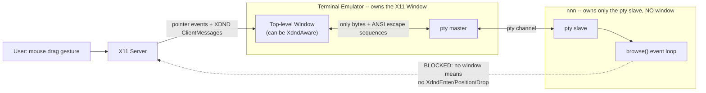
```mermaid
%% Why a TUI process cannot own the windowing-system DnD handshake
flowchart LR
    User["User: mouse drag gesture"]
    Xserver["X11 Server"]
    subgraph Emulator["Terminal Emulator -- owns the X11 Window"]
        Win["Top-level Window<br/>(can be XdndAware)"]
        Master["pty master"]
    end
    subgraph Nnn["nnn -- owns only the pty slave, NO window"]
        Slave["pty slave"]
        Loop["browse() event loop"]
    end
    User --> Xserver
    Xserver -->|"pointer events + XDND ClientMessages"| Win
    Win <-->|"only bytes + ANSI escape sequences"| Master
    Master <-->|"pty channel"| Slave
    Slave --> Loop
    Loop -.->|"BLOCKED: no window means<br/>no XdndEnter/Position/Drop"| Xserver
```

**Explanation.** Drag-and-drop on X11 (the XDND protocol) and on Wayland
(`wl_data_device`) is a conversation **between two windows**: a drag source
window and a drop target window. The X server delivers DnD messages to the
window under the pointer. In a terminal session that window belongs to the
**terminal emulator**, not to nnn. nnn is a pty-bound process: everything it
receives arrives as bytes/escape sequences through the pty, and it has no drawing
surface the X server can address. Therefore nnn (like Yazi, ranger, lf, and every
other TUI) **cannot itself be an XDND source or target**. The only way a TUI
participates in real DnD is to **delegate to something that does own a window**:
either a tiny helper GUI process, or (for newer terminals) the emulator itself
relaying DnD over an escape code. Every approach in Section 2 is a different
choice of *who owns that window*.

### 1.3 How nnn Works Today (Ground Truth From the Source)

nnn already has the plumbing a DnD feature needs: a selection store, a plugin
launcher, a control pipe, and a hover FIFO.

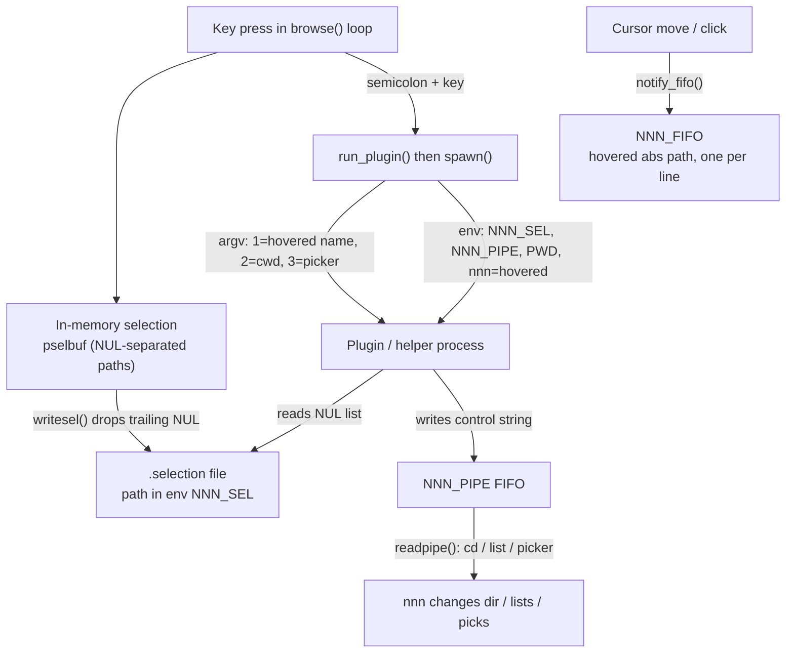
```mermaid
%% nnn internal data + IPC paths relevant to drag-and-drop
flowchart TD
    Keys["Key press in browse() loop"] --> SelBuf["In-memory selection<br/>pselbuf (NUL-separated paths)"]
    SelBuf -->|"writesel() drops trailing NUL"| SelFile[".selection file<br/>path in env NNN_SEL"]
    Keys -->|"semicolon + key"| RunPlug["run_plugin() then spawn()"]
    RunPlug -->|"argv: 1=hovered name, 2=cwd, 3=picker"| Child["Plugin / helper process"]
    RunPlug -->|"env: NNN_SEL, NNN_PIPE, PWD, nnn=hovered"| Child
    Child -->|"reads NUL list"| SelFile
    Child -->|"writes control string"| Pipe["NNN_PIPE FIFO"]
    Pipe -->|"readpipe(): cd / list / picker"| Nav["nnn changes dir / lists / picks"]
    Move["Cursor move / click"] -->|"notify_fifo()"| Fifo["NNN_FIFO<br/>hovered abs path, one per line"]
```

**Explanation.** Four mechanisms matter for DnD:

1. **Selection store.** Selected files live in an in-memory buffer `pselbuf`
   (`appendfpath()`, [src/nnn.c:1796](../src/nnn.c#L1796)) and are mirrored to a
   disk file whose path is in `NNN_SEL` (`writesel()`,
   [src/nnn.c:1781](../src/nnn.c#L1781)). The on-disk format is **NUL-separated
   absolute paths with the trailing NUL stripped** -- a reader must tolerate the
   missing final terminator (the `cpmv` plugin shows the correct read loop).
2. **Plugin launcher.** Key `;` then a plugin key runs a plugin via
   `run_plugin()` ([src/nnn.c:6601](../src/nnn.c#L6601)) which forks and
   `spawn()`s ([src/nnn.c:2640](../src/nnn.c#L2640)) the script with argv
   `$1`=hovered name, `$2`=cwd, `$3`=picker file, and env `NNN_SEL`, `NNN_PIPE`,
   `PWD`, `nnn` (hovered). The `F_NOWAIT` flag double-forks + `setsid()` to fully
   detach a GUI child -- exactly what a drag window needs.
3. **Control pipe `NNN_PIPE`.** A plugin writes one string
   `(optional '-')(ctxcode)(opcode)(data)` (no newline) to tell nnn to act
   (`readpipe()`, [src/nnn.c:6544](../src/nnn.c#L6544)). `ctxcode` is `+`/`0`/`1`
   to `4`; `opcode` is `c` (cd), `l` (list mode, then a NUL list follows), or `p`
   (picker). A leading `-` clears the selection first. This is how a drop can be
   shown to the user as a fresh listing.
4. **Hover FIFO `NNN_FIFO`.** On each cursor move nnn writes the hovered absolute
   path (newline-terminated) to the FIFO (`notify_fifo()`,
   [src/nnn.c:7475](../src/nnn.c#L7475)). Not needed for DnD but worth knowing.

**Mouse reality.** nnn enables only discrete button **press** events
(`mousemask(...)`, [src/nnn.c:2428](../src/nnn.c#L2428)) with `mouseinterval(0)`;
it does **not** request `REPORT_MOUSE_POSITION` or button-release, so there is no
motion/drag tracking anywhere. Any in-TUI drag gesture is greenfield work (this
is Approach E, and it cannot leave the terminal anyway).

The current key binding table (`bindings[]`,
[src/nnn.h:133](../src/nnn.h#L133)) leaves the upper-case **`D`** free, which we
will claim for the native action.

### 1.4 How Yazi Does It (Two Stories)

Studied from the Yazi source (cloned to `/tmp/yazi-src`) and upstream issues.
There are **two** DnD stories in Yazi and **neither makes the Rust binary an
X11/Wayland client**.

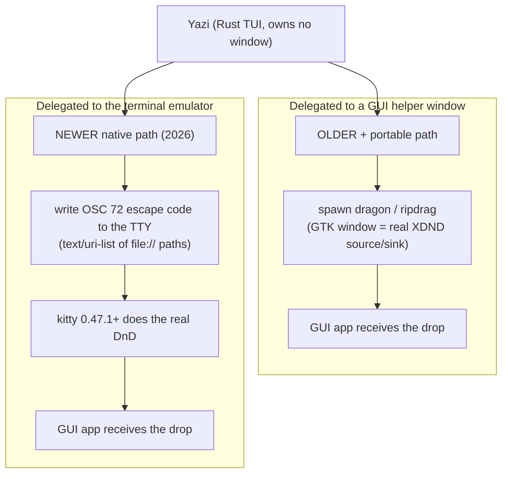
```mermaid
%% Yazi has two DnD paths -- both delegate the real windowing work
flowchart TD
    Yazi["Yazi (Rust TUI, owns no window)"]
    Yazi --> Old["OLDER + portable path"]
    Yazi --> New["NEWER native path (2026)"]

    subgraph OldBox["Delegated to a GUI helper window"]
        Old --> Dragon["spawn dragon / ripdrag<br/>(GTK window = real XDND source/sink)"]
        Dragon --> GuiApp1["GUI app receives the drop"]
    end

    subgraph NewBox["Delegated to the terminal emulator"]
        New --> Osc["write OSC 72 escape code to the TTY<br/>(text/uri-list of file:// paths)"]
        Osc --> Kitty["kitty 0.47.1+ does the real DnD"]
        Kitty --> GuiApp2["GUI app receives the drop"]
    end
```

**Explanation.** Yazi's *older* and still-most-portable answer is the same thing
nnn already ships: shell out to **`dragon`** (or community **`ripdrag`**) via a
keybinding/opener; that helper opens a real GTK window which is the actual XDND
source/sink. Its *newer* (May 2026, nightly) answer is "native" only in the sense
that Yazi writes an **OSC 72** escape sequence to the terminal and the
**terminal emulator** (kitty >= 0.47.1; Ghostty pending) performs the real
windowing-system DnD on its behalf -- proven by the protocol working over SSH.
The preset `yazi-plugin/preset/plugins/dnd.lua` is unambiguous: it builds a
`text/uri-list` of `file://` paths and queues `AgreeDrag`/`PresentDrag`/
`StartDrag` escape codes to the TTY. It never touches X11 or Wayland directly.

The architectural lesson for nnn: "copying Yazi" means copying either a
**process launcher** (spawn a window-owning helper) or a **protocol client**
(emit escape codes to a cooperating emulator). The genuinely portable, X11-first
choice is the helper launcher -- and we can make nnn's helper our own,
dependency-light, and tightly integrated rather than an external binary.

### 1.5 The DnD Protocol Landscape (X11, Wayland, helpers, terminal drop)

```
ASCII Table 1.5: Mechanisms for moving files in/out of a terminal app
+----------------------+--------------------------------+------------+-----------+
| Mechanism            | What it actually is            | Real DnD?  | X11 / Wl  |
+----------------------+--------------------------------+------------+-----------+
| XDND (X11)           | window-to-window ClientMessage | YES        | X11       |
|                      | handshake + X selection data   |            |           |
| wl_data_device (Wl)  | Wayland drag protocol, needs a | YES        | Wayland   |
|                      | surface + input grab serial    |            |           |
| dragon / ripdrag     | GTK helper window that is a     | YES        | X11 + Wl  |
|                      | real XDND / Wayland source/sink| (delegated)| (GTK)     |
| kitty OSC 72         | escape code; emulator does DnD | YES        | via kitty |
|                      |                                | (delegated)| only      |
| Emulator file drop   | drop on terminal -> pastes the | NO (drop   | emulator  |
|                      | path as typed text             | IN only)   | dependent |
| OSC 52               | set/read the clipboard buffer  | NO         | any term  |
| wl-clipboard/xclip   | clipboard get/set              | NO         | per srv   |
+----------------------+--------------------------------+------------+-----------+
```

**Explanation.** Only the first four rows are drag-and-drop. **XDND** is the X11
standard: a six-message `ClientMessage` handshake (`XdndEnter`, `XdndPosition`,
`XdndStatus`, `XdndLeave`, `XdndDrop`, `XdndFinished`) where the payload travels
through an X selection named `XdndSelection`, typed `text/uri-list`
(`file://...` URIs). Implementing it needs only **libX11** -- no toolkit. On
**Wayland**, the equivalent protocol requires a real surface and an input grab
serial, which a helper window has but a clipboard-only tool does not; this is why
`wl-clipboard` can do clipboard but not DnD. The pragmatic Wayland answer for an
X11 helper is **XWayland**, which bridges XDND to native Wayland inside the
compositor -- so an Xlib helper "just works" for most Wayland users. The last
three rows are commonly *confused* with DnD but are clipboard or
paste-on-drop, not drag-and-drop; we note them so the design does not conflate
them.

The XDND handshake we must speak (overview, detailed in 3.3 and 3.4):

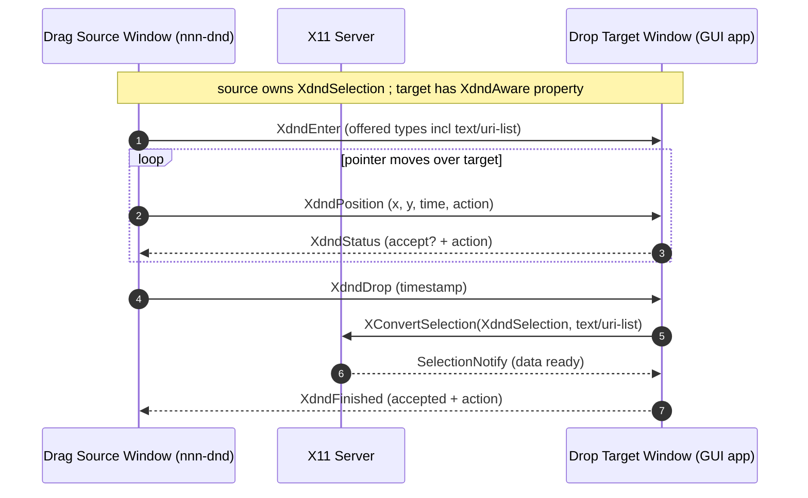
```mermaid
%% The XDND v5 message handshake between source and target windows
sequenceDiagram
    autonumber
    participant S as Drag Source Window (nnn-dnd)
    participant X as X11 Server
    participant T as Drop Target Window (GUI app)
    Note over S,T: source owns XdndSelection #59; target has XdndAware property
    S->>T: XdndEnter (offered types incl text/uri-list)
    loop pointer moves over target
        S->>T: XdndPosition (x, y, time, action)
        T-->>S: XdndStatus (accept? + action)
    end
    S->>T: XdndDrop (timestamp)
    T->>X: XConvertSelection(XdndSelection, text/uri-list)
    X-->>T: SelectionNotify (data ready)
    T-->>S: XdndFinished (accepted + action)
```

**Explanation.** When the pointer enters an XDND-aware window, the source sends
`XdndEnter` announcing the data types it can provide. While the pointer moves, the
source streams `XdndPosition` and the target answers each with `XdndStatus`
(accept/reject and which action -- copy/move/link). On button release the source
sends `XdndDrop`; the target then asks the X server to convert the
`XdndSelection` into `text/uri-list` and reads the file URIs, finally
acknowledging with `XdndFinished`. Our helper plays the **source** role for
drag-OUT and the **target** role for drop-IN.

### 1.6 Requirements and Constraints

```
ASCII Table 1.6: Requirements (R) and Constraints (C)
+------+-----------------------------------------------------------------------+
| ID   | Statement                                                             |
+------+-----------------------------------------------------------------------+
| R1   | Drag selected/hovered files OUT of nnn into any GUI app (X11).         |
| R2   | Drop files IN from a GUI app; results land in nnn's selection.         |
| R3   | Feel native: a first-class nnn key, not just an opaque plugin.         |
| R4   | Reuse nnn's selection format and IPC (NNN_SEL, NNN_PIPE).              |
| C1   | X11 is the primary target #59; Wayland is optional (XWayland is OK).   |
| C2   | Respect nnn's minimal-dependency ethos: default build unchanged,       |
|      | DnD code is opt-in and links at most libX11.                           |
| C3   | Degrade gracefully: if the helper is absent, fall back to dragon.      |
| C4   | POSIX/portable C11, same warning flags as nnn (-Wall -Wextra -Wshadow).|
| C5   | No blocking of nnn's UI: a drag window is detached (F_NOWAIT).         |
+------+-----------------------------------------------------------------------+
```

**Explanation.** R1-R4 are the feature; C1-C5 are the guardrails. C1 and C2 are
the decisive constraints: they push us toward a **libX11-only helper** rather
than a GTK helper, and toward an **opt-in build** so a normal `make` still
produces a dependency-free nnn.

---

## 2. Brainstorm of Approaches

Five candidate designs. Each is judged on the same criteria in 2.6.

### 2.1 Approach A: Enhance the Existing `dragdrop` Plugin

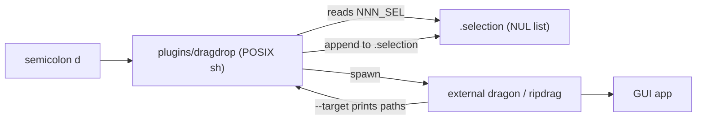
```mermaid
%% Approach A: keep DnD in the shell plugin, lean on external dragon/ripdrag
flowchart LR
    Key["semicolon d"] --> Plug["plugins/dragdrop (POSIX sh)"]
    Plug -->|"reads NNN_SEL"| Sel[".selection (NUL list)"]
    Plug -->|"spawn"| Dragon["external dragon / ripdrag"]
    Dragon --> Gui["GUI app"]
    Dragon -->|"--target prints paths"| Plug
    Plug -->|"append to .selection"| Sel
```

**Explanation.** This keeps everything in the existing
[plugins/dragdrop](../plugins/dragdrop) script and merely hardens it (better
binary probing including `ripdrag`, list dropped files via `NNN_PIPE`). Zero C
changes. It is the smallest possible change and the most portable, but it depends
on an external binary and stays a plugin (does not satisfy R3 "native").

```
ASCII Table 2.1: Approach A
+-------+----------------------------------------------------------------------+
| Pros  | - Tiny effort #59; pure shell, no build changes.                      |
|       | - Most portable today (dragon covers X11 + Wayland via GTK).          |
|       | - Already shipped #59; just polish it.                                |
+-------+----------------------------------------------------------------------+
| Cons  | - Hard dependency on an external tool (dragon/ripdrag).               |
|       | - Not "native": opaque plugin, no first-class key, no core hook.      |
|       | - dragon pulls in GTK3 at runtime (heavy for a minimal setup).        |
+-------+----------------------------------------------------------------------+
```

### 2.2 Approach B: Bundle a Native XDND Helper + Core Integration (RECOMMENDED)

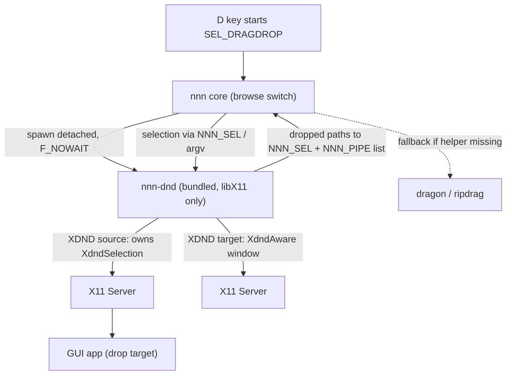
```mermaid
%% Approach B: nnn ships its own tiny libX11 XDND helper, driven from the core
flowchart TD
    Key["D key starts SEL_DRAGDROP"] --> Core["nnn core (browse switch)"]
    Core -->|"spawn detached, F_NOWAIT"| Helper["nnn-dnd (bundled, libX11 only)"]
    Core -->|"selection via NNN_SEL / argv"| Helper
    Helper -->|"XDND source: owns XdndSelection"| Xs["X11 Server"]
    Xs --> Gui["GUI app (drop target)"]
    Helper -->|"XDND target: XdndAware window"| Xs2["X11 Server"]
    Helper -->|"dropped paths to NNN_SEL + NNN_PIPE list"| Core
    Core -. "fallback if helper missing" .-> Dragon["dragon / ripdrag"]
```

**Explanation.** nnn ships a small C program, `nnn-dnd`, that implements the
XDND source and target roles directly on **libX11** (no toolkit). A new core
action `SEL_DRAGDROP` (bound to `D`) launches it: for drag-OUT it spawns the
helper **detached** with the current selection; for drop-IN it runs the helper in
target mode, writes received paths to `NNN_SEL`, and uses `NNN_PIPE` list mode to
show them. The helper is an **opt-in build** (`make O_DND=1`) linking only
libX11, so the default nnn is unchanged (C2). Wayland is covered by XWayland; if a
user wants native Wayland or has no helper, nnn falls back to dragon/ripdrag (C3).
This is the most "native," most X11-aligned, and most dependency-frugal design --
it subsumes Approach A as its own fallback.

```
ASCII Table 2.2: Approach B
+-------+----------------------------------------------------------------------+
| Pros  | - Truly native: first-class key, core hook, our own engine.           |
|       | - X11-first, libX11-only #59; matches the project priority + ethos.   |
|       | - No mandatory external dependency #59; falls back to dragon if built |
|       |   without DnD.                                                         |
|       | - Drop-in CLI-compatible with dragon, so plugins keep working.        |
|       | - Reuses NNN_SEL + NNN_PIPE, so drops integrate cleanly.              |
+-------+----------------------------------------------------------------------+
| Cons  | - Most code: an XDND source+target must be written and tested.        |
|       | - Native Wayland needs XWayland or a fallback (acceptable per C1).    |
|       | - Drag icon is a simple window, not a themed thumbnail (v1).          |
+-------+----------------------------------------------------------------------+
```

### 2.3 Approach C: Bundle a GTK3 Helper


```mermaid
%% Approach C: ship a GTK3 helper -- toolkit handles XDND and Wayland
flowchart LR
    Key["D key"] --> Core["nnn core"]
    Core -->|"spawn"| Gtk["bundled GTK3 helper"]
    Gtk -->|"gtk_drag_source_set + uri targets"| Xwl["X11 or native Wayland"]
    Xwl --> Gui["GUI app"]
```

**Explanation.** Same integration as B, but the helper is written with GTK3,
which implements XDND and native Wayland for us (far less protocol code). The cost
is a heavy build dependency (gtk+-3.0) that clashes with nnn's minimalism and with
C1 (we do not need native Wayland badly enough to pay GTK).

```
ASCII Table 2.3: Approach C
+-------+----------------------------------------------------------------------+
| Pros  | - Least DnD code #59; toolkit does XDND + native Wayland.             |
|       | - Best Wayland story out of the box.                                   |
|       | - Robust, well-trodden GTK drag APIs.                                  |
+-------+----------------------------------------------------------------------+
| Cons  | - Heavy dependency (GTK3) -- against nnn ethos and C2.                |
|       | - Overkill for an X11-first goal (C1).                                 |
|       | - This is essentially re-implementing dragon #59; better to reuse it. |
+-------+----------------------------------------------------------------------+
```

### 2.4 Approach D: kitty OSC-72 Terminal Protocol in Core

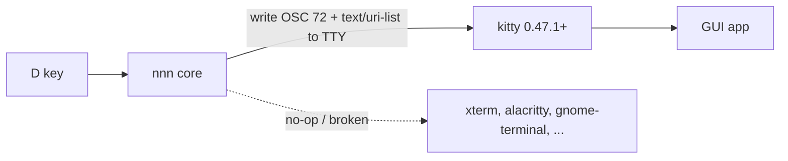
```mermaid
%% Approach D: emit OSC 72 from nnn core; emulator does the DnD (kitty only)
flowchart LR
    Key["D key"] --> Core["nnn core"]
    Core -->|"write OSC 72 + text/uri-list to TTY"| Term["kitty 0.47.1+"]
    Term --> Gui["GUI app"]
    Core -. "no-op / broken" .-> Other["xterm, alacritty, gnome-terminal, ..."]
```

**Explanation.** Copy Yazi's 2026 native path: nnn writes OSC 72 escape codes and
the terminal performs the DnD. Elegant, dependency-free, and it works **over SSH**
and **inside tmux** (via passthrough). It is bound to one emulator family (kitty
today#59; Ghostty has accepted it), so it cannot be the sole baseline -- but it is an
excellent **complement** to Approach B: when the terminal speaks OSC-72, nnn drags
out with zero helper process and zero X11 link#59; otherwise it falls back to the
helper. **This revision treats it as a first-class complementary path -- see the
deep dive in Section 5 and the implementation guide in Section 6** (covering tmux
`allow-passthrough` wrapping and the protocol's `i`-key multiplexer support).

```
ASCII Table 2.4: Approach D
+------+-----------------------------------------------------------------------+
|      | Notes                                                                 |
+------+-----------------------------------------------------------------------+
| Pros | - Genuinely in-process#59; no helper, no libX11, works over SSH.      |
|      | - Works inside tmux (outbound) via passthrough#59; tiny code.         |
|      | - Display-server agnostic (X11 or Wayland -- whatever kitty runs on). |
| Cons | - kitty-only today (Ghostty accepted)#59; a no-op elsewhere.          |
|      | - Inside tmux only drag-OUT works#59; drop-IN needs inbound events    |
|      |   that tmux does not yet route to the pane.                           |
|      | - Best as a complement to Approach B, not a replacement.              |
+------+-----------------------------------------------------------------------+
```

### 2.5 Approach E: In-TUI Mouse-Drag Gesture

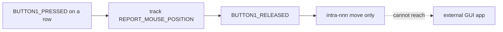
```mermaid
%% Approach E: detect press-move-release inside nnn -- cannot cross the window
flowchart LR
    Press["BUTTON1_PRESSED on a row"] --> Track["track REPORT_MOUSE_POSITION"]
    Track --> Release["BUTTON1_RELEASED"]
    Release --> Intra["intra-nnn move only"]
    Intra -. "cannot reach" .-> Gui["external GUI app"]
```

**Explanation.** Extend nnn's `mousemask` to track motion and release, and
implement a drag gesture. This can only move files *within* nnn (for example
between dual panes) because, per 1.2, the gesture never leaves the terminal
window. It does not satisfy R1/R2 (DnD with GUI apps). Listed for completeness as
a possible separate convenience feature, not a DnD solution.

```
ASCII Table 2.5: Approach E
+-------+----------------------------------------------------------------------+
| Pros  | - No external process #59; pure ncurses.                              |
|       | - Could enable nice intra-pane drag-move later.                       |
+-------+----------------------------------------------------------------------+
| Cons  | - Does NOT do DnD with GUI apps (the actual goal) -- fails R1/R2.     |
|       | - Terminal mouse motion reporting is inconsistent across emulators.   |
|       | - Conflicts with terminal text selection.                             |
+-------+----------------------------------------------------------------------+
```

### 2.6 Scorecard and Winner

Each criterion scored 1 to 5 (5 = best). Criteria abbreviations: NAT =
nativeness, X11 = X11 support, WL = Wayland support, DEP = dependency frugality,
EFF = low implementation effort, ROB = robustness/maintainability, UX = user
experience, CMP = drop-in compatibility with existing plugins.

```
ASCII Table 2.6: Approach scorecard (5 = best)
+--------------------------------+-----+-----+-----+-----+-----+-----+-----+-----+-------+
| Approach                       | NAT | X11 | WL  | DEP | EFF | ROB | UX  | CMP | TOTAL |
+--------------------------------+-----+-----+-----+-----+-----+-----+-----+-----+-------+
| A: enhance dragdrop plugin     |  2  |  5  |  4  |  3  |  5  |  4  |  4  |  5  |  32   |
| B: native XDND helper + core   |  5  |  5  |  3  |  5  |  2  |  4  |  5  |  5  |  34   |
| C: GTK3 helper + core          |  4  |  5  |  5  |  2  |  3  |  5  |  5  |  5  |  34   |
| D: kitty OSC-72 in core        |  5  |  2  |  2  |  5  |  3  |  3  |  5  |  1  |  26   |
| E: in-TUI mouse drag           |  3  |  1  |  1  |  5  |  3  |  2  |  2  |  1  |  18   |
+--------------------------------+-----+-----+-----+-----+-----+-----+-----+-----+-------+
```

**Winner: Approach B.** B and C tie on raw points (34), but the project's stated
priorities break the tie decisively: **X11-first (C1)** and **minimal
dependencies (C2)**. C pays a heavy GTK3 dependency to buy native Wayland we
explicitly deprioritized; B delivers the same X11 result with **only libX11**,
keeps the default build dependency-free, is the most *native* of all options, and
can **fall back to Approach A** (dragon/ripdrag) when the helper is not built and
to **Approach C/D** as future options. B is therefore both the best fit and a
superset architecture. The rest of this document deep-dives Approach B.

**Update (this revision).** Approach D (kitty OSC-72) is promoted from "future
option" to a **recommended complement**. On terminals that implement the protocol
it is the lightest path and the only one that works over SSH, and it coexists with
the helper (use OSC-72 when available, the helper otherwise). Its deep dive is
Section 5 and its implementation guide is Section 6, including tmux passthrough.

---

## 3. Deep Dive: Recommended Design (Approach B)

### 3.1 Architecture Overview

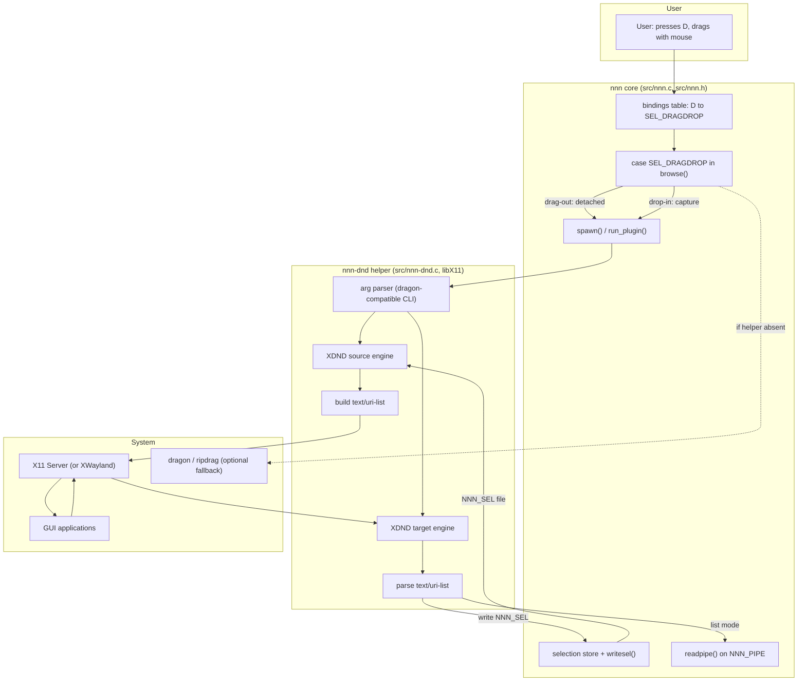
```mermaid
%% Recommended layered architecture for native DnD in nnn
flowchart TD
    subgraph UserLayer["User"]
        U["User: presses D, drags with mouse"]
    end

    subgraph CoreLayer["nnn core (src/nnn.c, src/nnn.h)"]
        Bind["bindings table: D to SEL_DRAGDROP"]
        Case["case SEL_DRAGDROP in browse()"]
        Spawn["spawn() / run_plugin()"]
        SelStore["selection store + writesel()"]
        Pipe["readpipe() on NNN_PIPE"]
    end

    subgraph HelperLayer["nnn-dnd helper (src/nnn-dnd.c, libX11)"]
        Args["arg parser (dragon-compatible CLI)"]
        Src["XDND source engine"]
        Tgt["XDND target engine"]
        UriIn["build text/uri-list"]
        UriOut["parse text/uri-list"]
    end

    subgraph SystemLayer["System"]
        Xorg["X11 Server (or XWayland)"]
        Gui["GUI applications"]
        Fallback["dragon / ripdrag (optional fallback)"]
    end

    U --> Bind --> Case
    Case -->|"drag-out: detached"| Spawn
    Case -->|"drop-in: capture"| Spawn
    Spawn --> Args
    Args --> Src
    Args --> Tgt
    SelStore -->|"NNN_SEL file"| Src
    Src --> UriIn --> Xorg --> Gui
    Gui --> Xorg --> Tgt --> UriOut
    UriOut -->|"write NNN_SEL"| SelStore
    UriOut -->|"list mode"| Pipe
    Case -. "if helper absent" .-> Fallback
```

**Explanation.** Three owned layers plus the system. The **core** gains exactly
one new action and a small handler; it reuses the existing `spawn()`, selection
store, and pipe reader. The **helper** is a standalone libX11 program with a
dragon-compatible CLI, an XDND **source** engine (drag-OUT) and **target** engine
(drop-IN), plus URI list builders/parsers. The **system** layer is the X server
(native X11 or XWayland) and the GUI apps; an external dragon/ripdrag remains an
optional fallback. The arrows show the two data directions: selection ->
uri-list -> X server -> GUI (out), and GUI -> X server -> uri-list -> NNN_SEL /
NNN_PIPE (in).

### 3.2 The `nnn-dnd` Helper: Responsibilities and CLI

The helper is intentionally a **drop-in replacement for `dragon`** so existing
plugins and muscle memory keep working, while being ours to ship and ~700-900
lines of dependency-light C.

```
ASCII Table 3.2: nnn-dnd responsibilities
+----------------------+-----------------------------------------------------------+
| Responsibility       | Detail                                                    |
+----------------------+-----------------------------------------------------------+
| Source mode (default)| Show a small window listing the file(s) #59; on press-drag |
|                      | act as XDND source advertising text/uri-list.             |
| Target mode (-t)     | Show an XdndAware window #59; receive a drop #59; print     |
|                      | the received paths (or file:// URIs) to stdout.            |
| Input intake         | Files from argv, or from stdin (-I) as NUL/newline list,   |
|                      | or from NNN_SEL when asked.                                |
| Output              | URIs by default #59; plain paths with -p (--print-path).    |
| Lifetime            | Persist until window closed, or exit after one op with -x. |
| URI hygiene          | Percent-encode/decode #59; emit file://HOST/abs/path.       |
+----------------------+-----------------------------------------------------------+
```

**Explanation.** The helper does one job per invocation: be a drag source or a
drop target. It reads its file list from argv/stdin/NNN_SEL, and for drops it
prints results so the caller (core or plugin) can route them into nnn. Mirroring
dragon's flags (`-t`, `-x`, `-a`, `-p`, `-I`, `-T`) means
[plugins/dragdrop](../plugins/dragdrop) can simply prefer `nnn-dnd` if present.
The full CLI is in Appendix B.

### 3.3 XDND Source Flow (Drag OUT)

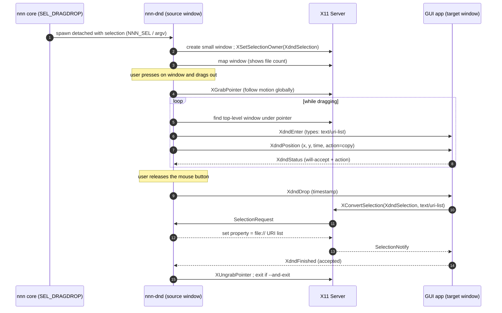
```mermaid
%% Drag OUT: nnn-dnd is the XDND source; a GUI app is the target
sequenceDiagram
    autonumber
    participant Nnn as nnn core (SEL_DRAGDROP)
    participant H as nnn-dnd (source window)
    participant X as X11 Server
    participant G as GUI app (target window)
    Nnn->>H: spawn detached with selection (NNN_SEL / argv)
    H->>X: create small window #59; XSetSelectionOwner(XdndSelection)
    H->>X: map window (shows file count)
    Note over H: user presses on window and drags out
    H->>X: XGrabPointer (follow motion globally)
    loop while dragging
        H->>X: find top-level window under pointer
        H->>G: XdndEnter (types: text/uri-list)
        H->>G: XdndPosition (x, y, time, action=copy)
        G-->>H: XdndStatus (will-accept + action)
    end
    Note over H: user releases the mouse button
    H->>G: XdndDrop (timestamp)
    G->>X: XConvertSelection(XdndSelection, text/uri-list)
    X->>H: SelectionRequest
    H-->>X: set property = file:// URI list
    X-->>G: SelectionNotify
    G-->>H: XdndFinished (accepted)
    H->>X: XUngrabPointer #59; exit if --and-exit
```

**Explanation.** On spawn the helper creates a small window and immediately takes
ownership of the `XdndSelection`. When the user presses inside the window and
drags, the helper grabs the pointer so it keeps receiving motion even outside its
own window, and for each move it locates the top-level window under the cursor and
checks its `XdndAware` property. It then drives the source half of the handshake:
`XdndEnter` once on entering an aware window, `XdndPosition` on every move, reading
the target's `XdndStatus` to update accept/reject feedback. On release it sends
`XdndDrop`; the target requests the selection, the helper answers the
`SelectionRequest` by writing the `text/uri-list` (percent-encoded `file://`
URIs) into the requested property, and the target confirms with `XdndFinished`.
The helper ungrabs and (with `-x`) exits. Because the core spawned it with
`F_NOWAIT`, nnn never blocks.

### 3.4 XDND Target Flow (Drop IN)

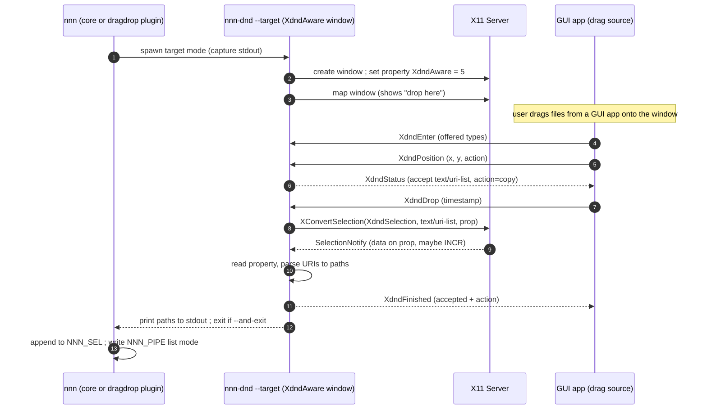
```mermaid
%% Drop IN: nnn-dnd is the XDND target; a GUI app is the source
sequenceDiagram
    autonumber
    participant P as nnn (core or dragdrop plugin)
    participant H as nnn-dnd --target (XdndAware window)
    participant X as X11 Server
    participant G as GUI app (drag source)
    P->>H: spawn target mode (capture stdout)
    H->>X: create window #59; set property XdndAware = 5
    H->>X: map window (shows "drop here")
    Note over G: user drags files from a GUI app onto the window
    G->>H: XdndEnter (offered types)
    G->>H: XdndPosition (x, y, action)
    H-->>G: XdndStatus (accept text/uri-list, action=copy)
    G->>H: XdndDrop (timestamp)
    H->>X: XConvertSelection(XdndSelection, text/uri-list, prop)
    X-->>H: SelectionNotify (data on prop, maybe INCR)
    H->>H: read property, parse URIs to paths
    H-->>G: XdndFinished (accepted + action)
    H-->>P: print paths to stdout #59; exit if --and-exit
    P->>P: append to NNN_SEL #59; write NNN_PIPE list mode
```

**Explanation.** Target mode is the mirror image. The helper creates a window and
advertises itself by setting the `XdndAware` property (version 5) on it. When a
GUI app drags over it, the helper answers each `XdndPosition` with an
`XdndStatus` that accepts `text/uri-list` and the copy action. On `XdndDrop` it
calls `XConvertSelection` to fetch the data (handling the `INCR` chunked-transfer
type for large payloads), parses the `file://` URIs into local paths, prints
them, and sends `XdndFinished`. The caller -- the core handler or the enhanced
plugin -- then appends those paths to nnn's `NNN_SEL` and uses `NNN_PIPE` list
mode so the dropped files appear immediately in nnn.

### 3.5 nnn Core Integration: the `SEL_DRAGDROP` Action

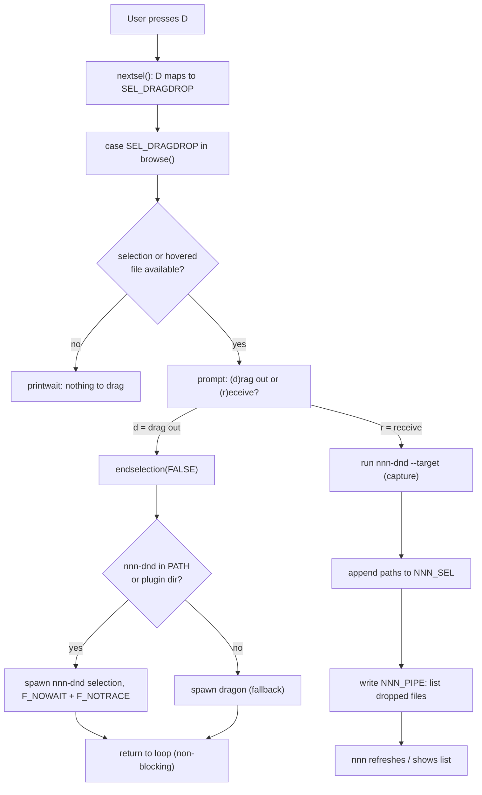
```mermaid
%% Control flow of the new core action
flowchart TD
    Start["User presses D"] --> Sel["nextsel(): D maps to SEL_DRAGDROP"]
    Sel --> Case["case SEL_DRAGDROP in browse()"]
    Case --> Have{"selection or hovered<br/>file available?"}
    Have -->|"no"| Warn["printwait: nothing to drag"]
    Have -->|"yes"| Prompt["prompt: (d)rag out or (r)eceive?"]
    Prompt -->|"d = drag out"| End0["endselection(FALSE)"]
    End0 --> Find{"nnn-dnd in PATH<br/>or plugin dir?"}
    Find -->|"yes"| SpawnOut["spawn nnn-dnd selection, F_NOWAIT + F_NOTRACE"]
    Find -->|"no"| FallA["spawn dragon (fallback)"]
    SpawnOut --> Done["return to loop (non-blocking)"]
    FallA --> Done
    Prompt -->|"r = receive"| Recv["run nnn-dnd --target (capture)"]
    Recv --> Merge["append paths to NNN_SEL"]
    Merge --> List["write NNN_PIPE: list dropped files"]
    List --> Refresh["nnn refreshes / shows list"]
```

**Explanation.** The new action is small and follows the exact pattern of the
existing `SEL_PLUGIN`/spawn cases. On `D`, nnn checks there is something to drag
(active selection or hovered file), then prompts for direction. **Drag-out**
finalizes the selection (`endselection(FALSE)`) and spawns the helper detached
(`F_NOWAIT|F_NOTRACE`), so a GUI drag window appears while nnn stays responsive;
if the helper binary is not found it falls back to `dragon`. **Receive** runs the
helper in target mode, appends the dropped paths to `NNN_SEL`, and writes a
`NNN_PIPE` list-mode command so the dropped files are shown. (Because nnn drains
`NNN_PIPE` during plugin execution, the receive direction is most robust when run
through the plugin path -- see 3.6 -- so the core handler may simply delegate
receive to the plugin while owning the headline drag-out path.)

### 3.6 Drop-IN via the Enhanced Plugin and `NNN_PIPE`

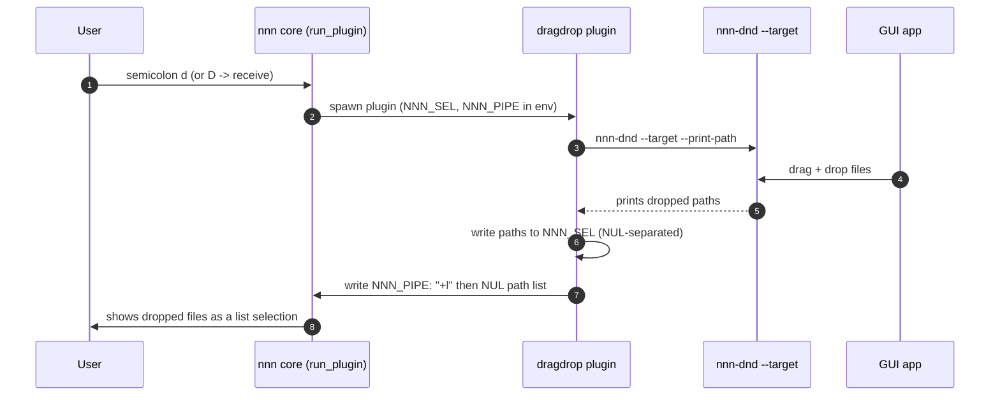
```mermaid
%% Drop-IN end to end through the enhanced plugin (drains NNN_PIPE synchronously)
sequenceDiagram
    autonumber
    participant U as User
    participant N as nnn core (run_plugin)
    participant D as dragdrop plugin
    participant H as nnn-dnd --target
    participant G as GUI app
    U->>N: semicolon d (or D -> receive)
    N->>D: spawn plugin (NNN_SEL, NNN_PIPE in env)
    D->>H: nnn-dnd --target --print-path
    G->>H: drag + drop files
    H-->>D: prints dropped paths
    D->>D: write paths to NNN_SEL (NUL-separated)
    D->>N: write NNN_PIPE: "+l" then NUL path list
    N->>U: shows dropped files as a list selection
```

**Explanation.** The enhanced [plugins/dragdrop](../plugins/dragdrop) keeps its
current behavior but (a) prefers the bundled `nnn-dnd` over external dragon, and
(b) upgrades the receive path: after collecting dropped paths it writes them to
`NNN_SEL` (as today) **and** issues a `NNN_PIPE` list-mode command (`+l` followed
by a NUL-separated path list) so the user immediately sees what was dropped,
instead of silently mutating the selection. Running through `run_plugin()`
guarantees nnn is actively reading `NNN_PIPE`, which is why the receive direction
lives here.

### 3.7 Class Diagram and Class Summary

C has no classes; we model the helper's logical "classes" as its core structs and
the integration's touch points.

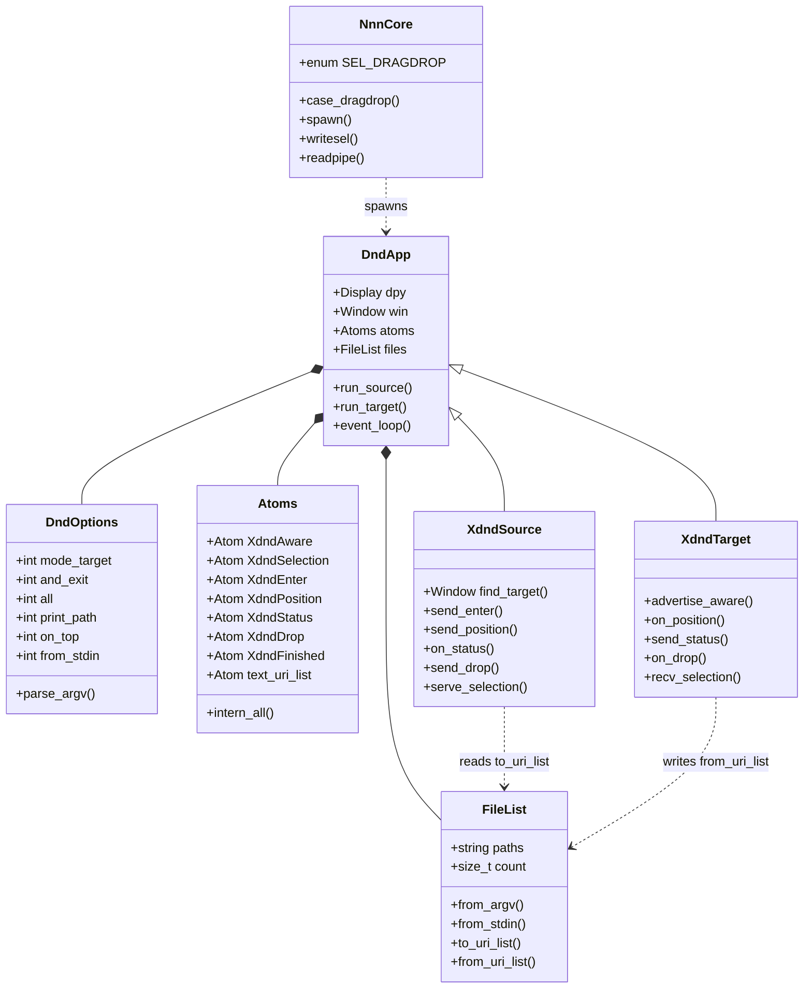
```mermaid
%% Logical class model of the nnn-dnd helper and its nnn-core touch points
classDiagram
    class DndOptions {
        +int mode_target
        +int and_exit
        +int all
        +int print_path
        +int on_top
        +int from_stdin
        +parse_argv()
    }
    class DndApp {
        +Display dpy
        +Window win
        +Atoms atoms
        +FileList files
        +run_source()
        +run_target()
        +event_loop()
    }
    class Atoms {
        +Atom XdndAware
        +Atom XdndSelection
        +Atom XdndEnter
        +Atom XdndPosition
        +Atom XdndStatus
        +Atom XdndDrop
        +Atom XdndFinished
        +Atom text_uri_list
        +intern_all()
    }
    class FileList {
        +string paths
        +size_t count
        +from_argv()
        +from_stdin()
        +to_uri_list()
        +from_uri_list()
    }
    class XdndSource {
        +Window find_target()
        +send_enter()
        +send_position()
        +on_status()
        +send_drop()
        +serve_selection()
    }
    class XdndTarget {
        +advertise_aware()
        +on_position()
        +send_status()
        +on_drop()
        +recv_selection()
    }
    class NnnCore {
        +enum SEL_DRAGDROP
        +case_dragdrop()
        +spawn()
        +writesel()
        +readpipe()
    }
    DndApp *-- Atoms
    DndApp *-- FileList
    DndApp *-- DndOptions
    DndApp <|-- XdndSource
    DndApp <|-- XdndTarget
    NnnCore ..> DndApp : spawns
    XdndSource ..> FileList : reads to_uri_list
    XdndTarget ..> FileList : writes from_uri_list
```

**Explanation.** `DndApp` is the helper's runtime aggregate: it owns the X
`Display`, its `Window`, the interned `Atoms`, the `FileList`, and the parsed
`DndOptions`. `XdndSource` and `XdndTarget` are the two behavioral roles (one is
chosen per run). `FileList` centralizes the conversion between local paths and the
`text/uri-list` wire format. `NnnCore` is not part of the helper -- it is the
nnn-side touch point (the new action, `spawn()`, `writesel()`, `readpipe()`) that
launches and consumes the helper.

```
ASCII Table 3.7: Class / component summary
+--------------+----------------------+----------+--------------------------------+
| Class        | Lives in             | Lifetime | Responsibility                 |
+--------------+----------------------+----------+--------------------------------+
| DndOptions   | src/nnn-dnd.c        | per run  | Parsed CLI flags + mode select |
| DndApp       | src/nnn-dnd.c        | per run  | Owns Display/Window/Atoms #59; |
|              |                      |          | drives the event loop          |
| Atoms        | src/nnn-dnd.c        | per run  | Interned XDND + selection atoms|
| FileList     | src/nnn-dnd.c        | per run  | Path list <-> text/uri-list    |
| XdndSource   | src/nnn-dnd.c        | per drag | Source-side XDND handshake +   |
|              |                      |          | selection serving              |
| XdndTarget   | src/nnn-dnd.c        | per drop | Target-side XDND handshake +   |
|              |                      |          | selection receiving (INCR)     |
| NnnCore      | src/nnn.c, src/nnn.h | program  | New action, spawn, sel store,  |
|              |                      |          | pipe reader (integration)      |
+--------------+----------------------+----------+--------------------------------+
```

**Explanation.** The table is the canonical inventory of the new code: six logical
units in one new file `src/nnn-dnd.c`, plus the integration touch points in the
existing `src/nnn.c` / `src/nnn.h`. Everything in the helper is per-run scoped
(the process is short-lived), which keeps memory management trivial (allocate,
run, exit -- the OS reclaims).

### 3.8 Collaboration Diagram and Component Summary

Mermaid has no native collaboration diagram, so (matching the house style) we use
a flowchart with **numbered** interaction edges.

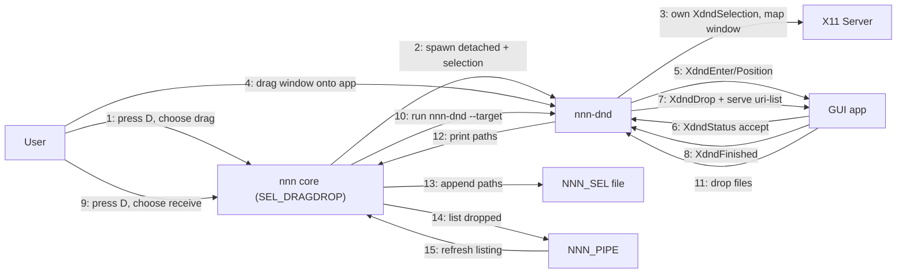
```mermaid
%% Collaboration: numbered interactions for a complete drag-OUT then drop-IN
flowchart LR
    User["User"]
    Core["nnn core (SEL_DRAGDROP)"]
    Helper["nnn-dnd"]
    Xorg["X11 Server"]
    Gui["GUI app"]
    Sel["NNN_SEL file"]
    Pipe["NNN_PIPE"]

    User -->|"1: press D, choose drag"| Core
    Core -->|"2: spawn detached + selection"| Helper
    Helper -->|"3: own XdndSelection, map window"| Xorg
    User -->|"4: drag window onto app"| Helper
    Helper -->|"5: XdndEnter/Position"| Gui
    Gui -->|"6: XdndStatus accept"| Helper
    Helper -->|"7: XdndDrop + serve uri-list"| Gui
    Gui -->|"8: XdndFinished"| Helper

    User -->|"9: press D, choose receive"| Core
    Core -->|"10: run nnn-dnd --target"| Helper
    Gui -->|"11: drop files"| Helper
    Helper -->|"12: print paths"| Core
    Core -->|"13: append paths"| Sel
    Core -->|"14: list dropped"| Pipe
    Pipe -->|"15: refresh listing"| Core
```

**Explanation.** Edges 1-8 are the drag-OUT collaboration; edges 9-15 are the
drop-IN collaboration. The numbering shows temporal order and which component
initiates each message. Note the two distinct data channels back into nnn:
`NNN_SEL` (the file that holds the dropped paths) and `NNN_PIPE` (the control
command that makes nnn list them). The user appears as an actor in both flows
because DnD is inherently interactive (the actual pointer drag is performed by the
user on the helper window).

```
ASCII Table 3.8: Collaboration component summary
+-------------+-------------------------------+-------------------------------------+
| Component   | Role in the collaboration     | Talks to                            |
+-------------+-------------------------------+-------------------------------------+
| User        | Initiates + performs the drag | nnn core, nnn-dnd window            |
| nnn core    | Launch + route results        | User, nnn-dnd, NNN_SEL, NNN_PIPE    |
| nnn-dnd     | XDND source/target engine     | nnn core, X11 server, GUI app       |
| X11 Server  | Routes DnD messages + selection| nnn-dnd, GUI app                    |
| GUI app     | The drop target or drag source| nnn-dnd (via X11)                   |
| NNN_SEL     | Holds dropped/dragged paths   | nnn core, nnn-dnd                    |
| NNN_PIPE    | Control channel for listing   | nnn core (reader), plugin (writer)  |
+-------------+-------------------------------+-------------------------------------+
```

**Explanation.** Each row pins a component to its single collaboration role and
its neighbors, so an implementer can reason about one interface at a time. The X11
server is the hub for the actual DnD messages; nnn core is the hub for routing
results back into the UI.

### 3.9 State Machines (Source and Target)

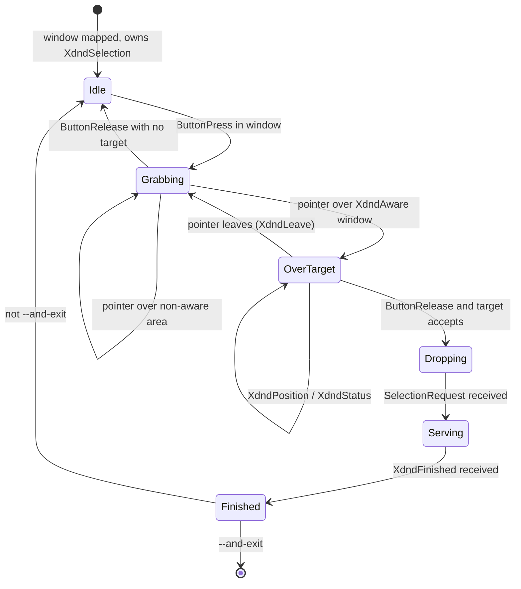
```mermaid
%% nnn-dnd source-mode state machine
stateDiagram-v2
    [*] --> Idle: window mapped, owns XdndSelection
    Idle --> Grabbing: ButtonPress in window
    Grabbing --> OverTarget: pointer over XdndAware window
    Grabbing --> Grabbing: pointer over non-aware area
    OverTarget --> OverTarget: XdndPosition / XdndStatus
    OverTarget --> Grabbing: pointer leaves (XdndLeave)
    OverTarget --> Dropping: ButtonRelease and target accepts
    Grabbing --> Idle: ButtonRelease with no target
    Dropping --> Serving: SelectionRequest received
    Serving --> Finished: XdndFinished received
    Finished --> Idle: not --and-exit
    Finished --> [*]: --and-exit
```

**Explanation.** The source starts `Idle` with a mapped window owning the
selection. A press starts `Grabbing` (pointer grabbed). While grabbing, entering
an aware window moves to `OverTarget`, where position/status messages loop;
leaving returns to `Grabbing`. Releasing over an accepting target moves to
`Dropping` -> `Serving` (answering the data request) -> `Finished`. With `-x` the
process exits; otherwise it returns to `Idle` for another drag.

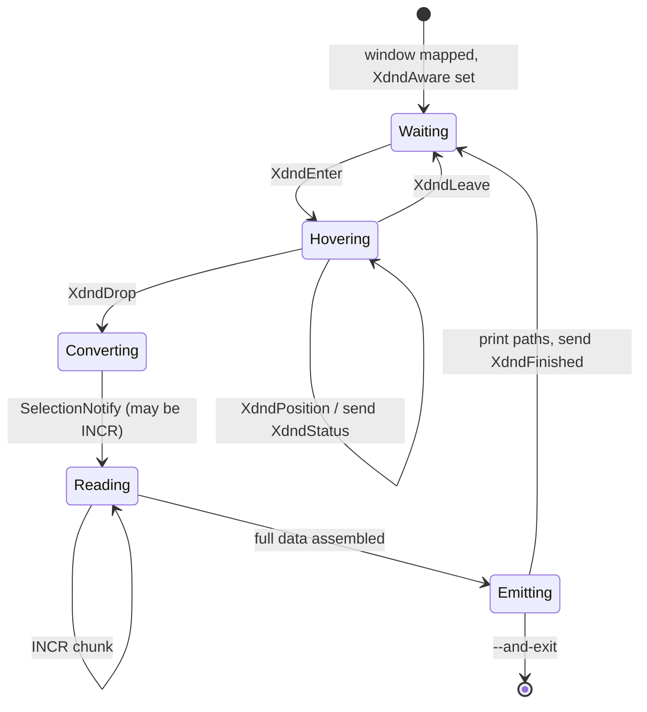
```mermaid
%% nnn-dnd target-mode state machine
stateDiagram-v2
    [*] --> Waiting: window mapped, XdndAware set
    Waiting --> Hovering: XdndEnter
    Hovering --> Hovering: XdndPosition / send XdndStatus
    Hovering --> Waiting: XdndLeave
    Hovering --> Converting: XdndDrop
    Converting --> Reading: SelectionNotify (may be INCR)
    Reading --> Reading: INCR chunk
    Reading --> Emitting: full data assembled
    Emitting --> Waiting: print paths, send XdndFinished
    Emitting --> [*]: --and-exit
```

**Explanation.** The target waits with an `XdndAware` window. A source hovering
over it drives `Hovering` (answering each position with a status). On drop it moves
to `Converting` (requesting the selection), then `Reading` (which loops if the
data arrives via the chunked `INCR` protocol), then `Emitting` (print paths, send
`XdndFinished`). With `-x` it exits after the first drop; otherwise it returns to
`Waiting`.

### 3.10 Data Model and Data Flow

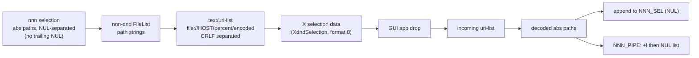
```mermaid
%% How file paths transform across the boundary
flowchart LR
    A["nnn selection<br/>abs paths, NUL-separated<br/>(no trailing NUL)"] --> B["nnn-dnd FileList<br/>path strings"]
    B --> C["text/uri-list<br/>file://HOST/percent/encoded<br/>CRLF separated"]
    C --> D["X selection data<br/>(XdndSelection, format 8)"]
    D --> E["GUI app drop"]
    E --> F["incoming uri-list"]
    F --> G["decoded abs paths"]
    G --> H["append to NNN_SEL (NUL)"]
    G --> I["NNN_PIPE: +l then NUL list"]
```

**Explanation.** The recurring subtlety is **format translation**. nnn stores
NUL-separated paths (last one not NUL-terminated). The wire format is
`text/uri-list`: percent-encoded `file://` URIs separated by CRLF. The helper
converts each direction carefully -- encode on the way out, decode on the way in
-- and writes results back in nnn's NUL format for `NNN_SEL` and as a NUL list for
`NNN_PIPE` list mode. Getting the trailing-NUL and CRLF details right is the most
common source of off-by-one bugs, so it is centralized in `FileList`.

```
ASCII Table 3.10: Data formats at each boundary
+----------------------+-----------------------------+--------------------------+
| Boundary             | Separator / encoding        | Notes                    |
+----------------------+-----------------------------+--------------------------+
| nnn .selection file  | NUL between paths, no final | absolute paths           |
|                      | NUL                         |                          |
| argv to helper       | one path per argv slot      | from spawn()             |
| stdin to helper (-I) | NUL or newline              | auto-detect              |
| text/uri-list (wire) | CRLF between URIs           | file://HOST/abs, percent |
|                      |                             | encoded                  |
| helper stdout (-p)   | newline between paths       | plain decoded paths      |
| NNN_PIPE list mode   | +l header, then NUL list   | shows as a listing       |
+----------------------+-----------------------------+--------------------------+
```

**Explanation.** This table is the contract every conversion function must honor.
It is deliberately explicit about the two asymmetries that bite implementers: the
**missing final NUL** in nnn's selection file, and the **CRLF + percent-encoding**
of the uri-list wire format.

### 3.11 5W1H of the New Components

```
ASCII Table 3.11a: 5W1H -- nnn-dnd helper
+-------+----------------------------------------------------------------------+
| What  | A small libX11 program implementing XDND source + target roles.       |
| Who   | Spawned by nnn core (SEL_DRAGDROP) or the dragdrop plugin.            |
| Where | New file src/nnn-dnd.c #59; built opt-in to bin nnn-dnd.              |
| When  | Launched on the D key (drag) or receive choice (drop).               |
| Why   | A TUI cannot own a window #59; the helper provides the DnD surface.   |
| How   | Owns XdndSelection / sets XdndAware #59; speaks the XDND handshake.   |
+-------+----------------------------------------------------------------------+
```

```
ASCII Table 3.11b: 5W1H -- SEL_DRAGDROP action
+-------+----------------------------------------------------------------------+
| What  | A new core action + key binding (D) that drives DnD.                  |
| Who   | nnn core browse() loop, via nextsel() and the bindings[] table.       |
| Where | enum action + bindings[] in src/nnn.h #59; case in src/nnn.c.         |
| When  | On the D key press in the file browser.                              |
| Why   | Makes DnD a first-class, discoverable nnn feature (R3).              |
| How   | Prompt direction #59; spawn helper detached (out) or capture (in).   |
+-------+----------------------------------------------------------------------+
```

**Explanation.** The 5W1H tables capture intent and placement at a glance: the
helper is the *mechanism* (a window-owning process), and `SEL_DRAGDROP` is the
*affordance* (the native key and handler). Splitting them this way keeps the core
change tiny and the protocol complexity quarantined in one optional file.

### 3.12 Wayland Strategy (Optional)

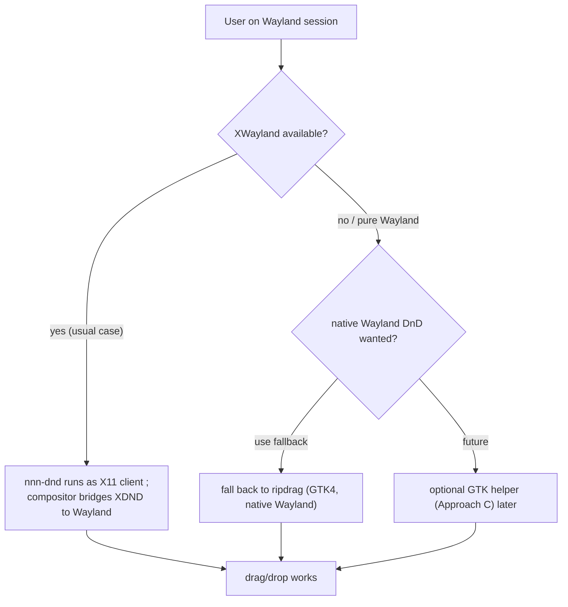
```mermaid
%% Decision: how a Wayland user gets DnD with an X11-first helper
flowchart TD
    Start["User on Wayland session"] --> XW{"XWayland available?"}
    XW -->|"yes (usual case)"| Works["nnn-dnd runs as X11 client #59;<br/>compositor bridges XDND to Wayland"]
    XW -->|"no / pure Wayland"| Alt{"native Wayland DnD wanted?"}
    Alt -->|"use fallback"| Rip["fall back to ripdrag (GTK4, native Wayland)"]
    Alt -->|"future"| GtkOpt["optional GTK helper (Approach C) later"]
    Works --> Done["drag/drop works"]
    Rip --> Done
    GtkOpt --> Done
```

**Explanation.** Per C1, Wayland is optional and handled pragmatically. Almost
every Wayland desktop runs **XWayland**, under which our libX11 helper is an
ordinary X client and the compositor bridges its XDND to native Wayland apps -- so
it simply works. For the rare pure-Wayland setup, nnn falls back to **ripdrag**
(GTK4, native Wayland) or, as a future enhancement, an optional GTK helper
(Approach C). This delivers "Wayland optionally" without paying GTK in the default
path.

### 3.13 Security, Edge Cases, Error Handling

```
ASCII Table 3.13: Risks and mitigations
+------------------------------+----------------------------------------------+
| Risk / edge case             | Mitigation                                   |
+------------------------------+----------------------------------------------+
| No DISPLAY (pure TTY/SSH)    | Detect #59; warn and no-op (or use OSC-72     |
|                              | later). Never crash.                         |
| Helper binary not found      | Fall back to dragon/ripdrag #59; else warn.  |
| Empty selection + no hover   | Refuse with a status message.                |
| Paths with spaces / unicode  | Percent-encode URIs #59; NUL-separate files. |
| Very large selection (INCR)  | Implement INCR on both serve and receive.    |
| Trailing-NUL mismatch        | Use the tolerant read loop (cpmv pattern).   |
| Pointer grab fails           | Abort drag cleanly, ungrab, exit non-zero.   |
| Window manager quirks        | Walk to the real top-level via XmuClient or  |
|                              | manual XQueryTree #59; honor XdndProxy.       |
| nnn UI blocking              | Always spawn drag-out with F_NOWAIT.         |
| Remote file:// from drop-in  | Optionally curl http(s)/ftp like dragdrop.   |
+------------------------------+----------------------------------------------+
```

**Explanation.** The two correctness-critical items are **INCR** (large
selections exceed the X maximum request size and must be chunked) and the
**top-level window walk** (the window under the pointer is often a child; XDND
properties live on the top-level, and some apps redirect via `XdndProxy`). The
two robustness-critical items are graceful behavior with **no DISPLAY** and a
**fallback** when the helper is absent, so the feature never makes nnn worse than
today.

### 3.14 Build and Packaging

```mermaid
%% Build graph: default nnn unchanged; helper is opt-in
flowchart LR
    Mk["Makefile"] --> Def["make (default): nnn only, no new deps"]
    Mk --> Opt["make O_DND=1: nnn + nnn-dnd"]
    Opt --> NnnBin["nnn (with SEL_DRAGDROP compiled in)"]
    Opt --> HelperBin["nnn-dnd (links -lX11)"]
    Def --> NnnBinPlain["nnn (DnD action present, helper just absent)"]
```

**Explanation.** The Makefile gains one flag, `O_DND`. The **default build is
untouched** and links no new libraries (C2). With `O_DND=1`, the Makefile also
compiles `src/nnn-dnd.c` to the `nnn-dnd` binary against `-lX11` and defines a
macro so the core compiles the `SEL_DRAGDROP` handler. (Even without `O_DND`, the
key/action can be present and simply rely on an external dragon, so a plain build
still offers DnD via the fallback.) `make install` installs `nnn-dnd` next to
`nnn` when it was built.

---

## 4. Step-by-Step Implementation Guidelines

No timeline -- just an ordered, verifiable path. Each step ends with a check and
maps to a single focused commit.

### Step 0: Branch and baseline

- Create `feature/native-drag-drop` from `develop`.
- Build the current tree to confirm a clean baseline: `make` (and `make O_DND=1`
  must fail only because the file/flag do not exist yet).
- **Check:** `./nnn -V` prints the version; the tree is clean.

### Step 1: Scaffold `src/nnn-dnd.c` (CLI + window, no protocol yet)

- New file `src/nnn-dnd.c`. Implement:
  - `DndOptions` + `parse_argv()` accepting the dragon-compatible flags
    (Appendix B): `-t/--target`, `-x/--and-exit`, `-a/--all`, `-p/--print-path`,
    `-T/--on-top`, `-I/--stdin`, `-i/--icon-only` (accepted), `-h/--help`,
    `-V/--version`.
  - `FileList` intake: `from_argv()`, `from_stdin()` (auto-detect NUL vs newline).
  - `DndApp`: open `Display`, intern `Atoms` (`intern_all()`), create + map a
    small window showing the file count or "drop here".
  - Graceful no-`DISPLAY` exit with a clear message.
- **Check:** `nnn-dnd --help` works; `nnn-dnd FILE` maps a window (verify with
  `xwininfo`/`xprop`); `nnn-dnd --version` prints.
- **Commit:** "nnn-dnd: scaffold helper (CLI, file intake, X11 window)".

### Step 2: XDND target engine (drop IN first -- it is easier to test)

- Implement `XdndTarget`: set `XdndAware = 5` on the window (`advertise_aware()`),
  handle `XdndEnter`/`XdndPosition` (reply `XdndStatus` accepting
  `text/uri-list`), `XdndDrop` -> `XConvertSelection`, `SelectionNotify` ->
  read property (handle `INCR`), `from_uri_list()` decode, print paths
  (URIs by default, plain with `-p`), send `XdndFinished`, exit on `-x`.
- **Check:** run `nnn-dnd --target --print-path`; drag a file from a GUI file
  manager onto the window; the correct local path prints. Verify `XdndAware` with
  `xprop` on the window.
- **Commit:** "nnn-dnd: implement XDND target (drop-in) with INCR".

### Step 3: XDND source engine (drag OUT)

- Implement `XdndSource`: own `XdndSelection` (`XSetSelectionOwner`), on
  `ButtonPress` `XGrabPointer`; on motion `find_target()` (walk to top-level,
  read `XdndAware`, honor `XdndProxy`), `send_enter()` once, `send_position()`
  per move, handle `XdndStatus`; on `ButtonRelease` `send_drop()`; answer
  `SelectionRequest` with the `to_uri_list()` payload (INCR if large); handle
  `XdndFinished`; exit on `-x`.
- **Check:** run `nnn-dnd FILE`; drag from the window into a browser/file
  manager/image editor; the file is received there. Cross-check against `dragon`
  behavior.
- **Commit:** "nnn-dnd: implement XDND source (drag-out)".

### Step 4: Makefile integration (opt-in `O_DND`)

- Add `O_DND := 0` with a comment; when `1`, define `-DDND` for the core and add a
  `nnn-dnd` target/rule: `$(CC) $(CFLAGS) -o nnn-dnd src/nnn-dnd.c -lX11`.
- Make `all` build `nnn-dnd` too when `O_DND=1`; extend `install`/`clean`.
- **Check:** `make` builds only `nnn` (no X11 link, verify with `ldd`);
  `make O_DND=1` builds both; `nnn-dnd` links libX11 (`ldd nnn-dnd`).
- **Commit:** "build: add opt-in O_DND target for the nnn-dnd helper".

### Step 5: Native core integration (`SEL_DRAGDROP`)

- In `src/nnn.h`: add `SEL_DRAGDROP` to `enum action` (before the mouse block)
  and a `{ 'D', SEL_DRAGDROP }` row to `bindings[]`.
- In `src/nnn.c`: add `case SEL_DRAGDROP:` in `browse()` modeled on the
  spawn/plugin cases: guard for selection-or-hover, prompt direction, drag-out =
  `endselection(FALSE)` + locate `nnn-dnd` (plugin dir or PATH) + spawn
  `F_NOWAIT|F_NOTRACE` (fallback to `dragon`), receive = delegate to the plugin
  path (3.6). Add a help-screen entry.
- Guard the heavier bits with `#ifdef DND` where appropriate; the key/fallback can
  remain always-present.
- **Check:** `make O_DND=1`; in nnn select files, press `D`, choose drag, drag the
  window onto a GUI app; press `D`, choose receive, drop files, confirm they enter
  the selection/listing.
- **Commit:** "core: add native SEL_DRAGDROP action bound to D".

### Step 6: Enhance the `dragdrop` plugin (prefer helper + list dropped files)

- In [plugins/dragdrop](../plugins/dragdrop): add `nnn-dnd` to the front of the
  binary probe; on receive, after writing `NNN_SEL`, also emit `NNN_PIPE` list
  mode (`printf '%s' '+l' > "$NNN_PIPE"` then the NUL path list) so dropped files
  show immediately.
- **Check:** `shellcheck plugins/dragdrop` passes; `;d` receive lists dropped
  files.
- **Commit:** "dragdrop: prefer bundled nnn-dnd and list dropped files via pipe".

### Step 7: Build, smoke tests, and a manual test matrix

- Compile clean with nnn's flags: `-std=c11 -Wall -Wextra -Wshadow`.
- Smoke tests (scriptable): window maps; `xprop` shows `XdndAware`; source owns
  `XdndSelection` (`xprop -root` / selection check); `--help`/`--version`.
- Manual matrix (record results): drag-out to {file manager, browser, image
  editor}; drop-in from {file manager, browser}; single vs multi file; spaces and
  unicode in names; no-`DISPLAY` graceful exit; helper-missing fallback to dragon.
- **Check:** all smoke tests pass; matrix documented in the doc/PR.
- **Commit:** "test: add DnD smoke tests and document the manual matrix".

### Step 8: Wire-up docs and config

- Document the `D` key and `O_DND` in the man page section and README/plugin docs.
- Optionally update the user config notes (the `nnn_config.sh` already maps
  `d:dragdrop`; mention the new native `D`).
- **Check:** docs build/read correctly; cross-references resolve.
- **Commit:** "docs: document native drag-and-drop (D key, O_DND, nnn-dnd)".

---

## 5. Deep Dive: The kitty OSC-72 Approach (with tmux passthrough)

Approach D, promoted to a first-class **complement** of the helper. Where Approach
B puts a window-owning helper process next to nnn, the OSC-72 approach makes **nnn
itself** the drag source: it writes escape codes to its own terminal and the
**terminal emulator** performs the real windowing-system drag-and-drop. No helper
process, no libX11, and -- crucially -- it works **over SSH** and **inside tmux**.
The cost: it only works on terminals that implement kitty's Drag-and-Drop protocol
(kitty >= 0.47.1 today#59; Ghostty has accepted it). It is verified ground truth
from kitty's spec (`OSC 72 ; metadata ; payload ST`) and Yazi's implementation.

> **Implementation status / correction (2026).** A first cut wired drag-out to
> the `D` keypress and was reverted. kitty's drag-out is **mouse-gesture-driven
> and bidirectional**, not app-initiated: the app only *declares* it can be a
> source (`t=o:x=1`, once at startup); the **user's mouse drag** on the terminal
> makes kitty send an inbound `t=o` *offer*, which the app must answer with
> agree -> present -> start. A keypress `StartDrag` with no live gesture returns
> `t=E ; EPERM` ("permission to start drag denied... user has already released"),
> and unconsumed inbound events print as garbage. A correct implementation
> therefore needs: (1) enable-offering at init, (2) an **inbound OSC-72 parser**
> tapping nnn's ncurses input stream, and (3) event-driven responses. **Yazi
> confirms this is the only way**: it sends `EnableDrag`/`EnableDrop` once at
> startup (`yazi-tui/src/raterm.rs`), parses inbound OSC-72 in its own `yazi-term`
> crate -- a `State::Osc72` parser it built by **replacing Crossterm** (issue
> #3910) -- and calls `offer_uri_list` (agree+present+start) only in response to
> an inbound offer (`components/current.lua`: `Current:drag(event)` when
> `event.type == "offer"`). The diagrams in 5.3-5.4 below show this corrected,
> mouse-driven flow. The libX11 helper (Approach B) already covers kitty
> **locally**; OSC-72's unique benefit is **drag-out over SSH**.

### 5.1 How It Differs From the Helper Approach

```
ASCII Table 5.1: Helper (Approach B) vs kitty OSC-72 (this approach)
+----------------------+-----------------------------+--------------------------------+
| Aspect               | Approach B (nnn-dnd helper) | kitty OSC-72 (this approach)   |
+----------------------+-----------------------------+--------------------------------+
| Owns the DnD window  | the helper process (libX11) | the terminal emulator          |
| Extra dependency     | libX11 (opt-in build)       | none (writes to the tty)       |
| Works over SSH       | no (needs a local display)  | yes (rides the pty stream)     |
| Terminal requirement | any X11 terminal            | kitty >= 0.47.1                |
| Display server       | X11 (Wayland via XWayland)  | agnostic (whatever kitty uses) |
| Inside tmux          | works (its own window)      | drag-OUT via passthrough       |
| Drag OUT             | yes                         | yes                            |
| Drop IN              | yes                         | yes (limited inside tmux)      |
| Process model        | fork + detached window      | in-process escape writes       |
+----------------------+-----------------------------+--------------------------------+
```

```mermaid
%% Who performs the real drag-and-drop in each approach
flowchart LR
    subgraph HelperWay["Approach B (window-owning helper)"]
        Nnn1["nnn (TUI)"] -->|"spawn"| Helper["nnn-dnd window (libX11)"]
        Helper -->|"XDND handshake"| App1["GUI app"]
    end
    subgraph OscWay["kitty OSC-72 (this approach)"]
        Nnn2["nnn (TUI)"] -->|"OSC 72 escape codes on the tty"| Kitty["kitty terminal"]
        Kitty -->|"real OS drag-and-drop"| App2["GUI app"]
    end
```

**Explanation.** Both approaches still obey the iron rule of Section 1.2 -- a TUI
owns no window -- they just delegate to a different window owner. Approach B
delegates to a helper **process** it spawns#59; the OSC-72 approach delegates to the
**terminal emulator** it is already talking to. The latter needs no new process and
no display connection, which is why it alone survives an SSH hop, but it depends on
the terminal implementing the protocol. They compose: prefer OSC-72 when available,
fall back to the helper otherwise.


### 5.2 The OSC-72 Escape Code

```
ASCII Table 5.2: OSC-72 escape-code structure
+-----------------+----------------------------------------------------------+
| Part            | Value                                                    |
+-----------------+----------------------------------------------------------+
| Full form       | OSC 72 ; metadata ; payload ST                           |
| OSC             | ESC ] = bytes 0x1b 0x5d                                  |
| ST (terminator) | ESC backslash = bytes 0x1b 0x5c                          |
| metadata        | colon-separated key=value pairs, e.g. t=o:x=1:i=7        |
| payload         | meaning depends on metadata; base64 when binary          |
| size limit      | payload <= 4096 bytes (after base64)                     |
| chunking        | larger payloads split; every non-final chunk carries m=1 |
+-----------------+----------------------------------------------------------+
```

**Explanation.** A single escape-code family carries the whole protocol. The `t`
key selects the message (offer / accept / present / start / request)#59; `o`
encodes the operation (copy/move/either)#59; `x` is an index or enable/disable flag#59;
`m=1` marks a non-final chunk#59; and `i` is an id used for multiplexer routing
(Section 5.5). The full key reference is in Appendix D.


### 5.3 Drag-OUT Flow (Source)


```mermaid
%% Drag OUT via OSC-72 (corrected): gesture-driven and bidirectional
sequenceDiagram
    autonumber
    participant N as nnn core
    participant K as kitty terminal
    participant G as GUI app (drop target)
    Note over N: at startup -- enable offering (t=o:x=1)
    Note over K: user holds the mouse and drags on the terminal
    K-->>N: inbound offer (t=o with cell x, y)
    Note over N: map cell to file row #59; build text/uri-list #59; base64
    N->>K: agree-drag copy or move (t=o:o=3) + text/uri-list
    N->>K: present data (t=p:x=0) base64 uri-list
    N->>K: start the drag (t=P:x=-1)
    K-->>N: status (t=e) or t=E (OK / EPERM)
    K->>G: real OS drag-and-drop (XDND or Wayland)
```

**Explanation (corrected).** The app cannot start a drag on its own. nnn enables
offering **once at startup** (`t=o:x=1`). The drag is initiated by the **user's
mouse gesture** on the terminal#59; kitty then sends nnn an **inbound `t=o` offer**
carrying the start cell. Only then does nnn map that cell to the file row, build the
`text/uri-list`, and reply agree -> present -> start. If the gesture has already
ended, kitty answers `t=E ; EPERM`. Because the flow needs those **inbound** events,
nnn must parse OSC-72 from its input stream (5.7), and inside tmux the inbound leg is
the hard part (5.5). This is exactly how Yazi does it (see the status note above).


### 5.4 Drop-IN Flow (Target)


```mermaid
%% Drop IN via OSC-72: kitty sends inbound events with the dropped data
sequenceDiagram
    autonumber
    participant G as GUI app (drag source)
    participant K as kitty terminal
    participant N as nnn core
    N->>K: accept drops (t=a) text/uri-list
    Note over G,K: user drags files onto the terminal window
    K-->>N: DropEnter (x, y, op, mimes)
    N->>K: agree-drop copy (t=m:o=1) text/uri-list
    K-->>N: DropReady
    N->>K: request dropped data (t=r:x=0)
    K-->>N: DropArrive (idx, base64 data)
    N->>K: finish copy (t=r:o=1)
    Note over N: decode the uri-list, add to selection / list
```

**Explanation.** Drop-IN is inherently **bidirectional**: nnn must read inbound
OSC-72 events (`DropEnter`, `DropReady`, `DropArrive`) from its own input stream and
reply. That is straightforward on bare kitty, but it is the part that does **not**
survive tmux today (Section 5.5), so the design keeps drop-IN on the helper/plugin
path inside multiplexers.


### 5.5 tmux (and Multiplexer) Passthrough


```mermaid
%% Outbound OSC-72 must be wrapped for tmux #59; inbound is not routed back
flowchart LR
    Seq["raw OSC 72 sequence<br/>ESC ] 72 then metadata then ST"] --> Q{"inside tmux?<br/>($TMUX is set)"}
    Q -->|"no"| Direct["write the sequence straight to the tty"]
    Q -->|"yes"| Dcs["wrap in tmux DCS passthrough<br/>double every ESC byte<br/>requires allow-passthrough on"]
    Direct --> Term["kitty performs the drag"]
    Dcs --> Term
```

```
ASCII Table 5.5: tmux passthrough behaviour for OSC-72
+----------------------------+--------------------------------------+---------------------------------+
| Direction                  | Mechanism                            | Works in tmux today?            |
+----------------------------+--------------------------------------+---------------------------------+
| Outbound (nnn to terminal) | DCS passthrough wrapper, ESC doubled | yes, with allow-passthrough on  |
| Inbound (terminal to nnn)  | tmux must route OSC-72 by the i key  | no (tmux has no OSC-72 routing) |
+----------------------------+--------------------------------------+---------------------------------+
```

**Explanation.** Two facts decide what is possible inside a multiplexer.
**Outbound** (nnn -> terminal), tmux swallows raw escape codes, so nnn must wrap each
OSC-72 sequence in tmux's Device Control String passthrough -- `ESC P tmux ;` then the
payload with **every ESC byte doubled**, then `ST` -- and the user must set
`allow-passthrough on` (tmux 3.3+). **Inbound** (terminal -> nnn) is the harder leg:
kitty's protocol anticipates multiplexers with the `i` (id) key (the app stamps
`i=<id>` and the terminal echoes it so tmux can route the reply to the right pane).
Observed in testing: kitty's inbound OSC-72 events **did reach the nnn pane through
tmux** (they appeared as the leaked garbage), which is encouraging -- but they must
be consumed by an inbound parser (5.7) instead of being printed, and robust
cross-pane routing still depends on tmux's `i`-key handling. Net: **outbound needs
passthrough wrapping**, **inbound must be parsed** (it is at least delivered), and the
gesture-driven drag-out in 5.3 needs *both* legs -- which is why it is a substantial
change, not a one-line escape write.


### 5.6 Terminal Detection and Approach Selection


```mermaid
%% Choose the drag-out mechanism at runtime
flowchart TD
    Start["D pressed: drag out"] --> InTmux{"inside tmux?"}
    InTmux -->|"yes"| KT{"kitty underneath?<br/>(env hint or config)"}
    InTmux -->|"no"| KD{"kitty?<br/>($KITTY_WINDOW_ID or TERM)"}
    KT -->|"yes"| OscT["emit OSC-72 via tmux passthrough"]
    KT -->|"no"| Help["use nnn-dnd helper (Approach B)"]
    KD -->|"yes"| OscD["emit OSC-72 directly"]
    KD -->|"no"| Help
    Help -->|"absent"| Plug["dragdrop plugin / dragon"]
```

**Explanation.** Detection is **heuristic** because the reliable handshake (the
`t=q` query and its reply) needs an inbound response that tmux will not deliver.
On bare kitty, `$KITTY_WINDOW_ID` is set and `TERM` is usually `xterm-kitty`. Inside
tmux, `TERM` is rewritten to `screen`/`tmux-256color`, so nnn relies on an explicit
opt-in (an `NNN_DND_OSC72=1` env hint or config) plus `$TMUX`. When nothing
indicates OSC-72 support, nnn simply uses the helper -- the feature degrades, it
never breaks.


### 5.7 nnn Core Integration


```mermaid
%% Where the OSC-72 path hooks into the existing core action
flowchart TD
    Case["case SEL_DRAGDROP"] --> Dir{"drag out or receive?"}
    Dir -->|"drag out"| Pref{"OSC-72 terminal<br/>available?"}
    Pref -->|"yes"| Emit["emit_osc72_drag(selection)<br/>in-process, no fork, no helper"]
    Pref -->|"no"| Helper["spawn nnn-dnd helper (Approach B)"]
    Dir -->|"receive"| Recv["dragdrop plugin via NNN_PIPE"]
    Emit --> Done["return to the browse loop"]
    Helper --> Done
```

**Explanation.** The OSC-72 path is a small branch added **before** the helper spawn
inside the existing `SEL_DRAGDROP` handler: if the terminal is OSC-72 capable and
the direction is drag-out, nnn emits the escape codes in-process and returns -- no
fork, no helper window. Everything else (no support, or the receive direction) keeps
the Section 3 behaviour. The change is additive and guarded, so non-kitty users are
unaffected.


### 5.8 Class / Function Summary

```
ASCII Table 5.8: New functions for the OSC-72 path (all in src/nnn.c)
+----------------------+----------------------------------------------------------+
| Function             | Responsibility                                           |
+----------------------+----------------------------------------------------------+
| dnd_osc72_capable()  | Heuristic: is the terminal OSC-72 capable (env hints)?   |
| dnd_osc72_write()    | Write one OSC-72 sequence; wrap in tmux DCS if $TMUX set |
| dnd_b64()            | base64-encode the uri-list payload                       |
| dnd_build_uri_list() | selection / hovered file -> text/uri-list (file:// URIs) |
| dnd_osc72_drag()     | emit enable + agree-drag + present + start (chunked)     |
+----------------------+----------------------------------------------------------+
```

**Explanation.** Unlike Approach B (a whole new file), the OSC-72 path is a handful
of small static functions inside `src/nnn.c` -- it is just string building and
`write()` to the tty. No new link dependency, so it can be **always compiled in**
(it is inert unless the terminal supports the protocol).


### 5.9 Limitations and Honest Caveats

```
ASCII Table 5.9: Limitations of the OSC-72 approach
+-------------------------+------------------------------------------------------------------+
| Limitation              | Consequence / mitigation                                         |
+-------------------------+------------------------------------------------------------------+
| kitty-only today        | Ghostty accepted but unshipped; no-op elsewhere -> fall back     |
| tmux drop-IN            | inbound events are not routed -> drop-IN uses the helper in tmux |
| detection is heuristic  | t=q reply cannot cross tmux -> rely on env hint / opt-in         |
| writing while in curses | escape codes go to the tty; force a redraw afterwards            |
| role                    | a complement to Approach B, never the sole baseline              |
+-------------------------+------------------------------------------------------------------+
```

**Explanation.** The honest summary: this is the **best** path when it is available
(in-process, SSH-friendly, zero dependencies) and a **no-op** when it is not. Pairing
it with Approach B gives the widest coverage: OSC-72 for kitty users (including over
SSH and, for drag-out, inside tmux), the libX11 helper for every other X11 setup.


---

## 6. Step-by-Step Implementation Guidelines (kitty OSC-72 + tmux)

No timeline -- an ordered, verifiable path. The whole feature lives in `src/nnn.c`
(no new file, no new link dependency) and hooks into the existing `SEL_DRAGDROP`
handler from Section 3.5. Each step ends with a check and maps to one focused commit.


### Step 0: Branch and baseline
- Build the current tree (`make O_DND=1`) to confirm a clean baseline.
- **Check:** `./nnn -V` runs; the existing helper-based `D` key still works.


### Step 1: Terminal and multiplexer detection
- Add `static bool dnd_in_tmux(void)` -> `getenv("TMUX") != NULL`.
- Add `static bool dnd_osc72_capable(void)`: true if `getenv("NNN_DND_OSC72")`
  is set to `1`, OR `getenv("KITTY_WINDOW_ID")` is set, OR `TERM` contains
  `kitty`. (Inside tmux, prefer the explicit `NNN_DND_OSC72=1` opt-in because
  `TERM` is rewritten.)
- **Check:** print the result behind a debug env var in kitty, kitty+tmux, xterm.


### Step 2: The OSC-72 writer (with tmux passthrough)
- Add `static void dnd_osc72_write(const char *seq, size_t len)`.
  - Not in tmux: `write()` the bytes straight to the controlling tty.
  - In tmux: emit `ESC P tmux ;`, then the payload with **every `0x1b` byte
    doubled**, then `ESC backslash`. Document that `allow-passthrough on` is
    required (tmux 3.3+).
- Write to the terminal fd, then force an ncurses redraw so the UI is intact.
- **Check:** in kitty, `printf` an `OSC 72 ; t=q ST` style probe via this writer
  and confirm the bytes reach the terminal (e.g. `cat -v` a captured stream).


### Step 3: base64 + uri-list builders
- Add a small `dnd_b64()` (standard base64, no external dep).
- Add `dnd_build_uri_list()`: for the selection (or the hovered file when none),
  emit `file://` + percent-encoded absolute path + CRLF per entry -- the same
  format the helper already uses (reuse the logic/tests from Approach B).
- **Check:** unit-style print of the uri-list for a multi-file selection.


### Step 4: The drag-OUT emitter
- Add `static void dnd_osc72_drag(const char *uri_list, size_t len)` that emits,
  in order, via `dnd_osc72_write()`:
  1. enable drag offering: `OSC 72 ; t=o:x=1 ; <machine-id> ST`
  2. agree-drag (either copy or move): `OSC 72 ; t=o:o=3 ; text/uri-list ST`
  3. present data: `OSC 72 ; t=p:x=0 ; <base64 uri-list> ST` (chunk at 4096,
     non-final chunks carry `m=1`)
  4. start the drag: `OSC 72 ; t=P:x=-1 ST`
- **Check:** on bare kitty, press the key and drag the terminal onto a file
  manager -- the file copies. (Manual test -- see the matrix in Step 7.)


### Step 5: Wire into the core SEL_DRAGDROP action
- In the `case SEL_DRAGDROP` drag-out branch, **before** the helper spawn:
  `if (dnd_osc72_capable()) { dnd_osc72_drag(...); statusbar(path); goto nochange; }`
- Otherwise fall through to the Section 3.5 helper/plugin path unchanged.
- Keep it always-compiled (no new dependency); it is inert on non-kitty terminals.
- **Check:** `make`; on kitty the `D` key drags via OSC-72, on xterm it uses the
  helper, with no behaviour change for the latter.


### Step 6 (optional): Drop-IN via inbound OSC-72
- Only attempt outside tmux. Send `OSC 72 ; t=a ; text/uri-list ST`, then parse
  inbound `OSC 72` events (`DropEnter`/`DropReady`/`DropArrive`) from nnn's input,
  reply with `t=m`/`t=r`, decode the uri-list, and feed it into the selection.
- This is invasive (it taps the input stream); inside tmux keep drop-IN on the
  helper/plugin. Defer unless bare-kitty drop-IN is required.
- **Check:** on bare kitty, drag a file onto the terminal -> it enters the selection.


### Step 7: Build and manual test matrix
- Compile clean with nnn's flags (`-std=c11 -Wall -Wextra -Wshadow`).
- Matrix to record: (a) bare kitty drag-OUT to a file manager / browser / editor;
  (b) kitty + tmux with `allow-passthrough on` drag-OUT; (c) kitty + tmux WITHOUT
  passthrough (must no-op gracefully or fall back); (d) non-kitty terminal (must
  use the helper); (e) multi-file selection; (f) names with spaces / unicode.
- **Check:** all rows behave as designed; failures captured with a debug trace.


### Step 8: Docs and config
- Document the OSC-72 path, the `NNN_DND_OSC72` hint, and the tmux
  `set -g allow-passthrough on` requirement in the man page and help.
- **Check:** docs read correctly and cross-reference Sections 5 and 6.


---

## 7. Summary and Traceability

```
ASCII Table 5: Requirement -> design -> implementation traceability
+------+--------------------------------------+----------------------------------+
| Req  | Satisfied by                         | Where                            |
+------+--------------------------------------+----------------------------------+
| R1   | XDND source engine + D key drag-out  | src/nnn-dnd.c, src/nnn.c (case)  |
| R2   | XDND target engine + NNN_SEL/PIPE    | src/nnn-dnd.c, plugins/dragdrop  |
| R3   | SEL_DRAGDROP native action (D)       | src/nnn.h, src/nnn.c             |
| R4   | Reuse selection + control pipe       | writesel(), readpipe()           |
| C1   | libX11 helper #59; XWayland for Wl   | src/nnn-dnd.c, 3.12              |
| C2   | Opt-in O_DND #59; default unchanged  | Makefile                         |
| C3   | dragon/ripdrag fallback              | src/nnn.c case, plugins/dragdrop |
| C4   | C11 + same warnings                  | Makefile CFLAGS                  |
| C5   | F_NOWAIT detached drag window        | spawn() call in the case         |
+------+--------------------------------------+----------------------------------+
```

**Explanation.** Every requirement and constraint maps to a concrete design
element and a code location, so the implementation in Section 4 is auditable
against the goals in Section 1. The design is deliberately layered so it can ship
incrementally: the helper (Steps 1-4) is useful on its own (it is a dragon
replacement), the native key (Step 5) makes it first-class, and the plugin
enhancement (Step 6) polishes the receive direction -- each is independently
valuable and independently committable.

The headline insight, restated: **no terminal file manager does drag-and-drop "in
process"; the realistic, best-practice, X11-first design is a tiny window-owning
helper that nnn drives natively.** Approach B gives nnn its own such helper with
the smallest possible dependency footprint, and degrades to the tools nnn already
relies on when that helper is not available.

---

## Appendix A: XDND Atom and Message Reference

```
ASCII Table A.1: Atoms used by nnn-dnd
+----------------------+-------------------------------------------------------+
| Atom                 | Purpose                                               |
+----------------------+-------------------------------------------------------+
| XdndAware            | Property on a target top-level window = supported ver |
| XdndSelection        | The X selection carrying the drag data                |
| XdndEnter            | source->target: pointer entered, here are my types    |
| XdndPosition         | source->target: pointer at x,y, requested action      |
| XdndStatus           | target->source: will I accept, and which action       |
| XdndLeave            | source->target: pointer left / cancel                 |
| XdndDrop             | source->target: commit the drop                       |
| XdndFinished         | target->source: done (and action performed)           |
| XdndTypeList         | property on source when offering > 3 types            |
| XdndActionCopy       | the action atom we request/accept by default          |
| XdndProxy            | redirect property: real handler window                 |
| text/uri-list        | the MIME target atom for file lists                   |
| INCR                 | selection type signalling chunked transfer            |
+----------------------+-------------------------------------------------------+
```

```
ASCII Table A.2: XDND v5 ClientMessage data fields (l[0..4])
+--------------+----------------------------------------------------------------+
| Message      | data.l fields                                                  |
+--------------+----------------------------------------------------------------+
| XdndEnter    | 0=source win, 1=(version<<24)|moreTypesBit, 2..4=first 3 types  |
| XdndPosition | 0=source win, 1=0, 2=(x<<16)|y root, 3=time, 4=action atom      |
| XdndStatus   | 0=target win, 1=accept|wantPos, 2=(x<<16)|y, 3=(w<<16)|h,       |
|              | 4=action atom                                                  |
| XdndDrop     | 0=source win, 1=0, 2=time                                       |
| XdndFinished | 0=target win, 1=(bit0 accepted), 2=action performed            |
| XdndLeave    | 0=source win                                                   |
+--------------+----------------------------------------------------------------+
```

**Explanation.** These two tables are the implementer's quick reference for Steps
2-3. The version lives in the high byte of `XdndEnter` field 1; coordinates are
packed `(x<<16)|y` in root-window space; actions are atoms (default
`XdndActionCopy`). The effective protocol version is `min(source, target)`.

## Appendix B: `nnn-dnd` CLI Reference

```
ASCII Table B.1: nnn-dnd flags (dragon-compatible subset)
+----------------------+----------------------------------------------------------+
| Flag                 | Meaning                                                  |
+----------------------+----------------------------------------------------------+
| (none) FILE...       | Source mode: offer the given files for dragging out      |
| -t, --target         | Target mode: receive a drop, print the paths/URIs        |
| -x, --and-exit       | Exit after the first completed drag or drop              |
| -a, --all            | Offer all files as a single combined drag                |
| -p, --print-path     | With --target, print plain paths instead of file:// URIs |
| -T, --on-top         | Keep the helper window always on top                     |
| -I, --stdin          | Read the file list from stdin (NUL or newline)           |
| -i, --icon-only      | Accepted for dragon compatibility (minimal v1 behavior)  |
| -h, --help           | Usage                                                    |
| -V, --version        | Version                                                  |
+----------------------+----------------------------------------------------------+
```

**Explanation.** The flag set is intentionally a subset of dragon's, chosen so
that [plugins/dragdrop](../plugins/dragdrop) -- and any user habit built around
dragon -- works against `nnn-dnd` unchanged. Anything dragon-specific that we do
not implement is still *accepted* (parsed and ignored) to avoid breaking callers.

## Appendix C: Source Map (where each change lands)

```
ASCII Table C.1: Files touched
+-------------------------+--------------------------------------------------------+
| File                    | Change                                                 |
+-------------------------+--------------------------------------------------------+
| src/nnn-dnd.c (new)     | The libX11 XDND source+target helper                   |
| src/nnn.h               | enum action SEL_DRAGDROP + bindings[] D row            |
| src/nnn.c               | case SEL_DRAGDROP in browse() + help entry             |
| Makefile                | O_DND flag, nnn-dnd target, install/clean              |
| plugins/dragdrop        | prefer nnn-dnd #59; list dropped files via NNN_PIPE    |
| nnn.1 / README          | document the D key and O_DND                            |
| docs/Brainstorm_nnn_Support_Drag_and_Drop.md | this document                       |
+-------------------------+--------------------------------------------------------+
```

**Explanation.** The change surface is small and well-bounded: one new file holds
all the protocol complexity, the core change is two lines of table plus one
handler case, and the Makefile change is a single opt-in flag. This keeps the
feature reviewable and keeps the default nnn exactly as it is today.

## Appendix D: kitty OSC-72 Metadata Reference

```
ASCII Table D.1: OSC-72 metadata keys used by nnn
+-------+-------------------+--------------------------------------------------------------------------+
| Key   | Meaning           | Example values                                                           |
+-------+-------------------+--------------------------------------------------------------------------+
| t     | message type      | o offer, a accept, m drop-status, p present, P start, r request, q query |
| x     | index or flag     | x=1 enable / x=2 disable / x=idx / x=-1 start                            |
| o     | operation         | 1 copy, 2 move, 3 either, 0 reject (context dependent)                   |
| m     | more chunks       | m=1 on every non-final chunk of a payload                                |
| i     | id for routing    | echoed by the terminal so a multiplexer can route replies                |
| y     | icon format       | used only with the drag-icon present message                             |
| X / Y | icon width/height | used only with the drag-icon present message                             |
+-------+-------------------+--------------------------------------------------------------------------+
```

```
ASCII Table D.2: Key outbound sequences (app -> terminal)
+-------------------+------------------------------------+
| Purpose           | Sequence (between OSC 72 ; and ST) |
+-------------------+------------------------------------+
| enable drag       | t=o:x=1 ; <machine-id>             |
| agree-drag        | t=o:o=<1|2|3> ; <mime list>        |
| present data      | t=p:x=<idx>[:m=1] ; <base64>       |
| start drag        | t=P:x=-1                           |
| accept drops      | t=a ; <mime list>                  |
| agree-drop        | t=m:o=<0|1|2>[ ; <mime list>]      |
| request drop data | t=r:x=<idx>                        |
| finish drop       | t=r:o=<1|2>                        |
| query support     | t=q[:i=<id>]                       |
+-------------------+------------------------------------+
```

**Explanation.** OSC is `ESC ]` and ST is `ESC backslash`. Metadata is a
colon-separated list of `key=value` pairs; the payload follows the second `;`.
Binary payloads are base64-encoded and chunked at 4096 bytes with `m=1` on every
non-final chunk. Source: kitty's Drag-and-Drop protocol spec and Yazi's
`yazi-term` emitter/parser. These are the exact forms nnn emits in Section 6.

