# Brainstorm: Session Backup / Restore and Session Management for nnn

> Design exploration for **session backup/save, restore, and full session
> management** (list, preview, rename, delete, duplicate, switch, versioned
> backups, whole-workspace snapshots) for the personal `nnn` fork, built around
> the existing **dual-pane TMUX** setup (`-s left` / `-s right`, persistent
> sessions, auto-save-on-cd).
>
> Source baseline: this fork of `jarun/nnn`. Line references point to
> [src/nnn.c](../src/nnn.c). Companion docs: session auto-save
> ([nnn_Software_Design.md](nnn_Software_Design.md)), the shared history feature
> ([Brainstorm_nnn_Support_Unlimited_History.md](Brainstorm_nnn_Support_Unlimited_History.md)).

---

## Table of Contents

1. Goal and Requirements
2. How nnn Handles Sessions Today (Ground Truth)
3. The Binary Session File Format (byte-level)
4. Problem Decomposition (four concerns)
5. Brainstorm of Approaches (A..E) with Pros/Cons and a Scorecard
6. Deep Dive -- Recommended Design (Plugin-first Manager + Backup Store + gated `s` pipe op)
   - 6.1 Architecture and Components
   - 6.2 Class Diagram + Class Summary Table
   - 6.3 Collaboration Diagram + Participant Summary Table
   - 6.4 The Backup Store (layout, rotation, atomicity)
   - 6.5 Dynamic Behaviour (save, restore, switch, snapshot)
   - 6.6 Faithful Restore vs Quick cd (the key decision)
   - 6.7 Whole-Workspace Snapshots across the dual panes
   - 6.8 Edge Cases
7. Step-by-Step Implementation Guidelines
8. Summary

---

## 1. Goal and Requirements

nnn already has a *save/load/restore* primitive, but no way to **manage** the
collection of sessions: no list-with-preview, no rename/delete/duplicate, no
**versioned backups** (every save overwrites -- a bad state clobbers a good
one), no **whole-workspace** capture (left + right + auto together), and no
seamless **switch** into a running instance. This document designs that layer.

```
ASCII Table 1: Requirements
+------+---------------------------------------------------------------+---------+
| #    | Requirement                                                   | Today?  |
+------+---------------------------------------------------------------+---------+
| R1   | Save a NAMED point-in-time snapshot without clobbering live   | partial |
| R2   | List all sessions + snapshots with metadata (ctx, paths, mtime)| NO     |
| R3   | Restore a chosen snapshot into the LIVE instance faithfully   | partial |
| R4   | Quick cd into another session's dir (degraded, zero C)        | NO      |
| R5   | Rename / delete / duplicate a session safely (with confirm)   | NO      |
| R6   | Versioned backups with rotation (keep last N), never lose good| NO      |
| R7   | Whole-workspace snapshot: left + right + @ as one labelled unit| NO     |
| R8   | Human-inspectable backups (decoded text mirror and/or git)    | NO      |
| R9   | Small, upstream-friendly (plugin-first; any C gated by a flag) | --     |
| R10  | Works with dual-pane, O_SSN_ON_CD, ctx_switcher already in use | --     |
+------+---------------------------------------------------------------+---------+
```

The user's setup that frames the problem (from
[start_dual_nnn.sh](../../../bin/start_dual_nnn.sh) and
[nnn_config.sh](../../../.dotfiles/nnn/nnn_config.sh)):

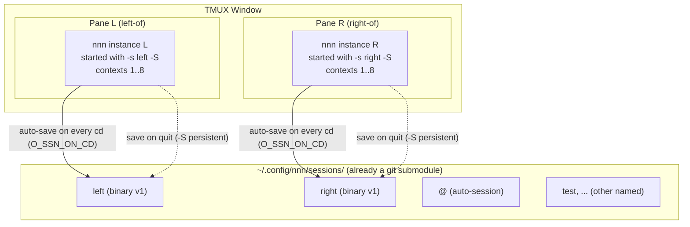

**Explanation.** Two nnn processes, each pinned to a named persistent session
(`left`, `right`). Because this fork builds with `O_SSN_ON_CD`, the on-disk
session file is rewritten on **every real directory change** -- so the file on
disk is effectively a **live mirror** of the instance's in-memory state. That
single fact is the load-bearing insight for the whole design (Section 6): a
backup that copies the on-disk file captures the *current working state*, no IPC
required.

---

## 2. How nnn Handles Sessions Today (Ground Truth)

```
ASCII Table 2: Existing session primitives
+---------------------------+-----------------------------------------------------+
| Primitive                 | What it does / where                                |
+---------------------------+-----------------------------------------------------+
| save_session(name)        | Serialize all 8 contexts + global cfg to            |
|   src/nnn.c:6041          | sessions/<name> (binary v1). Overwrites (O_TRUNC).  |
| load_session(name,...,r)  | Deserialize sessions/<name> into memory. If         |
|   src/nnn.c:6098          | restore(r), load "@" then unlink it.                |
| ^S menu (SEL_SESSIONS)    | Prompt "'s'ave/'l'oad/'r'estore?"; save reads a     |
|   src/nnn.c:10830         | name, load/restore call load_session.               |
| -s name (startup)         | Load a named session at launch. src/nnn.c:11509     |
| -S (persistent)           | Global persistent mode: save active session on      |
|   g_state.prstssn         | quit (src/nnn.c:11867) and (fork) auto-save on cd.  |
| "@" auto-session          | Fallback session; load-at-runtime auto-saves the    |
|                           | prior state here so 'restore' can recover it.       |
| O_SSN_ON_CD (fork flag)   | Auto-save the active session on every real chdir    |
|   src/nnn.c:9570          | at the begin: choke point.                          |
+---------------------------+-----------------------------------------------------+
```

The runtime session menu is tiny -- three actions behind one keypress:

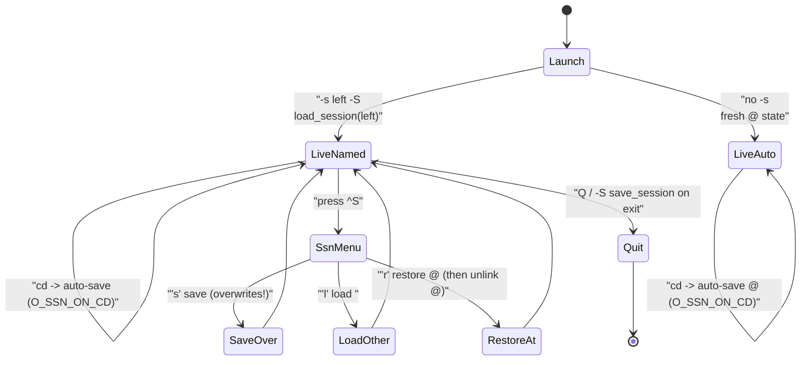

**Explanation.** Every path either loads or overwrites a single named file.
There is **no history**: `save_session` opens with `O_TRUNC` (src/nnn.c:6066),
so pressing `s` (or an auto-save-on-cd) irreversibly replaces the prior contents.
Restore only ever targets `@`. The gaps in ASCII Table 1 (R2..R8) all live in
the space this diagram does *not* cover: enumerating, previewing, versioning,
renaming, and coordinating multiple sessions.

The control channel a plugin can use to drive a running instance is the
**NNN_PIPE** protocol (`readpipe()`, src/nnn.c:7502). Today it understands three
ops:

```
ASCII Table 3: NNN_PIPE ops that exist today (readpipe, src/nnn.c:7530)
+-----+----------------------------+------------------------------------------+
| Op  | Wire format                | Effect in the receiving instance         |
+-----+----------------------------+------------------------------------------+
| c   | <ctx>c<abs/path>           | chdir context <ctx> to <path>, goto begin|
| l   | <ctx>l<listpath>           | load a file list into a context          |
| p   | <ctx>p                     | finish picker mode                        |
+-----+----------------------------+------------------------------------------+
```

There is **no session op** -- a plugin cannot ask a running instance to
`load_session`. That single missing op is the crux of the "faithful live
restore" problem in Section 6.6.

**One op per plugin run (verified).** `run_plugin()` opens the pipe once and
calls `readpipe()` **exactly once** (src/nnn.c:7683), then closes the read end
and blocks in `waitpid()`. So a plugin gets **one** message per invocation, and
a second write is not merely ignored -- it **deadlocks**: the plugin blocks in
`open(FIFO, O_WRONLY)` waiting for a reader that will never come, while nnn
waits for the plugin to exit. This was confirmed experimentally (a two-write
plugin hangs nnn permanently). Every design below therefore sends **at most one
message per action**, and the "replay each context" idea is off the table.

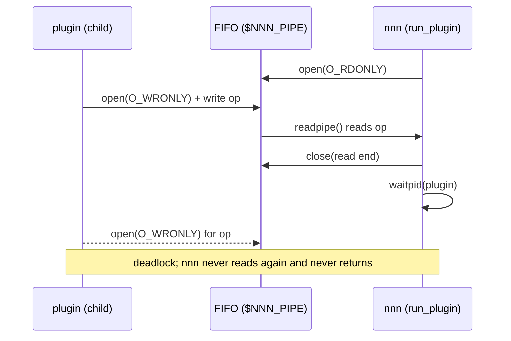

---

## 3. The Binary Session File Format (byte-level)

Both the manager's **preview** and any **text mirror** must parse this format.
It is already reverse-engineered by two artifacts in the repo: the
[load_nnn_session.sh](../../../.config/nnn/sessions/load_nnn_session.sh) demo and
the `extract_contexts()` function inside [plugins/ctx_switcher](../plugins/ctx_switcher).
The layout is driven by `session_header_t` (src/nnn.c:427) and the write loop in
`save_session` (src/nnn.c:6072).

```
ASCII Table 4: Session file byte layout (SESSIONS_VERSION = 1, CTX_MAX = 8)
+----------------+----------------------+-------+------------------------------+
| Region         | Field                | Bytes | Notes                        |
+----------------+----------------------+-------+------------------------------+
| Header         | ver (size_t)         | 8     | must equal 1                 |
|                | pathln[8] (size_t)   | 64    | strlen(c_path)+1 per ctx, 0  |
|                |                      |       |   if ctx inactive            |
|                | lastln[8] (size_t)   | 64    | strlen(c_last)+1 per ctx     |
|                | nameln[8] (size_t)   | 64    | strlen(c_name)+1 per ctx     |
|                | fltrln[8] (size_t)   | 64    | REGEX_MAX (48) if active, 0  |
+----------------+----------------------+-------+------------------------------+
| Global cfg     | cfg (settings)       | 4     | packed bitfield              |
+----------------+----------------------+-------+------------------------------+
| Per context i  | c_cfg (settings)     | 4     | per-ctx packed bitfield      |
| (0..7, only    | color (uint_t)       | 4     | dir color code               |
|  the bytes for | c_name[nameln[i]]    | var   | cursor file name             |
|  active ctxs   | c_last[lastln[i]]    | var   | last visited dir             |
|  are present)  | c_fltr[fltrln[i]]    | var   | filter (48 bytes if active)  |
|                | c_path[pathln[i]]    | var   | current dir                  |
+----------------+----------------------+-------+------------------------------+
```

Header size is fixed: `8 + 4*8*8 = 264` bytes, then the 4-byte global cfg, then
the variable per-context blocks. The write order **inside** each context is
`c_cfg, color, c_name, c_last, c_fltr, c_path` (note: name/last/filter come
before path).

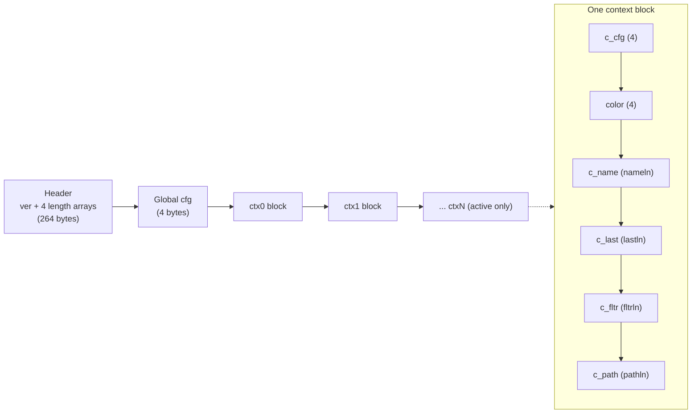

**Explanation.** A parser walks the four length arrays to know how many bytes to
skip/read per field. An inactive context contributes only its fixed 8 bytes
(`c_cfg` + `color`) with all four lengths zero. The manager's **preview** only
needs `pathln`/`c_path` (and optionally `c_name`) per context, so it can skip the
rest -- exactly what `ctx_switcher` already does. This format is **opaque and
version-locked** (R8): a strong argument for also emitting a **decoded text
mirror** next to each backup so snapshots are greppable and human-readable.

---

## 4. Problem Decomposition (four concerns)

"Session management" bundles four independent concerns. Separating them keeps the
design honest about which need C and which are pure plugin.

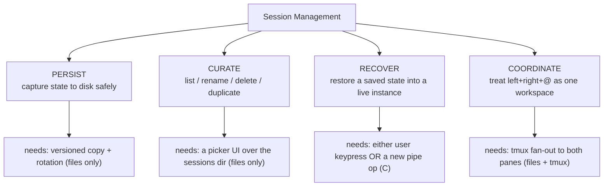

```
ASCII Table 5: Concern -> mechanism -> needs C?
+-------------+------------------------------------------+-------------------+
| Concern     | Natural mechanism                        | Needs C?          |
+-------------+------------------------------------------+-------------------+
| Persist     | cp live file -> backups/<name>/<ts>, prune| No (plugin)       |
| Curate      | fzf over sessions/, mv/rm/cp             | No (plugin)       |
| Recover     | faithful: load_session in live instance  | Yes, tiny (pipe s)|
|             | degraded: ONE 'c' op -> its current dir  | No (plugin)       |
| Coordinate  | tmux send-keys / per-pane pipe to L and R| No (plugin+tmux)  |
+-------------+------------------------------------------+-------------------+
```

The decisive observation: **three of the four concerns need zero C.** Only
*faithful* recovery (restoring all per-context settings/filters/cursor, not just
paths) benefits from a small new pipe op -- and even that has a zero-C fallback.
This shapes the recommendation: a plugin-first manager, with one **optional,
build-flag-gated** C op for the seamless-restore polish.

---

## 5. Brainstorm of Approaches

Five candidates, scored on the requirements (R1..R10) plus implementation cost
and upstream-merge friction.

### Approach A -- Pure plugin session manager (zero C)

A single `nnn-sessions` plugin (fzf-driven) does everything at the file level:
list + preview (parse the binary header), save-snapshot (copy live file to a
timestamped backup), restore (copy back + tell the user to press `^S l`, or cd
into its current dir with a single `c` op), rename/delete/duplicate
(`mv`/`rm`/`cp`), rotation.

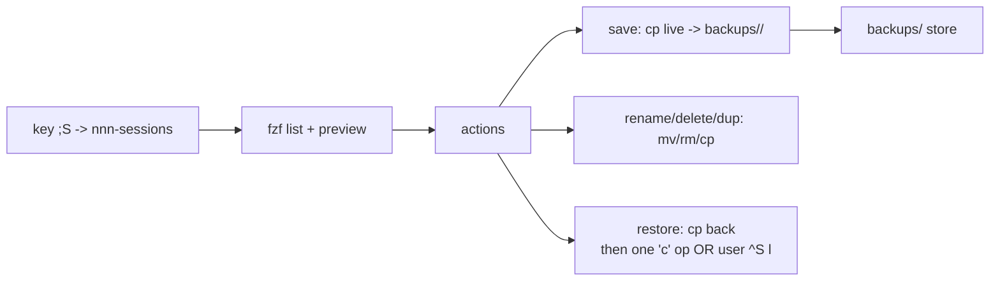

- **Pros.** Zero C, byte-for-byte upstream binary, matches the fork's
  plugin-first philosophy, reuses `ctx_switcher`'s parser, trivially portable.
  Because `O_SSN_ON_CD` keeps the on-disk file live, backups are accurate.
- **Cons.** Faithful restore into a *running* instance is not seamless -- either
  the user presses `^S l`, or the plugin does a degraded paths-only replay
  (losing per-ctx settings/filter/cursor). No native "switch session" polish.

### Approach B -- Plugin manager + tiny gated `s` pipe op (recommended core)

Approach A plus **one** new NNN_PIPE op, `s` (session load), gated behind a build
flag (`O_SSN_PIPE` -> `-DSSN_PIPE`). `readpipe` handles `<ctx>s<name>` by calling
`load_session(name,...)` and `goto begin`. Now the plugin can perform a
**faithful** live restore/switch with zero keypresses.

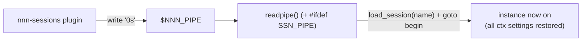

- **Pros.** Seamless faithful restore/switch; the C change is ~12 lines, fully
  contained (readpipe + one browse branch), and gated so the default build stays
  identical to upstream. Everything else stays in the plugin.
- **Cons.** Adds a little C surface; a plugin can now trigger a full session load
  (acceptable -- it already can drive `cd`).

### Approach C -- In-C session manager (expand SEL_SESSIONS)

Add list/rename/delete/backup directly to nnn's `^S` menu in C.

- **Pros.** Native, no plugin, no fzf dependency.
- **Cons.** Large C footprint, reinvents an fzf UI in ncurses, diverges hard from
  upstream (bad merge friction), contradicts the fork's plugin-first approach.
  Low score on R9.

### Approach D -- Git-backed session store

Because `~/.config/nnn` is **already a git submodule** (`.git` ->
`modules/nnn-dotfiles`), back up by committing `sessions/`; restore by
`git checkout`. Optionally store a decoded text mirror so diffs are meaningful.

- **Pros.** Unlimited history, atomic, already-present infrastructure, diffable
  (with the text mirror), off-site if the submodule has a remote.
- **Cons.** Binary blobs don't diff; commit noise; requires git literacy for
  restore. Best as an **optional backend** under Approach B, not the whole story.

### Approach E -- Timestamped tarball snapshots (extend `nbak`)

Reuse the official [nbak](../plugins/nbak) idea: tar the whole config (or just
`sessions/`) into dated archives with rotation.

- **Pros.** Dead simple, robust, whole-config coverage, good for off-box backup.
- **Cons.** Coarse (whole dir), restore is manual, no per-session curation. Best
  as the **workspace-snapshot** primitive (R7) inside Approach B.

### Scorecard

```
ASCII Table 6: Approach scorecard (+ = strong, o = partial, - = weak/none)
+----------------------------+----+----+----+----+----+
| Requirement                | A  | B  | C  | D  | E  |
+----------------------------+----+----+----+----+----+
| R1 named snapshot          | +  | +  | +  | +  | o  |
| R2 list + preview          | +  | +  | +  | -  | -  |
| R3 faithful live restore   | o  | +  | +  | o  | -  |
| R4 quick paths switch      | +  | +  | o  | -  | -  |
| R5 rename/delete/duplicate | +  | +  | +  | o  | -  |
| R6 versioned + rotation    | +  | +  | o  | +  | +  |
| R7 whole-workspace snapshot| +  | +  | -  | +  | +  |
| R8 inspectable/text mirror | +  | +  | -  | +  | o  |
| R9 upstream-friendly       | +  | +  | -  | +  | +  |
| R10 fits current setup     | +  | +  | o  | o  | o  |
+----------------------------+----+----+----+----+----+
| C code cost                | 0  | ~12| big| 0  | 0  |
| Merge friction             | none|tiny|high|none|none|
+----------------------------+----+----+----+----+----+
```

**Winner: Approach B** as the core -- a plugin-first manager plus one tiny gated
pipe op -- absorbing D (git backend, optional) and E (workspace tarball, for R7)
as sub-features. It maxes every requirement at near-zero C cost and stays
upstream-friendly.

---

## 6. Deep Dive -- Recommended Design

**"Plugin-first Session Manager (`nnn-sessions`) + versioned Backup Store +
optional gated `s` pipe op for faithful live restore, with git and tarball
backends."**

### 6.1 Architecture and Components

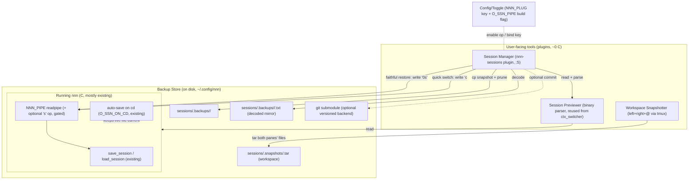

**Explanation.** Three planes. The **UI plane** is entirely plugins: the manager,
a previewer (the binary parser already proven in `ctx_switcher`), and a workspace
snapshotter that fans out over tmux. The **store plane** is plain files:
timestamped backups, a decoded text mirror per backup, whole-workspace tarballs,
and the already-present git submodule as an optional long-term backend. The
**live plane** is existing C -- `save_session`/`load_session`, the auto-save-on-cd
hook that keeps the on-disk file current, and `readpipe`, to which we add exactly
**one** optional gated op (`s`). No plane depends on shared memory; the on-disk
session file is the contract between them.

### 6.2 Class Diagram + Class Summary Table

Since nnn is C, each "class" is a function-group or a plugin subroutine plus the
data it owns.

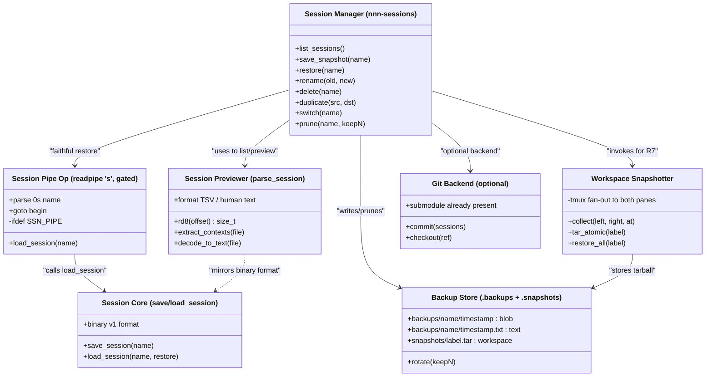

```
ASCII Table 7: Class summary (for the class + collaboration diagrams)
+----------------------------+-----------+------------------------------------------+
| Class (module)             | Where     | Responsibility                           |
+----------------------------+-----------+------------------------------------------+
| Session Manager            | plugin    | The fzf UI + all curation/backup actions.|
|   (nnn-sessions)           | (0 C)     | The single entry point (;S).             |
| Session Previewer          | plugin    | Parse the binary v1 header/contexts for  |
|   (parse_session)          | (0 C)     | preview + decode to a text mirror.       |
| Backup Store               | disk      | Timestamped blob backups + text mirrors  |
|   (.backups/.snapshots)    |           | + workspace tarballs; rotation.          |
| Workspace Snapshotter      | plugin    | Capture/restore left+right+@ as one unit |
|   (tmux fan-out)           | (0 C)     | across both panes.                       |
| Session Pipe Op            | C, gated  | New 's' op: load_session in the live     |
|   (readpipe 's')           | (~12 ln)  | instance. The ONLY C change. Opt-in.     |
| Session Core               | C, exists | save_session/load_session, binary v1.    |
|   (save/load_session)      |           | Unchanged.                               |
| Git Backend                | plugin    | Commit/checkout sessions via the already |
|   (optional)               | (0 C)     | present config-dir submodule.            |
+----------------------------+-----------+------------------------------------------+
```

### 6.3 Collaboration Diagram + Participant Summary Table

UML collaboration (communication) view of the three key use cases, with numbered
messages.

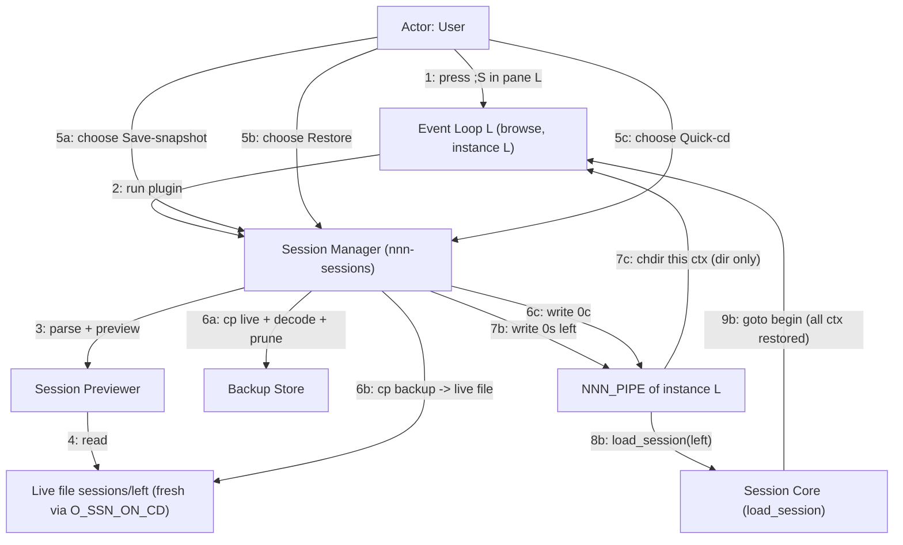

**Explanation.** Messages 1..4 are common setup (open the manager, preview via the
parser). Branch **A** (5a..6a) is pure file work -- snapshot the live file, write a
decoded mirror, prune old backups. Branch **B** (5b..9b) is the *faithful* restore:
swap the file, then the one gated pipe op makes the live instance re-`load_session`
so **all** per-context settings/filters/cursor come back. Branch **C** (5c..7c) is
the zero-C fallback: a single `c` op into the session's saved current directory
-- fast and dependency-free, but one context and no settings (one message is all
the pipe allows, see Section 2).

```
ASCII Table 8: Collaboration participants
+----------------------------+-----------------------------------------------+
| Participant                | Role in the collaboration                     |
+----------------------------+-----------------------------------------------+
| User                       | Presses ;S; chooses save/restore/switch.      |
| Event Loop L (browse)      | Runs the plugin; receives pipe ops.           |
| Session Manager            | Orchestrates the chosen action.               |
| Session Previewer          | Parses binary for list + preview.             |
| Live file sessions/left    | The current on-disk state (kept fresh).       |
| Backup Store               | Holds timestamped backups + mirrors + tars.   |
| NNN_PIPE of instance L      | Control channel back into the live instance.  |
| Session Core (load_session)| Does the real faithful reload.                |
+----------------------------+-----------------------------------------------+
```

### 6.4 The Backup Store (layout, rotation, atomicity)

```
ASCII Table 9: Backup store directory layout
+---------------------------------------------------------------+
| ~/.config/nnn/sessions/                                       |
|   left                     <- live (fresh via O_SSN_ON_CD)    |
|   right                    <- live                            |
|   @                        <- auto-session                    |
|   test                     <- other named session            |
|   .backups/                                                   |
|     left/                                                     |
|       2026-07-16T09-48-12   <- binary snapshot (blob copy)    |
|       2026-07-16T09-48-12.txt <- decoded human mirror         |
|       2026-07-15T18-02-40                                     |
|       2026-07-15T18-02-40.txt                                 |
|     right/                                                    |
|       ...                                                     |
|   .snapshots/                                                 |
|     before-refactor.tar     <- workspace: left+right+@        |
|     daily-2026-07-16.tar                                      |
+---------------------------------------------------------------+
```

Rotation keeps the last **N** backups per session (default e.g. 20), pruning the
oldest pair (blob + `.txt`) together. All writes are **atomic**: copy to a
`.tmp` name in the same directory, then `rename()` (same-filesystem, atomic), so a
crash mid-backup never yields a half-written snapshot.

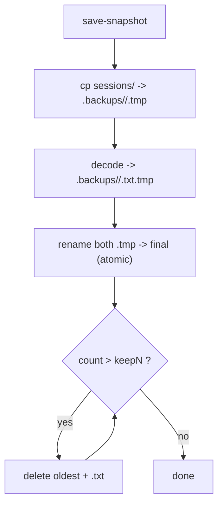

**Explanation.** The decode step (right after the blob copy) produces the
human-readable mirror from the *same* bytes, so blob and text never disagree.
Rotation loops until the count is within budget, always removing the blob and its
mirror as a pair. Because both live file and backups sit in the same directory
tree (and the same git submodule), an optional `git add -A sessions && git commit`
gives an off-box, unlimited-history backend for free (Approach D).

### 6.5 Dynamic Behaviour (save, restore, switch, snapshot)

The manager is a small state machine over the fzf selection.

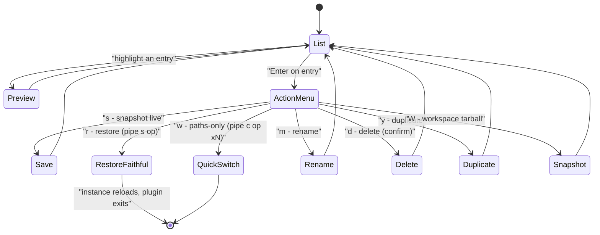

The faithful-restore sequence (Approach B's payoff) end to end:

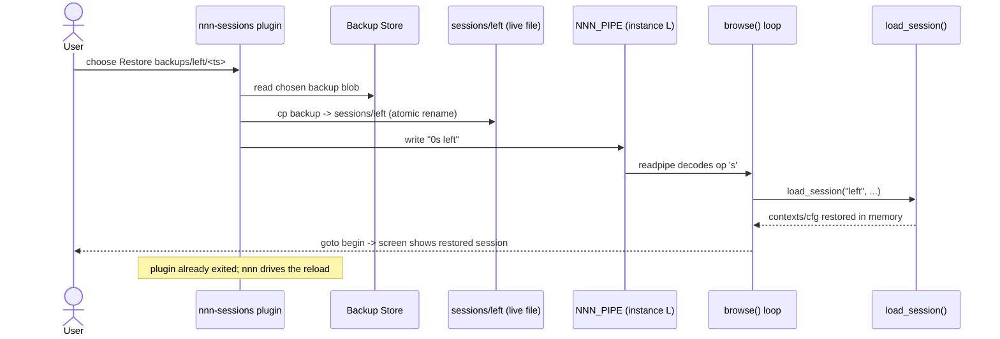

The zero-C quick-switch fallback (works today, no build flag):

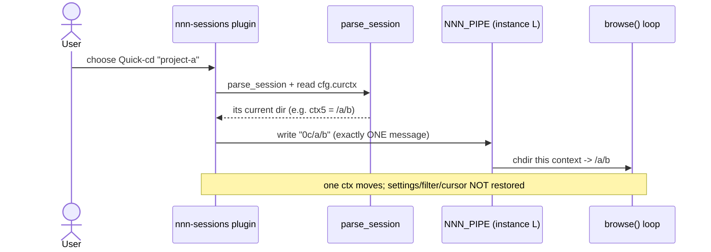

**Explanation.** The two restore paths are complementary. Faithful restore needs
the gated op but returns the session *exactly* (sort flags, hidden toggle,
filters, cursor file, colors) for all 8 contexts. Quick cd needs nothing new,
but the one-op pipe limit (Section 2) means it can only move the **current**
context, into the directory that session was last sitting in -- which is read
from `settings.curctx` in the saved global cfg. The manager offers both and
labels them honestly so the user picks per situation.

### 6.6 Faithful Restore vs Quick cd (the key decision)

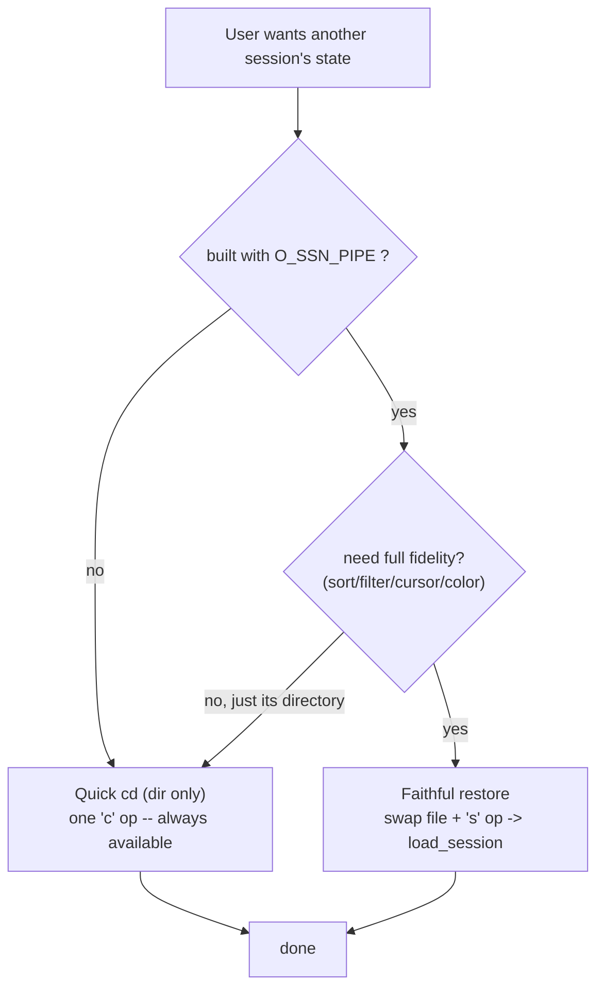

```
ASCII Table 10: Faithful restore vs quick cd
+-------------------------+---------------------------+--------------------------+
| Aspect                  | Faithful restore (s op)   | Quick cd (one c op)      |
+-------------------------+---------------------------+--------------------------+
| Restores paths          | yes (all 8 ctx)           | current ctx only         |
| Restores sort/hidden    | yes                       | no                       |
| Restores filter         | yes                       | no                       |
| Restores cursor file    | yes                       | no                       |
| Restores colors/cfg     | yes                       | no                       |
| Adopts the session name | yes (curssn <- name)      | no (stays on yours)      |
| Pipe messages needed    | 1                         | 1 (the hard limit)       |
| Needs build flag        | yes (O_SSN_PIPE)          | no                       |
| C code                  | ~12 lines (gated)         | none                     |
| Best for                | "resume exactly"          | "just take me there"     |
+-------------------------+---------------------------+--------------------------+
```

**Why not always faithful?** Because the zero-C path keeps the feature working on
a stock/upstream build and on machines where the flag is off -- graceful
degradation. The manager auto-detects the op (probe an env marker the build sets,
e.g. `NNN_SSN_PIPE=1`) and only offers faithful restore when available.

### 6.7 Whole-Workspace Snapshots across the dual panes

R7 wants "left + right + @ as one labelled unit" -- the mental model from
`start_dual_nnn.sh`. A workspace snapshot tars the three live files together; a
workspace restore lays them back and (optionally) tells **both** panes to reload.

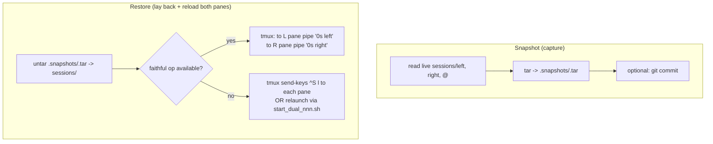

**Explanation.** Capture is a single `tar` of the three fresh files (fresh thanks
to auto-save-on-cd), optionally committed. Restore lays the files back, then
coordinates *both* panes: with the gated op it writes the `s` message to each
pane's own `$NNN_PIPE` (each instance has `nnn-pipe.<pid>`; the plugin locates the
sibling pane exactly as `ctx_switcher` already does via `tmux` pane indices);
without it, it falls back to sending `^S l` keystrokes or relaunching the pair.
This makes "save/restore my whole dual-pane workspace" a one-key operation.

### 6.8 Edge Cases

```
ASCII Table 11: Edge cases and handling
+-------------------------------------+----------------------------------------+
| Case                                | Handling                               |
+-------------------------------------+----------------------------------------+
| Version mismatch (ver != 1)         | Previewer refuses to decode; manager   |
|                                     | shows "unsupported vN", still allows   |
|                                     | blob backup/restore (opaque copy).     |
| Restore while O_SSN_ON_CD active    | The next cd would re-overwrite. Do the |
|                                     | file swap, THEN the 's' op immediately#59;|
|                                     | reload happens before any cd.          |
| Backup during auto-save race        | Copy is a snapshot of a complete file  |
|                                     | (save_session writes fully then close)#59;|
|                                     | copy-then-rename avoids torn reads.    |
| Delete the LIVE named session       | Confirm twice#59; warn it is the active  |
|                                     | session#59; do not touch in-memory state.|
| Non-tmux / single instance          | Workspace fan-out degrades to just the |
|                                     | current instance (no sibling pane).    |
| Pipe op not compiled in             | Manager hides faithful restore#59; uses  |
|                                     | quick switch or ^S l guidance.         |
| Backup store on different FS        | rename() not atomic across FS -> keep   |
|                                     | store under sessions/ (same FS).       |
| Name with spaces/unicode            | Quote everywhere#59; the binary parser    |
|                                     | already handles UTF-8 paths.           |
+-------------------------------------+----------------------------------------+
```

---

## 7. Step-by-Step Implementation Guidelines

No timeline -- ordered by dependency. Each phase is independently useful and
testable; you can stop after any phase and still have a working feature.

### Phase 0 -- Plugin skeleton and key binding

1. Create `plugins/nnn-sessions` (POSIX sh, `. "$(dirname "$0")"/.nnn-plugin-helper`).
2. Define constants at top: `SESSIONS_DIR`, `BACKUPS_DIR=$SESSIONS_DIR/.backups`,
   `SNAP_DIR=$SESSIONS_DIR/.snapshots`, `KEEP_N=20`, and the binary-format
   constants (`CTX_MAX=8 SIZE_T=8 SETTINGS_SIZE=4 UINT_SIZE=4`) copied from
   `ctx_switcher`.
3. Bind a key in [nnn_config.sh](../../../.dotfiles/nnn/nnn_config.sh) `NNN_PLUG`,
   e.g. `S:nnn-sessions` (invoke with `;S`). Keep `w:ctx_switcher` as-is.

### Phase 1 -- List + preview (Session Previewer)

4. Port `rd8()` + `extract_contexts()` from `ctx_switcher` into a shared helper (or
   copy). Add `decode_to_text()` that emits the full human mirror (reuse the field
   walk from [load_nnn_session.sh](../../../.config/nnn/sessions/load_nnn_session.sh)).
5. Build the fzf list: one row per file in `sessions/` (skip dotfiles), columns
   `name  ctxN  mtime`. Use `--preview` to show `decode_to_text` output (paths per
   context, sort/filter flags).
6. Test: `;S` lists `left/right/@/test`; preview shows all 8 contexts' paths for
   `left` and `right` (compare against `ctx_switcher`).

### Phase 2 -- Save-snapshot + Backup Store + rotation

7. Implement `save_snapshot <name>`: `ts=$(date +%Y-%m-%dT%H-%M-%S)`; copy
   `sessions/<name>` to `.backups/<name>/<ts>.tmp`, write `decode_to_text` to
   `<ts>.txt.tmp`, then `mv` (rename) both to final names.
8. Implement `prune <name>`: list `.backups/<name>/` blobs newest-first, delete
   beyond `KEEP_N` (remove the `.txt` sibling too).
9. Test: snapshot `left` twice; confirm two timestamped pairs + rotation past
   `KEEP_N`; confirm `.txt` mirror matches the live paths.

### Phase 3 -- Curate: rename / delete / duplicate

10. `rename old new` = `mv` live file (+ optionally move its `.backups/<old>` dir).
    `delete name` = confirm (double-confirm if it equals `curssn`), then `rm` the
    file (leave backups). `duplicate src dst` = `cp`.
11. Test each with confirm prompts; verify the live instance is untouched (state
    is in memory until the next auto-save).

### Phase 4 -- Quick cd (zero C, works today)

12. `session_curctx <file>`: the saved current context is `settings.curctx`, bits
    **13..15** of the 4-byte global cfg at offset `HDR_LEN` (13 single-bit fields
    precede it): `cfg=$(od -An -tu4 -j 264 -N 4 -v file)`, then `(cfg >> 13) & 7`.
13. `quick_switch <name>`: resolve that context's path, guard `test -d`, and write
    **exactly one** message `"0c$path"` to `$NNN_PIPE`.
    **Do not loop over the contexts** -- nnn reads one op per plugin run and a
    second write deadlocks it (Section 2). This is the single most important
    constraint in the whole feature.
14. Test from pane L: quick-cd to `right`; confirm the current context lands in
    right's saved current directory, that your session name does **not** change,
    and that nnn stays responsive (no hang).

### Phase 5 -- Faithful restore: the gated `s` pipe op (the only C)

15. **Makefile / Makefile_debug**: add `O_SSN_PIPE := 0  # session load via NNN_PIPE`
    and `ifeq ($(strip $(O_SSN_PIPE)),1)` -> `CPPFLAGS += -DSSN_PIPE`.
16. **readpipe()** (src/nnn.c:7530): add, guarded, an op branch:
    ```c
    #ifdef SSN_PIPE
    } else if (op == 's') {         /* load session by name */
        ssize_t len = read_nointr(fd, g_buf, NAME_MAX);
        if (len <= 0) return NULL;
        g_buf[len] = '\0';
        /* signal browse() to load_session(g_buf) -- via a small static */
    #endif
    ```
    Simplest wiring: stash the name in a static (like the ctx return) and set a
    flag the `browse()` post-`readpipe` block checks, then call
    `load_session(name, &path, &lastdir, &lastname, FALSE)` + `setdirwatch()` +
    `goto begin` -- mirroring the existing `SEL_SESSIONS` load path
    (src/nnn.c:10839).
17. Export a marker so the plugin can auto-detect: in the `#ifdef SSN_PIPE` init,
    `setenv("NNN_SSN_PIPE", "1", 1)` (near `setexports`/plugin init).
18. **build.sh / build_debug.sh**: append `O_SSN_PIPE=1`.
19. In the plugin, `faithful_restore <name>`: swap the file (Phase 2 helper in
    reverse: `cp .backups/<name>/<ts> sessions/<name>`), then, if
    `[ -n "$NNN_SSN_PIPE" ]`, write `"0s${name}"` to `$NNN_PIPE`; else fall back to
    Phase 4 quick switch and print "press ^S l for full restore".
20. Test: build with `O_SSN_PIPE=1`; restore a backup of `left` that has a filter +
    non-default sort in ctx 3; confirm sort/filter/cursor all return (not just the
    path). Verify the default build (`O_SSN_PIPE=0`) is byte-for-byte unchanged and
    the plugin degrades to quick switch.

### Phase 6 -- Whole-workspace snapshots (R7)

21. `snapshot_workspace <label>`: `tar -cf .snapshots/<label>.tar -C sessions left
    right @` (whatever exists). `list_workspaces` / preview via `tar -tf`.
22. `restore_workspace <label>`: `tar -xf` into `sessions/`, then reload both panes.
    Locate the sibling pane with the same `tmux` pane-index logic `ctx_switcher`
    uses; per pane, if `NNN_SSN_PIPE`, write `0s left` / `0s right` to that pane's
    `$NNN_PIPE`; else `tmux send-keys` the `^S l` sequence (escape `;` as `'\;'`),
    or relaunch via `start_dual_nnn.sh`.
23. Test: snapshot the pair, cd around in both panes, restore the label, confirm
    both panes return to the captured layout.

### Phase 7 -- Optional git + text-mirror backend (R8)

24. Add `backup_git`: `git -C "$SESSIONS_DIR/.." add -A sessions .backups
    .snapshots && git ... commit -m "nnn sessions <ts>"` (the config dir is already
    a submodule). Guard behind a config toggle (`NNN_SSN_GIT=1`).
25. The `.txt` mirrors from Phase 2 make these commits diffable.
26. Test: `git log` shows session commits; `git show HEAD:...txt` reads a past
    layout.

### Phase 8 -- Wire-up, docs, and test matrix

27. Update `nnn_config.sh` `NNN_PLUG` (the `S:` binding) and note it in the header
    comments alongside the `;h`/`;r`/`;w` notes.
28. Document the feature in [nnn_Software_Design.md](nnn_Software_Design.md)
    (new subsection: components, the `s` pipe op, the backup store, the
    faithful-vs-quick decision) with the diagrams above.
29. Manual test matrix: single-instance, dual-pane, op-on, op-off, version
    mismatch, spaces/unicode names, rotation limit, workspace round-trip.

```
ASCII Table 12: Implementation phases at a glance
+-------+--------------------------------+---------+-----------------------------+
| Phase | Deliverable                    | C code? | Independently useful?       |
+-------+--------------------------------+---------+-----------------------------+
| 0     | plugin skeleton + key          | no      | (scaffolding)               |
| 1     | list + preview                 | no      | yes (browse sessions)       |
| 2     | snapshot + store + rotation    | no      | yes (versioned backups)     |
| 3     | rename/delete/duplicate        | no      | yes (curation)              |
| 4     | quick switch (c ops)           | no      | yes (paths-only switch)     |
| 5     | faithful restore (s op)        | ~12 ln  | yes (exact restore)         |
| 6     | workspace snapshots            | no      | yes (dual-pane unit)        |
| 7     | git + text mirror backend      | no      | yes (unlimited history)     |
| 8     | wire-up + docs + tests         | no      | (hardening)                 |
+-------+--------------------------------+---------+-----------------------------+
```

---

## 8. Summary

- nnn today has a **save/load/restore** primitive but **no management layer**:
  no list/preview, no rename/delete/duplicate, no **versioned backups**, no
  **whole-workspace** capture, and no seamless **switch** into a running instance
  (ASCII Table 1/2).
- The load-bearing fact is that this fork's **`O_SSN_ON_CD`** keeps each on-disk
  session file a **live mirror** of the instance, so a plain file copy is an
  accurate backup -- three of the four concerns (persist, curate, coordinate)
  need **zero C** (ASCII Table 5).
- Only **faithful live restore** benefits from new C, and that is exactly **one**
  tiny, build-flag-gated NNN_PIPE op (`s`, ~12 lines), with a zero-C **quick
  switch** fallback so a stock build still works (Sections 6.6, Table 10).
- **Recommended: Approach B** -- a plugin-first **Session Manager**
  (`nnn-sessions`, `;S`) over a **versioned Backup Store**, reusing the proven
  `ctx_switcher` binary parser for preview, absorbing **git** (config dir is
  already a submodule) and **tarball workspace snapshots** as sub-features
  (Scorecard, Table 6).
- The build stays **upstream-friendly**: default build byte-for-byte unchanged;
  the single C op is opt-in behind `O_SSN_PIPE`, matching the fork's existing
  `O_HIST` / `O_SSN_ON_CD` / `O_FZ_CPMV` pattern.
- Implementation is **eight dependency-ordered phases** (Table 12), each shippable
  on its own -- from "list + preview" through "versioned backups" to
  "faithful restore" and "whole-workspace snapshots".
```
