# Brainstorm: Unlimited, Cross-Everything Directory History for nnn

> Design exploration for an **unlimited directory back-history** that works
> **across all 8 sessions/tabs (contexts), across both running instances
> (dual TMUX panes), and across sessions** -- recorded automatically and
> navigable optionally by the user.
>
> Source baseline: `origin-old/master` at `ecf6d9a8`. Line references point to
> [src/nnn.c](../src/nnn.c).

---

## Table of Contents

1. Goal and Requirements
2. How nnn Handles Directory History Today (Ground Truth)
3. Problem Decomposition (the four axes)
4. Brainstorm of Approaches (A..F) with Pros/Cons and a Scorecard
5. Deep Dive -- Recommended Design (Shared Visit Log + Picker + optional Nav)
   - 5.1 Architecture and Components
   - 5.2 Class Diagram + Class Summary Table
   - 5.3 Collaboration Diagram + Participant Summary Table
   - 5.4 The Shared Store (schema, concurrency, compaction)
   - 5.5 Dynamic Behaviour (record, pick-jump, sequential back/forward)
   - 5.6 Auto-detection and Optional User Choice
   - 5.7 Edge Cases
6. Step-by-Step Implementation Guidelines
7. Summary

---

## 1. Goal and Requirements

```
ASCII Table 1: Requirements
+-----+--------------------------------------------------------------+--------+
| #   | Requirement                                                  | Today? |
+-----+--------------------------------------------------------------+--------+
| R1  | Unlimited back history (not just one previous directory)     | NO     |
| R2  | History shared across all 8 contexts (tabs) of one instance  | NO     |
| R3  | History shared across sessions (-s left / -s right, restore) | partial|
| R4  | History shared across BOTH running instances (TMUX panes)    | NO     |
| R5  | Recorded AUTOMATICALLY (no manual marking)                   | NO     |
| R6  | User can OPTIONALLY choose where to jump (a picker)          | NO     |
| R7  | Small, upstream-friendly change (keep pulling origin-old)    | --     |
+-----+--------------------------------------------------------------+--------+
```

The user's setup that frames the problem:

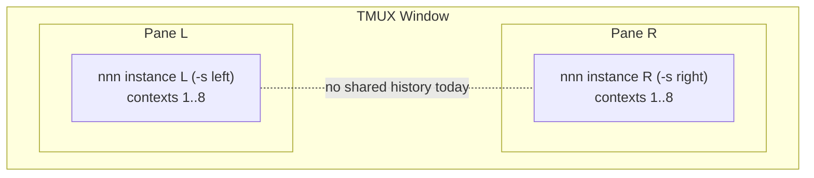

**Explanation.** Two independent nnn processes, each with 8 contexts. This is
exactly what `~/bin/start_dual_nnn.sh` builds: it `tmux split-window -h`s the
window and launches the `nnn_left` and `nnn_right` aliases from
`~/.dotfiles/nnn/nnn_config.sh`:

```sh
# ~/.dotfiles/nnn/nnn_config.sh (abridged)
alias nnn_left='/home/tripham/bin/nnn ... -s left  -S -f'
alias nnn_right='/home/tripham/bin/nnn ... -s right -S -f'
export NNN_FIFO="/tmp/nnn.fifo"   # already SHARED between both panes
export NNN_PLUG='...;r:my_trash_restore;...'   # where ;h will be added
```

So the two instances already share `nnn_config.sh` (one `NNN_PLUG`, one shared
`NNN_FIFO`) and are distinguished by their tmux pane id `$TMUX_PANE` and their
session names `left` / `right`. Nothing about *directory history* is shared,
though -- that is the gap this design fills. The `$TMUX_PANE` id and the
`left`/`right` session names become the natural labels for each history record
(5.4).

---

## 2. How nnn Handles Directory History Today (Ground Truth)

nnn stores exactly **one** previous directory per context, in the `context`
struct ([src/nnn.c:419](../src/nnn.c#L419)):

```c
typedef struct {
    char c_path[PATH_MAX];  /* current dir  */
    char c_last[PATH_MAX];  /* last visited dir -- the ONLY history, depth 1 */
    ...
} context;
```

On every directory change, `cdprep()` ([src/nnn.c:8395](../src/nnn.c#L8395))
overwrites that single slot:

```c
static bool cdprep(char *lastdir, char *lastname, char *path, char *newpath)
{
    ...
    xstrsncpy(lastdir, path, PATH_MAX);   /* save CURRENT as "last" (overwrite) */
    xstrsncpy(path, newpath, PATH_MAX);   /* move to new */
    ...
}
```

The `-` key (`SEL_CDLAST`, [src/nnn.c:8971](../src/nnn.c#L8971)) just toggles
between `c_path` and `c_last`. So "back" is a one-level flip, scoped to a single
context.

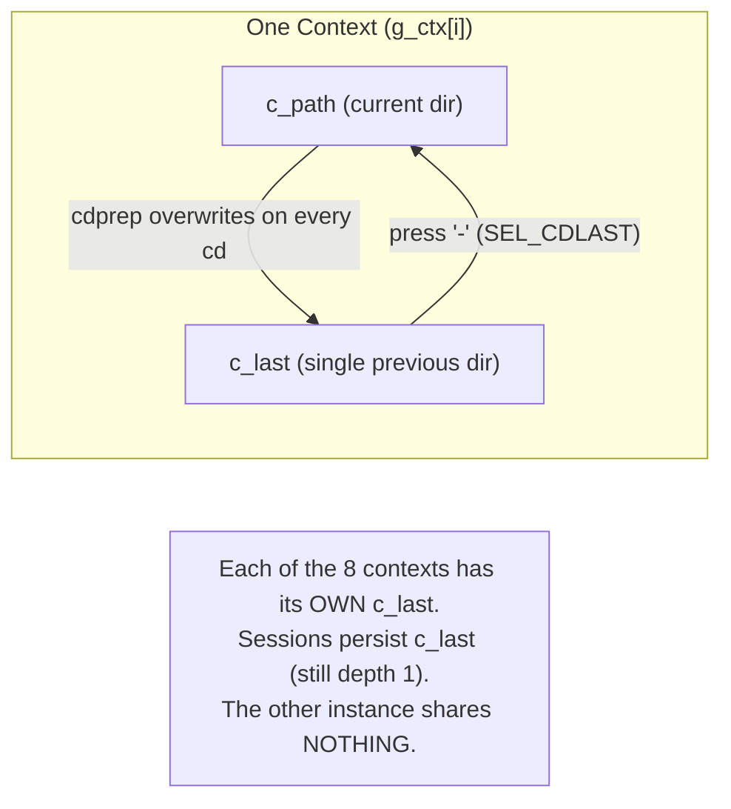

```
ASCII Table 2: What is and is not shared today
+--------------------------+------------------------------------------------+
| Scope                    | Directory-history sharing today                |
+--------------------------+------------------------------------------------+
| Within one context       | depth 1 (c_last), toggled by '-'               |
| Across contexts (tabs)   | none (each c_last is independent)              |
| Across sessions          | c_last is persisted, but still depth 1         |
| Across instances (panes) | none (separate processes, separate memory)     |
+--------------------------+------------------------------------------------+
```

**Two facts that the design will exploit:**

1. **The `begin:` choke point.** Every real directory change funnels through the
   `begin:` label in `browse()` with the `cd` flag set (the same place Part I's
   session auto-save hooks). One line there can record every visit.
2. **The `NNN_PIPE` control protocol.** A plugin can drive its **own** instance
   to change directory by writing `<ctx>c<abspath>` to `$NNN_PIPE`
   (`readpipe()`, [src/nnn.c:6485](../src/nnn.c#L6485)). This is how zoxide /
   autojump plugins already work -- so cross-instance *navigation* needs **no C
   code**, only a plugin plus a shared store.

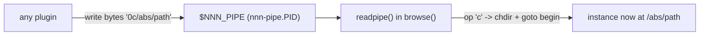

---

## 3. Problem Decomposition (the four axes)

The requirement mixes two independent dimensions: **depth** (how far back) and
**scope** (whose history). Separating them clarifies the design.

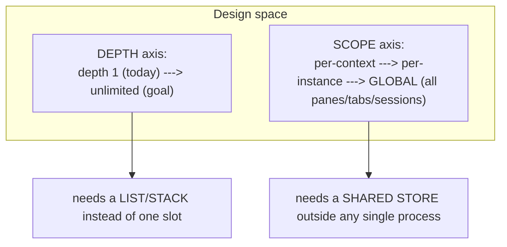

```
ASCII Table 3: The four axes mapped to mechanisms
+--------------+--------------------------------+------------------------------+
| Axis         | What it needs                  | Natural mechanism            |
+--------------+--------------------------------+------------------------------+
| Unlimited    | a growable ordered list        | append-only log / ring stack |
| Cross-tab    | shared between 8 contexts      | a process-global structure   |
| Cross-session| survives restart/restore       | persisted to disk            |
| Cross-       | shared between separate         | a file (or daemon) outside    |
|   instance   | processes                      | any one process              |
+--------------+--------------------------------+------------------------------+
```

The single mechanism that covers **all four** at once is a **shared,
append-only, on-disk visit log**: it is unlimited (append), process-global,
persistent, and cross-instance (one file for everyone).

---

## 4. Brainstorm of Approaches

Six candidates, scored on the requirements (R1..R7) plus implementation cost and
upstream-merge friction.

### Approach A -- Per-context history stack inside nnn (pure C)

Replace `c_last` with an in-memory ring/stack per context (and persist it in the
session file). New keys walk the stack.

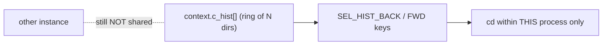

```
ASCII Table 4: Approach A
+-----------+----------------------------------------------------------------+
| Pros      | - Native back/forward keys, instant, no external store.         |
|           | - Sequential 'back button' feel.                               |
+-----------+----------------------------------------------------------------+
| Cons      | - Does NOT cross instances (R4) -- the headline requirement.    |
|           | - Cross-tab only if the stack is process-global, not per-ctx.  |
|           | - Big C change + session-format bump (compat break), large     |
|           |   merge surface vs upstream (violates R7).                      |
+-----------+----------------------------------------------------------------+
```

### Approach B -- Shared append-only visit log + fzf picker plugin (RECOMMENDED core)

One tiny C hook at `begin:` appends every real `chdir` to a shared log. A plugin
(`;h`) reads the log, dedups, shows it in fzf (newest at the bottom, like the
trash-restore plugin), and jumps via `NNN_PIPE`.

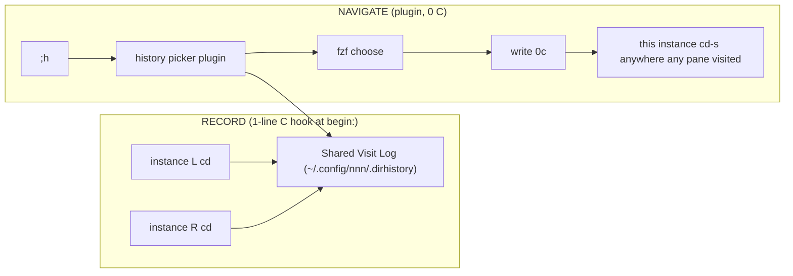

```
ASCII Table 5: Approach B
+-----------+----------------------------------------------------------------+
| Pros      | - Covers R1..R6: unlimited, cross-tab, cross-session, cross-    |
|           |   instance, auto-recorded, user-chosen (fzf).                  |
|           | - Minimal C: ONE hook line at begin: (mirrors Part I) (R7).     |
|           | - Navigation needs ZERO C (reuses NNN_PIPE 'c'), like zoxide.   |
|           | - Persistent, plain-text, debuggable, plays with existing tools.|
+-----------+----------------------------------------------------------------+
| Cons      | - The picker (not a literal 'back key') is the primary UX.      |
|           | - Needs log compaction + concurrent-append care (5.4).         |
|           | - Sequential cross-instance 'back' needs a small add-on (App F).|
+-----------+----------------------------------------------------------------+
```

### Approach C -- Zero-C daemon tailing the shared NNN_FIFO

The user already shares `NNN_FIFO=/tmp/nnn.fifo`. A daemon tails it and records
paths; the picker reads what the daemon stored.

```
ASCII Table 6: Approach C
+-----------+----------------------------------------------------------------+
| Pros      | - Zero C change (uses existing NNN_FIFO writes).               |
+-----------+----------------------------------------------------------------+
| Cons      | - NNN_FIFO streams the HOVERED path on every cursor move --     |
|           |   noisy, not clean directory-change events (needs heavy        |
|           |   filtering / dirname heuristics).                             |
|           | - Requires a long-running background daemon (lifecycle, races). |
|           | - Transient pipe, not a clean record of 'visits'. Fragile.     |
+-----------+----------------------------------------------------------------+
```

### Approach D -- A dedicated history daemon with a socket protocol

A small server holds the global history; instances notify it on cd; the picker
queries it (frecency ranking, live).

```
ASCII Table 7: Approach D
+-----------+----------------------------------------------------------------+
| Pros      | - Robust concurrency, ranking, real-time cross-instance view.   |
+-----------+----------------------------------------------------------------+
| Cons      | - Heavy: a new daemon, socket protocol, lifecycle/supervision.  |
|           | - Either more C (to speak the protocol) or a plugin shim.       |
|           | - Over-engineered vs. a flat file for a single user's history.  |
+-----------+----------------------------------------------------------------+
```

### Approach E -- Reuse zoxide (already installed: z / zi)

zoxide already keeps a global, cross-shell directory database; `zi` jumps
interactively.

```
ASCII Table 8: Approach E
+-----------+----------------------------------------------------------------+
| Pros      | - Zero new infrastructure; already global and cross-instance.   |
|           | - Fuzzy interactive jump (zi) via NNN_PIPE already works.       |
+-----------+----------------------------------------------------------------+
| Cons      | - FRECENCY ranking, NOT a chronological back-history: it does   |
|           |   not preserve visit ORDER or support sequential back/forward.  |
|           | - Cannot answer 'where did I just come from, across panes'.     |
|           | - Partial: great as a complementary jump, not the history.     |
+-----------+----------------------------------------------------------------+
```

### Approach F -- Hybrid: B (log + picker) PLUS optional in-C sequential back/forward

Approach B for the shared global store and the picker, **plus** a small optional
C addition: per-instance back/forward keys that walk a snapshot of the global
log (browser-style). This is B with the literal "unlimited back key" added.

```
ASCII Table 9: Approach F
+-----------+----------------------------------------------------------------+
| Pros      | - Everything in B, PLUS a true unlimited sequential back/forward|
|           |   key that can step across instances' visits.                  |
+-----------+----------------------------------------------------------------+
| Cons      | - Adds a few C lines (per-instance cursor + 2 actions) beyond   |
|           |   the single record hook -- still far smaller than Approach A.  |
+-----------+----------------------------------------------------------------+
```

### Scorecard

```
ASCII Table 10: Approach comparison (5 = best)
+-----------------------------+----+----+----+----+----+----+
| Criterion                   | A  | B  | C  | D  | E  | F  |
+-----------------------------+----+----+----+----+----+----+
| R1 unlimited depth          | 4  | 5  | 4  | 5  | 2  | 5  |
| R4 cross-instance           | 1  | 5  | 4  | 5  | 5  | 5  |
| R2/R3 cross-tab/session     | 3  | 5  | 4  | 5  | 4  | 5  |
| R5 auto-recorded            | 5  | 5  | 3  | 5  | 5  | 5  |
| R6 optional user choice     | 3  | 5  | 4  | 5  | 4  | 5  |
| R7 minimal C / merge-safe   | 1  | 5  | 5  | 2  | 5  | 4  |
| Robustness / simplicity     | 4  | 4  | 2  | 2  | 4  | 4  |
+-----------------------------+----+----+----+----+----+----+
| TOTAL                       | 21 | 34 | 26 | 29 | 29 | 33 |
+-----------------------------+----+----+----+----+----+----+
```

**Winner: Approach B as the core, extended to F.** Ship B first (one C hook +
picker plugin: covers every requirement with the smallest change), then
optionally add F's sequential back/forward key. zoxide (E) stays as a
complementary "jump to frequent dirs" and is not a substitute for ordered
history.

---

## 5. Deep Dive -- Recommended Design

### 5.1 Architecture and Components

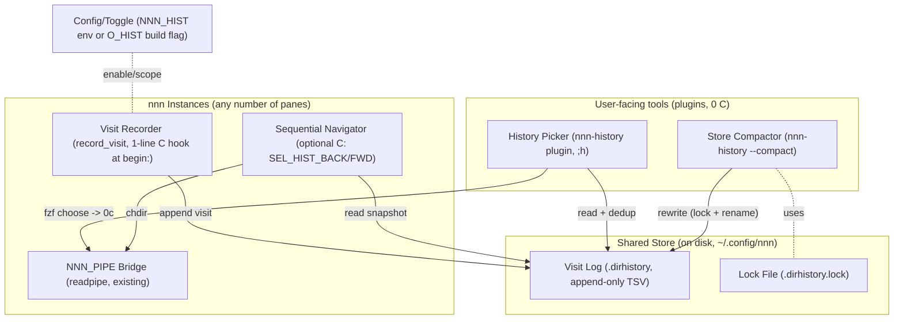

**Explanation.** Three planes: **record** (the only C hook -- one line),
**store** (a plain append-only file plus a lock), and **navigate** (plugins that
need zero C because they reuse `NNN_PIPE`). The optional **Sequential Navigator**
is the only piece that adds more than one C line, and it is opt-in (Approach F).

### 5.2 Class Diagram + Class Summary Table

Since nnn is C, each "class" is a function-group plus the data it owns.

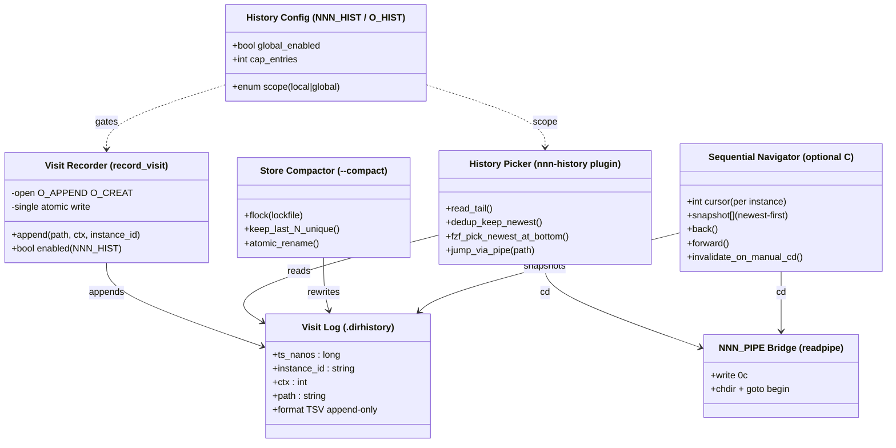

```
ASCII Table 11: Class summary (for the class + collaboration diagrams)
+--------------------------+-----------+-----------------------------------------+
| Class (module)           | Where     | Responsibility                          |
+--------------------------+-----------+-----------------------------------------+
| Visit Recorder           | C, in nnn | Append one record per real chdir at the |
|   (record_visit)         | (begin:)  | begin: choke point. The ONLY C hook.    |
| Visit Log                | disk file | Append-only TSV: the single source of   |
|   (.dirhistory)          |           | truth, shared by all instances.         |
| History Config           | env/build | Enable + scope (local vs global) + cap. |
|   (NNN_HIST / O_HIST)     |           | Auto-detect + optional toggle.          |
| History Picker           | plugin    | Read + dedup + fzf + jump via pipe.     |
|   (nnn-history)          | (0 C)     | The 'choose optionally' UX.             |
| Store Compactor          | plugin    | Bound the log: keep last N unique under |
|   (--compact)            | (0 C)     | a lock, atomic rename.                  |
| Sequential Navigator     | C, opt-in | Per-instance back/forward cursor over a |
|   (SEL_HIST_BACK/FWD)     |           | global snapshot (Approach F).           |
| NNN_PIPE Bridge          | C, exists | Reused 'c' op: cd this instance.        |
|   (readpipe)             |           | No change needed.                       |
+--------------------------+-----------+-----------------------------------------+
```

### 5.3 Collaboration Diagram + Participant Summary Table

UML collaboration (communication) view of the two key use cases, with numbered
messages.

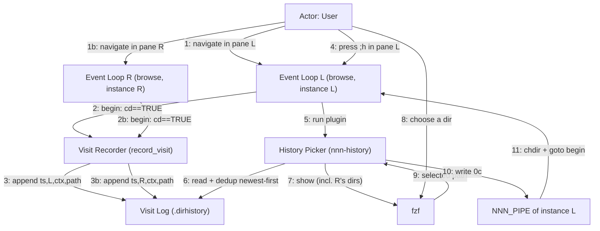

**Explanation.** Messages 1..3 (and 1b..3b) show **both** instances feeding the
**same** log -- that is the cross-instance recording. Messages 4..11 show pane L
jumping to a directory that pane R visited, proving cross-instance navigation
with no shared memory -- only the shared file plus L's own pipe.

```
ASCII Table 12: Collaboration participants
+----------------------------+-----------------------------------------------+
| Participant                | Role in the collaboration                     |
+----------------------------+-----------------------------------------------+
| Event Loop L / R (browse)  | Detect cd at begin: (record); run the picker. |
| Visit Recorder             | Append the record (both instances).           |
| Visit Log (.dirhistory)    | The shared rendezvous point for all panes.    |
| History Picker             | Read/dedup/show/jump.                          |
| fzf                        | Let the user choose optionally.               |
| NNN_PIPE of instance L     | Drive instance L to cd (per-instance).        |
+----------------------------+-----------------------------------------------+
```

### 5.4 The Shared Store (schema, concurrency, compaction)

#### Record schema

```
ASCII Table 13: One record (TSV line in .dirhistory)
+-------------+----------+----------------------------------------------------+
| Field       | Type     | Meaning                                            |
+-------------+----------+----------------------------------------------------+
| ts_nanos    | int64    | Wall-clock nanoseconds (ordering across instances).|
| instance_id | string   | $TMUX_PANE (e.g. %12) if set, else pid -- which    |
|             |          | pane/process. The dual-start uses tmux panes.      |
| session     | string   | curssn ('left' / 'right' / '@') -- which session.  |
| ctx         | int 1..8 | Which tab inside that instance.                    |
| path        | string   | Absolute directory path (the visit).               |
+-------------+----------+----------------------------------------------------+
```

Example lines (the left pane is `%12`, the right pane is `%13`):

```
1750000000123  %12  left   3  /home/tripham/Dev/nnn
1750000000456  %13  right  1  /home/tripham/Downloads
1750000000789  %12  left   3  /home/tripham/Dev/nnn/src
```

Using `$TMUX_PANE` as the id (which the recorder reads with
`getenv("TMUX_PANE")`, falling back to the pid) means the picker can label each
entry with the exact pane it came from -- `left`/`right` are the session names,
`%12`/`%13` the panes.

#### Concurrency -- lockless append, locked compaction

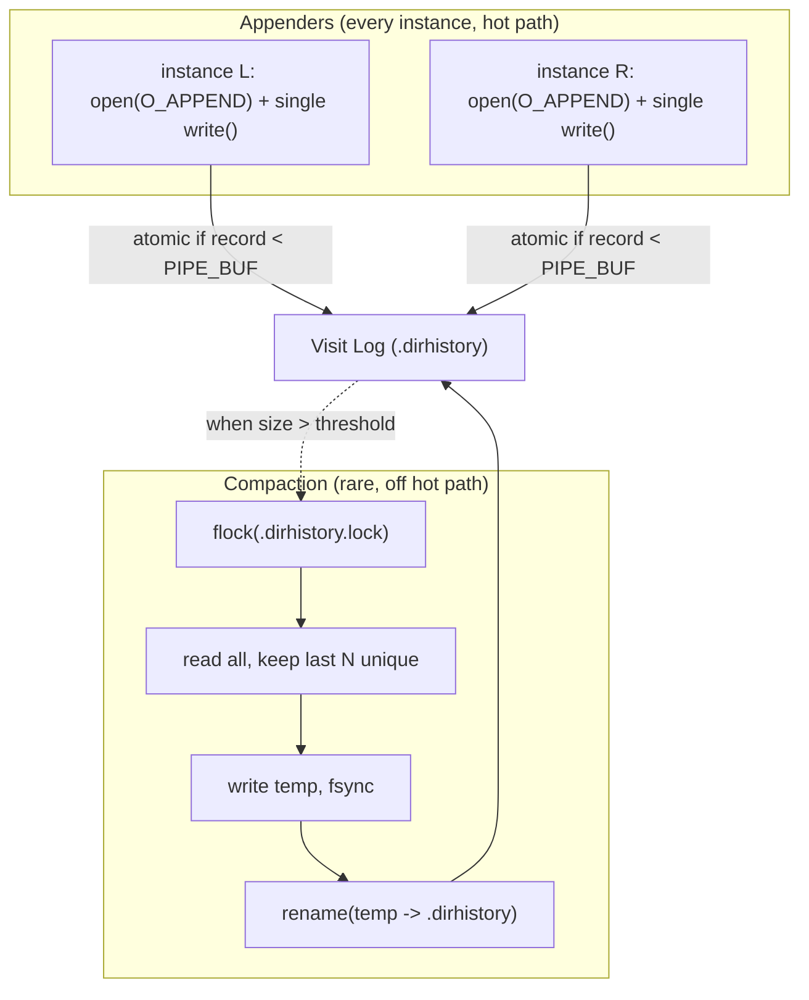

**Best practices baked in:**

```
ASCII Table 14: Store best practices
+--------------------+-------------------------------------------------------+
| Concern            | Practice                                              |
+--------------------+-------------------------------------------------------+
| Append atomicity   | One write() in O_APPEND mode is atomic when the       |
|                    | record is < PIPE_BUF (4096B). Keep records short;     |
|                    | tolerate/skip the rare malformed line on read.        |
| No lock on hot path| Appends never block -- only compaction takes the lock.|
| Bounded size       | Compactor keeps the last N unique paths (e.g. 1000).  |
| Crash safety       | Append-only + atomic rename for compaction; a partial |
|                    | tail line is simply ignored by the reader.            |
| Privacy            | File mode 0600 under ~/.config/nnn (paths are private)|
| Portability        | clock_gettime(CLOCK_REALTIME), getpid(); plain POSIX. |
+--------------------+-------------------------------------------------------+
```

#### Compaction lifecycle

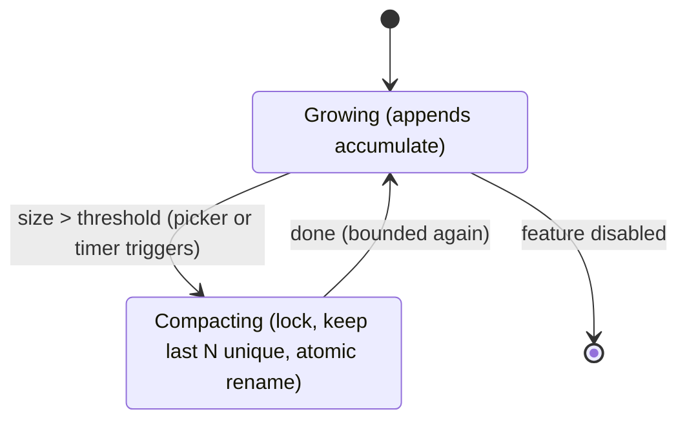

### 5.5 Dynamic Behaviour

#### 5.5.1 Recording a visit (the one C hook)

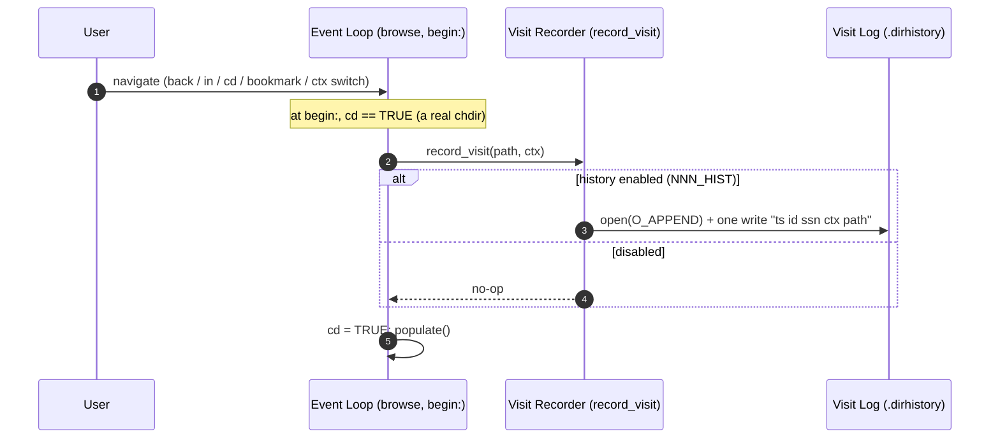

**Explanation.** This mirrors Part I exactly: a single guarded statement at
`begin:` keyed off the existing `cd` flag. Every real directory change in every
instance/tab is recorded -- automatic (R5), unlimited (append, R1), and shared
because all instances open the **same** file (R2/R3/R4).

#### 5.5.2 Jump anywhere via the picker (cross-instance)

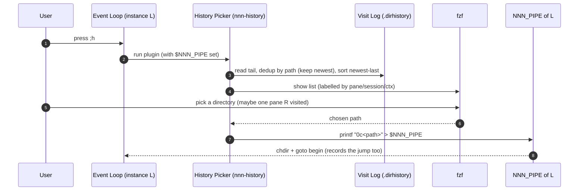

**Explanation.** The picker is the "choose optionally" UX (R6). Because it reads
the shared log, it can list and jump to directories visited by the *other*
instance (R4). The jump itself is recorded by the same hook, so history stays
consistent.

#### 5.5.3 Optional sequential back/forward (Approach F)

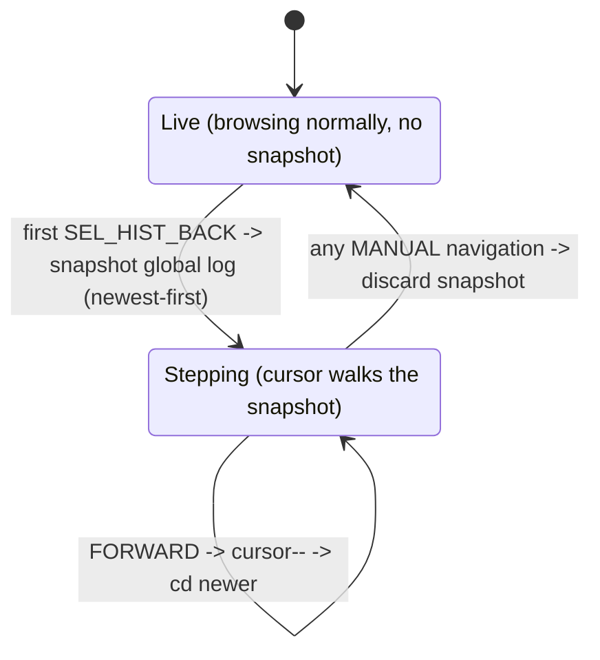

**Explanation.** For users who want a literal "unlimited back key," a per-instance
cursor walks a **snapshot** of the global log taken on the first back-press
(browser-style). A normal manual navigation discards the snapshot so the next
back-press re-reads the latest global history. This is the only piece that adds
more than one C line, and it is opt-in.

#### 5.5.4 End-to-end data flow

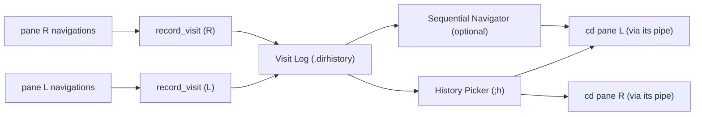

### 5.6 Auto-detection and Optional User Choice

```
ASCII Table 15: How R5 (auto) and R6 (optional) are satisfied
+--------------------------+--------------------------------------------------+
| Aspect                   | Mechanism                                        |
+--------------------------+--------------------------------------------------+
| Auto-record              | The begin: hook fires on every cd, no user action|
| Auto-detect sources      | Each record carries instance_id + session + ctx, |
|                          | so the picker auto-labels 'which pane/tab/session'|
| Auto-detect live panes   | Picker can mark entries whose pid is still alive  |
|                          | (kill -0) as '[live]' vs '[past]'.               |
| Optional: enable/disable | NNN_HIST=1 env (or O_HIST build flag) gates the   |
|                          | recorder; default off = byte-for-byte upstream.  |
| Optional: scope          | NNN_HIST=local keeps depth-1 behaviour#59;        |
|                          | NNN_HIST=global enables the shared store.        |
| Optional: choose target  | The fzf picker -- user selects any entry, or      |
|                          | filters by pane/session/ctx label.               |
+--------------------------+--------------------------------------------------+
```

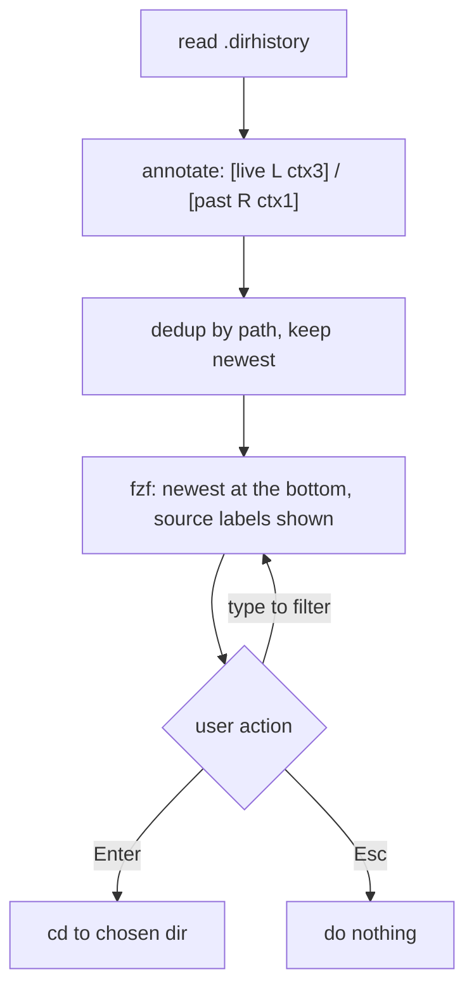

### 5.7 Edge Cases

```
ASCII Table 16: Edge cases and handling
+-------------------------------------+----------------------------------------+
| Edge case                           | Handling                               |
+-------------------------------------+----------------------------------------+
| Two instances append at the same    | O_APPEND single-write is atomic for     |
|   instant                           | records < PIPE_BUF; order by ts_nanos.  |
| Very long path (record >= PIPE_BUF) | Rare; reader skips a malformed line.    |
|                                     | Optionally cap/truncate path on record. |
| Log grows unbounded                 | Compactor keeps last N unique (5.4).   |
| Picked dir no longer exists         | Plugin checks `test -d` before the pipe |
|                                     | write; drops dead entries from view.    |
| Jump to a dir from a dead instance  | Fine -- the path is just a path; the    |
|                                     | live instance cd-s there.              |
| Feature disabled (NNN_HIST unset)   | Recorder is a no-op; behaviour ==       |
|                                     | upstream (depth-1 c_last).             |
| Sessions left/right both on         | Each record carries 'session', so the   |
|                                     | picker can filter or show all.         |
| Privacy of visited paths            | 0600 file under ~/.config/nnn.          |
+-------------------------------------+----------------------------------------+
```

---

## 6. Step-by-Step Implementation Guidelines

No timeline -- ordered steps only.

### Step 1 -- Add the config toggle

Add an `NNN_HIST` env read (and/or an `O_HIST` Makefile option mirroring
`O_SSN_ON_CD`) so the whole feature is **off by default** (keeps the default
build identical to upstream, R7). Values: unset/`0` = off, `global` = shared
log, `local` = current behaviour.

### Step 2 -- Add the Visit Recorder hook (the only required C change)

At the `begin:` label in `browse()`, right where Part I's auto-save sits, add one
guarded call after a real chdir:

```c
#ifndef NOSSN /* reuse the same gating spirit; or #ifdef O_HIST */
    if (cd && hist_enabled)
        record_visit(path);   /* append "ts id ssn ctx path" to .dirhistory */
#endif
```

`record_visit()` is a ~10-line helper: build the line with
`clock_gettime` + (`getenv("TMUX_PANE")` else `getpid`) + `curssn` +
`cfg.curctx` + `path`, then `open(O_WRONLY|O_APPEND|O_CREAT, 0600)` and a single
`write()`.

### Step 3 -- Define the store path and format

`${XDG_CONFIG_HOME:-$HOME/.config}/nnn/.dirhistory` (TSV, Table 13), lock file
`.dirhistory.lock`. Reuse nnn's `cfgpath` to build it.

### Step 4 -- Write the History Picker plugin (no C)

`plugins/nnn-history` (bind `;h` via `NNN_PLUG`): read `.dirhistory`, annotate
with live/past + pane/session/ctx, dedup by path keeping newest, show in fzf
**newest-at-the-bottom** (reuse the `tac` trick from `my_trash_restore`), then
`printf "0c%s" "$dir" > "$NNN_PIPE"` to jump. Guard with `test -d`.

### Step 5 -- Write the Store Compactor (no C)

`nnn-history --compact` (run from the picker opportunistically when the file
exceeds a threshold, or from a periodic job): take `flock` on
`.dirhistory.lock`, keep the last N unique paths, write a temp file, `rename()`.

### Step 6 -- (Optional, Approach F) Sequential back/forward keys

Add two actions (`SEL_HIST_BACK` / `SEL_HIST_FWD`) bound to free keys, a
per-instance cursor + snapshot, and reuse the existing `chdir + goto begin` path.
Invalidate the snapshot on any manual navigation (5.5.3).

### Step 7 -- Wire config + build (uses the existing dotfiles)

In `~/.dotfiles/nnn/nnn_config.sh`: `export NNN_HIST=global`, and add the picker
to `NNN_PLUG` (e.g. append `;h:nnn-history`). If a build flag is used, add
`O_HIST=1` to `build.sh` (mirroring `O_SSN_ON_CD` / `O_FZ_CPMV`). Install the
`nnn-history` plugin alongside `my_trash_restore` /
`cpmv` in `~/.config/nnn/plugins/`. **`~/bin/start_dual_nnn.sh` needs no
change** -- both `nnn_left` and `nnn_right` inherit the env and plugin, so both
panes record into and read from the one shared log automatically.

### Step 8 -- Verify

```
ASCII Table 17: Verification matrix
+-------------------------------------------+--------------------------------+
| Test                                      | Expected                       |
+-------------------------------------------+--------------------------------+
| cd in pane L, then ;h in pane L           | sees L's recent dirs           |
| cd in pane R, then ;h in pane L           | sees R's dirs too (R4)         |
| switch ctx in L, navigate, ;h             | sees dirs from multiple tabs   |
| restart with -s left, ;h                  | sees pre-restart history (R3)  |
| append from both panes rapidly            | no corruption#59; ordered by ts|
| grow the log, trigger compaction          | bounded, newest kept           |
| NNN_HIST unset                            | no .dirhistory written#59;     |
|                                           | behaviour == upstream          |
| pick a deleted dir                        | skipped (test -d guard)        |
+-------------------------------------------+--------------------------------+
```

### Step 9 -- Keep upstream-syncable

The only C edits are: the config read, the one-line `record_visit` hook at
`begin:`, and (optionally) the two sequential-nav actions. Everything else is
plugins. Periodically `git fetch origin-old && git rebase origin-old/master`;
the single hook at the stable `begin:` label rebases cleanly (as Part I/II have).

---

## 7. Summary

- nnn today keeps **one** previous directory per context (`c_last`), with no
  sharing across tabs, sessions, or the two instances.
- The requirement splits into **depth** (unlimited) and **scope** (global). A
  single **shared, append-only visit log** satisfies both, and -- crucially --
  is the only structure that reaches **across separate processes** (R4).
- **Recommended: Approach B (extended to F).** One guarded C line at the
  `begin:` choke point records every visit (auto, unlimited, shared); a
  zero-C **fzf picker plugin** lets the user jump to any directory any pane,
  tab, or session visited (via the existing `NNN_PIPE` `c` op); an optional
  small C addition gives a literal unlimited back/forward key.
- The design is **off by default** (`NNN_HIST`/`O_HIST`), so the default build
  stays byte-for-byte upstream and rebasing onto `origin-old/master` stays
  trivial -- the same minimal-footprint strategy proven by the Part I and Part
  II features.
- **zoxide** (already installed) complements this as a frecency jumper but is not
  a substitute for ordered, cross-instance back-history.
