# Brainstorm: nnn Updates

> Living design document for incremental, upstream-friendly enhancements to
> [nnn](https://github.com/jarun/nnn). Each Part isolates one feature so that it
> can be reasoned about, reviewed, and rebased on top of `origin-old/master`
> independently.
>
> **Source baseline:** all line numbers and code excerpts in this document refer
> to `origin-old/master` at commit `ecf6d9a8` ("Update to lock threads v6",
> 2026-06-06) unless explicitly marked "(old branch)". Re-verify with
> `git fetch origin-old` if upstream has advanced.

---

## Part I -- Save Session Automatically When Changing Directory

### I.0 Goal Statement

When the user navigates between directories inside nnn, the **session state**
(contexts, current paths, last-visited dirs, filenames, filters, settings)
should be persisted to disk automatically, so that:

- A crash, terminal close, SSH drop, or power loss never loses "where I was".
- Re-launching with `nnn -s@` (load the auto-session), `nnn -s <name>`, `nnn -S`
  (persistent), or the runtime restore (`S` then `r`) returns to the exact spot.
  (Note: the CLI `-r` flag is **not** about sessions -- see I.3.0.)

The change must be **small and surgical** so that the fork can keep pulling the
latest upstream code from the `origin-old` remote's `master` branch with the
**least possible merge friction** -- ideally touching a **single logical line**
inside the hot navigation path.

---

### I.0.1 Upstream Sync Status (READ FIRST)

The feature branch `feature/save-session-when-chdir` was cut from a 2024 nnn.
Upstream has since moved far ahead. Current divergence:

```
ASCII Table 0: Branch vs origin-old/master (as of commit ecf6d9a8)
+----------------------------------+-----------------------------------------+
| Measure                          | Value                                   |
+----------------------------------+-----------------------------------------+
| Feature branch is AHEAD by       | 1 commit  (ca805a09, the auto-save WIP) |
| Feature branch is BEHIND by      | 263 commits                             |
| Upstream HEAD                     | ecf6d9a8 "Update to lock threads v6"    |
| Upstream HEAD date               | 2026-06-06                              |
+----------------------------------+-----------------------------------------+
```

During those 263 commits, upstream performed a **session-handling refactor**
that directly changes how this feature must be implemented. The refactor is the
single most important input to this design and is detailed in I.1.7. The
headline consequence:

> The current branch's edits reference a `session` variable that **no longer
> exists** in `browse()`. Rebasing the branch onto `origin-old/master` does not
> merely conflict -- it produces a **compile error**. The feature must be
> re-expressed in terms of the new `curssn` global.

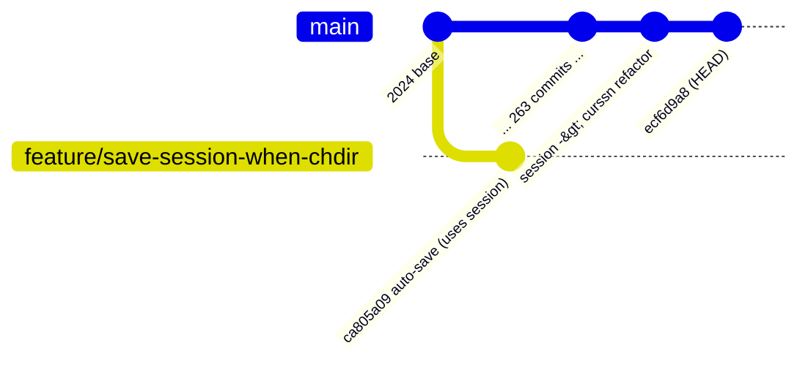

---

### I.1 How Sessions Work Today (Ground Truth from the Source)

Before proposing anything, here is the *actual* machinery, extracted from the
upstream [src/nnn.c](../src/nnn.c) at `ecf6d9a8`.

#### I.1.1 The session on-disk format

A session file is a flat binary blob: a fixed header, the global `cfg`, then a
per-context record for each of the `CTX_MAX` contexts. The format is unchanged
across the refactor.

```
session_header_t (src/nnn.c:426)        Per-context payload (x CTX_MAX)
+--------------------------------+      +------------------------------+
| ver        : size_t            |      | c_cfg   : settings           |
| pathln[CTX_MAX] : size_t       |      | color   : uint_t             |
| lastln[CTX_MAX] : size_t       |      | c_name  : nameln bytes       |
| nameln[CTX_MAX] : size_t       |      | c_last  : lastln bytes       |
| fltrln[CTX_MAX] : size_t       |      | c_fltr  : REGEX_MAX bytes    |
+--------------------------------+      | c_path  : pathln bytes       |
                                        +------------------------------+
```

The writer is `save_session()` ([src/nnn.c:5075](../src/nnn.c#L5075)); the
reader is `load_session()` ([src/nnn.c:5132](../src/nnn.c#L5132)).

#### I.1.2 The session "slots"

```
ASCII Table 1: Session naming semantics
+-------------------+-----------------------------------------------------------+
| Slot name         | Meaning                                                   |
+-------------------+-----------------------------------------------------------+
| "@"               | The special "auto session" / "last session". Written      |
|                   | automatically when a session is loaded at runtime; loaded  |
|                   | by `nnn -s@` or the runtime restore (`S` -> `r`). Also     |
|                   | the slot `-S` uses when no named session is active.        |
| <user name>       | A named session created by the user via the `S` key or    |
|                   | launched with `nnn -s <name>`.                             |
| "" (empty curssn) | No session active (default launch). This is the new        |
|                   | "no session" sentinel -- an EMPTY STRING, never NULL.      |
+-------------------+-----------------------------------------------------------+
```

#### I.1.3 NEW: the mutable `curssn` global replaces the old `session` parameter

This is the crux of the refactor. In the 2024 branch, `browse()` took a
**`const char *session`** argument that was fixed at launch and could be `NULL`.
That parameter is **gone**. Upstream now keeps a single mutable global:

```c
/* src/nnn.c:505 */
#ifndef NOSSN
static char curssn[NAME_MAX + 1];   /* current session name; "" => none */
#endif
```

and `browse()` is now simply ([src/nnn.c:8416](../src/nnn.c#L8416)):

```c
static bool browse(char *ipath, int pkey)   /* no more `session` param */
```

```
ASCII Table 2: session (old) vs curssn (new)
+--------------------------+----------------------------+------------------------+
| Property                 | OLD: const char *session   | NEW: char curssn[]     |
+--------------------------+----------------------------+------------------------+
| Storage                  | browse() parameter         | file-scope global      |
| Mutability               | const (fixed at launch)    | mutable                |
| "no session" sentinel    | NULL pointer               | empty string ""        |
| Updated on runtime load? | NO                         | YES (see I.1.5)        |
| Can be NULL?             | YES (crash risk)           | NO (always a buffer)   |
| Set by -s / -S           | via local `session`        | xstrsncpy into curssn  |
+--------------------------+----------------------------+------------------------+
```

Where `curssn` is established:

- `-s name` -> `xstrsncpy(curssn, optarg, NAME_MAX)`
  ([src/nnn.c:10376](../src/nnn.c#L10376)).
- `-S` (persistent) -> if `!curssn[0]` then `curssn[0] = '@'`
  ([src/nnn.c:10380](../src/nnn.c#L10380)).
- Picker / certain modes clear it: `curssn[0] = '\0'`
  ([src/nnn.c:10459](../src/nnn.c#L10459)).
- On clean exit with `-S`: `if (curssn[0] && g_state.prstssn) save_session(curssn, NULL)`
  ([src/nnn.c:10731](../src/nnn.c#L10731)).
- `browse()` start: `if (!curssn[0] || !load_session(curssn, ...))`
  ([src/nnn.c:8442](../src/nnn.c#L8442)).

#### I.1.4 The NULL-deref landmine is DEFUSED by the refactor

`mkpath()` still dereferences `name[0]` ([src/nnn.c:1250](../src/nnn.c#L1250))
via `tilde_is_home_strict(name)`, so `save_session(NULL, ...)` would still crash.
But the auto-save now uses `curssn`, which is a **statically allocated buffer
that is never NULL**. The relevant guard therefore becomes the **empty-string
test `curssn[0]`** rather than a NULL check:

```
ASCII Table 3: How the slot argument can be invalid, then vs now
+----------------------+-----------------------------+------------------------+
| Risk                 | OLD (session)               | NEW (curssn)           |
+----------------------+-----------------------------+------------------------+
| save_session(NULL)   | CRASH in mkpath (name[0])   | impossible (buffer)    |
| save_session("")     | n/a                         | open() fails -> silent |
|                      |                             | graceful no-op         |
| Correct guard        | `&& session` (non-NULL)     | `&& curssn[0]` (non-"") |
+----------------------+-----------------------------+------------------------+
```

So the design is now **strictly safer**: the worst untrapped case is a failed
`open()` (handled silently when `presel == NULL`), not a segfault. We still gate
on `curssn[0]` so we never even attempt a save when no session is active.

#### I.1.5 NEW: runtime session loads now update `curssn` (the big win)

In the 2024 code there was **no** mutable "current session", so an auto-save
could only ever target the launch session. Upstream fixed this: `load_session()`
now writes the loaded name into `curssn` ([src/nnn.c:5198](../src/nnn.c#L5198)):

```c
/* tail of load_session(), after a successful read */
xstrsncpy(curssn, sname ? sname : "@", NAME_MAX);
```

Consequence for this feature: **auto-saving to `curssn` automatically targets
whatever session is currently active**, including one loaded at runtime via the
`S` key. The entire "which slot?" subtlety that the old design had to defer
(old I.4.6) is now **solved for free by upstream**. See I.4.6 for the updated,
much shorter treatment.

There is even a new UI affordance: the active session name is surfaced in the
session info dump ([src/nnn.c:6339](../src/nnn.c#L6339)):

```c
if (curssn[0])
    fprintf(f, "\nSESSION: %s\n", curssn);
```

#### I.1.6 The single convergence point for ALL directory changes: `begin:`

This remains the most important structural fact, and it is **unchanged** by the
refactor. nnn's main loop is a `switch` over actions inside `browse()`. Every
action that *changes directory* ends with `goto begin;`. At the `begin:` label
([src/nnn.c:8494](../src/nnn.c#L8494)) nnn `chdir()`s into `path` and repopulates
the listing.

A boolean `cd` ([src/nnn.c:8426](../src/nnn.c#L8426)) distinguishes the two kinds
of `goto begin`:

- `cd == TRUE`  (the default; reset at [src/nnn.c:8541](../src/nnn.c#L8541)) ->
  a **real directory change**.
- `cd == FALSE` (explicitly set before a `goto begin`) -> an **in-place
  refresh** (sort toggle, hidden toggle, filter, delete-and-repopulate, etc.).

```
ASCII Table 4: Sample of goto-begin sites and whether they change directory
+----------------------------+---------------+-------------------------------+
| Action / site (src/nnn.c)  | cd value      | Real chdir?                   |
+----------------------------+---------------+-------------------------------+
| SEL_BACK         (~8625)   | TRUE          | YES                           |
| SEL_NAV_IN/OPEN  (~8729)   | TRUE          | YES  <- branch patched here   |
| SEL_NAV_IN symlk (~8810)   | TRUE          | YES  <- branch patched here   |
| SEL_CD* family             | TRUE          | YES                           |
| set_smart_ctx              | TRUE          | YES (may switch context)      |
| Bookmark open              | TRUE          | YES                           |
| SEL_SESSIONS load(~9704)   | TRUE          | YES (loads + re-enters)       |
| Empty dir guard            | FALSE         | no                            |
| Filter refresh   (~9202)   | FALSE         | no                            |
| SEL_HIDDEN/DETAIL          | FALSE         | no                            |
| Delete repopulate          | FALSE         | no                            |
+----------------------------+---------------+-------------------------------+
```

The current branch only patched the two `SEL_NAV_IN` rows. **Back, cd-home,
bookmarks, context-switch, and session-load all silently miss the auto-save.**

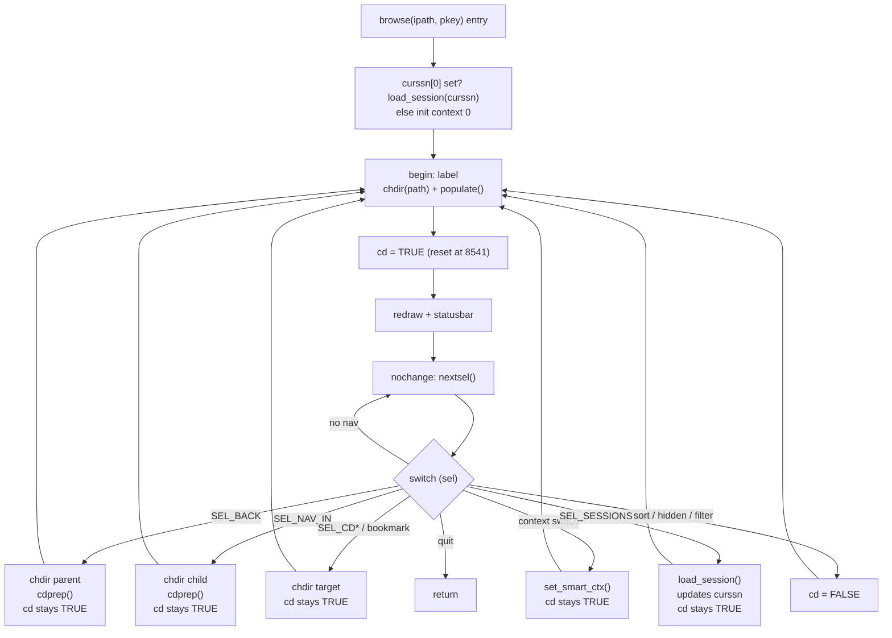

The takeaway: **`begin:` is the choke point**. One guarded statement there
covers *every* directory change with *zero* duplication.

#### I.1.7 Summary of refactor impact on this feature

```
ASCII Table 5: What the 263-commit refactor changes for our design
+--------------------------------+-----------------------------+------------------+
| Aspect                         | Effect of refactor          | Net for us       |
+--------------------------------+-----------------------------+------------------+
| browse() session parameter     | REMOVED                     | branch won't     |
|                                |                             | compile; rewrite |
| curssn global introduced       | NEW mutable session name    | use it as guard  |
| load_session updates curssn    | NEW                         | resolves I.4.6   |
| NULL-deref risk                | gone (curssn is a buffer)   | strictly safer   |
| begin: choke point + cd flag   | UNCHANGED                   | design holds     |
| cdprep / set_smart_ctx         | UNCHANGED                   | Approach C still |
|                                |                             | incomplete       |
| Session file format            | UNCHANGED                   | no migration     |
+--------------------------------+-----------------------------+------------------+
```

---

### I.2 Brainstorm of Approaches

Five candidate approaches, scored against the project's real constraints:
correctness, completeness (covers all nav paths), upstream-merge friction
(lines touched in the hot path), performance, and behavioral politeness toward
upstream defaults. All approaches are now expressed against the **new `curssn`**
world.

#### Approach A -- Per-call-site sprinkling (THE CURRENT BRANCH SOLUTION)

> This is the approach already implemented on
> `feature/save-session-when-chdir` in commit `ca805a09`. It is evaluated here
> as a first-class candidate alongside the alternatives, and a focused
> head-to-head against the recommended approach follows in I.2.1.

The branch inserts (with debug `DPRINTF_*` lines) `save_session(session, NULL);`
after each `chdir + goto begin` in the two `SEL_NAV_IN` arms. On the 2024 tree
this was:

```c
/* (old branch) SEL_NAV_IN, after cdprep(...) and before `goto begin;` */
save_session(session, NULL);
goto begin;
```

**Against current upstream this no longer compiles**: `session` was removed from
`browse()`. The minimum viable port is to replace `session` with `curssn` at
each site:

```c
/* ported to upstream: still per-site, still incomplete */
if (curssn[0]) save_session(curssn, NULL);
goto begin;
```

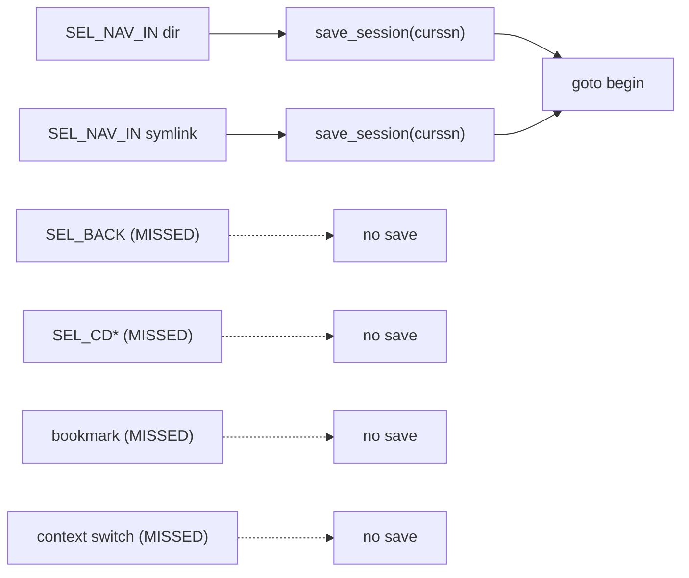

```
ASCII Table 6: Approach A
+-----------+----------------------------------------------------------------+
| Pros      | - Conceptually trivial; obvious at each call site.             |
|           | - Already implemented on the branch (for the 2024 tree).       |
+-----------+----------------------------------------------------------------+
| Cons      | - DOES NOT COMPILE on current upstream (uses removed `session`).|
|           | - INCOMPLETE: covers 2 of ~7 real nav paths (Table 4).         |
|           | - On 2024 tree: passes possibly-NULL `session` -> CRASH.        |
|           | - Duplicated logic = high merge-conflict surface vs upstream.  |
|           | - Each new upstream nav path must be patched again, forever.   |
|           | - Leftover DPRINTF_* debug lines committed in the hot path.    |
+-----------+----------------------------------------------------------------+
```

#### I.2.1 Head-to-head: Current branch (A) vs Recommended (B)

Because Approach A is the existing solution, here is the direct comparison
before introducing the rest of the field. Both are now framed against upstream
`curssn`.

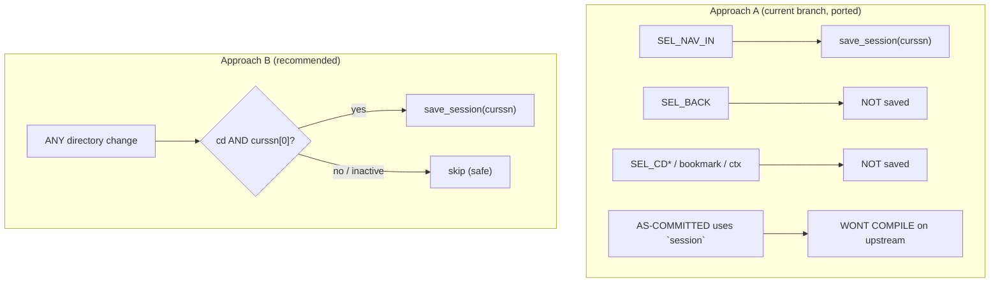

```
ASCII Table 6a: Current branch (A) vs Recommended (B), point by point
+-----------------------------+--------------------------+----------------------+
| Dimension                   | A (current branch)       | B (recommended)      |
+-----------------------------+--------------------------+----------------------+
| Compiles on upstream as-is? | NO (uses removed session)| YES                  |
| Nav paths covered           | 2 (both SEL_NAV_IN arms) | ALL (one choke point)|
| SEL_BACK saved?             | NO                       | YES                  |
| cd-home / root / last?      | NO                       | YES                  |
| Bookmark open saved?        | NO                       | YES                  |
| Context switch saved?       | NO                       | YES                  |
| Session-load saved?         | NO                       | YES                  |
| Inactive session (curssn"") | (n/a; crashes on 2024)   | safe (guarded skip)  |
| Lines edited in hot path    | 2 cases (+debug lines)   | 1 line               |
| Duplicated logic            | yes (per case)           | none                 |
| Future nav paths            | must patch each one      | covered automatically|
| Upstream rebase conflicts   | high (edits in cases)    | low (1 stable label) |
| Debug DPRINTF left in code  | yes (should be removed)  | n/a                  |
+-----------------------------+--------------------------+----------------------+
```

Net: Approach A and Approach B share the same *intent* and the same building
block (`save_session`), but A applies it at the **leaves** of the navigation
tree (so it must be repeated and is easy to leave incomplete) while B applies it
at the **root** (`begin:`), where one guarded line is total and future-proof.
After the upstream refactor, A has the additional, decisive problem that it does
not even compile, and must be ported to `curssn` and de-debugged regardless.

#### Approach B -- Single guarded hook at the `begin:` choke point (RECOMMENDED)

Place **one** guarded statement at `begin:`, just before `cd` is reset to TRUE,
keyed off the existing `cd` flag and the new `curssn` global.

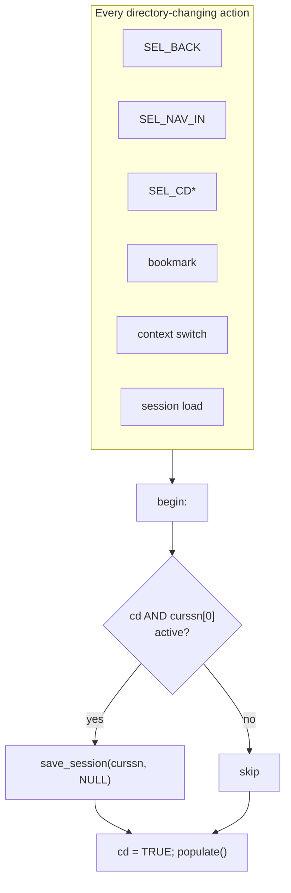

```
ASCII Table 7: Approach B
+-----------+----------------------------------------------------------------+
| Pros      | - COMPLETE: one hook covers ALL current and FUTURE nav paths.  |
|           | - Smallest possible diff in the hot path (1 logical line).     |
|           | - Reuses the existing `cd` flag and `curssn`; no new state.    |
|           | - Lowest merge-conflict surface vs origin-old/master.          |
|           | - Crash-safe: curssn is a buffer; guard is curssn[0].          |
|           | - Targets the ACTIVE session (curssn tracks runtime loads).    |
+-----------+----------------------------------------------------------------+
| Cons      | - Fires on context switches and session-load re-entry too      |
|           |   (usually desirable, but must be acknowledged).               |
|           | - A disk write per directory change (mitigations in I.4.4).    |
+-----------+----------------------------------------------------------------+
```

#### Approach C -- Hook inside `cdprep()`

`cdprep()` ([src/nnn.c:8386](../src/nnn.c#L8386)) is the helper most nav cases
call to swap `path`. Adding the save there is tempting and is still a single
edit, but it remains incomplete after the refactor.

```
ASCII Table 8: Approach C
+-----------+----------------------------------------------------------------+
| Pros      | - Single edit, outside the giant switch.                       |
|           | - curssn is a global, so cdprep() can read it without a new    |
|           |   parameter (this part got EASIER after the refactor).         |
+-----------+----------------------------------------------------------------+
| Cons      | - INCOMPLETE: context-switch navigation uses set_smart_ctx()   |
|           |   ([src/nnn.c:5226]) / savecurctx(), NOT cdprep() -> those      |
|           |   paths still miss the save.                                    |
|           | - Fires even when the caller will set cd = FALSE afterwards in  |
|           |   some flows -> harder to reason about than the cd-gated hook.  |
+-----------+----------------------------------------------------------------+
```

#### Approach D -- Hook inside `populate()`

`populate()` is called once at `begin:` for every (re)listing.

```
ASCII Table 9: Approach D
+-----------+----------------------------------------------------------------+
| Pros      | - Truly one function, one place.                               |
+-----------+----------------------------------------------------------------+
| Cons      | - OVER-FIRES: populate() also runs on refreshes (cd == FALSE), |
|           |   so it saves on every sort toggle, filter keystroke refresh,  |
|           |   delete, etc. Wasteful and semantically wrong.                |
|           | - populate() is performance-critical; adding I/O there is bad. |
+-----------+----------------------------------------------------------------+
```

#### Approach E -- Defer to exit-only persistence (`-S`), do nothing new

nnn already saves the session on clean exit when launched with `-S`
([src/nnn.c:10731](../src/nnn.c#L10731)).

```
ASCII Table 10: Approach E
+-----------+----------------------------------------------------------------+
| Pros      | - Zero code change.                                            |
+-----------+----------------------------------------------------------------+
| Cons      | - Does NOT satisfy the goal: a crash / kill -9 / power loss     |
|           |   loses everything because the save only happens at clean exit. |
|           | - "On chdir" durability is exactly what is missing. Rejected.   |
+-----------+----------------------------------------------------------------+
```

#### Scorecard

```
ASCII Table 11: Approach comparison (5 = best)
+--------------------------+-----+-----+-----+-----+-----+
| Criterion                |  A  |  B  |  C  |  D  |  E  |
+--------------------------+-----+-----+-----+-----+-----+
| Compiles on upstream     |  1  |  5  |  5  |  5  |  5  |
| Correctness (no crash)   |  2  |  5  |  4  |  3  |  5  |
| Completeness (all paths) |  2  |  5  |  3  |  5  |  1  |
| Least upstream friction  |  2  |  5  |  4  |  4  |  5  |
| Performance              |  4  |  4  |  4  |  2  |  5  |
| Meets the goal           |  3  |  5  |  4  |  4  |  1  |
+--------------------------+-----+-----+-----+-----+-----+
| TOTAL                    | 14  | 29  | 24  | 23  | 22  |
+--------------------------+-----+-----+-----+-----+-----+
```

**Winner: Approach B** -- single guarded hook at `begin:`.

---

### I.3 The "Least Change" / One-Line Variants

Because reducing the upstream-merge surface is an explicit requirement, here are
the concrete single-statement forms of Approach B, with their trade-offs. All go
at `begin:`, immediately **before** the `cd = TRUE;` reset at
[src/nnn.c:8541](../src/nnn.c#L8541) (so the `cd` value still reflects the
incoming navigation).

But B1 and B2 differ only in **which users they protect** and **which session
file they write to** -- and you cannot judge that without first understanding
nnn's three session-entry mechanisms and what the `-r` flag actually is. That
background is I.3.0; the variants follow in I.3.1 and I.3.2.

#### I.3.0 Background: `-s`, `-S`, the "@" auto-session, and runtime restore

This sub-section corrects a common misconception (the one this document itself
made in an earlier draft): **the CLI `-r` flag has nothing to do with sessions.**

```
ASCII Table 12: What each session-related entry point actually does
+----------------+--------------------------------------------------------------+
| Mechanism      | Effect                                                       |
+----------------+--------------------------------------------------------------+
| `nnn -s NAME`  | Set curssn = NAME and LOAD that session at startup           |
|                | (src/nnn.c:10376, 8442). NAME may be "@".                    |
| `nnn -S`       | Persistent mode: set g_state.prstssn = 1; if no -s was       |
|                | given, set curssn = "@" (src/nnn.c:10378-10381). On CLEAN    |
|                | exit, save curssn (src/nnn.c:10731). On next `nnn -S`,       |
|                | curssn="@" is loaded at startup -> auto-restore.             |
| `S` then `l`   | Runtime LOAD by name (load_session(NULL,...,restore=FALSE)). |
|                | Prompts for a name; before loading, dumps the CURRENT state  |
|                | to "@" so it can be undone (src/nnn.c:5157-5158).            |
| `S` then `r`   | Runtime RESTORE: load_session(NULL,...,restore=TRUE) loads   |
|                | "@" and then UNLINKS it (src/nnn.c:5155,5207). One-shot undo.|
| `S` then `s`   | Runtime SAVE by name (save_session(typed_name)).             |
| CLI `-r`       | NOT A SESSION FLAG. On Linux it swaps in the advcpmv patched |
|                | cp/mv binaries for copy/move progress bars                   |
|                | (src/nnn.c:10071 usage, 10364-10368). Unrelated entirely.    |
+----------------+--------------------------------------------------------------+
```

The "@" file is nnn's single **scratch / auto-session slot**, living at
`${XDG_CONFIG_HOME:-$HOME/.config}/nnn/sessions/@`. Per the manual (nnn.1,
SESSIONS): *"When a session is loaded at runtime, the last working state is
saved automatically to a dedicated 'auto session' file. Session option restore
would restore the 'auto session'. ... The 'auto session' is used in persistent
session mode if no session is active."*

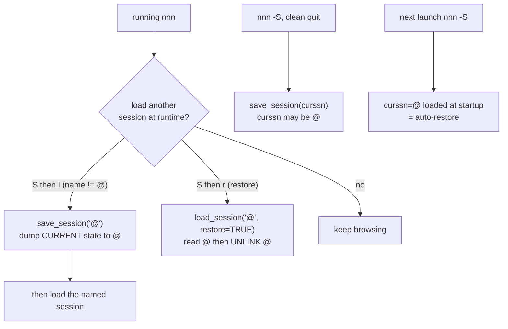

Two things to take away before reading the variants:

1. **A pure default launch (`nnn`, no `-s`, no `-S`) has `curssn[0] == 0`**, and
   upstream writes **no** session file for it except the transient "@" dump that
   only happens if the user manually loads another session. So a crash loses
   everything for default-launch users today.
2. **`nnn -S` already gives auto-restore-on-launch**, because `-S` sets
   `curssn = "@"` and `browse()` loads `curssn` at startup. But upstream only
   *writes* "@" at **clean exit** -- so a crash still loses the `-S` user's work.
   This is precisely the durability gap the auto-save-on-chdir feature closes.

#### I.3.1 Variant B1 -- Save only when a session is already active (safest, 1 line)

```c
/* at begin:, just before `cd = TRUE;` */
if (cd && curssn[0]) save_session(curssn, NULL);
```

What it does, precisely:

- Fires on every real directory change (`cd == TRUE`) **only when a session is
  active** (`curssn[0] != 0`). It writes to whatever session is currently active
  -- the named one from `-s`, the "@" slot from `-S`, or a session loaded at
  runtime (because `load_session` updated `curssn`, see I.4.6).
- `curssn` is a fixed buffer, never NULL, so there is no crash risk; the
  empty-string guard simply means "no active session, do nothing".

Who is protected, and how they recover after a crash:

```
ASCII Table 13: B1 coverage matrix
+------------------------+-----------+------------------+--------------------------+
| Launch / runtime state | curssn    | B1 auto-saves?   | Recover after crash by   |
+------------------------+-----------+------------------+--------------------------+
| nnn (no flags)         | "" empty  | NO               | (not protected)          |
| nnn -s work            | "work"    | YES -> sessions/ | nnn -s work              |
|                        |           | work             |                          |
| nnn -S                 | "@"       | YES -> sessions/@| nnn -S  (auto-loads @)   |
|                        |           |                  | or nnn -s@               |
| nnn -s work -S         | "work"    | YES -> work      | nnn -s work [-S]         |
| loaded 'play' at       | "play"    | YES -> play      | nnn -s play              |
|   runtime (S->l)       |           |                  |                          |
+------------------------+-----------+------------------+--------------------------+
```

The headline B1 win: **`nnn -S` becomes crash-safe.** Upstream `-S` only writes
"@" at clean exit; with B1 the "@" slot is rewritten on every directory change,
so a `kill -9` / power loss leaves a fresh, loadable "@". Relaunching `nnn -S`
(or `nnn -s@`) drops you back where you were.

- Pros: zero behavior change for pure default launches (perfect upstream
  politeness); one line; targets the active session automatically.
- Cons: the pure default-launch user (no `-s`/`-S` at all) gets **no** crash
  recovery -- they never opted into a session, so nothing is written.

#### I.3.2 Variant B2 -- Always auto-save, falling back to the "@" slot (1 line)

```c
/* at begin:, just before `cd = TRUE;` */
if (cd) save_session(curssn[0] ? curssn : "@", NULL);
```

What it adds over B1: the `else` branch. When a session is active it behaves
exactly like B1 (writes to `curssn`). When **no** session is active
(`curssn[0] == 0`, the pure default launch) it writes the live state to the
**"@" auto-session** anyway. So every nnn invocation -- even `nnn` with no flags
-- continuously persists "where I am" into "@".

How a default-launch user recovers after a crash under B2:

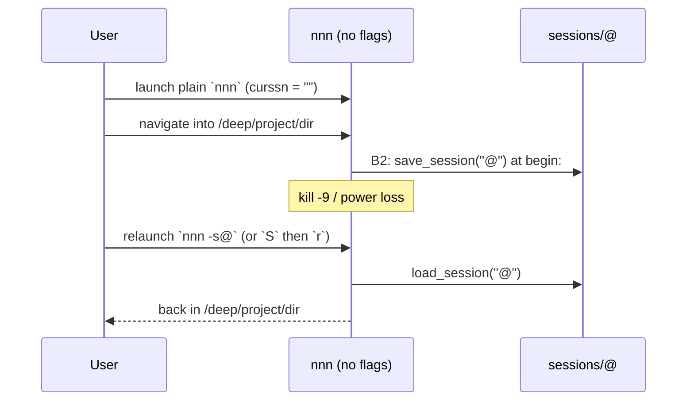

So the corrected statement (the earlier draft wrongly said `nnn -r`):

> Under B2, a default-launch user recovers by relaunching with **`nnn -s@`**
> (load the auto-session by name) or via the **runtime restore** (`S` then `r`).
> The CLI `-r` flag is irrelevant -- it enables advcpmv, not session restore.

Important interaction with the "@" slot (a genuine B2 nuance to weigh):

```
ASCII Table 14: B2 and the shared "@" slot
+-----------------------------------+----------------------------------------------+
| Concern                           | Assessment under B2                          |
+-----------------------------------+----------------------------------------------+
| "@" is also the runtime-load undo | For default launches B2 keeps "@" = current  |
|   scratch slot                    | state, which is still a sensible "return to" |
|                                   | point; the semantics stay coherent.          |
| User does `S`->`r` (restore)      | load_session("@") then UNLINKS "@". The next |
|                                   | directory change immediately re-creates "@"  |
|                                   | from the live state. No crash, just a re-arm.|
| Named-session user (curssn set)   | B2 writes to the NAMED file, NOT "@", so the |
|                                   | classic "@" undo-before-load behavior is     |
|                                   | fully preserved for them.                    |
| Extra disk writes                 | "@" is now written on every cd for default   |
|                                   | launches -> the behavioral divergence and    |
|                                   | the only real cost (see I.4.4 perf).         |
+-----------------------------------+----------------------------------------------+
```

- Pros: protects **everyone**, including users who never asked for a session;
  still one line.
- Cons: changes upstream default behavior (the "@" slot is written continuously
  for plain `nnn`); slightly repurposes the shared "@" scratch slot; marginally
  more I/O for users who do not care about sessions.

#### Variant B3 -- Gate behind a build flag (politest for upstreaming)

```c
#ifdef SAVE_SESSION_ON_CD
    if (cd && curssn[0]) save_session(curssn, NULL);
#endif
```

- Opt-in; upstream maintainers are far likelier to accept a `#ifdef`.
- A few extra lines, but the *hot-path* logic is still one line.
- Note: B3 as written gates the **B1** body. The next variant, B4, is the more
  interesting composite: gate the **B2** body, so the opt-in build also protects
  plain `nnn`.

#### Variant B4 -- B2 gated by a build flag (B2 + B3 composite, RECOMMENDED for shipping)

This is the combination called out as the sweet spot: take B2's universal
coverage (protect even a flag-less `nnn` via the "@" slot) and put it behind B3's
compile-time opt-in, so the default build is byte-for-byte upstream behavior and
the feature is a deliberate build choice.

```c
/* at begin:, just before `cd = TRUE;` */
#ifdef SAVE_SESSION_ON_CD
    if (cd) save_session(curssn[0] ? curssn : "@", NULL);
#endif
```

Why this is attractive:

- **Default build = zero divergence.** With `SAVE_SESSION_ON_CD` undefined, the
  compiler emits nothing; the binary is identical to upstream. This is the
  politest possible posture for pulling from `origin-old/master` and for any
  future upstream PR.
- **Opt-in build = protect everyone.** When the fork defines the flag (e.g. in
  [build.sh](../build.sh)), it gets B2's full coverage: `-s`/`-S`/runtime-loaded
  sessions write to their own slot, and a plain `nnn` writes to "@", so *no*
  launch mode can lose work to a crash.
- **Still one hot-path line**, wrapped in a 2-line `#ifdef`.
- **Trivial rebases.** The `#ifdef` lives at the stable `begin:` label; upstream
  never touches `SAVE_SESSION_ON_CD`, so conflicts are essentially impossible.

Refinement (B4-layered) -- if you want the always-safe part unconditional and
only the aggressive "protect plain `nnn`" part behind the flag:

```c
#ifndef NOSSN
    if (cd && curssn[0])            /* B1: active session, always compiled in */
        save_session(curssn, NULL);
#ifdef SAVE_SESSION_ON_CD
    else if (cd)                    /* B2 fallback: only with the opt-in flag  */
        save_session("@", NULL);
#endif
#endif
```

This layered form makes `nnn -S` crash-safe in **every** build (the B1 line is
unconditional) while keeping the plain-`nnn`-via-"@" behavior opt-in. It is a few
lines longer but arguably the most principled split. Choose plain B4 for minimum
lines, B4-layered for the cleanest semantics.

How to enable the flag in the fork's build (concrete). NOTE: do **not** pass
`CPPFLAGS=...` on the make command line -- a command-line `CPPFLAGS` assignment
overrides the makefile and discards every `O_*`-derived define (`-DNERD`,
`-DPCRE2`, `-DNOSSN`, ...). nnn's idiomatic mechanism is a dedicated `O_*`
option, mirroring `O_NOSSN`:

```
ASCII Table 15: Enabling B4 at build time
+----------------------------+------------------------------------------------+
| Where                      | How                                            |
+----------------------------+------------------------------------------------+
| Makefile (+ Makefile_debug)| add option `O_SSN_ON_CD := 0` and a block      |
|                            | `ifeq ($(strip $(O_SSN_ON_CD)),1)` ->          |
|                            | `CPPFLAGS += -DSAVE_SESSION_ON_CD`             |
| build.sh / build_debug.sh  | append `O_SSN_ON_CD=1` to the make invocation  |
| one-off make               | make O_SSN_ON_CD=1 <other O_* flags>           |
+----------------------------+------------------------------------------------+
```

```
ASCII Table 16: One-line variant trade-offs (B4 added)
+---------+----------------+----------------+-------------------+-------------+
| Variant | Crash-safe?    | Default users  | Upstream-default  | Lines added |
|         |                | protected?     | behavior changed? | (hot path)  |
+---------+----------------+----------------+-------------------+-------------+
| B1      | yes (buffer)   | no             | no                | 1           |
| B2      | yes (fallback) | yes            | yes ("@" written) | 1           |
| B3      | yes (buffer)   | no (opt-in)    | no (flag off)     | 1 (+ifdef)  |
| B4      | yes (fallback) | yes (flag on)  | no (flag off)     | 1 (+ifdef)  |
| B4-lyr  | yes (buffer)   | yes (flag on)  | no (flag off)     | ~3 (+ifdef) |
+---------+----------------+----------------+-------------------+-------------+
```

The decisive distinction: B2 always changes default behavior, B3 never protects
the flag-less user, but **B4 is the only variant that protects everyone when you
want it and changes nothing when you do not** -- the choice is moved from runtime
to a one-time build decision.

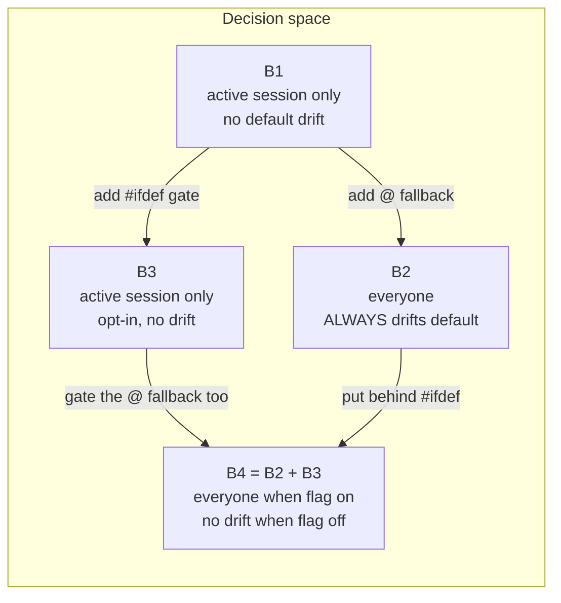

> Recommendation: **ship B4 (B2 + B3) in the fork**, with `SAVE_SESSION_ON_CD`
> defined in [build.sh](../build.sh). Rationale:
>
> - The default (flag-undefined) build stays identical to upstream, so rebasing
>   onto `origin-old/master` and any eventual upstream PR are maximally clean.
> - The fork's own builds opt in and get **universal** crash recovery: named and
>   `-S` sessions persist on every `chdir`, and even a flag-less `nnn` is
>   recoverable via `nnn -s@` (or runtime `S` -> `r`).
> - If you prefer the B1 crash-safety to exist in *every* build (not just the
>   opt-in one), use **B4-layered** instead.
>
> Use plain **B1** only if you specifically do *not* want flag-less `nnn` to ever
> write a session file even in your own builds.

#### Why "least change" maps directly to "easy upstream pulls"

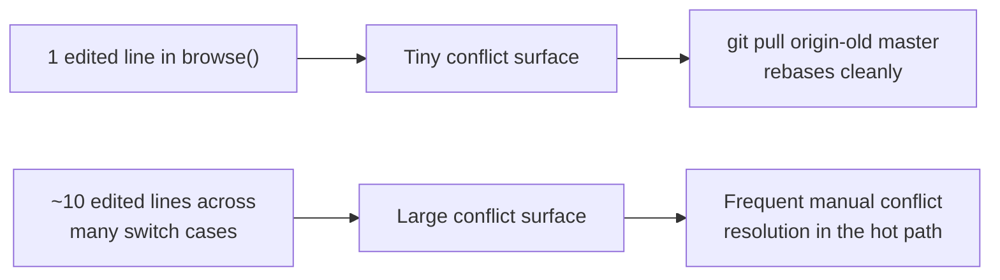

Upstream changes `browse()` often (it is the program's core) -- the 263-commit
drift and the `session`->`curssn` refactor prove it. The branch's Approach A
edits *inside* multiple `switch` cases -- exactly the lines upstream is most
likely to also touch -- and indeed those edits now fail to compile. Approach B/B1
edits **one** line at a stable label (`begin:` / `cd = TRUE;`), which has
survived the entire refactor unmoved, so a `git rebase origin-old/master`
almost never conflicts.

---

### I.4 Deep Dive: Recommended Design (Approach B)

> This deep dive uses the **B1** body (`if (cd && curssn[0]) save_session(curssn,
> NULL);`) to explain placement, the `cd`/`curssn[0]` guards, performance, and
> edge cases, because every variant shares that core. The shipping recommendation
> is **B4** (I.3.2 / I.5 Step 2), which wraps the **B2** body in the
> `SAVE_SESSION_ON_CD` `#ifdef`; wherever the B1 body would *skip* (no active
> session), B4 instead writes the "@" slot. Each note below flags that delta.

#### I.4.1 Placement, precisely

```
src/nnn.c (origin-old/master ecf6d9a8), around the begin: label
---------------------------------------------------------------
8521:   if (order && cd) {
            ... sort-order bookkeeping that already reads `cd` ...
8540:   }
8541:   cd = TRUE;          <-- `cd` is about to be reset
8543:   populate(path, lastname);
```

Insert the hook between line 8540 (end of the `if (order && cd)` block) and line
8541 (`cd = TRUE;`), so it observes the *incoming* `cd`:

```c
    }                       /* end of existing `if (order && cd)` */
#ifndef NOSSN
    if (cd && curssn[0])    /* >>> auto-save on real directory change <<< */
        save_session(curssn, NULL);
#endif
    cd = TRUE;
```

The `#ifndef NOSSN` mirrors how the rest of the session code is conditionally
compiled (`curssn` itself only exists under `#ifndef NOSSN`), so builds with
sessions disabled are unaffected and still link.

#### I.4.2 Why this placement is correct

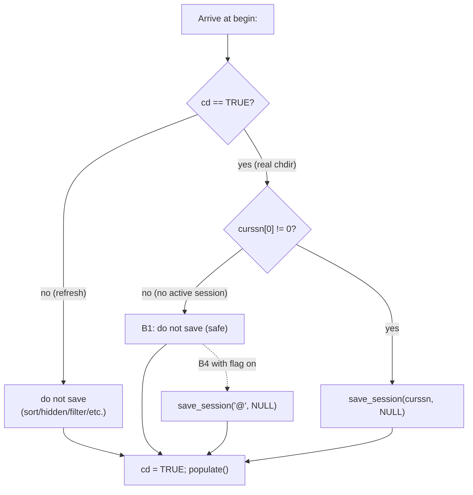

- `cd` is read **before** its reset, so it still reflects whether we got here via
  a directory change or an in-place refresh.
- The `&& curssn[0]` guard means we never call `save_session` with an inactive
  (empty) session, and there is no NULL pointer in play at all.
- `presel` is irrelevant to saving, so passing `NULL` as the second arg (no
  warning UI) is appropriate -- failures here should be silent and
  non-disruptive.
- **B4 delta:** the "no active session" branch is exactly where B4 (flag on)
  diverges -- instead of skipping it writes the "@" auto-session, which is what
  extends crash recovery to a flag-less `nnn`.

#### I.4.3 Behavioral comparison: before vs after

```
ASCII Table 17: When does the session get written?
+-----------------------------+------------------+------------------------+
| Event                       | Upstream today   | With Variant B1        |
+-----------------------------+------------------+------------------------+
| Navigate in / back / cd     | not saved        | saved (if curssn set)  |
| Switch context              | not saved        | saved (if curssn set)  |
| Open bookmark               | not saved        | saved (if curssn set)  |
| Sort / hidden / filter      | not saved        | not saved (cd FALSE)   |
| Load a session at runtime   | "@" auto-saved   | saved to loaded name   |
| Clean exit with -S          | saved            | saved (same)           |
| Crash / kill -9 / power off | LOST             | last dir preserved     |
+-----------------------------+------------------+------------------------+
```

#### I.4.4 Performance analysis and mitigations

A session file is tiny: `sizeof(header) + sizeof(cfg) + CTX_MAX * (settings +
uint + names + filter + path)` -- on the order of a few kilobytes. The write is
`open(O_TRUNC) + write + close` ([src/nnn.c:5100](../src/nnn.c#L5100)).

```
ASCII Table 18: Cost envelope
+--------------------------+----------------------------------------------+
| Dimension                | Assessment                                   |
+--------------------------+----------------------------------------------+
| Frequency                | Bounded by HUMAN nav speed (a few per sec).  |
| Bytes per save           | ~kilobytes; single contiguous write.         |
| Syscalls per save        | open + write x (1 header + per-ctx) + close. |
| Worst case               | Holding a nav key for autorepeat.            |
+--------------------------+----------------------------------------------+
```

Mitigations, only if profiling ever shows a problem (do NOT pre-optimize):

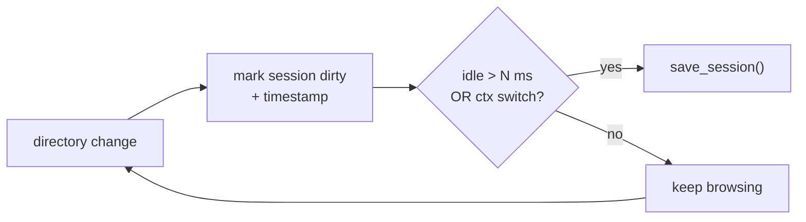

The recommendation is to **start without debounce** -- the naive write is
simpler, has zero added state, and is empirically fine at human speed. Keep the
one-line form; add debounce only on evidence.

#### I.4.5 Edge cases and how the design handles them

```
ASCII Table 19: Edge cases
+--------------------------------------+----------------------------------------+
| Edge case                            | Behavior / handling                    |
+--------------------------------------+----------------------------------------+
| curssn[0] == 0 (default launch)      | Guard skips save. No crash. (B1)       |
| Session-load re-entry (goto begin    | cd is TRUE there -> a redundant save   |
|   after load_session)                | of the freshly-loaded curssn. Harmless |
|                                      | and actually correct.                  |
| `begin:` via nochange recovery path  | cd is TRUE -> a save happens. Harmless |
|   (chdir failed)                     | (state is still valid to persist).     |
| Save fails (disk full / RO)          | save_session passes presel=NULL -> no  |
|                                      | UI nag; navigation continues.          |
| Sessions compiled out (NOSSN)        | Whole hook + curssn are #ifdef'd away. |
| Picker mode (curssn cleared at       | curssn[0] == 0 -> guard skips save     |
|   src/nnn.c:10459)                   | (correct; picker should not persist).  |
+--------------------------------------+----------------------------------------+
```

#### I.4.6 The "which slot?" subtlety -- NOW RESOLVED BY UPSTREAM

In the 2024 design this was an unavoidable wart: `session` was fixed at launch,
so auto-save always targeted the launch session even after the user loaded a
different one at runtime, and "track the active session" was a deferred,
larger change.

**Upstream has already implemented that change.** `load_session()` writes the
loaded name into `curssn` ([src/nnn.c:5198](../src/nnn.c#L5198)). Therefore
Variant B1, by saving to `curssn`, **automatically follows the active session**:

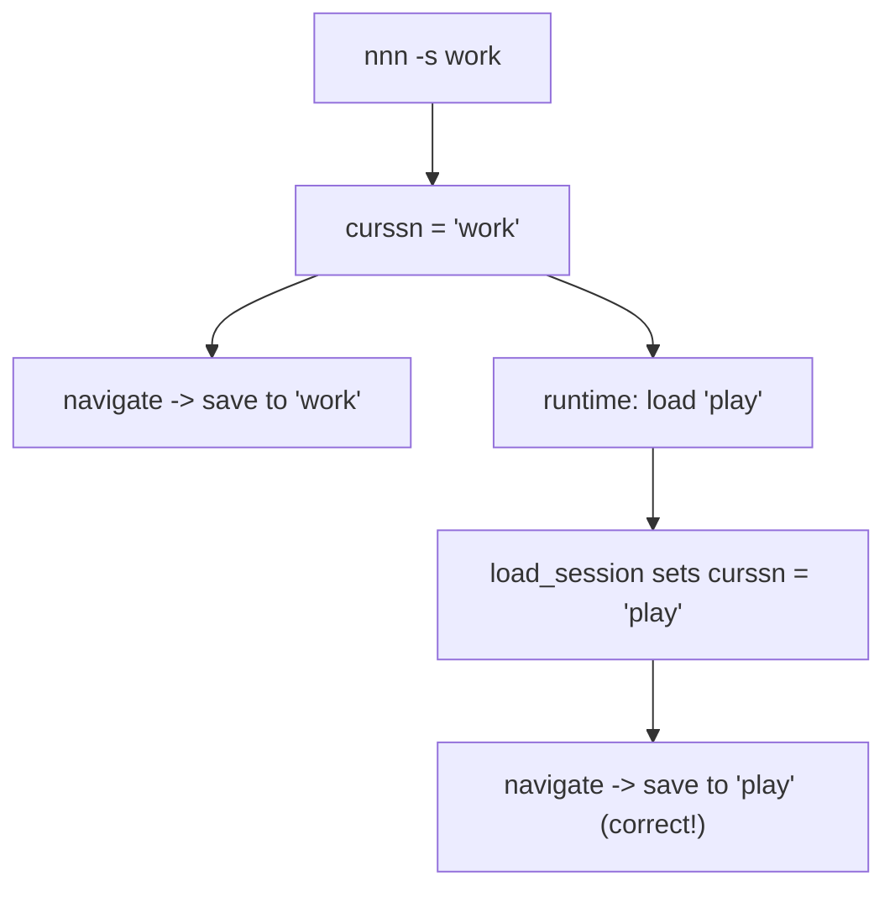

No extra code is required in this fork to get correct slot tracking -- it is a
direct dividend of rebasing onto upstream. This is a concrete example of why the
"least change, stay close to upstream" strategy pays off.

---

### I.5 Step-by-Step Implementation Guidelines

No timeline -- ordered steps only.

#### Step 0 -- Rebase the feature branch onto latest upstream FIRST

This must happen before any code edit, because the branch references the removed
`session` symbol.

```
git fetch origin-old
git switch feature/save-session-when-chdir
git rebase origin-old/master
```

Expect the rebase to **stop on commit `ca805a09`** with a conflict / build break
in the two `SEL_NAV_IN` edits (they reference `session`). Resolve by **dropping**
those per-site edits entirely (they are superseded by Step 2). The unrelated
debug-build artifacts in that commit (`Makefile_debug`, `nnn_debug` binary,
`.vscode/`, `build*.sh`) should be reviewed: keep the build scripts if still
wanted, but do **not** keep the committed `nnn_debug` binary.

#### Step 1 -- Remove the branch's Approach A edits

Delete the two `save_session(session, NULL);` insertions and their `DPRINTF_*`
debug lines in the `SEL_NAV_IN` cases, restoring those cases to upstream form.
This both fixes the compile break and shrinks the diff.

#### Step 2 -- Add the guarded hook at `begin:`

In `browse()`, between the close of the `if (order && cd)` block and `cd =
TRUE;` (around [src/nnn.c:8540](../src/nnn.c#L8540)). Recommended form is **B4**
(B2 universal coverage, gated by B3's opt-in flag):

```c
    }
#ifndef NOSSN
#ifdef SAVE_SESSION_ON_CD
    if (cd) save_session(curssn[0] ? curssn : "@", NULL);
#endif
#endif
    cd = TRUE;
```

If you prefer the always-on active-session save plus an opt-in plain-`nnn`
fallback, use **B4-layered** instead:

```c
    }
#ifndef NOSSN
    if (cd && curssn[0])
        save_session(curssn, NULL);
#ifdef SAVE_SESSION_ON_CD
    else if (cd)
        save_session("@", NULL);
#endif
#endif
    cd = TRUE;
```

#### Step 3 -- Choose the variant and wire the build flag

- **B4** (recommended): the form above; then define `SAVE_SESSION_ON_CD` in the
  fork's build (Table 15) so the fork's binaries opt in while the default build
  stays identical to upstream.
- **B4-layered**: if `nnn -S` should be crash-safe in *every* build, not only the
  opt-in one.
- **B1** (`if (cd && curssn[0]) save_session(curssn, NULL);`, unconditional): if
  you do not want flag-less `nnn` to ever write a session file even in your own
  builds.
- **B2** (unconditional, `curssn[0] ? curssn : "@"`): only if you intend to change
  upstream default behavior outright (not recommended for an upstream PR).

#### Step 4 -- Build

```
ASCII Table 20: Build matrix to exercise the guard and the #ifdef
+----------------------------+-------------------------------------------+
| Build                      | What it verifies                          |
+----------------------------+-------------------------------------------+
| make                       | Default build still compiles.             |
| make O_NOSSN=1 (NOSSN)     | Hook + curssn compiled out cleanly.       |
| ./build.sh                 | The fork's feature build.                 |
+----------------------------+-------------------------------------------+
```

#### Step 5 -- Manual verification

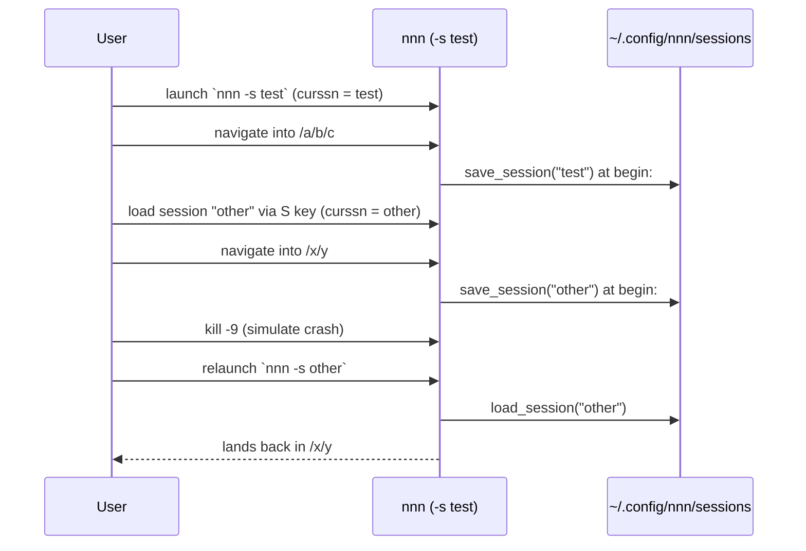

Concrete checks:
1. `nnn -s test`, navigate into several directories, switch a context, open a
   bookmark. After each, confirm the mtime of
   `~/.config/nnn/sessions/test` advances.
2. Load a different session at runtime (`S` -> `l`), navigate, and confirm the
   **newly loaded** session file (not `test`) is the one being updated -- this
   validates the curssn-follows-active-session behavior (I.4.6).
3. `kill -9` the nnn process, relaunch with the matching `-s`, confirm it
   restores the last directory and context.
4. Launch plain `nnn` (no `-s`): navigate around and confirm **no** session file
   is created and **no crash** (validates the `curssn[0]` guard).
5. Toggle sort / hidden / apply a filter: confirm these do **not** bump the
   session file mtime (validates the `cd` guard).

#### Step 6 -- Document the divergence

Append a note to the fork's README / this file recording: the one-line hook, the
chosen variant, and that slot selection now follows `curssn`, so future
maintainers understand the intended semantics when reconciling with upstream.

#### Step 7 -- Keep upstream-syncable

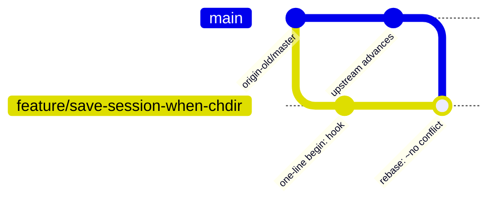

Periodically:

```
git fetch origin-old
git rebase origin-old/master      # the single-line hook rebases cleanly
./build.sh && <run Step 5 checks>
```

Keeping the change to one line at the stable `begin:` label is precisely what
makes this rebase routine and conflict-free -- as proven by the fact that the
label and the `cd = TRUE;` reset survived all 263 upstream commits unmoved.

---

### I.6 Summary

- Upstream has advanced **263 commits** past the feature branch and performed a
  session refactor: the `browse()` `session` parameter was **removed** in favor
  of a mutable global `curssn`. The branch's current edits **no longer compile**
  and must be re-expressed against `curssn`.
- nnn still centralizes every directory change at the `begin:` label, gated by
  the existing `cd` flag -- so the cleanest auto-save remains **one guarded
  statement there**, not per-call-site sprinkling.
- The recommended form is **Variant B4** (B2 + B3): B2's universal coverage
  (`if (cd) save_session(curssn[0] ? curssn : "@", NULL);`) wrapped in B3's
  `#ifdef SAVE_SESSION_ON_CD`. The default build is byte-for-byte upstream
  behavior (cleanest possible rebases against `origin-old/master`), while the
  fork opts in to **universal** crash recovery -- named/`-S` sessions persist to
  their own slot and a flag-less `nnn` persists to "@". Use **B4-layered** if
  `nnn -S` must be crash-safe in every build, or plain **B1** if flag-less `nnn`
  should never write a session file.
- All variants are crash-safe (curssn is a buffer, never NULL) and complete
  across every nav path, because they sit at the single `begin:` choke point.
- The refactor makes the design **strictly better**: the old NULL-deref crash is
  impossible, and the old "which slot?" subtlety is resolved for free because
  `load_session()` now updates `curssn`.
- Performance is a non-issue at human navigation speed; debounce only on
  evidence.
- The current branch's Approach A is incomplete (misses
  back/cd/bookmark/context/session-load navigation), carries leftover debug
  lines, and -- decisively -- does not build on current upstream; it should be
  replaced by the single hook after rebasing.

---

## Part II -- FileZilla-Style Copy/Move Conflict Resolution

### II.0 Goal Statement

Reproduce FileZilla's overwrite-handling experience for nnn's copy/move, driven
entirely from the existing keys, with this workflow:

1. Select files with `Space`.
2. Navigate to the destination directory.
3. Press `p` to **copy here**, or `v` to **move here**.
4. On a conflict (target already exists) present a per-file menu:
   overwrite, newer only, different size only, different size or newer, resume,
   rename (keep both), skip.
5. After each decision, ask whether to **apply the same decision to all remaining
   conflicts**; keep asking until the user accepts.

```
ASCII Table II.0: FileZilla options mapped to this feature
+-------------------------------------------+------------------------------------+
| FileZilla option                          | This feature's menu entry          |
+-------------------------------------------+------------------------------------+
| Overwrite                                 | 1) overwrite                       |
| Overwrite if source newer                 | 2) newer only                      |
| Overwrite if different size               | 3) different size only             |
| Overwrite if different size or source new | 4) different size or newer         |
| (FileZilla "resume" of interrupted xfer)  | 5) resume                          |
| Rename                                    | 6) rename (keep both)              |
| Skip                                      | 7) skip                            |
| "Apply to all" checkbox                   | repeated "apply to ALL?" prompt    |
+-------------------------------------------+------------------------------------+
```

As in Part I, the change must be **small and surgical** so the fork keeps pulling
`origin-old/master` with the least merge friction -- ideally a **single line** of
C, with the behaviour-heavy logic living outside `nnn.c`.

> A candidate implementation already exists in
> [my_patches/nnn-pv-cpmv.patch](../my_patches/nnn-pv-cpmv.patch) and
> [my_patches/nnn-cpmv](../my_patches/nnn-cpmv). It is evaluated here as **one
> candidate among several** (Approach A), not as the assumed answer.

---

### II.1 How Copy/Move Works Today (Ground Truth from the Source)

All line numbers refer to `origin-old/master` at `ecf6d9a8`.

#### II.1.1 The keys and the single chokepoint

```
ASCII Table II.1: Copy/move key bindings (src/nnn.h)
+----------------------+-------------+----------------------------------------+
| Key(s)               | Action      | Path through the code                  |
+----------------------+-------------+----------------------------------------+
| p / Ctrl-P (h:232)   | SEL_CP      | cpmvrm_selection() -> opstr(g_buf, cp) |
| v / Ctrl-V (h:235)   | SEL_MV      | cpmvrm_selection() -> opstr(g_buf, mv) |
| w / Ctrl-W (h:238)   | SEL_CPMVAS  | cpmv_rename()  (separate "as" path)    |
+----------------------+-------------+----------------------------------------+
```

`p` and `v` both reach **`opstr()`** ([src/nnn.c:2737](../src/nnn.c#L2737)) -- the
one function that builds the shell command for a "copy/move here". `w` (copy/move
*as*) is a different path (`cpmv_rename()`) and is out of scope for this feature.

```c
/* src/nnn.c:2737 -- the entire function; the chokepoint */
static void opstr(char *buf, char *op)
{
    snprintf(buf, CMD_LEN_MAX,
        "xargs -0 sh -c '%s \"$0\" \"$@\" . < /dev/tty' < '%s'", op, selpath);
}
```

#### II.1.2 What that command actually does

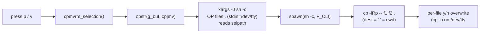

Key facts the design depends on:

```
ASCII Table II.2: Invariants of the stock path
+-----------------------------+-----------------------------------------------+
| Invariant                   | Detail (src ref)                              |
+-----------------------------+-----------------------------------------------+
| op string                   | cp = "cp -iRp --", mv = "mv -i --"            |
|                             | (src/nnn.c:812-813)                            |
| advcpmv (progress bars)     | with the -r flag, cp/mv become "cpg -giRp --" |
|                             | / "mvg -gi --" (src/nnn.c:810-811,10378). See |
|                             | Part I Table 12 -- that is what CLI -r does.   |
| selection file (selpath)    | NUL-separated absolute paths (xargs -0)        |
| destination                 | passed literally as "." -- nnn's cwd IS the    |
|                             | browse dir (it chdir'd at begin:)              |
| stdin                       | redirected to /dev/tty so prompts work         |
| executor                    | spawn(UTIL_SH_EXEC=sh -c, ..., F_CLI|F_CHKRTN) |
|                             | (src/nnn.c:2892) -- foreground, restores TUI   |
| CMD_LEN_MAX                 | PATH_MAX + 2*(NAME_MAX+1) (src/nnn.c:190)      |
+-----------------------------+-----------------------------------------------+
```

#### II.1.3 The gap

The only conflict handling stock nnn offers is `cp -i` / `mv -i`: a per-file
**y/n overwrite** prompt. There is no "newer only", "different size", "different
size or newer", "resume", "rename/keep-both", or "apply to all remaining". That
entire matrix is what this feature adds.

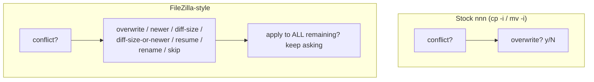

#### II.1.4 Design-critical observation

`opstr()` is to copy/move what `begin:` was to navigation in Part I: a **single
convergence point** that both relevant actions pass through. Anything injected
there covers `p` and `v` together, with no duplication -- which is exactly what
makes a one-line change possible.

---

### II.2 Brainstorm of Approaches

Five candidates, scored on the same axes as Part I plus two that matter here:
"keeps the p/v keys" and "logic lives outside nnn.c" (nnn's delegate-to-shell
philosophy).

#### Approach A -- External helper via a one-line `opstr()` rewrite (THE my_patches SOLUTION)

Rewrite the single `snprintf` in `opstr()` to invoke an external helper that
implements the menu, and ship that helper.

```c
/* opstr() after the change */
snprintf(buf, CMD_LEN_MAX, "nnn-cpmv %s '%s' . < /dev/tty", op, selpath);
```

The helper ([my_patches/nnn-cpmv](../my_patches/nnn-cpmv)) reads the NUL-separated
selection, detects conflicts, shows the 7-option menu, supports apply-to-all, and
shells out to cp/mv/rsync (and cpg/mvg for progress).

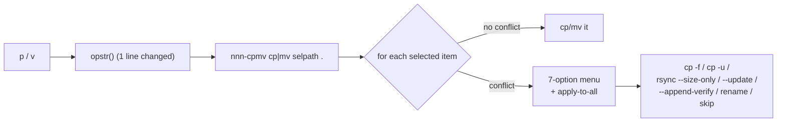

```
ASCII Table II.3: Approach A (my_patches)
+-----------+----------------------------------------------------------------+
| Pros      | - opstr() is the single chokepoint: one line covers p AND v.   |
|           | - Minimal C change (1 line; see II.3 for exactly 1).           |
|           | - All behaviour in shell -- matches nnn's delegate-to-shell     |
|           |   design; iterate on the script with no recompile.             |
|           | - Keeps the native p / v keys and the Space-select workflow.   |
|           | - Reuses nnn's selection file and /dev/tty prompt plumbing.    |
+-----------+----------------------------------------------------------------+
| Cons      | - Requires the helper installed (PATH or plugins dir).         |
|           | - Edits upstream code (tiny, but non-zero rebase surface).     |
|           | - Replaces nnn's native cp -i path; advcpmv must be re-added   |
|           |   inside the helper (the script does this).                    |
|           | - Conflict granularity is per selected TOP-LEVEL item, not     |
|           |   per nested file (FileZilla is per file). See II.4.6.         |
|           | - Size/resume modes need rsync; degrade without it.           |
|           | - The committed script has a data-loss bug + portability gaps  |
|           |   (II.4.7) that must be fixed before shipping.                 |
+-----------+----------------------------------------------------------------+
```

#### Approach B -- Pure nnn plugin (ZERO C change)

Do not touch `nnn.c` at all. Ship the same logic as an nnn **plugin** in
`plugins/`, invoked via the plugin runner (`;` + a key, or an `NNN_PLUG`
mapping such as `c:cpmv`). Plugins already run with cwd = the browse dir and get
the selection via `$NNN_SEL` / the default selection file.

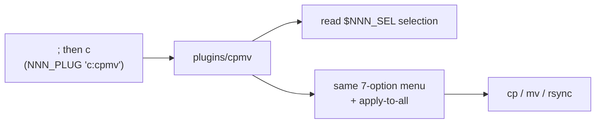

```
ASCII Table II.4: Approach B (plugin)
+-----------+----------------------------------------------------------------+
| Pros      | - ZERO nnn.c change -> nothing to rebase, perfectly upstream-   |
|           |   clean; survives every `git rebase origin-old/master`.        |
|           | - Uses nnn's official, documented extension mechanism.         |
|           | - Distributable independently of any fork.                     |
+-----------+----------------------------------------------------------------+
| Cons      | - Does NOT use p / v -- the user's stated workflow requires     |
|           |   those exact keys. A plugin is reached via `;c` (or a chosen   |
|           |   NNN_PLUG key), so the muscle memory differs.                  |
|           | - "copy/move here" semantics must be reconstructed in the      |
|           |   plugin (dest = $PWD; that is fine, plugins run in the dir).   |
+-----------+----------------------------------------------------------------+
```

#### Approach C -- Redefine the `cp` / `mv` command globals to a wrapper

Leave `opstr()` alone; instead point the `cp`/`mv` globals (or the advcpmv
swap, or a new build define) at a wrapper binary that accepts the
xargs-expanded `<files...> .` argument list.

```
ASCII Table II.5: Approach C (swap the cp/mv globals)
+-----------+----------------------------------------------------------------+
| Pros      | - opstr() string untouched.                                    |
+-----------+----------------------------------------------------------------+
| Cons      | - opstr wraps op as `OP "$0" "$@" . < /dev/tty`; the wrapper   |
|           |   must accept "dest is the LAST arg" -- awkward and fragile.   |
|           | - The "-iRp --" suffix is baked into the global; you fight     |
|           |   the existing flags or must blank them (still a C edit).      |
|           | - No cleaner than A, and less readable. Rejected.             |
+-----------+----------------------------------------------------------------+
```

#### Approach D -- A single rsync command (no custom menu)

Replace the `opstr()` command with one `rsync` invocation implementing **one**
fixed policy (e.g. `--update` for "newer only").

```
ASCII Table II.6: Approach D (one static rsync policy)
+-----------+----------------------------------------------------------------+
| Pros      | - One line, no script, no helper to install.                   |
+-----------+----------------------------------------------------------------+
| Cons      | - rsync cannot present an interactive per-conflict MENU with    |
|           |   "apply to all"; it applies ONE policy to everything.         |
|           | - Fails requirements 4 and 5 outright. rsync is only useful    |
|           |   here as a BUILDING BLOCK inside Approach A/B. Rejected as a   |
|           |   standalone solution.                                          |
+-----------+----------------------------------------------------------------+
```

#### Approach E -- Implement the menu natively in C inside nnn

Add conflict detection, the 7-option prompt, apply-to-all state, and the
cp/rsync invocations directly in `cpmvrm_selection()` / `opstr()`.

```
ASCII Table II.7: Approach E (native C)
+-----------+----------------------------------------------------------------+
| Pros      | - Self-contained; no external helper to install.               |
|           | - Could reuse nnn's prompt/status UI.                           |
+-----------+----------------------------------------------------------------+
| Cons      | - Large C addition against nnn's delegate-to-shell philosophy.  |
|           | - Must reimplement stat-compare, rename-collision, resume,     |
|           |   directory recursion -- hundreds of lines, high bug surface.  |
|           | - Largest possible merge surface; the OPPOSITE of least-change.|
|           | - Upstream is very unlikely to accept it. Rejected.           |
+-----------+----------------------------------------------------------------+
```

#### Scorecard

```
ASCII Table II.8: Approach comparison (5 = best)
+-----------------------------+-----+-----+-----+-----+-----+
| Criterion                   |  A  |  B  |  C  |  D  |  E  |
+-----------------------------+-----+-----+-----+-----+-----+
| Meets full requirement      |  5  |  5  |  3  |  1  |  5  |
| Keeps the p / v keys        |  5  |  1  |  5  |  5  |  5  |
| Logic outside nnn.c         |  5  |  5  |  5  |  5  |  1  |
| Least C change / friction   |  5  |  5  |  3  |  5  |  1  |
| Upstream-rebase cleanliness |  4  |  5  |  3  |  4  |  1  |
| Maintainability             |  5  |  5  |  2  |  3  |  2  |
+-----------------------------+-----+-----+-----+-----+-----+
| TOTAL                       | 29  | 26  | 21  | 23  | 15  |
+-----------------------------+-----+-----+-----+-----+-----+
```

**Winner: Approach A** -- the one-line `opstr()` rewrite plus an external helper.
It is the only option that meets the full requirement *and* keeps the `p`/`v`
keys *and* stays nearly upstream-clean. Approach B is the close runner-up and is
the better choice if the fork is willing to use a plugin key instead of `p`/`v`
(it is the only truly zero-rebase option).

---

### II.3 The "Least Change" / One-Line Variants

`opstr()` is the single chokepoint, so every variant is a one-line edit there.

#### Variant A0 -- Truly one line, keep passing the cp/mv globals

```c
/* opstr(): op is still the cp/mv global ("cp -iRp --" etc.) */
snprintf(buf, CMD_LEN_MAX, "nnn-cpmv %s '%s' . < /dev/tty", op, selpath);
```

- Exactly **one** changed line. The helper receives `op` = `"cp -iRp --"` (or the
  mv/advcpmv variant) as its first argument and detects cp-vs-mv from the first
  token. No other edit is required.

#### Variant A1 -- my_patches form (1 line in opstr + 2 cleanup lines)

The committed patch additionally changes the two call sites in
`cpmvrm_selection()` to pass the literal strings `"cp"`/`"mv"` instead of the
globals, so the helper's argument is a clean `cp` or `mv`:

```c
case SEL_CP: opstr(g_buf, "cp"); break;   /* was: opstr(g_buf, cp); */
case SEL_MV: opstr(g_buf, "mv"); break;   /* was: opstr(g_buf, mv); */
```

- 3 changed lines total. Slightly cleaner helper parsing, but it **discards the
  advcpmv (cpg/mvg) selection** that the globals encode -- the helper must
  re-detect cpg/mvg itself (the script does). A0 keeps that information.

#### Variant A2 -- Gated behind a build flag (RECOMMENDED, mirrors Part I's B4)

```c
/* opstr() */
#ifdef FZ_CPMV
    snprintf(buf, CMD_LEN_MAX, "nnn-cpmv %s '%s' . < /dev/tty", op, selpath);
#else
    snprintf(buf, CMD_LEN_MAX,
        "xargs -0 sh -c '%s \"$0\" \"$@\" . < /dev/tty' < '%s'", op, selpath);
#endif
```

- The default build is **byte-for-byte upstream** (`xargs ... cp -i`); the fork
  opts in with `-DFZ_CPMV` via an `O_FZ_CPMV` Makefile option (exactly like
  `O_SSN_ON_CD` in Part I). Politest for upstreaming and cleanest for rebases.

```
ASCII Table II.9: One-line variant trade-offs
+---------+----------------+------------------+--------------------+-------------+
| Variant | Lines in nnn.c | advcpmv kept?    | Upstream-default   | Needs helper|
|         |                |                  | changed?           | in PATH?    |
+---------+----------------+------------------+--------------------+-------------+
| A0      | 1              | yes (via op)     | yes                | yes         |
| A1      | 3              | no (helper redet)| yes                | yes         |
| A2      | 1 (+ifdef)     | yes (via op)     | no (flag off)      | yes (flag on)|
+---------+----------------+------------------+--------------------+-------------+
```

> Recommendation: ship **A2** (A0's one line, gated by `-DFZ_CPMV`) so the
> default build matches upstream and rebases stay clean, while the fork's build
> enables the FileZilla helper. Distribute the helper as an nnn **plugin**
> (II.4.2) so nothing has to land in the user's `$PATH` by hand.

#### Why one line at `opstr()` rebases cleanly

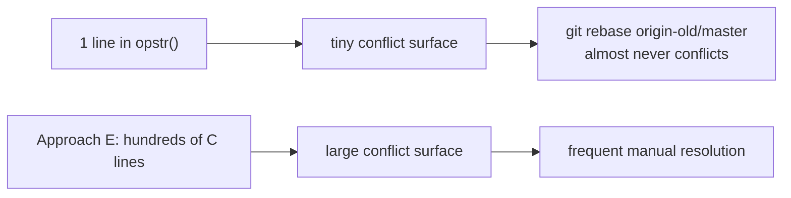

---

### II.4 Deep Dive: Recommended Design (Approach A2 + hardened helper)

#### II.4.1 The two pieces

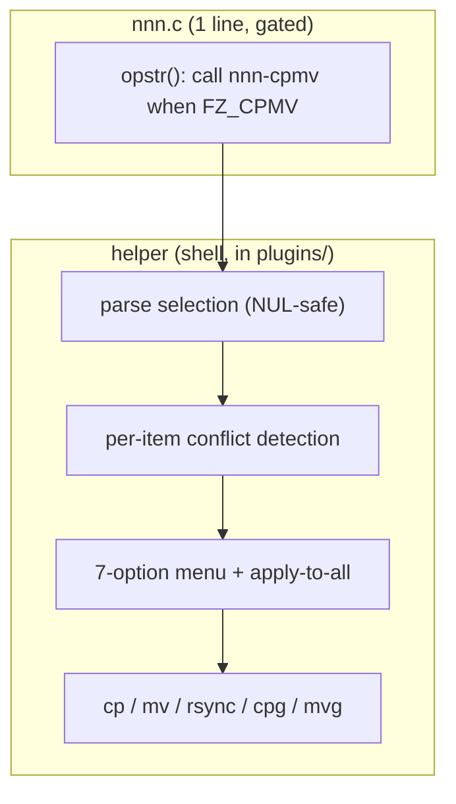

The contract between them is three positional arguments:

```
ASCII Table II.10: nnn -> helper contract
+----------+--------------------------------------------------------------+
| Arg      | Value                                                        |
+----------+--------------------------------------------------------------+
| $1 op    | "cp" or "mv" (A1), or the full op string "cp -iRp --" (A0)   |
| $2 sel   | path to the NUL-separated selection file (nnn's selpath)     |
| $3 dest  | "." -- the helper resolves it to $PWD (nnn's browse dir)     |
| stdin    | /dev/tty (so read prompts work under spawn F_CLI)           |
+----------+--------------------------------------------------------------+
```

#### II.4.2 Packaging the helper as a plugin (best practice)

Rather than requiring `nnn-cpmv` on the user's `$PATH`, place it in nnn's plugin
directory and call it by absolute path from `opstr()`:

```c
#ifdef FZ_CPMV
    snprintf(buf, CMD_LEN_MAX,
        "\"${NNN_PLUG_DIR:-$HOME/.config/nnn/plugins}/cpmv\" %s '%s' . < /dev/tty",
        op, selpath);
#endif
```

- Keeps `$PATH` clean and ships the helper the nnn-idiomatic way (the plugins
  dir is already part of every nnn install). This is the best-of-both-worlds with
  Approach B: the C hook keeps `p`/`v`, the logic ships as a plugin file.

#### II.4.3 The per-conflict decision logic

```mermaid
%% Per-item loop with apply-to-all short-circuit
flowchart TD
    Start["for each selected item src"] --> Tgt{"dest/basename<br/>exists?"}
    Tgt -->|"no"| Just["copy/move it (no prompt)"]
    Tgt -->|"yes"| Glob{"GLOBAL_MODE set?"}
    Glob -->|"yes"| Apply["apply GLOBAL_MODE"]
    Glob -->|"no"| Show["show sizes + mtimes<br/>show 7-option menu"]
    Show --> Read["read choice 1-7"]
    Read --> Do["apply choice"]
    Do --> AskAll{"apply to ALL<br/>remaining? y/N"}
    AskAll -->|"y"| SetG["GLOBAL_MODE = choice"]
    AskAll -->|"n"| Next1["continue (ask again next time)"]
    Apply --> Next2["next item"]
    Just --> Next2
    SetG --> Next2
    Next1 --> Next2
```

#### II.4.4 The seven modes and their implementations

```
ASCII Table II.11: Mode -> tool mapping
+---+----------------------------+--------------------------------------------+
| # | Menu entry                 | Implementation                             |
+---+----------------------------+--------------------------------------------+
| 1 | overwrite                  | cp -f  /  mv -f   (or cpg/mvg)              |
| 2 | newer only                 | cp -u  /  mv -u  (mtime: source newer)     |
| 3 | different size only        | rsync -a --size-only                       |
| 4 | different size or newer    | rsync -a --update (size+mtime quick check, |
|   |                            | skip if dest newer) -- approximates FZ      |
| 5 | resume (interrupted)       | rsync -a --partial --append-verify         |
| 6 | rename (keep both)         | copy to "stem (n)ext" next free suffix      |
| 7 | skip                       | do nothing                                 |
+---+----------------------------+--------------------------------------------+
```

For `mv`, the rsync-based modes (3/4/5) are an **emulated move**: rsync to the
destination, then remove the source -- non-atomic and slower than a real `mv`
(see the data-loss caveat in II.4.7).

#### II.4.5 Apply-to-all as a tiny state machine

```mermaid
%% GLOBAL_MODE state
stateDiagram-v2
    [*] --> Asking
    Asking --> Asking: "conflict -> menu -> 'all? n'"
    Asking --> Locked: "conflict -> menu -> 'all? y'"
    Locked --> Locked: "conflict -> reuse choice (no prompt)"
    Asking --> [*]: "items exhausted"
    Locked --> [*]: "items exhausted"
```

Once locked, every remaining conflict reuses the chosen mode with no further
prompts -- FileZilla's "apply to all" checkbox, exactly as the workflow requires.

#### II.4.6 Conflict granularity (an honest limitation)

FileZilla resolves conflicts **per file**, descending into directory trees. This
design resolves them **per selected top-level item**. For a selected directory,
the chosen mode applies to the whole subtree:

```
ASCII Table II.12: Granularity comparison
+------------------------------+-----------------------------+------------------+
| Scenario                     | FileZilla                   | This design      |
+------------------------------+-----------------------------+------------------+
| select 3 files               | 3 per-file prompts          | 3 per-item       |
|                              |                             | prompts (same)   |
| select a dir with 100 files, | up to 100 nested prompts    | ONE prompt for   |
|   some conflicting           |                             | the dir; rsync   |
|                              |                             | rule applies to  |
|                              |                             | the subtree      |
+------------------------------+-----------------------------+------------------+
```

This is usually acceptable (and faster), but it must be documented. A future
enhancement could expand directories and prompt per nested conflict; that is
explicitly out of scope for the least-change deliverable.

#### II.4.7 Critique of the committed helper (fix before shipping)

[my_patches/nnn-cpmv](../my_patches/nnn-cpmv) is a strong starting point
(NUL-safe parsing, advcpmv detection, size/mtime display, apply-to-all, rename
collision). Treating it as a candidate rather than the answer, these issues must
be addressed:

```
ASCII Table II.13: Helper issues, severity-ordered
+----------+------------------------------------+------------------------------+
| Severity | Issue                              | Fix                          |
+----------+------------------------------------+------------------------------+
| CRITICAL | move modes 3/4/5 run `rsync ... ;  | use `&&`: only rm_src on     |
|          | rm_src` with a SEMICOLON, so a     | rsync SUCCESS. As written, a |
|          | failed rsync still deletes the     | failed transfer DELETES the  |
|          | source -> DATA LOSS.               | source. (lines 61-63)        |
| HIGH     | `stat -c` is GNU-only; breaks on   | detect BSD `stat -f` or fall |
|          | BSD/macOS where nnn also runs.     | back to `wc -c` / `find`.    |
| MEDIUM   | non-conflict path uses mode 1      | harmless but document; or    |
|          | (overwrite -f) unconditionally     | use plain cp without -f.     |
| MEDIUM   | cpg/mvg `-t`,`-f` flag support     | feature-test the flags, or   |
|          | assumed; advcpmv variants differ.  | fall back to plain cp/mv.    |
| LOW      | copying a file onto itself         | guard: skip if src -ef tgt.  |
| LOW      | resume on a complete-but-different | acceptable; note that mode 5 |
|          | file re-verifies (slow)            | assumes an interrupted xfer. |
+----------+------------------------------------+------------------------------+
```

```mermaid
%% The critical move bug, visualized
flowchart LR
    R["rsync src -> dest"] -->|"current: #59;"| RM["rm -rf src ALWAYS"]
    R -->|"fixed: &&"| RMok["rm -rf src ONLY if rsync ok"]
    RM --> Loss["data loss on failure"]
    RMok --> Safe["safe move"]
```

#### II.4.8 Edge cases

```
ASCII Table II.14: Edge cases and handling
+--------------------------------------+----------------------------------------+
| Edge case                            | Handling                               |
+--------------------------------------+----------------------------------------+
| empty selection                      | nnn already guards (isselfileempty);   |
|                                      | helper also exits with a message.      |
| filenames with spaces/newlines       | NUL-separated read -r -d '' (safe).    |
| filename starting with '-'           | `--` and `-t dest` everywhere.         |
| no rsync installed                   | modes 3/4/5 print "rsync missing" and  |
|                                      | skip (do not silently overwrite).      |
| dest == source dir (copy onto self)  | guard with `src -ef tgt`; skip.        |
| sessions/advcpmv (-r) build          | op encodes cpg/mvg; helper uses it     |
|                                      | (A0) or re-detects (A1).               |
| FZ_CPMV not defined (default build)  | opstr() is upstream verbatim; feature  |
|                                      | absent, zero risk.                     |
+--------------------------------------+----------------------------------------+
```

---

### II.5 Step-by-Step Implementation Guidelines

No timeline -- ordered steps only. Assumes the branch is already on
`origin-old/master` (Part I, Step 0).

#### Step 1 -- Add the gated one-line hook in `opstr()`

Edit [src/nnn.c:2737](../src/nnn.c#L2737) to the A2 form (II.3 / II.4.2),
preferably calling the helper by its plugin path:

```c
static void opstr(char *buf, char *op)
{
#ifdef FZ_CPMV
    snprintf(buf, CMD_LEN_MAX,
        "\"${NNN_PLUG_DIR:-$HOME/.config/nnn/plugins}/cpmv\" %s '%s' . < /dev/tty",
        op, selpath);
#else
    snprintf(buf, CMD_LEN_MAX,
        "xargs -0 sh -c '%s \"$0\" \"$@\" . < /dev/tty' < '%s'", op, selpath);
#endif
}
```

#### Step 2 -- Add the `O_FZ_CPMV` build option

Mirror `O_SSN_ON_CD` (Part I): add `O_FZ_CPMV := 0` near the other `O_*` options
in `Makefile` (and `Makefile_debug`), and a block:

```make
ifeq ($(strip $(O_FZ_CPMV)),1)
	CPPFLAGS += -DFZ_CPMV
endif
```

Then append `O_FZ_CPMV=1` to `build.sh` / `build_debug.sh`.

#### Step 3 -- Install the hardened helper as a plugin

Place the helper at `~/.config/nnn/plugins/cpmv` (or ship it in the fork's
`plugins/` dir), `chmod +x`. Start from
[my_patches/nnn-cpmv](../my_patches/nnn-cpmv) and apply the II.4.7 fixes --
**at minimum the CRITICAL `;` -> `&&` move fix** and the `stat` portability
guard.

#### Step 4 -- Build

```
ASCII Table II.15: Build matrix
+----------------------------+-------------------------------------------+
| Build                      | What it verifies                          |
+----------------------------+-------------------------------------------+
| make                       | Default build = upstream opstr (no flag). |
| make O_FZ_CPMV=1           | Hook compiles; calls the plugin.          |
| ./build.sh                 | Fork build with the feature enabled.      |
+----------------------------+-------------------------------------------+
```

#### Step 5 -- Manual verification

```mermaid
%% Verification flow mirroring the user's workflow
sequenceDiagram
    participant U as User
    participant N as nnn (O_FZ_CPMV=1)
    participant H as plugins/cpmv
    U->>N: Space-select file(s)
    U->>N: navigate to dest dir
    U->>N: press p (copy here)
    N->>H: cpmv cp selpath .
    H-->>U: CONFLICT menu (1-7) for clashing item
    U->>H: choose 3 (different size only)
    H-->>U: apply to ALL remaining? y/N
    U->>H: y
    H->>H: reuse mode 3 for the rest, no prompts
    H-->>U: Done. Press enter.
```

Concrete checks:
1. Copy a non-conflicting file -> no prompt, file appears.
2. Copy a conflicting file -> menu shows source/target size + mtime; pick each of
   1-7 and confirm the documented behaviour.
3. Pick a mode, answer "apply to all = y", and confirm remaining conflicts are
   resolved without further prompts.
4. **Move (v) with rsync modes 3/4/5**: interrupt/force an rsync failure and
   confirm the **source is preserved** (validates the II.4.7 CRITICAL fix).
5. Select a directory tree with mixed conflicts; confirm the per-item semantics
   (II.4.6) match expectations.
6. Default build (no `O_FZ_CPMV`): confirm `p`/`v` behave exactly as upstream.

#### Step 6 -- Keep upstream-syncable

`opstr()` is small and rarely touched upstream; the gated one-liner rebases
cleanly. Periodically:

```
git fetch origin-old
git rebase origin-old/master      # the gated opstr line rebases cleanly
./build.sh && <run Step 5 checks>
```

---

### II.6 Summary

- `opstr()` ([src/nnn.c:2737](../src/nnn.c#L2737)) is the single chokepoint for
  both `p` (SEL_CP) and `v` (SEL_MV) -- the cp/mv analog of Part I's `begin:`.
  Stock nnn only offers `cp -i`/`mv -i` (y/n overwrite); everything else is the
  gap to fill.
- Recommended: **Approach A2** -- a **one-line**, build-flag-gated (`-DFZ_CPMV`)
  rewrite of `opstr()` that calls an external helper, with the helper shipped as
  an nnn **plugin**. Default build stays byte-for-byte upstream; the fork opts in.
- The `my_patches` solution is essentially Approach A1 and is a sound starting
  point, but (a) it changes 3 lines instead of 1 and drops the advcpmv info, and
  (b) its helper has a **CRITICAL data-loss bug** (move modes run `rsync ... ;
  rm` instead of `&&`) plus GNU-only `stat` -- both must be fixed before shipping.
- Approach B (pure plugin, zero C change) is the most rebase-proof option and the
  right choice if the fork accepts a plugin key (`;c`) instead of `p`/`v`.
- Honest limitation: conflict resolution is per selected top-level item, not per
  nested file as in FileZilla (II.4.6) -- acceptable and faster, but documented.
