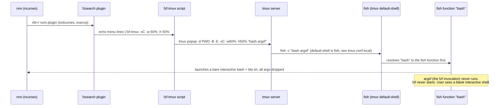

# Fix: Alt+/ (fzsearch) shows an interactive terminal instead of the search-mode menu

## Purpose

This document plans the fix for a reported bug: pressing `Alt+/` in `nnn` (bound to the
`fzsearch` plugin) does not show the expected 2-item menu ("Grep string in file" /
"Search name of file"). Instead the user sees what looks like a plain interactive
terminal.

The investigation was done by reading the relevant source (nnn key handling, the
plugin script, `fzf-tmux`) and by reproducing the failure live in a disposable tmux
session. The root cause is confirmed, not guessed. It is not a bug in `fzsearch`'s own
logic; it is an environment interaction between `fzf-tmux`'s popup mechanism, tmux's
`default-shell`, and a fish shell function that silently drops arguments.

## Root cause (Fact, reproduced live)

`Decision`: fix at the real root cause first (a one-line change outside this repo),
then optionally harden `fzsearch` so it does not depend on that environment detail at
all.

### Confirmed chain of causation



| Component | Role | Notes |
|---|---|---|
| `nnn` | File manager, ncurses UI | Correctly maps `Alt+/` to plugin `fzsearch` via `NNN_PLUG`. Verified in `src/nnn.c` (`handle_alt_key`, `nextsel`, `SEL_PLUGIN`). Not part of the bug. |
| `plugins/fzsearch` | This repo's plugin script | Logic is correct. Calls `fzf-tmux` with popup-position flags when running inside tmux. |
| `/home/tripham/bin/fzf-tmux` (symlink to `~/.dotfiles/bin/fzf-tmux`) | Vendored fzf helper, not part of this repo | Builds a small script (`argsf`) that runs fzf, and asks tmux to display it as a popup via `tmux popup ... "bash $argsf"`. |
| tmux server | Runs the popup's shell command | Executes any given shell-command string as `<default-shell> -c "<string>"`. `default-shell` is explicitly set to `/usr/bin/fish` in `~/.config/tmux/tmux.conf.local:630`. |
| `~/.config/fish/functions/bash.fish` (tracked in `~/.dotfiles/fish`, a separate git repo) | User's fish shim for the `bash` command | Shadows the real `bash` binary. Defined as `env -u SHELL FISH_VERSION="$FISH_VERSION" bash` with **no `$argv` passthrough**, so it silently discards whatever arguments it was called with. |

### What actually happens

1. `fzsearch` runs `fzf-tmux -xC -w '60%' -h '50%' --prompt "..."` piped from `echo`.
2. `fzf-tmux` (in tmux, popup mode) asks the tmux server to open a popup running the
   literal string `bash /tmp/fzf-args-<id>` (a small generated script that would run
   the real `fzf` binary).
3. tmux runs that string via `default-shell -c "<string>"`. Since `default-shell` is
   fish, this becomes `fish -c "bash /tmp/fzf-args-<id>"`.
4. Fish resolves `bash` to the user's own fish **function** (functions take precedence
   over `$PATH` binaries in fish), not the real `bash` executable.
5. That function ignores the `/tmp/fzf-args-<id>` argument entirely and just execs a
   bare, argument-less `bash`. Connected to a real pty with no script to run, this bash
   behaves like an interactive shell: it sources `~/.bashrc`, which sources
   `~/.local/share/blesh/ble.sh` (line 227 of `~/.bashrc`).
6. The result: the popup shows a live, interactive bash prompt (with ble.sh loaded)
   instead of the fzf menu. `fzf` itself never starts.

### Evidence gathered during live reproduction

`Fact`: reproduced by creating a disposable tmux session (`fztest4`), attaching a real
pty client via `script` (so tmux had an actual client to render the popup into), and
invoking the plugin exactly as `nnn` does:

```bash
/home/tripham/.config/nnn/plugins/fzsearch "/home/tripham/Dev/Playground_Terminal/nnn" "-"
```

Observed process tree (trimmed):

```
bash /home/tripham/.config/nnn/plugins/fzsearch ...
  \_ bash /home/tripham/bin/fzf-tmux -xC -w 60% -h 50% --prompt Grep Name/File>
      \_ tmux popup -d <dir> -B -E -xC -w60% -h50% bash /tmp/fzf-args-799
fish -c bash /tmp/fzf-args-799          <- the popup's shell, per tmux default-shell
  \_ bash                                <- cmdline is literally "bash", NO arguments
```

`/proc/<pid>/status` for that final `bash` process: `State: S (sleeping)`.
`/proc/<pid>/wchan`: `do_select` (readline waiting on terminal input).
`/proc/<pid>/fd/0` and `/1`: both point directly at the popup's pty (`/dev/pts/45`).
Additional fds present: `.../blesh/<pid>.util.msleep.pipe`, `.../blesh/<pid>.stderr`
(ble.sh runtime files, only created for a real interactive bash session).

No `fzf` process ever appeared anywhere in the tree, and the internal fifo
(`/tmp/fzf-fifo1-799`) that `fzf-tmux` uses to feed the menu items to `fzf` never got a
writer. This confirms the popup script (`argsf`) never actually executed; the fish
`bash` shim intercepted it first.

`Fact`: `grep -rl "fzf-tmux" plugins/` in this repo returns only `fzsearch`, so within
this repository the exposure is isolated to this one plugin. The underlying fish/tmux
interaction, however, would affect any other tool on this machine that asks tmux (or
anything using `$SHELL -c "..."`) to run a `bash <script>` command, not just `nnn`.

### Assumption

The `bash.fish` shim was written to make a manually-typed `bash` (interactive,
inside fish) behave a certain way (drop `$SHELL`/`$FISH_VERSION` pollution). It was
very likely never intended to intercept programmatic, non-interactive invocations like
`fish -c "bash <script>"`. Fixing it to forward `$argv` preserves the original intent
for interactive use and fixes the non-interactive case as a side effect.

## 1. Current code structure

- `plugins/fzsearch` (this repo, symlinked at `~/.config/nnn/plugins/fzsearch`):
  bash script bound to key `/` in `NNN_PLUG` (see
  `~/.config/nnn/nnn_config.sh:9`: `NNN_PLUG='...;/:fzsearch;...'`).
  - Sources `plugins/.nnn-plugin-helper` via `. "$(dirname "$0")"/.nnn-plugin-helper`.
  - Branches on `not_in_tmux` (WezTerm-specific pane-splitting vs. plain `fzf`) vs. the
    tmux `else` branch, which calls `fzf-tmux -xC -w '<pct>' -h '<pct>' ...` three
    times: once for the top menu, once for "Grep string in file" (live `rg` search),
    once for "Search name of file" (`fd` search).
  - The user's real daily workflow is always inside tmux (`start_dual_nnn.sh` requires
    `$TMUX_PANE` to be set), so the tmux `else` branches are the ones that matter.
- `plugins/.nnn-plugin-helper` (this repo): **incomplete**. It defines `nnn_cd`,
  `cmd_exists`, `nnn_use_selection`, but is **missing** `not_in_tmux()` and
  `nnn_banner()`, both of which `fzsearch` calls.
  - `Fact`: the deployed copy at `~/.config/nnn/plugins/.nnn-plugin-helper` (a
    separate, non-symlinked file) does have both functions. `fzsearch` currently works
    (up to the bug above) only because it is invoked through that deployed file, not
    through this repo's copy. If this repo's `.nnn-plugin-helper` were ever deployed
    fresh (new machine, dotfiles resync), `fzsearch` would break immediately with
    `not_in_tmux: command not found`. This is a latent, separate bug worth fixing
    alongside the main one since it is in the same file family and low risk.
- `/home/tripham/bin/fzf-tmux` -> `~/.dotfiles/bin/fzf-tmux`: vendored fzf helper, not
  part of this repo. Not modified by this plan.
- `~/.config/fish/functions/bash.fish` -> `~/.dotfiles/fish/functions/bash.fish`:
  the actual file that needs the primary fix. Tracked in its own git repo
  (`~/.dotfiles/fish`, confirmed via `git rev-parse --show-toplevel`), separate from
  the `nnn` repo.

## 2. Files likely to change

| File | Repo | Change |
|---|---|---|
| `~/.config/fish/functions/bash.fish` | `~/.dotfiles/fish` (separate git repo) | Required. Forward `$argv` to the real `bash`. |
| `plugins/.nnn-plugin-helper` | this repo (`nnn`) | Required. Add the missing `not_in_tmux()` and `nnn_banner()` functions so the repo copy matches the deployed copy and stays self-consistent. |
| `plugins/fzsearch` | this repo (`nnn`) | Optional / ask first. Only if the user also wants to remove the dependency on `fzf-tmux` popup mode (see Step 4 below). No change needed to fix the reported bug once the two required fixes above are in place. |

## 3. Data structures / functions to add or update

No data structures involved; this is shell script glue. Functions touched:

- `bash` (fish function, `bash.fish`): add `$argv` to the exec call.
  ```fish
  function bash
      env -u SHELL FISH_VERSION="$FISH_VERSION" bash $argv
  end
  ```
- `not_in_tmux()` and `nnn_banner()` (to be added to this repo's
  `plugins/.nnn-plugin-helper`, copied verbatim from the deployed file so behavior
  does not change):
  ```sh
  not_in_tmux() {
      [ -z "$TMUX" ]
  }

  nnn_banner() {
      figlet_text="
  $1
    ++
  "
      cols=$(tput cols)
      figlet -f slant -w "$cols" -c "$figlet_text" | lolcat
  }
  ```
  `Risk`: retype this by hand only as a last resort. Prefer copying the exact bytes
  from the deployed file (see Step 2 below) so trailing whitespace / comments match
  exactly and `diff` against the deployed copy comes back clean.
- (Optional, only if the user opts into Step 4) `plugins/fzsearch`: replace the three
  `fzf-tmux -xC -w '<pct>' -h '<pct>' ...` invocations in the tmux branches with plain
  `fzf ...` invocations (same flags minus `-tmux`/`-xC`/`-w`/`-h`), matching the style
  already used in the non-tmux/non-WezTerm branch (line 33 of the current file).

## 4. Implementation steps

`Decision`: do steps 1-2 always (they fix the reported bug and a latent portability
bug). Do step 3 only if the user explicitly wants to remove the popup-mode dependency
as well; ask before applying it, since it changes the visual behavior (full-pane `fzf`
instead of a floating popup).

### Step 1: Fix the fish `bash` shim (primary fix, required)

Repo: `~/.dotfiles/fish` (or edit via the `~/.config/fish` symlink; same file).

1. Open `~/.config/fish/functions/bash.fish`.
2. Change:
   ```fish
   function bash
       env -u SHELL FISH_VERSION="$FISH_VERSION" bash
   end
   ```
   to:
   ```fish
   function bash
       env -u SHELL FISH_VERSION="$FISH_VERSION" bash $argv
   end
   ```
3. Reload fish config in any already-open fish sessions (`exec fish`, or open a new
   pane) so the updated function definition is picked up. Existing fish processes
   that already parsed the old function keep the old behavior until reloaded.

### Step 2: Sync the missing helper functions into this repo (required)

Repo: `nnn` (this repo).

1. Diff the repo copy against the deployed copy to get the exact missing text:
   ```bash
   diff /home/tripham/Dev/Playground_Terminal/nnn/plugins/.nnn-plugin-helper \
        /home/tripham/.config/nnn/plugins/.nnn-plugin-helper
   ```
2. Append the missing `not_in_tmux()` and `nnn_banner()` functions (shown in Section 3)
   to the end of `plugins/.nnn-plugin-helper` in this repo, byte-for-byte matching the
   deployed copy.
3. Re-run the `diff` command; it should now produce no output.
4. Note: `plugins/fzsearch` is a symlink to this repo file, so no redeploy step is
   needed for the script itself. `.nnn-plugin-helper` is **not** symlinked (it's a
   distinct file at the deployed path); after step 2 the repo and deployed copies will
   simply be identical, no separate "deploy" action is required for this fix to take
   effect (the deployed file already has the functions).

### Step 3 (optional, ask before applying): Remove `fzf-tmux` popup dependency

Only do this if the user wants `fzsearch` to be robust to shell/tmux-config drift
(e.g., if the default-shell/fish-shim interaction could regress again on this or
another machine). This is a UX change (full-pane `fzf` instead of a floating popup)
so confirm with the user first.

1. In `plugins/fzsearch`, in each of the three tmux (`else`) branches, replace:
   ```bash
   fzf-tmux -xC -w '60%' -h '50%' --prompt "$title_fzf> "
   ```
   and the two similar `-w '80%' -h '80%'` calls, with a plain `fzf` invocation
   (drop `-tmux`, `-xC`, `-w`, `-h`; keep `--bind`, `--ansi`, `--layout=reverse`,
   `--header`, `--prompt` as-is), matching the existing non-tmux branch style already
   used elsewhere in the same file.
2. This makes `fzf` a direct child of the plugin script (no intermediate tmux popup,
   no intermediate shell), so it no longer depends on tmux's `default-shell` or any
   fish shim at all.

## 5. Test plan

`Risk callout`: do not claim a step passed without actually running it. Record
pass/fail per step.

1. **Static check**: `bash -n plugins/fzsearch` and
   `bash -n plugins/.nnn-plugin-helper` (syntax check only, no functional signal).
2. **Fish shim regression check** (after Step 1):
   ```fish
   bash -c 'echo hello-from-real-bash'
   ```
   run from an interactive fish shell. Expect `hello-from-real-bash` printed by a real
   bash, not a bare interactive prompt. This directly exercises the exact call shape
   (`bash -c "<command>"`) that `fzf-tmux` uses.
3. **Helper sync check** (after Step 2): re-run the `diff` from Step 2.2; expect no
   output (files identical).
4. **End-to-end reproduction, no live UI needed** (mirrors how this bug was originally
   confirmed): from a tmux pane, run
   ```bash
   /home/tripham/.config/nnn/plugins/fzsearch "$PWD" "-"
   ```
   and, after a couple of seconds, inspect the process tree:
   ```bash
   ps -ef --forest | grep -E "fzsearch|fzf-tmux|fzf-args"
   ```
   Expect to see an `fzf` process as a descendant of the `tmux popup` line (previously
   there was a bare `bash` with no arguments and no `fzf` child). Press `q` or `Esc` in
   the popup to close it before moving on, or `Ctrl-C` the outer command if it is not
   interactive here.
5. **Live manual check (requires a human at the keyboard)**: press `Alt+/` inside a
   real `nnn` session in the dual-pane tmux layout (`start_dual_nnn.sh`). Confirm the
   two-item menu ("Grep string in file" / "Search name of file") appears in a floating
   popup, and that both sub-searches (`rg` live grep, `fd` filename search) also show
   their popups correctly. This step needs the user (or a human-in-the-loop agent) to
   actually look at the screen; a headless agent cannot fully verify the visual
   popup by itself. `Not verified` until a human confirms it.
6. If Step 3 (optional hardening) is applied, repeat step 5 and additionally confirm
   the menu now takes over the full pane (expected new behavior) rather than floating,
   and that selecting an item still works end to end (grep result opens via `tol`,
   filename result copies the path to the clipboard).

## 6. Risks

- `Risk`: Step 1 changes a shell function used for the user's daily interactive `bash`
  invocations too, not just this bug. Forwarding `$argv` only makes it behave like a
  normal wrapper; it should not change any currently-working interactive use (calling
  bare `bash` with no arguments still works identically, since `$argv` is empty then).
- `Risk`: Step 1 lives in a different git repository (`~/.dotfiles/fish`) than this
  task's repo (`nnn`). Commit it there separately with its own message; do not fold it
  into an `nnn` repo commit.
- `Risk`: existing fish sessions cache the old function definition until reloaded
  (new panes/windows pick up the fix automatically; already-open shells do not).
- `Risk`: Step 2 is low risk (additive, copies two functions verbatim from a file that
  already works in production), but skipping the final `diff` check could let a typo
  slip in (e.g., trailing whitespace/tab differences) since the original uses tabs for
  indentation inside `nnn_banner`.
- `Risk`: Step 3 (optional) is a real UX change (popup -> full-pane). Do not apply it
  without the user's explicit go-ahead.
- `Open question`: whether other machines/checkouts sharing these dotfiles (if any)
  need the same `bash.fish` fix applied there too. Out of scope for this plan; flag it
  to the user if relevant.

## 7. Sonnet execution checklist

1. [ ] Read `~/.config/fish/functions/bash.fish`; confirm current content matches
       Section 3 exactly before editing (guard against drift since this plan was
       written).
2. [ ] Edit `~/.config/fish/functions/bash.fish` to add `$argv` (Step 1).
3. [ ] In the `~/.dotfiles/fish` git repo (or via the `~/.config/fish` symlink path),
       `git status` / `git diff` to confirm only that one file changed, then commit
       with a descriptive message (no AI co-author trailer, per this user's
       documentation-style policy). Do not push unless asked.
4. [ ] Run the fish shim regression check (Test plan step 2). Record pass/fail.
5. [ ] Run `diff` between this repo's `plugins/.nnn-plugin-helper` and
       `~/.config/nnn/plugins/.nnn-plugin-helper` to confirm the exact missing text
       (Step 2.1).
6. [ ] Append `not_in_tmux()` and `nnn_banner()` to this repo's
       `plugins/.nnn-plugin-helper` (Step 2.2).
7. [ ] Re-run the `diff`; confirm no output (Step 2.3). Record pass/fail.
8. [ ] Run `bash -n` on both `plugins/fzsearch` and `plugins/.nnn-plugin-helper`.
9. [ ] Run the end-to-end process-tree check (Test plan step 4) from a real tmux pane
       in this environment; confirm an `fzf` process now appears under the `tmux
       popup` line. Record the exact command run and its result.
10. [ ] Ask the user to do the live manual check (Test plan step 5) since it needs a
        human looking at the screen; do not claim it passed without their
        confirmation.
11. [ ] Ask the user whether they also want Step 3 (drop `fzf-tmux` popup mode in
        `plugins/fzsearch`) applied. Only proceed with it if they say yes; if so,
        apply it, then repeat the process-tree check and ask for a live manual
        re-check.
12. [ ] Commit the `nnn` repo change (Step 2, and Step 3 if applied) separately from
        the dotfiles commit, with a descriptive message and no AI co-author trailer.
        Do not push unless asked.
13. [ ] Summarize for the user: what was fixed, which repo each commit landed in,
        which test steps actually ran (with pass/fail), and which step is still
        `Not verified` pending their live check.
