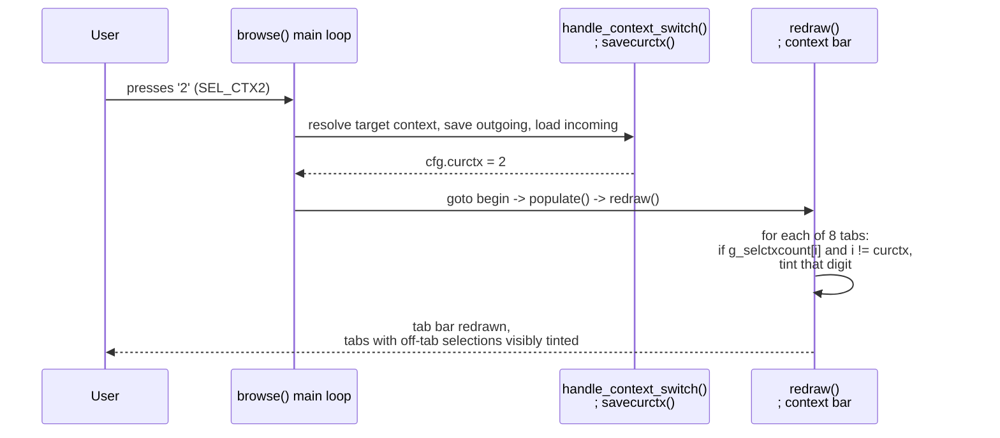

# Feature: track selections per tab/context, notify non-obtrusively on switch

## Purpose

`nnn` supports up to 8 contexts ("tabs", keys `1`-`8`, `Tab`/`Shift+Tab` to cycle).
Today the selection is a single global list (`pselbuf`/`selbufpos`/`nselected`)
shared by every context: select a file while on tab 1, switch to tab 2, and
nothing on screen tells you tab 1 still has something selected. This plan adds:

1. A record of which context(s) contributed to the current selection.
2. A persistent, non-obtrusive visual cue on the tab bar itself, so switching
   tabs (or just glancing at the screen) shows you which *other* tabs still
   hold a selection, with no popup and no interruption.

`Decision`: track **counts per context**, not the identity of individual files.
The literal ask ("track which selected files are on which tab") would need a
data structure that stays in sync with every add/remove/invert/edit/adopt of
the selection, several of which (`invertselbuf()`, cross-instance sync added
in the previous feature) do byte-level `memmove()` on `pselbuf`, not
entry-level operations. A parallel per-file array there means new heap
allocation, new realloc, new pointer arithmetic, i.e. exactly the class of bug
(dangling pointers into a realloc'd buffer, heap overflow from a miscounted
allocation) that the adversarial reviews in this repo's history repeatedly
caught in similar designs. A per-context **count** answers "which tabs have
selections and roughly how many" with zero new heap state: it rides along on
existing `++nselected` / `--nselected` sites as a paired increment/decrement,
no allocation, no `memmove`, no dangling pointer. That is what the
notification actually needs. Section 6 covers the precision trade-off this
makes.

## 1. Current code structure

- `src/nnn.h`: keymap `bindings[]`. `{ '1'..'8', SEL_CTX1..SEL_CTX8 }` (lines
  189-196), `{ '\t', SEL_CYCLE }` (185), `{ KEY_BTAB, SEL_CYCLER }` (187).
- `src/nnn.c`:
  - `context` struct (~line 417-424): per-tab state (`c_path`, `c_last`,
    `c_name`, `c_fltr`, `c_cfg`, `color`). `g_ctx[CTX_MAX]` (line 446) holds
    all 8. `cfg.curctx` (a 3-bit field, `settings.curctx`) is the active one.
    `g_ctx[i].c_cfg.ctxactive` marks whether tab `i` has ever been opened.
  - `handle_context_switch()` (~line 8961): resolves `SEL_CTX1..8` /
    `SEL_CYCLE` / `SEL_CYCLER` to a target context number `r`. Pure
    computation, no side effects.
  - `savecurctx()` (~line 6283): persists the outgoing context's state into
    `g_ctx[cfg.curctx]`, then switches `cfg` to the incoming context (creating
    it fresh if not yet active).
  - The `SEL_CYCLE`/`SEL_CYCLER`/`SEL_CTX1..8` case in `browse()`'s main
    switch (~line 10413-10439): calls `handle_context_switch()`, then
    `savecurctx()`, repoints `path`/`lastdir`/`lastname`/`tmp` at the new
    context, sets `presel` (for filter mode) or `watch = TRUE`, then
    `goto begin`, which always leads to `populate()` + `redraw()` +
    `statusbar()`.
  - Selection state: `pselbuf`, `selbufpos`, `nselected` (globals, ~line
    449-477), **not** scoped per context today. Mutated in `addtoselbuf()`
    (~2150), `rmfromselbuf()` (~2193), `invertselbuf()` (~2035), the inline
    `SEL_SEL` single-toggle case in `browse()` (~10611-10629), `xrmfromsel()`
    (~2894, purges a selected entry whose underlying file vanished),
    `editselection()` (~2299, the `E` key, edits the list in `$EDITOR`), and
    `syncselfile()` / `readselfile()` (added by the previous feature on this
    branch, cross-pane live-sync and on-demand adopt).
  - `redraw()` (~line 9525): the function that draws the whole screen,
    including the **top context bar**. Lines 9633-9642 print `"1 2 3 4 5 6 7 8"`
    with one of three styles per digit: dim (context never opened), bold +
    underline (active, not current), bold + reverse (current). This loop is
    the natural place for a "has a selection elsewhere" hint, since it already
    iterates all 8 contexts and already colors them individually, and it runs
    on every redraw, including immediately after every context switch (via
    `goto begin`).
  - `statusbar()` (~line 9154): draws the bottom status line, including the
    existing `nselected` indicator (~9185-9197): `+<N>` in reverse video when
    something is selected. This is the existing precedent for a compact,
    always-on selection indicator; not changed by this plan, just noted as
    the established visual language ("+" already means "selected").
  - Colors: `C_UND` (~line 866, "Unknown OR 0B regular/exe file: Red1") is an
    already-initialized color pair (`init_fcolors()`, used elsewhere via
    `COLOR_PAIR(C_UND + 1 + icon.color)` at ~line 6011). Reusing it avoids
    adding a new color pair or touching `init_fcolors()`.



| Component | Role | Notes |
|---|---|---|
| `handle_context_switch()` | Resolve which tab a key press switches to | No side effects, unchanged |
| `savecurctx()` | Persist outgoing tab, activate incoming tab | Unchanged |
| `redraw()` context-bar loop | Draw the 8 tab digits | New: tint digits with `g_selctxcount[i] > 0` |
| `g_selctxcount[CTX_MAX]` (new) | Per-tab count of selected entries | New global, paired with every `nselected` mutation |
| `statusbar()` | Bottom status line, existing `+N` selection indicator | Unchanged |

## 2. Files likely to change

| File | Change |
|---|---|
| `src/nnn.c` | Required. New global array. Paired increment/decrement/reset at every existing `nselected` mutation site. New tinting branch in the `redraw()` context-bar loop. |
| `src/nnn.h` | None. No new keybinding, no new `enum action`. |
| `docs/design/selected-files-on-other-tabs-notification-implementation-plan.md` | This plan. |

## 3. Data structures / functions to add or update

### New global

Declare next to `nselected` (~line 449):

```c
static int nselected;
static uint16_t g_selctxcount[CTX_MAX]; /* selected-entry count attributed to each context */
```

`uint16_t` is deliberate headroom; `nselected` itself is a plain `int` with no
enforced cap, but a context realistically won't hold anywhere near 65535
selected entries and this keeps the array small and cache-friendly.

### Invariant

`Fact`, to state precisely what this array does and does not guarantee:

> `g_selctxcount[i]` is the number of currently-selected entries that were
> added while `cfg.curctx == i`, **as approximated by attributing every
> removal to the context active at the time of removal**, not the context
> that originally added the entry. `sum(g_selctxcount) <= nselected` always
> holds (see the touch-point table for why it can be strictly less).

This is the accepted trade-off from the Purpose section. It is exact for the
overwhelming common case (select and deselect from the same tab in one
sitting) and only approximate in the case of moving to a different tab and
deselecting a file that happens to also be visible there (rare: contexts
usually browse different directory trees) or after an `E` edit / a cross-pane
sync adopt, both of which deliberately reset attribution to "now, in the
current tab" rather than try to reconstruct history (see rows 9-10 below).

### Touch points (every existing `nselected` mutation, paired)

| # | Site (current line, will drift slightly) | Existing code | Add |
|---|---|---|---|
| 1 | `invertselbuf()` first pass, ~2073 | `--nselected;` | `if (g_selctxcount[cfg.curctx]) --g_selctxcount[cfg.curctx];` |
| 2 | `invertselbuf()` second pass, ~2139 | `++nselected;` | `++g_selctxcount[cfg.curctx];` |
| 3 | `addtoselbuf()`, ~2184 | `++nselected;` | `++g_selctxcount[cfg.curctx];` |
| 4 | `xrmfromsel()`, ~2903 | `--nselected;` | `if (g_selctxcount[cfg.curctx]) --g_selctxcount[cfg.curctx];` |
| 5 | `browse()` `SEL_SEL` toggle-on, ~10623 | `++nselected;` | `++g_selctxcount[cfg.curctx];` |
| 6 | `browse()` `SEL_SEL` toggle-off, ~10627 | `--nselected;` | `if (g_selctxcount[cfg.curctx]) --g_selctxcount[cfg.curctx];` |
| 7 | `startselection()`, ~1971 | `nselected = 0;` | `memset(g_selctxcount, 0, sizeof(g_selctxcount));` |
| 8 | `clearselection()`, ~1983 | `nselected = 0;` | `memset(g_selctxcount, 0, sizeof(g_selctxcount));` |
| 9 | `editselection()` success, ~2420 | `nselected = lines;` | `memset(g_selctxcount, 0, sizeof(g_selctxcount)); g_selctxcount[cfg.curctx] = lines;` |
| 10 | `syncselfile()` peer-cleared branch (this branch's own recent addition), ~4716 | `nselected = 0;` | `memset(g_selctxcount, 0, sizeof(g_selctxcount));` |
| 11 | `syncselfile()` adopt branch, ~4738 | `nselected = count;` | `memset(g_selctxcount, 0, sizeof(g_selctxcount)); g_selctxcount[cfg.curctx] = count;` |

`Decision`: rows 9 and 11 reattribute the **entire** surviving selection to
the current tab rather than trying to preserve prior per-tab attribution
through an edit or a cross-instance adopt. Both operations already discard or
replace the whole buffer wholesale; there is no cheap way to tell which
surviving entry came from which original tab without a content diff, and
"you just confirmed this list from here" is a reasonable, simple story for
the user.

`Risk`: row 3 in `confirm_force()` (~line 1749-1753, `nselected =
entries_in_file(...)`) is deliberately **not** in this table. That assignment
is a transient display-only count used for a single confirmation prompt (when
acting on an external, not-locally-adopted selection); it does not persist
`pselbuf`, and updating `g_selctxcount` there would misattribute a count that
was never really "on" any tab in this instance. Leaving it alone means the
tab-bar tint can very briefly be stale relative to that one prompt's number;
accepted, narrow, and pre-existing in spirit (that code path is already an
approximation of the external file's true state).

### Display: `redraw()` context-bar loop (~line 9633-9642)

Current:

```c
for (i = 0; i < CTX_MAX; ++i) { /* 8 chars printed for contexts - "1 2 3 4 " */
	if (!g_ctx[i].c_cfg.ctxactive)
		addch(i + '1');
	else
		addch((i + '1') | (COLOR_PAIR(i + 1) | A_BOLD
			/* active: underline, current: reverse */
			| ((cfg.curctx != i) ? A_UNDERLINE : A_REVERSE)));

	addch(' ');
}
```

New:

```c
for (i = 0; i < CTX_MAX; ++i) { /* 8 chars printed for contexts - "1 2 3 4 " */
	if (!g_ctx[i].c_cfg.ctxactive)
		addch(i + '1');
	else if (g_selctxcount[i] && (i != cfg.curctx))
		/* Active tab holding a selection you are not currently on: tint it
		 * instead of its usual per-context color. Keep bold+underline so it
		 * still reads as "active", just attention-colored. No extra
		 * character, so the fixed 2-columns-per-context layout
		 * (MIN_DISPLAY_COL, used right after this loop) is unaffected. */
		addch((i + '1') | (COLOR_PAIR(C_UND + 1) | A_BOLD | A_UNDERLINE));
	else
		addch((i + '1') | (COLOR_PAIR(i + 1) | A_BOLD
			/* active: underline, current: reverse */
			| ((cfg.curctx != i) ? A_UNDERLINE : A_REVERSE)));

	addch(' ');
}
```

`Risk`: do not add a new character (a suffix marker, a superscript, etc.).
The comment `/* 8 chars printed for contexts - "1 2 3 4 " */` and
`#define MIN_DISPLAY_COL (CTX_MAX * 2)` (line 246) both encode a hard
assumption of exactly 2 columns per context; the path string is positioned
immediately after this loop using that budget. A tint (attribute/color
change on the existing digit) costs zero columns; an extra character would
not.

`Risk`, to verify live rather than assume: `COLOR_PAIR(C_UND + 1)` is used
elsewhere in this file with the same `+ 1` convention (`COLOR_PAIR(C_UND + 1
+ icon.color)`, ~line 6011), which is why this plan reuses it rather than
allocating a new pair. Confirm during testing that the digit actually renders
in a visibly distinct color against a real terminal, not just that it
compiles; if the offset convention is subtly wrong for this exact call site,
the safe fallback is `COLOR_PAIR(C_UND)` (drop the `+ 1`), verified by trying
both and comparing to how `C_UND` renders for an actual "unknown" file in the
listing.

### No new keybinding, no new message, no new function signature

`Decision`: this plan deliberately adds **no** transient status-bar text
message (no new `MSG_*` entry, no `printmsg()` call) on switch, in addition
to the tab-bar tint. A persistent, always-current visual cue that updates on
every redraw (including immediately after a switch) already satisfies
"notify when switching" without the interruption of a one-shot message that
could be missed or could overwrite something else `presel`/`printmsg` is
doing at that moment (context switching already sets `presel` for filter-mode
reactivation, an example of exactly that kind of collision to avoid). If a
loud confirmation is wanted in addition, that is a small, separate follow-up:
one `printmsg()` call right after `savecurctx()` in the switch handler.

## 4. Implementation steps

1. Add `static uint16_t g_selctxcount[CTX_MAX];` next to `nselected` (~line
   449).
2. Apply the 11 paired updates in the touch-point table. Read each function
   fresh before editing; line numbers will have drifted from cross-pane sync
   work already on this branch. Match by the existing `nselected` statement
   text, not by line number.
3. Update the `redraw()` context-bar loop as shown above.
4. Grep the whole file for `nselected` one more time after step 2 and confirm
   every assignment/increment/decrement site is accounted for in the table
   (the table was built from a grep at planning time; a rebase or further
   edits before implementation could add new sites).

No other files change. No new `enum action`, no new keybinding, no new
message string.

## 5. Test plan

`Risk callout`: do not claim a step passed without actually running it. Use a
disposable test directory and a throwaway `NNN_SEL`, the same technique
already used earlier on this branch; do not touch the user's real
`~/.config/nnn/.selection` or real tmux sessions.

1. **Build check**: `./build.sh` (not bare `make`), confirm no new warnings.
2. **Same-tab regression**: select 2 files on tab 1, confirm tab 1's digit
   stays its normal current-tab style (reverse video), not tinted (since
   `i == cfg.curctx` is excluded from the tint branch by construction).
3. **Cross-tab tint appears**: select 2 files on tab 1 (`1`), switch to tab 2
   (`2`). Confirm tab 1's digit in the top bar is now tinted (distinct color)
   while tab 2's is the normal current-tab style. This is the core feature.
4. **Tint clears on deselect**: back on tab 1, deselect both files (`Space`
   on each, or `a` to select-all then `a` again to toggle off, matching
   whatever the existing deselect-all key does). Switch to tab 2. Confirm
   tab 1's digit is no longer tinted.
5. **Multiple tabs tinted**: select on tab 1, switch to tab 2, select there
   too, switch to tab 3. Confirm both tab 1's and tab 2's digits are tinted,
   tab 3's is the normal current-tab style.
6. **`E` (edit selection) reattributes**: with tabs 1 and 2 both holding
   selections (from step 5), switch to tab 3, press `E`, delete some lines,
   save. Confirm the tab bar now shows the entries as attributed to tab 3
   (tabs 1 and 2 no longer tinted; only the source of the pre-edit selection
   flows through `nselected`/`pselbuf`, consistent with row 9's documented
   reattribution).
7. **`SEL_SELINV` (invert selection)**: on a tab with some files selected,
   press the invert key. Confirm the tab's own tint state is internally
   consistent (it is the current tab, so never tinted itself) and that
   `nselected` in the bottom status bar still matches the actual number of
   `+` marked files (a regression check on rows 1-2, since those are the two
   lines threaded into the most structurally complex existing function).
8. **Cross-pane interaction** (only if the previous cross-pane sync feature
   is in use): with two panes sharing `NNN_SEL`, select on tab 1 of pane A.
   In pane B (which has its own independent set of 8 contexts), confirm the
   sync attributes the adopted selection to pane B's *own* current tab (row
   11), not to any notion of "tab 1", since tabs are a purely per-process
   concept and pane B has no knowledge of pane A's context numbering.
9. **Zero-selection**: with nothing selected anywhere, cycle through all 8
   tabs. Confirm no tab is ever tinted and `redraw()` does not crash on an
   all-zero `g_selctxcount`.
10. **Live manual check (needs a human)**: the user tries their normal
    dual-pane workflow (`start_dual_nnn.sh`), selects files on one tab,
    switches tabs, and confirms the tint is visible and reads as intended
    (not confusing, not alarming). `Not verified` until the user does this
    themselves; color perception and "is this too obtrusive" are subjective
    calls no automated test can make.

## 6. Risks

- `Risk`: the core design trade-off, stated plainly: this feature tells you
  **which tabs** have selections and **roughly how many**, not **which
  specific files**. If the user's literal request ("track which selected
  files are on which tab") means they want to, say, switch to tab 1 and see
  a filtered list of only the files selected from tab 1, that is a
  materially bigger feature (real per-file attribution, which reopens the
  `invertselbuf()`/cross-pane-sync complexity this plan deliberately avoids)
  and is out of scope here. Flag this to the user; do not silently assume
  the count-based version is sufficient if they push back after seeing it.
- `Risk`: the approximation in the touch-point table (rows 1, 4, 6: removal
  always debits the *current* tab's bucket, not the original tab) means
  `g_selctxcount` can drift from ground truth in the cross-tab-deselect edge
  case. It self-heals on the next full reset (rows 7-11) and never exceeds
  `nselected` (every decrement is floored at 0), so the worst outcome is an
  under- or over-tinted tab bar for a while, never a crash or a wrong
  `nselected` count in the existing status bar (that variable is untouched
  by this plan beyond the paired updates, which never change its own logic,
  only add a sibling update next to it).
- `Risk`: `redraw()` is a hot path (runs on essentially every screen update).
  The added branch is a single array read and an `A_BOLD | A_UNDERLINE`
  attribute set per context, no allocation, negligible cost; confirm no
  visible redraw slowdown during testing regardless.
- `Risk`: reusing `COLOR_PAIR(C_UND + 1)` for the tint ties this feature's
  look to whatever the user's `NNN_FCOLORS` configures for "unknown/red".
  If they have customized that color to something that blends into the tab
  bar's existing per-context colors, the tint could be hard to see. Not
  fixed by this plan (adding a dedicated new color pair specifically for
  this feature would be the fix, and is a reasonable follow-up if the
  reused color turns out to be a poor fit visually).
- `Open question`: whether a one-shot `printmsg()` on switch is also wanted
  in addition to the persistent tint (see the end of Section 3). Not
  included by default; easy to add after the user sees the tint in
  practice and decides whether it is enough on its own.

## 7. Sonnet execution checklist

1. [ ] Read `src/nnn.c` around each of the 11 touch points in Section 3's
       table and confirm the current code matches what is quoted there
       (guard against drift since this plan was written). If any site does
       not match, stop and report the discrepancy rather than guessing.
2. [ ] Add `static uint16_t g_selctxcount[CTX_MAX];` next to `nselected`.
3. [ ] Apply all 11 paired updates.
4. [ ] Re-grep the whole file for `nselected` (assignments, `++`, `--`) and
       confirm no site was missed and no new site appeared since planning.
5. [ ] Apply the `redraw()` context-bar loop change exactly as shown
       (tint branch inserted between the "not active" and "normal" branches,
       no new character added, existing `addch(' ')` untouched).
6. [ ] Build with `./build.sh` (not bare `make`); confirm no new
       warnings/errors. Record the exact command and result.
7. [ ] Run test-plan steps 2, 3, 4, 5, 9 (the ones that don't need `$EDITOR`
       or cross-pane setup) in a disposable tmux session against a throwaway
       test directory, not the user's real files. Record pass/fail and the
       actual observed tab-bar state for each.
8. [ ] Run test-plan step 6 (`E` reattribution) and step 7 (invert), same
       throwaway setup. Record pass/fail.
9. [ ] If the cross-pane sync feature from the previous plan is present and
       built, run test-plan step 8. If not applicable, note why it was
       skipped.
10. [ ] Clean up every disposable tmux session/process/temp file created for
        testing. Do not touch the user's real `~/.config/nnn/.selection` or
        real tmux sessions/panes.
11. [ ] `git status` / `git diff` to confirm only `src/nnn.c` changed, then
        commit with a descriptive message (no AI co-author trailer, per this
        user's documentation-style policy). Do not push unless asked.
12. [ ] Tell the user they need to restart their `nnn` panes (or rerun
        `start_dual_nnn.sh`) to pick up the rebuilt binary.
13. [ ] Ask the user to do the live manual check (test-plan step 10); do not
        claim it passed without their confirmation, and explicitly surface
        the Section 6 "which tabs, not which files" trade-off so they can
        say if they actually wanted full per-file tracking instead.
