# nnn -- Problems and Solutions

A running log of real problems hit while using this nnn setup, the
investigations behind them, and the fixes. Each entry is self-contained.

---

## Problem 1 -- New files silently land inside the Trash after deleting and re-creating a directory you are `cd`'d into

### 1.1 Symptom (as reported)

1. Open a terminal and `cd` into `projectA` (created by extracting `projectA.zip`).
2. In nnn, delete `projectA` with `x` (confirm yes).
3. Run the `my_trash_restore` plugin (`Alt+r` / `;r`) and restore `projectA`.
4. Delete `projectA` again, then extract `projectA.zip` to create a fresh `projectA`.
5. Back in the **step-1 terminal**, run the project script. The new files are
   **not visible** in nnn or any file manager -- they were actually created in
   `/home/tripham/.local/share/Trash/files/projectA_1`.

A crucial extra clue from the user:

> Inside the terminal, `pwd -P` still shows the **correct** directory, not the
> one in Trash.

### 1.2 TL;DR root cause

A shell's "current directory" is an **open reference to a directory inode**, not
a path string. With `NNN_TRASH=1`, nnn's `x` delete runs `trash-put`, which
**moves** the directory into the Trash. On the same filesystem a move is a
*rename*: the inode is unchanged, it just lives under the Trash now. The step-1
terminal's working directory **silently follows that inode into the Trash**.
Re-extracting the zip creates a **brand-new directory with a different inode** at
the original path; the old terminal is still attached to the *trashed* inode, so
everything it writes lands in the Trash.

The bash/fish **builtin `pwd -P`** made this invisible: after the directory is
re-created, the stale `$PWD` string again names a real (but different) directory,
so the builtin happily prints the original path -- while the kernel's real
`getcwd()` (and therefore every file write) points into the Trash.

This is **inherent Unix behaviour**, not a bug in nnn, the plugin, or the
config. It cannot be prevented from the nnn side, but it can be **detected and
auto-repaired** by a shell prompt hook (the fix in 1.10).

### 1.3 Background -- how a shell's "current directory" really works

```
ASCII Table 1.3: Two different notions of "where am I"
+----------------------+--------------------------------------------------------+
| Notion               | What it is                                             |
+----------------------+--------------------------------------------------------+
| Kernel CWD (real)    | An open handle to a directory INODE. Used by every     |
|                      | relative-path syscall (open, mkdir, getcwd...). If the |
|                      | directory is renamed/moved, this handle follows it --  |
|                      | the path changes, the inode does not.                  |
| $PWD (logical)       | A STRING the shell caches when you `cd`. It is NOT      |
|                      | updated when the directory is moved out from under the |
|                      | shell by some other process (nnn, trash-put, mv).      |
+----------------------+--------------------------------------------------------+
```

The two normally agree. They **diverge** the moment something moves your current
directory without your shell knowing -- exactly what trashing does.

### 1.4 The trigger -- `NNN_TRASH=1` makes delete a *move*

`~/.dotfiles/nnn/nnn_config.sh` sets:

```sh
export NNN_TRASH=1   # x / Ctrl-X route deletes to trash-put instead of rm -rf
```

`trash-put` (and `gio trash`, `NNN_TRASH=2`) **move** the target into
`~/.local/share/Trash/files/`. Because `$HOME` and the Trash are on the **same
filesystem** (`/dev/nvme0n1p5`, ext4), the move is a pure rename -- the inode is
preserved and merely relocated. That preserved inode is what the step-1 terminal
is still holding onto.

> Note: this is trash-method-agnostic. `gio trash` moves too. The issue is
> "delete = move", not the specific tool.

### 1.5 Step-by-step mechanism (with inode tracking)

Let `I1` = the inode of the original `projectA`, `I2` = the inode of the
re-extracted `projectA`.

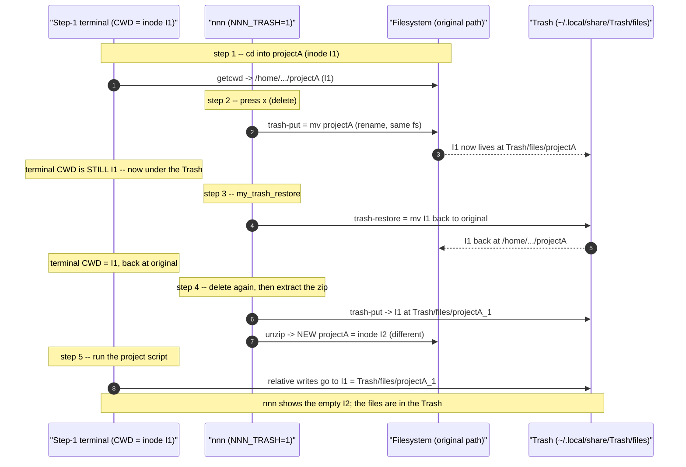

### 1.6 Why `pwd -P` "looked correct" (the key confusion)

The builtin `pwd -P` does **not** always call `getcwd()`. It canonicalises the
cached `$PWD` string and, if that path still names a valid directory, prints it.
After step 4 re-creates `projectA`, `$PWD` (the original path) is valid again --
so the builtin prints the **original** path even though the real CWD is the
Trash. The external `/bin/pwd` (true `getcwd()`) tells the truth.

Reproduced directly (directory trashed, then re-created at the original path):

```
ASCII Table 1.6: What each "where am I" command reports vs. reality
+----------------------------+------------------------------------+-----------+
| Command                    | Output                             | Truthful? |
+----------------------------+------------------------------------+-----------+
| $PWD                       | /home/.../projectA  (original)     | no (stale)|
| builtin pwd -P             | /home/.../projectA  (original)     | NO  <-- the
|                            |                                    | misleading|
|                            |                                    | clue      |
| /bin/pwd  (real getcwd)    | /home/.../Trash/files/projectA     | YES       |
| stat -c %i .  (CWD inode)  | I1 (the trashed inode)             | YES       |
| stat -c %i $PWD            | I2 (the new, different directory)  | YES       |
| touch newfile -> lands in  | /home/.../Trash/files/projectA     | reality   |
+----------------------------+------------------------------------+-----------+
```

The inode mismatch -- `stat .` (I1) != `stat $PWD` (I2) -- is the reliable,
symlink-safe signal that the working directory has been displaced. The fix in
1.10 keys off exactly this.

### 1.7 Why the files were in `projectA_1` (the `_1` suffix)

`trash-put` avoids name collisions in the Trash by appending `_1`, `_2`, ... When
`projectA` was trashed the second time (step 4), a `projectA` already existed in
the Trash (from earlier delete/restore cycles that were not fully emptied), so
the inode `I1` was stored as `projectA_1`. The suffix is **incidental** -- the
terminal follows `I1` to whatever name it currently has in the Trash.

### 1.8 Minimal reproduction

This reproduces the whole effect with plain `mv` (no nnn/trash-cli needed),
proving it is generic Unix behaviour. Run it with `bash script.sh` (a script,
not your interactive shell, so the `cd` is the real builtin):

```sh
R=/tmp/cwd_repro; rm -rf "$R"; mkdir -p "$R/trash"
mkdir -p "$R/projectA"; cd "$R/projectA"
mv "$R/projectA" "$R/trash/projectA"     # "trash" it (move)
mkdir "$R/projectA"                       # "extract the zip again" (new inode)

echo "builtin pwd -P : $(pwd -P)"         # -> $R/projectA   (looks fine!)
echo "/bin/pwd       : $(/bin/pwd)"       # -> $R/trash/projectA  (the truth)
touch created_here
ls "$R/projectA"        # empty  -- what nnn shows
ls "$R/trash/projectA"  # created_here  -- where the write actually went
```

### 1.9 Is this a bug in nnn / the plugin / the config?

No. Every component behaves correctly:

```
ASCII Table 1.9: Responsibility analysis
+----------------------+------------------------------------------------------+
| Component            | Verdict                                              |
+----------------------+------------------------------------------------------+
| nnn + NNN_TRASH=1    | Correct: routes delete to trash-put as configured.   |
| trash-put / restore  | Correct: a same-fs trash is a move (rename) by design.|
| my_trash_restore     | Correct: restores the inode to its original path.    |
| The terminal shell   | Correct per POSIX: CWD is an inode handle that        |
|                      | follows a rename.                                     |
+----------------------+------------------------------------------------------+
```

The surprise is the *interaction*: a long-lived terminal sitting inside a
directory that gets trashed. nnn cannot know about, or fix, an unrelated
terminal's working directory. The right place to handle it is the **shell**.

### 1.10 Solution -- the `cwd-guard` prompt hook

Install a tiny hook that runs **before every prompt**, compares the inode the
shell is really in against the inode `$PWD` names, and -- on a mismatch --
**warns** and (by default) **re-attaches** to `$PWD`.

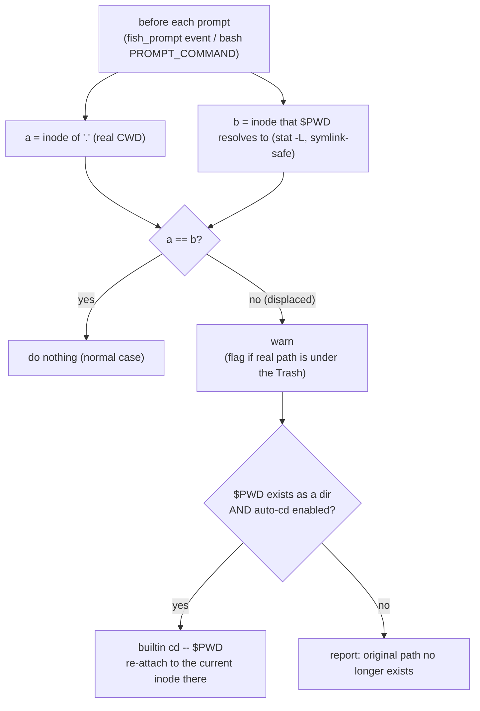

Why this is safe and correct:

- It only acts on a genuine **inode mismatch**, so normal navigation and
  symlinked directories never trigger it (`stat -L` resolves `$PWD` the same way
  the kernel resolved your `cd`).
- Re-attaching is just `cd "$PWD"`: it re-resolves the *logical* path string to
  whatever inode is there **now** (the re-extracted `I2`), fixing the terminal.
- If the path is gone (trashed, not re-created), it cannot re-attach and instead
  tells you your directory no longer exists.

#### What was installed, and where

```
ASCII Table 1.10: Installed fixes (this machine uses fish as the main shell)
+--------------------------------------------------+------------------------------+
| File                                             | Role                         |
+--------------------------------------------------+------------------------------+
| ~/.config/fish/conf.d/nnn_cwd_guard.fish         | fish guard, runs on the      |
|   (function __nnn_cwd_guard --on-event           | fish_prompt event. PRIMARY   |
|    fish_prompt)                                   | fix for the main shell.      |
| ~/.dotfiles/nnn/nnn_config.sh  (appended block)  | bash guard via PROMPT_COMMAND|
|   installed only in INTERACTIVE bash, so it is a  | for bash sessions. No-op when|
|   no-op when fish loads the file via `bass`.      | imported through `bass`.     |
+--------------------------------------------------+------------------------------+
```

Both read the same toggles:

```
ASCII Table 1.10b: Toggles (set in fish with `set -Ux`, in bash with `export`)
+--------------------------+-------------------------------------------------+
| Variable                 | Effect                                          |
+--------------------------+-------------------------------------------------+
| NNN_CWD_GUARD=0          | disable the guard entirely                      |
| NNN_CWD_GUARD_AUTOCD=0   | warn only -- do NOT auto re-attach              |
| (unset / default)        | enabled, with auto re-attach                    |
+--------------------------+-------------------------------------------------+
```

The fish function (installed file):

```fish
function __nnn_cwd_guard --on-event fish_prompt \
        --description 'Detect/repair a working directory displaced into the Trash'
    test "$NNN_CWD_GUARD" = 0; and return
    set -l cur (command stat -c '%d:%i' -- . 2>/dev/null)
    test -n "$cur"; or return
    set -l logical (command stat -Lc '%d:%i' -- "$PWD" 2>/dev/null)
    test "$cur" = "$logical"; and return            # CWD matches $PWD -> done
    set -l here (env pwd -P 2>/dev/null)            # real getcwd, not builtin
    switch "$here"
        case "*/.local/share/Trash/*" "*/.Trash-*/*"
            echo "[cwd-guard] Warning: this shell is physically inside the Trash:" >&2
            echo "            $here" >&2
        case "*"
            echo "[cwd-guard] Warning: working directory was moved/replaced under this shell (real: $here)" >&2
    end
    if test -d "$PWD"; and test "$NNN_CWD_GUARD_AUTOCD" != 0
        builtin cd -- "$PWD" 2>/dev/null; and echo "[cwd-guard] re-attached to $PWD" >&2
    else if not test -d "$PWD"
        echo "[cwd-guard] its original path no longer exists: $PWD" >&2
    end
end
```

#### Immediate manual remedy (no hook)

If you ever notice the symptom, in the affected terminal run:

```sh
cd "$PWD"        # re-resolves the logical path to the current inode there
# or:
cd ..; cd projectA
```

Note: `cd .` does **not** help -- `.` is the (trashed) inode you are already on.
You must re-resolve the **path string**.

#### Prevention habits

- After restoring or re-extracting a directory you have terminals sitting in,
  re-enter it in those terminals (`cd "$PWD"`).
- Prefer not to keep a terminal parked inside a directory you are about to
  delete/recreate from nnn; or rely on the guard above to repair it.

### 1.11 Secondary finding -- `trash-cli` version vs. `my_trash_restore`

This machine has **`trash-cli 0.17.1.14`**, but
[plugins/my_trash_restore](../plugins/my_trash_restore) documents itself as
needing **`>= ~0.22`** for the comma-separated **multi**-restore
(`trash-restore` accepting `1,3,5`). On 0.17:

- **Single** restore (pick one item) works -- this is the path used in the
  reported steps.
- **Multi**-select restore may be rejected as an invalid index. If multi-restore
  is needed, upgrade trash-cli (e.g. `pipx install trash-cli`) or restore one
  item at a time.

This is unrelated to Problem 1, but worth recording since the plugin and the
installed tool version disagree.

### 1.12 Verification

```
ASCII Table 1.12: Tests run while fixing this (all passing)
+------------------------------------------+----------------------------------+
| Case                                     | Result                           |
+------------------------------------------+----------------------------------+
| Normal directory                         | guard does NOT trigger           |
| Symlinked directory                      | guard does NOT trigger           |
| Trashed then re-created (the bug)        | warns + auto re-attaches to the  |
|                                          | new inode; files then land in    |
|                                          | the real directory               |
| Trashed and NOT re-created               | warns "original path gone"       |
| fish: emit fish_prompt after displacement| re-attaches (event hook fires)   |
| bash: PROMPT_COMMAND after displacement  | re-attaches in the main shell    |
| fish `bass source nnn_config.sh`         | imports env only; bash guard is  |
|                                          | NOT installed (no interference)  |
+------------------------------------------+----------------------------------+
```

---

## Problem 2 -- Native drag-and-drop from nnn never produced a drag (garbled OSC, EPERM, no icon)

### 2.1 Symptom (as reported)

Adding kitty's OSC-72 drag-and-drop to nnn so a file could be dragged onto a GUI
app (browser upload box, chat window, file manager). Early attempts failed in
several distinct ways across iterations:

- Pressing a "start drag" key and then mouse-dragging printed a garbled OSC
  string and `EPERM` into the pane, leaving an empty `tabbed-0.6 ::` window.
- Just mouse-dragging (no key) produced the same empty window.
- Later, the `1 file(s)` drag icon appeared but the drag was rejected with
  `error while decoding base64 pre-sent data`.
- Later still, the icon appeared but on release the drag was **canceled**
  (`t=e:x=4:y=1`) and the icon lingered; releasing on another app did nothing.

### 2.2 TL;DR root cause

kitty's OSC-72 drag-and-drop ([kitty >= 0.47.1](https://sw.kovidgoyal.net/kitty/))
is **mouse-gesture-driven and bidirectional**, not a fire-once escape. The app
declares itself a drag source **once** (EnableDrag); the **terminal** detects the
mouse gesture and sends the app an inbound offer, which the app answers. Five
independent mistakes each broke a different stage of that handshake:

```
ASCII Table 2.2: The five drag-OUT bugs, each at a different protocol stage
+---+--------------------------------+--------------------------------------+----------+
| # | Mistake                        | Effect                               | Commit   |
+---+--------------------------------+--------------------------------------+----------+
| 1 | Emitted the whole drag on a    | Wrong model -- garbage + EPERM. The  | e6d29667 |
|   | keypress                       | terminal drives the gesture, not us. |          |
| 2 | Wrote agree/present/start as   | Interleaved bytes corrupt the drag-  | 107259f8 |
|   | separate writes                | source "build" -> rejected.          |          |
| 3 | Emitted PADDED base64 ("=")    | kitty's decoder is unpadded (like    | db1dc51e |
|   |                                | Yazi); "error decoding base64".      |          |
| 4 | Advertised the hostname as the | kitty treats the drag as REMOTE and  | 555042a9 |
|   | machine-id                     | asks for file CONTENTS (t=k) we do   |          |
|   |                                | not serve -> drag canceled.          |          |
| 5 | No drag icon                   | Worked, but no visual feedback.      | 7361258a |
+---+--------------------------------+--------------------------------------+----------+
```

It is **opt-in** via `NNN_DND_OSC72=1` because enabling it changes the terminal's
mouse-gesture handling.

### 2.3 Background -- why a terminal program cannot "just drag" a file

A GUI drag is an X11/Wayland protocol (XDND) between **windows**. nnn is a
pty-bound process: it has no drawing surface the display server can address, and
no X connection. Everything it can do flows as bytes through the pty. Two ways
out exist: (a) spawn a helper GUI window that owns the real XDND drag (Approach
B, the `nnn-dnd` libX11 helper -- see the brainstorm doc), or (b) ask a
**protocol-aware terminal** to perform the drag on the app's behalf. kitty's
OSC-72 is option (b), and the only one that also works over SSH and inside tmux
(for the drag-OUT direction).

### 2.4 The protocol (drag-OUT direction)

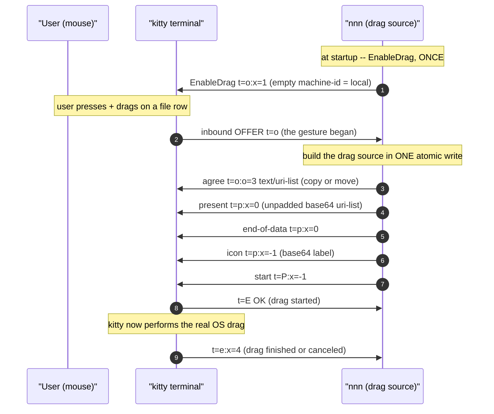

```
ASCII Table 2.4: OSC-72 metadata used by the drag-OUT path (all under "OSC 72 ;")
+-----------------+------------------------------------------------------------+
| Field           | Meaning                                                    |
+-----------------+------------------------------------------------------------+
| t=o:x=1;<id>    | EnableDrag. Empty <id> => LOCAL drag (kitty hands the drop |
|                 | target the file:// path; no t=k contents request).         |
| t=o (inbound)   | The terminal's OFFER: a drag gesture was detected.         |
| t=o:o=3;<mime>  | Agree-drag, operation 3 = copy-or-move, offering <mime>.   |
| t=p:x=0:m=N;..  | Present data for MIME index 0, chunked (m=1 => more).      |
| t=p:x=-1:...    | The drag icon (a small UTF-8 label, base64).               |
| t=P:x=-1        | Start the drag.                                            |
| t=e:x=N         | Status: x=4 finished, x=5 data requested (local: none).    |
| t=E;OK / EINVAL | Result: OK = started; otherwise an error string.           |
+-----------------+------------------------------------------------------------+
```

### 2.5 The base64 and machine-id findings (the two subtle ones)

- **Unpadded base64.** kitty decodes the pre-sent payload with an unpadded
  alphabet (matching Yazi's `BASE64_SANE`, `with_encode_padding(false)`). nnn's
  encoder originally appended `=`/`==`. The fix drops the padding entirely
  ([dnd_b64, src/nnn.c:3683](../src/nnn.c#L3683)). Verified by capturing the
  emitted bytes: `...eHQNCg` (no trailing `=`).
- **Empty machine-id = local.** EnableDrag may carry a machine-id so the
  terminal can tell a local drag from a remote (SSH) one. If nnn advertised the
  real hostname, kitty assumed the file lived on a *different* machine and asked
  nnn to stream the file **contents** via a `t=k` request; nnn only serves the
  `file://` path, so the drag stalled and was canceled. Sending an **empty**
  machine-id (exactly Yazi's `EnableDrag("")`) makes kitty treat it as local and
  use the path directly ([dnd_osc72_enable, src/nnn.c:4228](../src/nnn.c#L4228)).

### 2.6 Diagnostic technique

Because there is no kitty+mouse in the dev environment, the emitted bytes were
captured by feeding nnn a *simulated* inbound offer and logging exactly what it
wrote (ESC rendered as `\e`):

```sh
tmux send-keys -t SESS -l $'\e]72;t=o:x=10:y=5\e\\'   # fake the terminal's offer
# then inspect /tmp/nnn-dnd.log for the "out: ..." lines and base64-decode them
```

This made the padded-base64 and machine-id bugs visible without a real drag.
The file-based debug log (`NNN_DND_DEBUG=/tmp/nnn-dnd.log`, or `=1` for that
default path) never corrupts the curses screen.

### 2.7 Solution summary

nnn declares itself a drag source once at `browse()` start, parses inbound
OSC-72 events out of the input stream in `nextsel()`, and answers an offer with
one atomic, unpadded, empty-machine-id batch plus a text icon. Opt-in via
`NNN_DND_OSC72=1`; inside tmux it additionally needs `set -g allow-passthrough
on` so the outbound escapes reach kitty. Confirmed working: the `N file(s)` icon
appears and dropping on an external target delivers the file.

---

## Problem 3 -- Drag stops working after opening a file (and never recovers)

### 3.1 Symptom

After dragging worked, opening any file with the configured opener and then
returning to nnn left drag-and-drop **dead**: the `N file(s)` icon never appeared
again until nnn was restarted.

### 3.2 Root cause

Opening a file runs a **curses-suspending** subprocess. nnn calls
`exitcurses()` (= `endwin()`) before the child and `refresh()` after. That
terminal reset makes kitty **forget nnn is a drag source** -- the EnableDrag
registration is dropped. Because nnn's `g_dnd_on` flag stayed `TRUE`, the
one-shot `dnd_osc72_enable()` never re-sent EnableDrag.

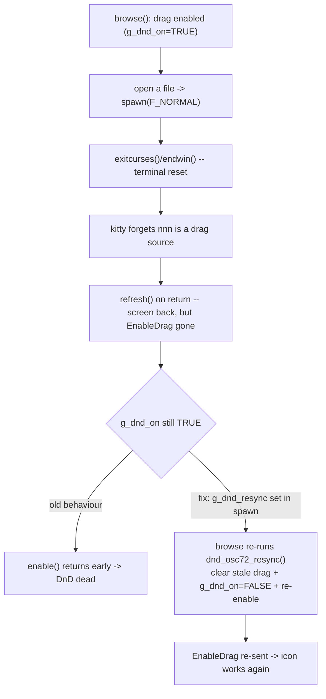

### 3.3 Solution

A `g_dnd_resync` flag ([src/nnn.c:2646](../src/nnn.c#L2646)) is set in `spawn()`
right after the `F_NORMAL` `refresh()`. On its next iteration `browse()` (before
reading input) calls `dnd_osc72_resync()` ([src/nnn.c:4272](../src/nnn.c#L4272)),
which drops any half-built drag and re-sends EnableDrag. No-op unless
`NNN_DND_OSC72` is enabled. Commit `f4d75e81`.

---

## Problem 4 -- Dragging across a tmux pane border resizes the panes

### 4.1 Symptom

With the dual-pane tmux layout (`start_dual_nnn.sh`), dragging a file whose path
crossed the tmux pane separator made tmux **resize** the panes instead of
continuing the drag.

### 4.2 Root cause

nnn's `mousemask` subscribes only to **button-press** events, not motion. tmux,
with `mouse on`, independently grabs pointer **motion** for its own pane-border
drag-to-resize. nnn cannot suppress that through its own mouse mask -- the two
mouse consumers are layered (kitty -> tmux -> nnn).

### 4.3 Solution

For the duration of an in-flight drag, turn tmux's mouse off and restore it when
the drag ends:

```
ASCII Table 4.3: tmux-mouse toggle lifecycle (src/nnn.c:3633)
+----------------------------+-------------------------------------------------+
| Event                      | Action                                          |
+----------------------------+-------------------------------------------------+
| drag goes in flight        | spawn "tmux set -g mouse off" (F_NOWAIT --      |
| (offer answered)           | no curses suspend), set g_dnd_tmux_grabbed.     |
| any drag-end path          | dnd_clear_data() -> dnd_release_tmux_mouse() -> |
| (finish/error/disable)     | "tmux set -g mouse on".                          |
| abnormal end / subprocess  | the resync (Problem 3) also releases the mouse, |
|                            | so it can never be left disabled.               |
+----------------------------+-------------------------------------------------+
```

`F_NOWAIT` is essential: it forks without `endwin()`, so the toggle is safe
mid-gesture. No-op outside tmux. Commit `96e4b092`.

---

## Problem 5 -- Dropping files INTO nnn from another app typed "strange key sequences"

### 5.1 Symptom

Dragging files from a GUI file manager and dropping them onto the nnn pane
dumped the file paths into nnn as if typed, triggering random keybindings,
instead of importing the files.

### 5.2 Root cause

nnn never *claimed* the drop, so kitty fell back to its default: **paste the
dropped paths as text**. With bracketed paste off (nnn's default), those bytes
arrived as raw keystrokes.

### 5.3 The tmux routing constraint (why two mechanisms are needed)

```
ASCII Table 5.3: Where each drop-IN mechanism works
+--------------------------+-------------------+----------------------------------+
| Mechanism                | Works in tmux?    | Notes                            |
+--------------------------+-------------------+----------------------------------+
| Native OSC-72 EnableDrop | NO                | tmux does not route the inbound  |
| (structured drop)        |                   | drop events (t=m/t=M/t=r) to the |
|                          |                   | pane. Worse: announcing it via   |
|                          |                   | passthrough makes kitty STOP     |
|                          |                   | pasting, so the drop vanishes.   |
| Bracketed-paste capture  | YES               | kitty wraps the drop-paste in    |
|                          |                   | ESC[200~..ESC[201~, which tmux   |
|                          |                   | forwards. Portable.              |
+--------------------------+-------------------+----------------------------------+
```

So nnn enables **EnableDrop only outside tmux**, and the **bracketed-paste
fallback always**.

### 5.4 Solution

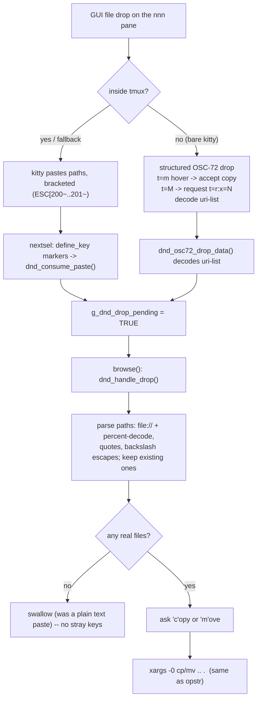

Key pieces:

- Bracketed paste is enabled (`ESC[?2004h`) when `NNN_DND_OSC72` is set, and the
  paste markers are registered with `define_key()` so ncurses surfaces them as
  single keycodes (`KEY_DND_PASTE_START/END`,
  [src/nnn.c:3613](../src/nnn.c#L3613)).
- `dnd_handle_drop()` ([src/nnn.c:4338](../src/nnn.c#L4338)) parses paths
  robustly (newline/space separated, quotes, backslash escapes, `file://` URIs
  with percent-decoding), keeps only existing paths, asks copy/move via
  `get_input(messages[MSG_CP_MV_AS])`, then reuses the exact NUL-separated
  `xargs -0 ... cp/mv ... .` command `opstr()` uses for selection copy.
- A paste with **no** existing paths is silently swallowed -- so a plain text
  paste no longer leaks as keystrokes either.

Commits `b12851d8` (bracketed-paste path), `b0416e90` (native OSC-72 drop).

---

## Problem 6 -- A file dropped into nnn does not bring its window to the front

### 6.1 Symptom

After dropping files onto the nnn window from another app, focus stays on the
source app; the user must Alt+Tab to nnn.

### 6.2 Root cause -- a pty program cannot focus its own window

This is a hard ceiling, not a missing feature:

- kitty implements **no** window-manipulation escape (XTWINOPS `CSI 5 t` is a
  no-op in kitty), by design.
- X11 input focus is an EWMH client message (`_NET_ACTIVE_WINDOW`) that needs a
  **display connection** -- which a pty app does not have (the whole reason
  OSC-72 exists).
- Window managers deliberately prevent apps from stealing focus.

### 6.3 Solution (best effort, honest about the limit)

On a real drop, `dnd_focus_window()` ([src/nnn.c:4322](../src/nnn.c#L4322)):

1. emits **BEL**, which makes kitty set the window **urgency hint** (taskbar/dock
   flash) -- always works;
2. runs `kitten @ focus-window`, which *actually* focuses the window **only if**
   kitty remote control is enabled (`allow_remote_control yes`).

Both are no-ops/ignored otherwise. True focus-switching depends on kitty remote
control being reachable; the flash is the reliable fallback. Commit `daca7d3a`.

---

## Problem 7 -- Dropping a drag back onto nnn's own pane opened the `>>>` prompt and leaked OSC bytes

This was the hardest bug; it took three iterations and a direct read of the live
debug log to pin down. It is worth recording the full investigation because two
plausible-but-wrong theories preceded the real cause.

### 7.1 Symptom (evolved across fixes)

1. First report: dropping a drag on nnn's own window **opened the file** (the
   nuke opener), and afterwards DnD was dead.
2. After a click fix: the file no longer opened, but the pane showed
   `>>> 72;t=e:x=4:y=0` and pressing Enter produced
   `fish: Unsupported use of '='. ... 'set t e:x=4:y=0'`.

### 7.2 Investigation -- two wrong theories, then the log

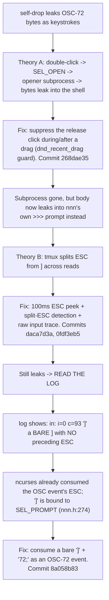

### 7.3 Root cause (confirmed from the log)

The decisive log line was:

```
in: i=0 c=93 ']'
```

`i=0` means `get_wch()` returned a *regular character* (not `KEY_CODE_YES`),
`c=93` is `]`. So nnn read a **bare `]` with no preceding ESC** -- ncurses had
already swallowed the leading ESC of the inbound OSC-72 event
(`ESC ] 72 ; t=e:x=4 ... ST`). And in
[src/nnn.h:274](../src/nnn.h#L274), `]` is bound to **`SEL_PROMPT`**:

```
{ ']', SEL_PROMPT },
```

So the chain was: lost ESC -> bare `]` -> `SEL_PROMPT` opens the `>>> ` prompt
-> the following `72;t=e:x=4:y=0` body is typed straight into it. Pressing Enter
sent that line to the shell (fish), producing the `'='` errors. The two earlier
fixes could not catch it because both keyed off an ESC that was no longer there.

### 7.4 Why the earlier theories were not the whole story

- **Theory A (double-click open) was real but secondary.** A self-drop does
  generate two `BUTTON1_PRESSED` on the same row within the double-click window,
  which nnn read as a double-click -> `SEL_OPEN` -> opener. Suppressing that
  (the `dnd_recent_drag()` guard, [src/nnn.c:3654](../src/nnn.c#L3654)) was
  correct and is kept -- it stops the file opening and the phantom re-drag -- but
  it only moved the leak from "into the shell" to "into the `>>>` prompt".
- **Theory B (split ESC) was plausible but not the cause.** The log proved the
  ESC was *gone*, not merely delayed, so a longer peek could never help.

### 7.5 Solution

When a drag source is active, a **bare `]`** (read as a normal key) whose next
byte begins the OSC body (`7` of `72;`) is consumed as an OSC-72 event instead
of opening the prompt; a genuine `]` keypress (no OSC body following) still falls
through to `SEL_PROMPT`. See the `nextsel()` guard around
[src/nnn.c:4493](../src/nnn.c#L4493). Commit `8a058b83`.

```
ASCII Table 7.5: The three inbound-OSC entry points nnn now handles
+--------------------------------+-----------------------------------------------+
| What nnn reads                 | Handling                                      |
+--------------------------------+-----------------------------------------------+
| ESC then ']' (same read)       | ESC handler peeks ']' -> dnd_osc72_consume()  |
| ESC alone, then ']' (split)    | 100ms peek catches the late ']' (kept)        |
| bare ']' (ESC already eaten)   | peek '7' of "72;" -> dnd_osc72_consume()      |
|                                | (the real fix for the self-drop leak)         |
+--------------------------------+-----------------------------------------------+
```

### 7.6 Diagnostic lesson

The breakthrough was reading `/tmp/nnn-dnd.log` directly instead of reasoning
about terminal timing. The temporary raw-input trace (`in:`/`esc-peek:` lines,
gated on `NNN_DND_DEBUG`) turned an invisible byte stream into evidence; it was
removed once the cause was confirmed. When a terminal-interaction bug resists
two reasoned fixes, **capture the actual bytes** before guessing a third time.

---

## Problem 8 -- A freshly started nnn dies with "Too many open files"

### 8.1 Symptom

During DnD testing, launching a new nnn instance printed `<line>: Too many open
files` and exited immediately, even though `ulimit -n` was high (100000).

### 8.2 Root cause

The exhausted limit was **`fs.inotify.max_user_instances`** (default 128), not
the file-descriptor limit. Long-running apps (VS Code, Teams, a JVM) had
consumed all per-user inotify instances. nnn calls `inotify_init1()` at startup
([src/nnn.c:11271](../src/nnn.c#L11271)) and treats failure as **fatal**
(`return EXIT_FAILURE`), so it cannot start when the cap is hit. `EMFILE` from
`inotify_init1` is reported as "Too many open files", which misleadingly points
at file descriptors.

### 8.3 Solution

Raise the per-user inotify instance cap (not an nnn bug):

```sh
sudo sysctl -w fs.inotify.max_user_instances=512
# persist:
echo 'fs.inotify.max_user_instances=512' | sudo tee /etc/sysctl.d/40-inotify.conf
```

### 8.4 Note

This is a common developer-machine condition (VS Code's docs recommend raising
the same limit). It is unrelated to the DnD feature but blocked testing it, so
it is recorded here.

### 8.5 Recurrence -- 2026-07-31, and why 128 is too low on this machine

The same failure hit again while live-testing the icon and status-bar fixes in
Problems 10 and 11 below: a brand-new throwaway `nnn` instance exited
immediately with `12364: Too many open files` (the line number matches
[src/nnn.c:12364](../src/nnn.c#L12364), confirming the exact same
`inotify_init1()` call as 8.2).

**Fact:** a live count on this machine at the time of the recurrence:

```sh
cat /proc/sys/fs/inotify/max_user_instances   # 128
find /proc/*/fd -lname "anon_inode:inotify" 2>/dev/null | wc -l   # 178
```

> **Correction (added 2026-08-03, see Problem 14.4).** That second command counts
> **descriptors, not instances**, and it does not filter by UID -- while the cap
> is enforced **per UID** and charges a `fork()`ed or `dup()`ed descriptor
> **once**. So "178" is an *upper bound* on this user's instance usage, not a
> measurement of it, and comparing it directly against `128` is not sound (it is
> also why a number larger than the cap can appear at all). The conclusion below
> still holds -- the cap really was exhausted -- but the reliable way to
> establish that is to ask the kernel for an instance and see whether it says
> `EMFILE`; see 14.4 for the method and a ready-made script.

178 descriptors against a cap of 128. Per-process breakdown (descriptors,
processes) for every command holding more than one:

```
ASCII Table 8.5: inotify instances by process, 2026-07-31
+------------------+-----------+-----------+
| Command          | Instances | Processes |
+------------------+-----------+-----------+
| code-insiders    |        53 |        37 |
| claude           |        16 |         9 |
| Typora           |         9 |         5 |
| systemd          |         5 |         1 |
| nvim             |         5 |         5 |
| qlicense         |         4 |         4 |
| pet              |         4 |         4 |
| nnn              |         4 |         4 |
| cpptools-srv2    |         4 |         4 |
| cpptools         |         4 |         4 |
+------------------+-----------+-----------+
(remaining ~40 commands hold 1-3 instances each)
```

**Root cause, restated precisely:** `128` is the Linux kernel default for
`fs.inotify.max_user_instances`, set decades before editors, language
servers, and AI-assistant CLIs each opened their own file watcher per
window/workspace/session. One VS Code window alone (`code-insiders`, 37
worker/extension-host processes) accounts for 53 instances -- over 40% of the
default cap -- by itself, before any other app runs. On a desktop with an
editor, a couple of `claude` sessions, a note app, and normal desktop
services all open at once, exhausting 128 is the **expected**, not the
exceptional, case. Every subsequent program that calls `inotify_init()` --
`nnn` among them -- gets `EMFILE` and, for `nnn` specifically, cannot start
at all (8.2).

**Solution -- raise the cap, and raise it enough that this class of machine
does not hit it again:**

```sh
# transient (until reboot), test the new value:
sudo sysctl -w fs.inotify.max_user_instances=1024

# persist across reboots:
echo 'fs.inotify.max_user_instances=1024' | sudo tee /etc/sysctl.d/40-inotify.conf
sudo sysctl --system   # reload without rebooting
```

`Assumption`: 1024 is a generous multiple of the observed 178-instance
baseline (about 5.7x headroom) without approaching any practical resource
concern -- each inotify instance is a small kernel object, not a per-watch
cost. `1024` is also the value VS Code's own troubleshooting docs suggest
when the *watch* limit is being raised, applied here to the (separate)
*instance* limit for the same reason: normal multi-app desktop use grows
faster than a decades-old default anticipated.

While tuning it, also check the companion limit, which governs the number of
individual paths watched (not the number of watcher handles), since it can
be exhausted by the same class of apps for a different reason (usually a
`git`-tracked repo with a very large working tree):

```sh
cat /proc/sys/fs/inotify/max_user_watches   # 524288 on this machine, already generous
```

`Fact`: `max_user_watches` was NOT the problem here (524288, far from
exhausted) -- only `max_user_instances` was. Do not conflate the two when
diagnosing a similar report; `find /proc/*/fd -lname "anon_inode:inotify" |
wc -l` (used above) counts instances, not watches, and is the right first
check when `nnn` (or anything else) fails to start with an `EMFILE`-flavored
message.

**Verification:** `Not verified end-to-end after raising the sysctl` in this
session -- the recurrence was diagnosed and the fix identified, but the
sysctl was not actually changed on the user's machine (a system-wide kernel
tuning change, left for the user to apply and confirmed only by root cause
and precedent from 8.2/8.3, not by re-running the failing command after the
change).

> **Follow-up (2026-08-03):** the sysctl was **never applied**. Problem 14
> records the third recurrence, confirms `max_user_instances` was still at the
> kernel default `128` with no `/etc/sysctl.d/40-inotify.conf` on disk, and
> tracks the fix through to a measured result. See 14.10 for the process lesson.

---

## Problem 9 -- The tab-bar tint marked a tab that never made the selection, then stopped marking the one that did

The per-tab selection tint (commit `e8ce68a7`) got the wrong answer twice in a
row, and both times for the same underlying reason. The first fix (`cb5b9db4`)
removed one wrong answer and immediately produced its mirror image; the real fix
(`1bc07033`) replaced the mechanism. This entry records the whole arc, because
the second failure is only understandable as a consequence of the first fix.

### 9.1 Symptom (as reported)

**Bug A -- a foreign selection lit up a local tab.**

1. Only **tab 1 of the LEFT pane** had 2 selected files (confirmed by pressing
   `E`, which lists the selection).
2. Yet **tab 4 of the RIGHT pane** was highlighted red, as if it held a
   selection.
3. Tab 4 of the right pane had never had anything selected on it.

**Bug B -- after Bug A was fixed, the tint stopped appearing at all.** This one
appeared **only after** `cb5b9db4` landed; it did not exist before:

1. Select 2 files on **left tab 1**, switch the left pane to tab 2. Tab 1 turns
   red -- correct.
2. Now select 2 files on **right tab 2** and switch the right pane to tab 3.
3. The **left pane's tab 1 is no longer red**, even though pressing `E` in the
   left pane still lists all 4 files, the left pane's 2 among them.

### 9.2 TL;DR root cause

`g_selctxcount[]` was a **running counter**: incremented next to every
`++nselected` and decremented next to every `--nselected`. A counter holds only
numbers. It carries **no record of which paths those numbers refer to**.

The cross-instance sync (described in 9.3) **replaces the entire
selection buffer at once** with the file's contents. At that moment a running
counter cannot be repaired, because there is no way to tell which of the
incoming paths this instance had already attributed to one of its own tabs:

- Crediting the whole incoming list to the current tab is wrong -- that is
  **Bug A** (a tab gets credit for files another pane selected).
- Zeroing the whole tally is also wrong -- that is **Bug B** (the pane throws
  away its own still-valid attribution for paths it really did select).

Both answers are wrong because the question needs **per-path** information that
a counter does not have. The fix is to stop counting and start **deriving**:
record `<ctx><path>` for every path this instance selects, and rebuild the tally
by intersecting those records against the live buffer.

### 9.3 Background -- one selection file, two panes, eight tabs each

The setup is two nnn instances side by side in tmux (`~/bin/start_dual_nnn.sh`,
aliases `nnn_left` / `nnn_right`). `NNN_SEL` is **not** set, so both instances
use the same default selection file, `~/.config/nnn/.selection`. That sharing is
**deliberate**: it is what makes select-in-left / paste-in-right work. Each
instance additionally has 8 contexts ("tabs", keys `1`-`8`, `Tab` to cycle).

A selection therefore lives in two places at once:

```
ASCII Table 9.3a: The two selection stores
+---------------------------+---------------------------------------------------+
| Store                     | Properties                                        |
+---------------------------+---------------------------------------------------+
| In memory, PER PROCESS    | pselbuf (src/nnn.c:481), selbufpos (459) and      |
|                           | nselected (449). Every path is NUL-TERMINATED,    |
|                           | so selbufpos == sum(len_i) + N.                   |
| On disk at selpath,       | NUL-SEPARATED with NO trailing NUL: writesel() is |
| SHARED by both panes      | always called with selbufpos - 1, so N paths give |
|                           | N-1 NULs. Caveat: plugins/dragdrop:46 appends a   |
|                           | NUL after EVERY path, and main() writes selpath   |
|                           | directly in picker mode, bypassing writesel().    |
+---------------------------+---------------------------------------------------+
```

Two features landed just before this bug and are what make it possible at all:

- **`0a921705`** made `writesel()` ([src/nnn.c:1792](../src/nnn.c#L1792)) write a
  sibling temp file and `rename(2)` it over `selpath` (atomic for external
  readers), and added `readselfile()` ([src/nnn.c:2060](../src/nnn.c#L2060)) so
  pressing `E` in a pane with nothing selected locally **adopts** the on-disk
  selection and can edit it.
- **`4a45a97e`** added the live cross-instance sync: `syncselfile()`
  ([src/nnn.c:4806](../src/nnn.c#L4806)) polls `selpath` with one `stat(2)` at
  the top of the `browse()` loop ([src/nnn.c:10148](../src/nnn.c#L10148)) and
  replaces the local copy when the file changed.

**This is the key point for Problem 9:** before the sync existed, a pane only
ever held paths it had selected itself, so attributing the buffer to a local tab
was always right. The sync is what makes a **foreign** selection appear inside a
local buffer. This whole class of bug could only exist once that landed.

Finally, what the tally must answer:

```
ASCII Table 9.3b: What g_selctxcount[i] means
+--------------------------------+-----------------------------------------------+
| Question it must answer        | "How many CURRENTLY-selected paths did I      |
|                                | select while sitting on context i?"           |
+--------------------------------+-----------------------------------------------+
| Who is "I"                     | This process only. Another instance's tabs    |
|                                | are not addressable from here.                |
| What it drives                 | The context-bar tint in redraw()              |
|                                | (src/nnn.c:9800): a tab OTHER than the        |
|                                | current one lights up when it holds a         |
|                                | selection, so a selection left behind on      |
|                                | another tab is not forgotten.                 |
| What it must NOT do            | Claim a selection this instance never made.   |
+--------------------------------+-----------------------------------------------+
```

The tint itself is one branch in the context-bar loop
([src/nnn.c:9800](../src/nnn.c#L9800), the inline comment between the two lines
is elided here):

```c
else if (g_selctxcount[i] && (i != cfg.curctx))
        addch((i + '1') | (COLOR_PAIR(C_UND) | A_BOLD | A_UNDERLINE));
```

No extra character is printed: the loop emits exactly 2 columns per context, and
`MIN_DISPLAY_COL` (`CTX_MAX * 2`, [src/nnn.c:246](../src/nnn.c#L246)) hardcodes that
budget for the path string drawn right after it. `COLOR_PAIR(C_UND + 1)` was
tried first (mirroring the `+1` convention used for icon coloring) but collides
with the icon-color pair table in this icon-enabled build and renders
black-on-black; `COLOR_PAIR(C_UND)` is the pair `init_fcolors()` assigns to
`C_UND` and renders visibly red.

### 9.4 Bug A mechanism -- the adopting pane credited its own current tab

Both adopt paths (`readselfile()` on `E`, and `syncselfile()` on the poll)
originally ended with the equivalent of
`g_selctxcount[cfg.curctx] = nselected`. `cfg.curctx` is the context the
**adopting** instance happens to be sitting on, which has nothing to do with
where the paths were selected.

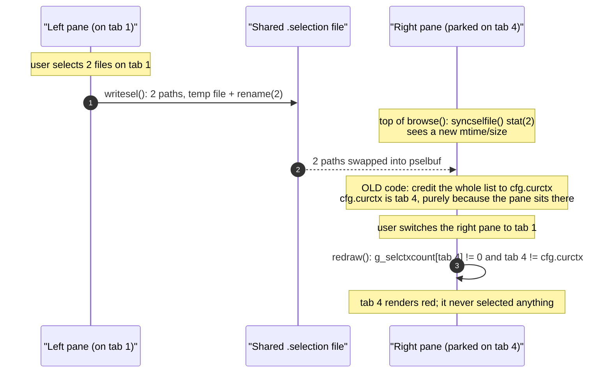

```
ASCII Table 9.4: Components in the Bug A path
+----------------------+--------------------------------------------------------+
| Component            | Role in the failure                                    |
+----------------------+--------------------------------------------------------+
| writesel()           | Publishes the left pane's 2 paths to the shared file.  |
| (src/nnn.c:1792)     | Correct; not implicated.                               |
| syncselfile()        | Notices the file changed and swaps pselbuf. Correct;   |
| (src/nnn.c:4806)     | the swap itself is exactly the intended feature.       |
| cfg.curctx           | The ADOPTING pane's current tab. Used as the           |
|                      | attribution target. THIS is the wrong part.            |
| g_selctxcount[]      | Receives the credit and has no way to know it is wrong.|
| redraw()             | Faithfully tints whatever the tally says.              |
| (src/nnn.c:9800)     |                                                        |
+----------------------+--------------------------------------------------------+
```

`cb5b9db4` fixed exactly this by **zeroing** the tally on both adopt paths
instead of crediting the current context, plus attributing an `E` edit to the
current context only when the buffer had not been adopted. That removed the
false claim. It also set up the next failure.

### 9.5 Bug B mechanism -- zeroing on adopt discarded the pane's OWN attribution

The shared file holds the **union** of what every instance selected. So when the
right pane appends its 2 paths, the left pane's next poll adopts a 4-path list
that **still contains the left pane's own 2 paths**. Zeroing on adopt threw away
attribution that was still perfectly valid.

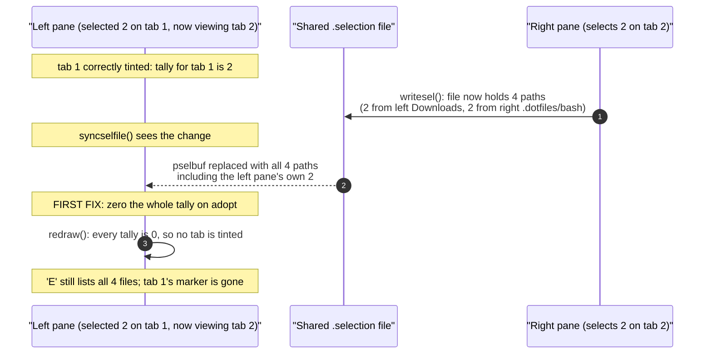

```
ASCII Table 9.5: Components in the Bug B path
+----------------------+--------------------------------------------------------+
| Component            | Role in the failure                                    |
+----------------------+--------------------------------------------------------+
| Shared selpath       | Holds the UNION of both panes' selections, so an       |
|                      | incoming list normally contains local paths too.       |
| syncselfile()        | Replaces the whole buffer. Correct.                    |
| The cb5b9db4 zeroing | Treats "the buffer was replaced" as "I own none of     |
|                      | it". True for foreign paths, FALSE for the local ones. |
| g_selctxcount[]      | Loses information it cannot reconstruct, because it    |
|                      | never held path identities in the first place.         |
| nselected            | Unaffected, which is why the status-bar count and 'E'  |
|                      | kept showing all 4 files while no tab was tinted.      |
+----------------------+--------------------------------------------------------+
```

**The deeper cause, common to both bugs.** After a whole-buffer replace, the
only sound question is "which of these incoming paths did I select, and where?".
A running counter cannot answer it, so every possible repair is a guess:

```
ASCII Table 9.5b: Why every counter-based repair on adopt is wrong
+---------------------------+------------------------+-------------------------+
| Repair on adopt           | Foreign paths          | Local paths in the list |
+---------------------------+------------------------+-------------------------+
| Credit cfg.curctx         | WRONG (Bug A: tints a  | wrong tab if the pane   |
|                           | tab that never chose   | moved since selecting   |
|                           | them)                  |                         |
| Zero the tally            | correct (no tab)       | WRONG (Bug B: loses a   |
|                           |                        | valid marker)           |
| Per-path ownership        | correct (no record ->  | correct (record ->      |
| (the fix)                 | no tab)                | original tab)           |
+---------------------------+------------------------+-------------------------+
```

### 9.6 How both were diagnosed

Both followed the same two-step pattern: confirm against the **live** instances
first, then reproduce **deterministically** in isolation.

```
ASCII Table 9.6: Diagnosis steps
+-------+-------------------------------+----------------------------------------+
| Bug   | Live confirmation             | Deterministic reproduction             |
+-------+-------------------------------+----------------------------------------+
| A     | Both panes confirmed running  | In an ISOLATED tmux server: park the   |
|       | with no NNN_SEL override, so  | right pane on tab 4, select 2 files on |
|       | one shared file. The shared   | left tab 1, switch the right pane to   |
|       | file confirmed to hold        | tab 1. The right pane's tab 4 then     |
|       | exactly the 2 entries.        | renders with SGR 38;5;196 (red).       |
| B     | The shared file confirmed to  | Same isolated server: the reported     |
|       | hold 4 entries -- the first 2 | sequence (left tab 1 selects, left     |
|       | from the left pane's          | switches to tab 2, right tab 2         |
|       | Downloads, the last 2 from    | selects, right switches to tab 3)      |
|       | the right pane's              | drops the left pane's tab 1 marker.    |
|       | .dotfiles/bash.               |                                        |
+-------+-------------------------------+----------------------------------------+
```

The live-instance step mattered: it ruled out "the two panes are not actually
sharing a file" and "the file does not contain what the user thinks", which are
the two cheap explanations. Only after the file contents matched the report did
the attribution logic become the suspect.

### 9.7 Solution -- derived per-path ownership (`1bc07033`, the current design)

Stop maintaining the tally incrementally. Record **which paths this instance
selected and on which tab**, and rebuild the tally on demand by intersecting
those records with the live `pselbuf`.

```
ASCII Table 9.7a: State (src/nnn.c:450-453)
+-----------------------------------+-------------------------------------------+
| Declaration                       | Meaning                                   |
+-----------------------------------+-------------------------------------------+
| uint16_t g_selctxcount[CTX_MAX]   | Per-context tally. DERIVED, never         |
|                                   | incrementally maintained.                 |
| char *g_selown                    | Records "<ctx byte><path>\0" for every    |
|                                   | path THIS instance selected. Advisory: no |
|                                   | file operation ever consumes it.          |
| uint_t g_selownpos, g_selownlen   | Used length and allocated length.         |
| bool g_selctxdirty                | The tally needs recomputing before read.  |
+-----------------------------------+-------------------------------------------+
```

```
ASCII Table 9.7b: Helper functions
+-------------------------+---------+-------------------------------------------+
| Function                | Line    | What it does                              |
+-------------------------+---------+-------------------------------------------+
| selown_inbuf(path)      | 1882    | Is path currently present in pselbuf?     |
| selown_del(path)        | 1899    | Forget any record for path, so a          |
|                         |         | re-select MOVES attribution to the new    |
|                         |         | context rather than duplicating it.       |
| selown_add(path)        | 1924    | selown_del() first (dedup), then record   |
|                         |         | "<cfg.curctx><path>" and mark dirty.      |
|                         |         | On allocation failure it degrades quietly |
|                         |         | to no-tint: the state is advisory, so it  |
|                         |         | must never abort.                         |
| selown_reset()          | 1946    | Drop all records and zero the tally.      |
| selown_recompute()      | 1955    | Rebuild g_selctxcount by intersecting     |
|                         |         | g_selown against the live pselbuf, and    |
|                         |         | COMPACT g_selown by dropping records      |
|                         |         | whose path is no longer selected (this is |
|                         |         | what keeps g_selown bounded).             |
+-------------------------+---------+-------------------------------------------+
```

```
ASCII Table 9.7c: Wiring
+--------------------------------+----------------------------------------------+
| Site                           | Action                                       |
+--------------------------------+----------------------------------------------+
| invertselbuf() 2nd pass (2283) | selown_add(): a path enters the selection    |
| addtoselbuf() (2329)           | selown_add()                                 |
| SEL_SEL toggle-on (10796)      | selown_add()                                 |
| startselection() (2113)        | selown_reset(): a new round discards the old |
|                                | records                                      |
| clearselection() (2126)        | selown_reset()                               |
| syncselfile() peer-cleared     | selown_reset(): nothing is selected anywhere |
| branch (4869)                  | now                                          |
| writesel() entry (1802)        | g_selctxdirty = TRUE. Every local selection  |
|                                | change funnels through writesel(), so this   |
|                                | one line covers them all generically.        |
| readselfile() (2092) and       | Set g_selctxdirty themselves (they do not    |
| syncselfile() adopt (4899)     | write) and deliberately KEEP g_selown.       |
| redraw() (9794-9795)           | selown_recompute(), only when dirty.         |
+--------------------------------+----------------------------------------------+
```

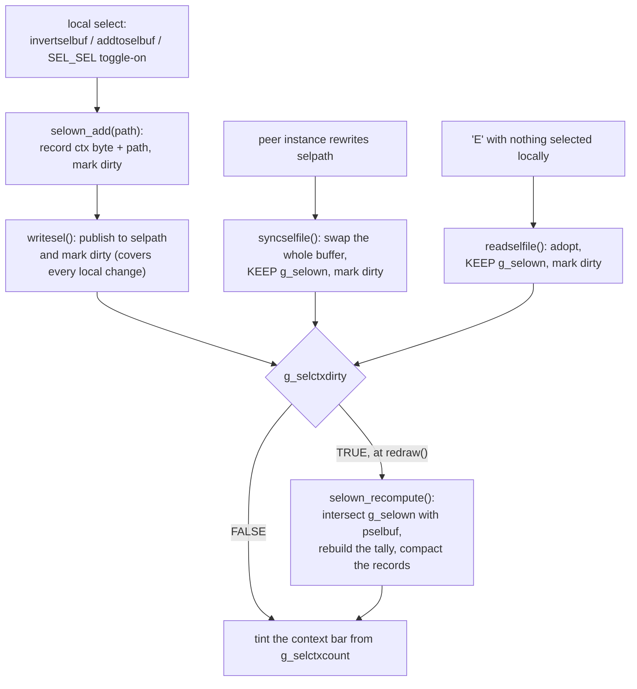

```
ASCII Table 9.7d: Nodes in the lifecycle diagram
+---------------------+---------------------------------------------------------+
| Node                | Responsibility                                          |
+---------------------+---------------------------------------------------------+
| selown_add()        | The ONLY place attribution is created. Records the      |
|                     | current context together with the path.                 |
| writesel()          | Generic invalidation point for every local change,      |
|                     | including removals, because all of them write the file. |
| syncselfile()       | Whole-buffer replace from a peer. Keeps ownership       |
|                     | records; they are re-matched, not re-guessed.           |
| readselfile()       | Same, for the 'E' adopt path.                           |
| selown_recompute()  | Rebuilds the tally and compacts the record buffer.      |
| redraw()            | The only reader. Recomputes lazily, only when dirty.    |
+---------------------+---------------------------------------------------------+
```

**Why removals need no handling.** There is no "remove" hook anywhere. A path
that leaves the selection simply **stops matching** `selown_inbuf()` during the
next recompute, so it contributes nothing to the tally and its record is dropped
from `g_selown` in the same pass. All the paired increments and decrements that
`e8ce68a7` had scattered next to every `nselected` mutation are gone.

**Why the tally cannot drift.** It is never carried forward. Every read is
preceded by a full rebuild from two sources of truth: `g_selown` (what this
instance chose) and `pselbuf` (what is actually selected right now). A
whole-buffer replace is therefore harmless -- it only sets a dirty flag. The
approximation `e8ce68a7` had to document (removals debited to the current
context rather than to the context that added the entry, self-healing only at
the next full reset) no longer exists.

**Why a foreign selection gets no tab.** A path that only ever existed in a
peer's list matches no record in `g_selown`, so it is attributed to no context.
`nselected` is untouched, so it still shows in the status-bar count and is still
fully usable. That is exactly the behaviour Bug A asked for, now obtained
without discarding local attribution (Bug B).

### 9.8 Verification

All checks below were run live in an **isolated tmux server**, not in the user's
own panes, and the user's `~/.config/nnn/.selection` was not touched.

```
ASCII Table 9.8: Checks after 1bc07033
+-------------------------------------------+-----------------------------------+
| Case                                      | Result                            |
+-------------------------------------------+-----------------------------------+
| Left tab 1 selects, right pane then        | left tab 1 KEEPS its marker      |
| selects into the shared list (Bug B repro) | (PASS)                           |
| Right pane selects on one tab              | marks that tab and no other      |
|                                            | (PASS)                           |
| Adopted selection (nothing selected        | marks NO tab, still reported in  |
| locally)                                   | the status-bar count (PASS)      |
| Deselecting the entries                    | marker clears (PASS)             |
| AddressSanitizer build driven through      | no reports                       |
| select-all, invert, cross-tab selects,     |                                  |
| mid-flight peer rewrites and peer clears   |                                  |
+-------------------------------------------+-----------------------------------+
```

Bug A's pre-fix reproduction (right pane parked on tab 4, left tab 1 selects 2
files, right pane switches to tab 1, right tab 4 renders `SGR 38;5;196`) was
also run in the same isolated server and is what pinned the attribution site.

### 9.9 Lesson

**Derived state beats incrementally-maintained state whenever something else can
replace the underlying data wholesale.**

An incremental counter is only correct while it sees **every** mutation. The
cross-instance sync introduced a mutation it fundamentally could not see the
details of: the entire buffer is swapped for a list produced by another process.
At that instant a counter has to guess, and both available guesses (credit the
current context, or zero everything) are wrong in a different case. Recording
enough information to **re-derive** the answer -- here, one context byte per
path -- turned an unfixable repair problem into a lazy recompute, removed every
paired increment/decrement in the file, and eliminated a documented
approximation at the same time.

The cost is bounded and cheap because the derived state is **advisory**: it only
drives a color, so it is allowed to degrade to "no tint" on an allocation
failure instead of aborting, and its record buffer is compacted on every
recompute.

---

## Problem 10 -- Some file-type icons rendered as blank space, but only in one of the two dual-pane instances

### 10.1 Symptom (as reported)

> I'm using the `O_EMOJI=1` build flag but the nnn cannot show the icon for
> some MIME types such as ELF binary and ASCII text files.

Environment: kitty terminal, inside tmux (`start_dual_nnn.sh`'s left/right
split). Follow-up reports as the investigation progressed:

1. "I ran with `start_dual_nnn.sh` and the left pane could show the icon
   correctly. However, the right pane just show blank icon."
2. After a full restart of both panes: "the issue is still persisted."
3. "I can see the issues on every directory and tabs of the right pane."

Point 3 was the pivotal clue: not tied to one file, one extension, or one
directory -- tied to **which of the two nnn processes** was drawing.

### 10.2 Initial hypothesis (partly right, incomplete)

`get_icon()` ([src/nnn.c:6144](../src/nnn.c#L6144)) only matches by exact
filename or extension (`icons_name[]` / `icons_ext[]`, by design -- see the
comment at [src/icons.h:198-207](../src/icons.h#L198)): no `file`/magic-byte
sniffing, to keep directory listings cheap. Real ELF binaries and plain-text
files usually carry **no extension at all**, so they fall through to the
`ent->mode & 0100` check and land on `exec_icon` or `file_icon`.

First theory: some of those fallback glyphs are built from a base codepoint
plus Unicode's `U+FE0F` "variation selector 16" (VS16, forces emoji/color
presentation on a character that defaults to narrow/monochrome "text"
presentation), and some *lacked* VS16 entirely on a codepoint that needs it.
Both look like plausible "sometimes no icon" bugs. This was tested and
partly confirmed (10.5), but it could not explain the left/right split in
report 1 -- a rendering bug tied to a Unicode property would hit both panes
identically, since they share one physical terminal (one kitty
`KITTY_WINDOW_ID`, confirmed via `/proc/<pid>/environ`).

### 10.3 Investigation

**Ruled out with direct evidence, in order:**

```
ASCII Table 10.3: what was ruled out, and how
+---------------------------------+---------------------------------------------------------+
| Candidate cause                 | How it was ruled out                                     |
+---------------------------------+---------------------------------------------------------+
| Font / terminal cannot render   | Both panes are one kitty window (same                   |
| the glyph                       | KITTY_WINDOW_ID); a per-pane split cannot be a           |
|                                  | font-rendering limit.                                    |
| Environment differs between the | Full `diff` of /proc/<left-pid>/environ vs               |
| two panes                       | /proc/<right-pid>/environ: identical except              |
|                                  | TMUX_PANE and ATUIN_SESSION.                             |
| Directory-content-dependent     | A brand-new nnn instance, same terminal, same            |
| (some file in ~/bin triggers it)| directory (~/bin), rendered every icon correctly.         |
| Session-restore state baked     | Copied the real ~/.config/nnn/sessions/{left,right}      |
| into the "right" session file   | into a throwaway HOME and loaded them: rendered fine.     |
| nnn's own string data corrupted | See 10.3.1 (gdb, /proc/<pid>/mem) -- bytes were intact.  |
| in the broken process           |                                                            |
+---------------------------------+---------------------------------------------------------+
```

**10.3.1 Live forensics on the actual broken process (read-only, non-destructive)**

With the user's real, currently-broken right-pane `nnn` process still
running, `tmux capture-pane -p -e` (raw cell content plus SGR codes) on that
exact pane showed the smoking gun at the byte level: for `nnn-dnd*` (no
extension, executable, should get `exec_icon`), the row was

```
...34.6K [39m  [38;5;46m [39m [38;5;46mnnn-dnd[39m*
```

-- i.e. `attron(green)`, **one literal space**, `attroff`, not the expected
gear glyph -- while an adjacent `.sh` file (extension-matched, unrelated code
path) rendered its icon correctly in the **same** process. The color (green,
`C_EXE`) was correct, so the row *was* being drawn; only the glyph bytes were
missing.

Two more checks nailed down that this was not an nnn bug:

- **Address computation + `/proc/<pid>/mem` read.** Found `exec_icon`'s
  string constant's file offset in the (unstripped) binary via a byte
  search, mapped it through the ELF `LOAD` segment table (`readelf -l`) to a
  vaddr, added the live ASLR base for that exact segment from
  `/proc/<pid>/maps`, and read the resulting address directly out of the
  **running, broken** process. Result: `e2 9a 99 ef b8 8f 20 00` -- the
  exact, uncorrupted `"gear + VS16 + space"` bytes. The data was never wrong.
- **`gdb -p <pid>` read-only attach, breakpoint on `waddnstr`** (the real
  linked symbol behind the `addstr()` macro -- confirmed via
  `objdump -T nnn | grep addstr` showing `waddnstr@NCURSESW6` /
  `waddnwstr@NCURSESW6`), logging every string argument while forcing a
  redraw (`tmux send-keys`). Confirmed nnn called `waddnstr()` with the
  fully correct bytes for `LICENSE`'s icon (`"⚖️ "`, has VS16) on every
  redraw, in the broken process, and that row still rendered blank on
  screen -- while `Makefile`'s icon (`"🛠 "`, no VS16, a different codepoint
  entirely) rendered correctly a few rows later in that **same** trace.
  `detach` was used to release the process afterward with no state changed.

### 10.4 Root cause

`Fact`, established by the evidence above: nnn's code and data were correct
in every observed case -- the right bytes reached the right ncurses call
every time. The failure is in how that specific terminal/ncurses stack
renders a base codepoint immediately followed by `U+FE0F` (VS16), and it is
consistent **per process** rather than per file or per directory: two
otherwise-identical `nnn` invocations (`-s left` vs `-s right`, differing
only in that one argv string) can differ in whether this renders.

`Assumption`: the exact mechanism inside ncursesw/kitty was not isolated
further (that would need source-level debugging of ncursesw's wide-character
cell composition or kitty's own font-fallback path, both out of scope for an
nnn fix). `Decision`: rather than keep chasing a third-party rendering
detail, remove the trigger from nnn's own icon table -- every icon can be a
single codepoint that Unicode's own data says defaults to full-color
presentation, so no variation selector is ever needed.

### 10.5 Solution -- audit against Unicode's own data, replace every risky icon

Downloaded the authoritative source directly from Unicode.org (the same file
browsers and terminal emulators are expected to consult):

```sh
curl -s "https://www.unicode.org/Public/UCD/latest/ucd/emoji/emoji-data.txt" -o emoji-data.txt
```

`Emoji_Presentation=Yes` in that file means "renders full-color/full-width by
default, no VS16 needed"; anything in the `Emoji=Yes` set but *absent* from
`Emoji_Presentation` defaults to narrow/text presentation and needs VS16 to
reliably render as an icon (exactly the class of codepoint the earlier
`ICON_MAKEFILE`/`ICON_DOCUMENT`/arrow icons used, and exactly what the VS16
sequences added on top of, in the icons that actually went blank).

A small harness resolved every `ICON_*` macro to its literal `EMOJI`-column
string (`gcc -E -P` on a synthetic file that `#define`s `EMOJI` and
`ICONS_ENABLED` then references each macro name bare, so the preprocessor
does the `ICON_STR(...)` resolution), then cross-referenced every codepoint
in every icon against the parsed `Emoji_Presentation` set. It found 14
definitions in [src/icons.h](../src/icons.h) either containing a literal
`U+FE0F`, or built from a codepoint that needs one and never had it:

```
ASCII Table 10.5: every icon changed, old -> new (all new values are Emoji_Presentation=Yes, no VS16)
+---------------------+--------------------------+------------------------+----------------------------+
| Macro                | Used for                | Old (unsafe)           | New (safe)                 |
+---------------------+--------------------------+------------------------+----------------------------+
| ICON_DOCUMENT        | .txt, and via ICON_TEX  | spiral note pad, no    | U+1F4C4 page facing up     |
|                      | .tex/.bib/.sty/.cls     | VS16 (text-default)    |                             |
| ICON_LICENSE         | LICENSE (exact name)    | scales + VS16          | U+1F4D1 bookmark tabs      |
| ICON_DATABASE        | .db extension           | card box + VS16        | U+1F4BE floppy disk        |
| ICON_DESKTOP         | Desktop (exact name)    | desktop PC + VS16      | U+1F4BB personal computer  |
| ICON_MAKEFILE        | Makefile, .cmake, .mk   | hammer+wrench, no VS16 | U+1F9F0 toolbox            |
| ICON_PHOTOSHOP       | .psd, .psb              | paintbrush + VS16      | U+1F3A8 artist palette     |
| ICON_PICTUREFILE     | .jpg/.png/.gif/... (ext)| framed picture + VS16  | U+1F4F7 camera             |
| ICON_VIDEOFILE       | .mp4/.mkv/.avi/... (ext)| film frames, no VS16   | U+1F3A5 movie camera       |
| ICON_EXT_NIX         | .nix extension          | snowflake + VS16       | U+1F9CA ice cube           |
| ICON_ARROW_UP        | "more above" indicator  | up arrow, no VS16      | U+23EB double up triangle  |
| ICON_ARROW_DOWN      | "more below" indicator  | down arrow, no VS16    | U+23EC double down tri.    |
| ICON_ARROW_FORWARD   | defined, unused in code | right arrow, no VS16   | U+23E9 double right tri.   |
+---------------------+--------------------------+------------------------+----------------------------+
ICON_EXEC and ICON_CHESS: see 10.6, kept a different resolution by request.
```

`.txt` -> `ICON_DOCUMENT` and no-extension executables -> `exec_icon` were
exactly the two categories in the original report.

Verified against the same authoritative data before landing: a second
audit pass (identical harness) confirmed zero remaining icons contain
`U+FE0F` and zero remaining icons resolve to a codepoint outside
`Emoji_Presentation=Yes`, except the two explicit exceptions in 10.6.

### 10.6 User-requested exceptions: keep gear and pawn

The user asked, after seeing the safe replacements, to keep the gear icon
for executables and the pawn icon for chess files specifically ("I insist"),
despite both being exactly the VS16-needing class this fix removes
everywhere else. Resolution: use the **bare base codepoint with no VS16
suffix** (`U+2699` gear alone, `U+265F` pawn alone) instead of either the
original VS16 form or an unrelated substitute glyph. This keeps the
requested glyph while dropping the one sequence proven (10.3.1) to trigger
the blank-render bug. Live-verified in a fresh instance in the same
terminal: both render correctly, matching the `ICON_MAKEFILE`
(no-VS16-needed-but-renders-fine-anyway) precedent observed during the gdb
trace.

### 10.7 Verification

```sh
./build.sh                          # clean build, only the pre-existing unused-fuzzyentrycmp warning
```

Live, in the exact terminal/tmux setup the bug was reported in:

- Fresh instance on `~/bin` (the directory from the original report): every
  extensionless executable/symlink icon (gear) rendered.
- Synthetic `.fen`/`.pgn` files: pawn icon rendered.
- Full second Unicode-data audit pass: 0 icons with `U+FE0F`, 0 icons
  outside `Emoji_Presentation=Yes` other than the two named exceptions.

Committed as commit `29686303` `fix(icons): stop using Unicode variation
selectors in emoji icons` (includes the 10.6 exceptions, applied in the same
session before the commit).

### 10.8 Lesson

A glyph that "should" need `U+FE0F` per the Unicode standard, and a glyph
that already has it, are not equally safe in every terminal stack -- **this
kitty + tmux + ncursesw combination silently drops the VS16 sequence in one
of two otherwise-identical processes**, a failure mode invisible from
reading nnn's source, invisible from checking environment variables, and
invisible from testing a single fresh instance. It only became reproducible
once the *comparison* (working pane vs broken pane, same terminal) was
treated as the primary evidence rather than an afterthought. Once
reproducible, `gdb` read-only attach plus a direct `/proc/<pid>/mem` read
turned "maybe it's memory corruption" into a two-command disproof, which is
what actually pointed the fix at the terminal-rendering layer instead of
nnn's C code. The general takeaway for icon or symbol tables aimed at
terminals: prefer codepoints Unicode itself marks `Emoji_Presentation=Yes`
and skip variation selectors entirely wherever an equally suitable
already-safe codepoint exists; they are not just "more portable in theory,"
they route around a real, silent, process-dependent failure mode that is
very expensive to diagnose after the fact.

---

## Problem 11 -- Long filenames get cut off in the narrow dual-pane column, with no way to see the full name or full path

### 11.1 Symptom (as reported)

> With dual pane of nnn inside TMUX, some file names are cut off on the
> right.

Each pane in `start_dual_nnn.sh`'s side-by-side layout is roughly half the
terminal's columns; the listing further subtracts date, permissions, size,
and icon columns (`adjust_cols()`, [src/nnn.c:9792](../src/nnn.c#L9792)),
leaving a narrow budget for the name itself. A long filename is truncated at
that budget with no indication of what the rest of it is. Pressing `f` (file
stat, `SEL_STATS`) to check showed the same problem one level deeper: the
popup's `File: <full path>` line was itself wider than the popup and got
horizontally scrolled/truncated rather than shown in full.

### 11.2 Requested solution (given directly by the user)

1. Extend the bottom status area from 2 lines to 3, with the new middle line
   showing the current entry's full name (no path).
2. Make the `f` (file stat) popup wrap the full-path line instead of cutting
   it off.

### 11.3 Why the bottom status line is a good place for the full name

The listing row's name budget is squeezed by icon + date + permission + size
columns, and in a dual-pane layout the pane itself is already only ~half the
terminal. The bottom status area spans the **full pane width** with none of
those competing columns, so a name the listing had to cut off in a ~50-60
column budget will frequently fit, in full, in a ~100+ column status line.

### 11.4 Implementation -- 3-line status area

`ONSCREEN` ([src/nnn.c:218](../src/nnn.c#L218)) changed from `xlines - 4`
("leave top 2 and bottom 2 lines") to `xlines - 5` ("... bottom 3 lines").
The two pre-existing bottom rows keep their relative roles, both shifted up
by one to make room for a new row between them:

```
ASCII Table 11.4: the 3-line bottom status area (bottom-up)
+------------+---------------------------------------------------------------+
| Row        | Content                                                        |
+------------+---------------------------------------------------------------+
| xlines - 1 | Unchanged: index/selection/permissions/size/sort line          |
|            | (tolastln(), also the filter/rename/prompt input line).       |
| xlines - 2 | NEW: current entry's full name (no path), via                 |
|            | printfullname() (src/nnn.c:9393).                              |
| xlines - 3 | Unchanged content, shifted from xlines-2: file-mime info       |
|            | (cfg.fileinfo) or sort/filter-mode indicator, or the "more     |
|            | entries below" down-arrow.                                    |
+------------+---------------------------------------------------------------+
```

`printfullname()` is a small shared helper, forward-declared at
[src/nnn.c:930](../src/nnn.c#L930) (needed because `showfilterinfo()` at
line 5097, which also calls it, is defined earlier in the file than its
primary caller `statusbar()` at line 9403). It clears the row and, if
`ndents`, draws `pdents[cur].name`; called from both `statusbar()` (normal
browsing) and `showfilterinfo()` (type-to-filter mode) so the line never
goes stale in either state.

Every other `xlines - 2` reference tied to the old 2-line convention moved
to `xlines - 3` to keep sharing that row correctly with the new one:
`clearoldprompt()` (1625), the filter-mode info line and its post-filter
cleanup (5107/5114/5432), the "down arrow, more entries" indicator in
`redraw()` (9988), the preview pane's row budgets for both the external
`.npreview` plugin path and the built-in fallback previewer
(9638/9652/9758), the built-in directory-preview line budget (`xlines - 4`
-> `xlines - 5`, 9705), and the mouse-click boundary that toggles filter
mode on a click in the bottom rows (10320, comment updated to "last 3
lines"). The preview pane's vertical border loop
([src/nnn.c:9606](../src/nnn.c#L9606)) needed no change: it is already
expressed relative to the fixed bottom-most line (`xlines - 1`), not a
"2-line status area" assumption, so it automatically continues to span
through the new row.

### 11.5 Implementation -- wrap the file-stat popup's full path

`show_stats()` ([src/nnn.c:7217](../src/nnn.c#L7217)) builds its content by
shelling out to `file`/`stat` and hands the combined output to
`show_content_in_floating_window()` ([src/nnn.c:6996](../src/nnn.c#L6996)),
a popup shared with one other caller (arbitrary plugin output via
`run_cmd_as_plugin()`, `F_WINDOW` flag). That popup's original behavior for
every line was **horizontal-scroll-and-truncate** (`<`/`>` indicators,
`KEY_LEFT`/`KEY_RIGHT` to scroll) -- fine for preserving column-aligned
plugin output, wrong for a single very long `File: <path>` line from `stat`.

Added a `bool wrap` parameter. When set, a new helper,
`wraplines()` ([src/nnn.c:6949](../src/nnn.c#L6949)), hard-wraps every line
in the content buffer to the popup's content width (`win_width - 2`) **before**
the existing line-count/rendering logic runs, by inserting `'\n'` at each
`width`-byte boundary into a freshly allocated buffer (freed at the
function's single exit point, alongside the existing `delwin(win)`). No
other line in `show_content_in_floating_window()` needed to change: since
every wrapped line is now `<= max_display_width` by construction, the
existing "show horizontal-scroll indicators" condition
(`max_line_width > max_display_width`) is simply never true anymore, so the
now-pointless `<`/`>` indicators and `KEY_LEFT`/`KEY_RIGHT` handling degrade
to silent no-ops without needing their own special case. Vertical scrolling
(`KEY_UP`/`KEY_DOWN`/page keys) is unaffected -- it now scrolls through more,
shorter lines.

`show_stats()`'s call passes `wrap = TRUE`; the plugin-output call in
`run_cmd_as_plugin()` ([src/nnn.c:7972](../src/nnn.c#L7972)) passes
`wrap = FALSE`, deliberately preserving its existing horizontal-scroll
behavior, since arbitrary plugin output (tables, source code, `ls -la`) can
have meaningful column alignment that wrapping would break, and the user's
request was specifically about file-stat's path line.

### 11.6 Verification

```sh
./build.sh   # clean build, only the pre-existing unused-fuzzyentrycmp warning
```

Live, in a throwaway directory with a name-heavy nested path, resized to a
realistic dual-pane width (105 columns):

- Listing row: `📄 this-is-a-very-long-filename-that-should-definitely-get-`
  `cut-off-in-a-` -- confirmed still truncated (unavoidable, fixed listing
  column budget).
- New middle status line, same moment: the full 104-character filename,
  uncut.
- `f` (file stat): the `File:` line, previously cut off mid-path, now wraps
  across five lines inside the popup showing the complete absolute path with
  no `<`/`>` indicators; scrolling down (`KEY_DOWN`) continued smoothly into
  the unaffected `Size:`/`Device:`/`Inode:` lines below it.

### 11.7 Note -- unrelated system-resource failure hit while testing

While setting up throwaway verification instances for this fix, a fresh
`nnn` process failed to start with `12364: Too many open files`. This is the
same, pre-existing `fs.inotify.max_user_instances` exhaustion documented in
Problem 8 -- unrelated to this change, recorded with fresh evidence and a
stronger recommended fix in Problem 8, section 8.5.

---

## Problem 12 -- "Drag-and-drop doesn't work" in the running dual-pane setup

### 12.1 Symptom (as reported)

> The current dual nnn running instance in the first window of the `main_fish`
> tmux session has problems that drag and drop doesn't work.

Reported alongside a decision: abandon the bundled `nnn-dnd` helper and use
`dragon` instead, together with the kitty OSC-72 protocol.

### 12.2 TL;DR root cause

**There was no defect.** Two independent things were true at once, and together
they produced the impression of a broken feature:

1. `nnn-dnd` had **never been installed on `$PATH`**, so the <kbd>D</kbd> key had
   always been falling through to `dragon`. That fall-through is correct, and is
   now the intended configuration -- but it also meant the "bundled helper" the
   docs advertised as *preferred* had never actually run.
2. **The kitty OSC-72 drag-out path has no key binding at all.** It is started
   *only* by a mouse drag on the pane. Pressing <kbd>D</kbd> can never exercise
   it. Every attempt in the log up to that point had been a <kbd>D</kbd> press,
   which is why the OSC-72 debug log contained the drag-source registration and
   nothing else.

The transport was healthy the entire time. Once a real mouse drag was performed
on the pane, the full handshake completed on the first try, with no change to
any source file, script, tmux option or environment variable.

```
ASCII Table 12.2: What each user action actually exercises
+----------------------------------+---------------------+-----------------------+
| User action                       | Path taken          | OSC-72 log traffic    |
+----------------------------------+---------------------+-----------------------+
| Press D, answer (d)               | dragdrop -> dragon  | none (only a resync)  |
| Press D, answer (r)               | dragdrop -> dragon  | none (only a resync)  |
| Press ;d                          | dragdrop -> dragon  | none (only a resync)  |
| Mouse-drag on the pane            | kitty OSC-72        | full handshake        |
| Drop a file onto the pane         | bracketed paste     | none (paste capture)  |
+----------------------------------+---------------------+-----------------------+
```

### 12.3 The environment, measured

Every value below was read from the live system, not assumed.

```
ASCII Table 12.3: Verified environment
+---------------------+--------------------------------------------------------+
| Component           | Value                                                  |
+---------------------+--------------------------------------------------------+
| kitty               | 0.47.4 (protocol added in 0.47.0)                      |
| tmux                | 3.7b                                                   |
| allow-passthrough   | on (pane-scoped read: `tmux show -p allow-passthrough`)|
| tmux mouse          | on                                                     |
| Session             | X11, DISPLAY=:1, GNOME Shell                           |
| nnn instances       | pid 38608 (-s left, pts/6), 38841 (-s right, pts/2)    |
| NNN_DND_OSC72       | 1  (present in BOTH /proc/<pid>/environ)               |
| NNN_DND_DEBUG       | /tmp/nnn-dnd.log                                       |
| nnn-dnd on PATH     | NO -- `which nnn-dnd` is empty                         |
| dragon              | ~/bin/dragon -> .../dragon/dragon, v1.2.0, GTK3        |
+---------------------+--------------------------------------------------------+
```

**Fact:** `~/bin/nnn` is a symlink to the built binary, but no corresponding
`~/bin/nnn-dnd` symlink was ever created. Both the C fast path
(`getutil("nnn-dnd")` in `SEL_DRAGDROP`) and the plugin probe
(`type nnn-dnd` in [plugins/dragdrop](../plugins/dragdrop)) therefore fail, and
`dragon` wins the resolution order.

### 12.4 Evidence trail from the debug log

`/tmp/nnn-dnd.log` is the single most useful artifact. Before the first real
mouse drag it contained **only**:

```
out: \e]72;t=o:x=1;\e\
enable sent (drag offering on)          <- pid 38608 at startup
out: \e]72;t=o:x=1;\e\
enable sent (drag offering on)          <- pid 38841 at startup
out: \e]72;t=o:x=1;\e\
enable sent (drag offering on)          <- resync after the dragdrop plugin ran
```

Three registrations, **zero inbound events**. Read correctly, that line-up says:
nnn did its half (it is a registered drag source) and the terminal never had a
gesture to report. The third entry is `dnd_osc72_resync()` firing after the
`dragdrop` plugin returned -- itself proof that a <kbd>D</kbd> press, not a mouse
drag, was the action being performed.

Corroborating evidence from the process table at the same timestamps:

```
351044  09:16:41  dragon VinhHT_Performance_Review.png
385256  09:19:30  dragon HuynhThanhVinh_Performance_Review_202606.md
```

Both re-parented to `systemd --user` (the plugin backgrounds them), both with
`cwd=/home/tripham/Downloads`. So the <kbd>D</kbd> path was working correctly
and visibly the whole time.

After a real mouse drag on the pane, the same log gained the complete handshake,
three times:

```
72;t=o:x=65:y=26:X=1186:Y=969             <- inbound offer (cell 65,26; pixel 1186,969)
out: \e]72;t=o:o=3;text/uri-list\e\ ... t=p:x=0 ... t=P:x=-1\e\
offer -> agree + present + start (batched)
72;t=E:m=0;OK                             <- kitty: drag started
72;t=e:x=4:y=0                            <- finished, y=0 = NOT cancelled
drag finished
```

Decoding the pre-sent payload confirms the right file was offered:

```sh
b64=$(grep -o 'ZmlsZTov[A-Za-z0-9+/]*' /tmp/nnn-dnd.log | tail -1)
pad=$(( (4 - ${#b64} % 4) % 4 ))
printf '%s%*s' "$b64" $pad '' | tr ' ' '=' | base64 -d
# file:///home/tripham/Downloads/HuynhThanhVinh_Performance_Review_202606.md
```

(nnn emits **unpadded** base64 by design -- see Problem 2, bug 3 -- so padding
must be added back before `base64 -d` will accept it.)

### 12.5 Diagnostic technique -- probing the transport with no mouse

The hardest thing to establish was whether the *transport* was at fault, because
the only documented way to trigger drag-out is a physical gesture. It turns out
the protocol carries its own non-interactive test: the support query
`OSC 72 ; t=q:i=<id> ST`, which a supporting terminal **must** answer with
`OSC 72 ; t=q:i=<id> ; <payload> ST`.

That makes it possible to test the **complete round trip** -- app to terminal and
back -- without dragging anything. The probe used is preserved as a copy-paste
script in the README (§ Troubleshooting Drag-and-Drop, Step 3). Its results here:

```
ASCII Table 12.5: Transport probe results
+-----------------------------+-------------------------------------------------+
| Path                        | Raw reply                                       |
+-----------------------------+-------------------------------------------------+
| bare kitty (no tmux)        | \e]72;t=q:i=7\e\  \e[?62;52;c                    |
| inside tmux (passthrough on)| \e[?1;2c  \e]72;t=q:i=7\e\                       |
+-----------------------------+-------------------------------------------------+
```

Both answered. **Fact: the OSC-72 round trip works through tmux 3.7b in both
directions.** Outbound reaches kitty through tmux's DCS passthrough wrapper;
inbound comes back because tmux does not recognise OSC 72 (`strings $(which
tmux)` finds no DnD handling at all) and passes the unrecognised bytes through to
the focused pane as input -- which is exactly how nnn's `nextsel()` parser gets
to see them, and also why a bare `]` had to be special-cased (Problem 7).

> **Caveat worth remembering.** kitty's spec says: *"if a response for the device
> attributes is received before a response for the queries, then the terminal
> does not support this protocol."* **That heuristic gives a false negative under
> tmux**, because tmux answers DA1 itself, immediately, without asking kitty --
> see the reversed order in the table above. Judge by the *presence* of the `t=q`
> answer, never by its ordering.

### 12.6 Hypotheses tested and rejected

Recording these because each is a plausible-sounding theory that measurement
killed, and re-deriving them later would waste time.

```
ASCII Table 12.6: Rejected root causes
+------------------------------------+---------------------------------------------+
| Hypothesis                          | Why it is wrong                            |
+------------------------------------+---------------------------------------------+
| tmux does not route inbound OSC-72  | It does. Proven by the t=q probe (12.5) and |
| back to the pane                    | by Problem 7, where OSC bytes reached nnn.  |
| tmux `mouse on` grabs the pointer   | It does not suppress it. The working offers |
| so kitty never sees the gesture     | in 12.4 all arrived with `mouse on`; nnn    |
|                                     | only turns it off AFTER an offer arrives.   |
| allow-passthrough was off           | `tmux show -p allow-passthrough` -> on.     |
| The opt-in env var was missing      | Present in /proc/<pid>/environ for BOTH     |
|                                     | instances, read BEFORE the first good drag. |
| kitty 0.47.4 changed the protocol   | Changelog 0.47.0-0.47.4 has no protocol     |
|                                     | change; the shipped spec matches the code.  |
| An env var was fixed externally     | Impossible: a process's environment cannot  |
|                                     | be modified from outside after exec().      |
+------------------------------------+---------------------------------------------+
```

**Fact:** nothing was changed to make it work. `git status --porcelain` was empty
throughout, and the mtimes of `nnn_config.sh` (2026-07-16),
`start_dual_nnn.sh` (2026-06-17), `tmux.conf.local` (2026-07-13) and the `nnn`
binary (2026-07-31) were all unchanged on the day of the investigation.

### 12.7 Solution

No code change was required for the symptom itself. The resolution is a
**decision plus documentation**:

```
ASCII Table 12.7: Resolution
+---+--------------------------------------------------------------------------+
| 1 | `nnn-dnd` is retired. `dragon` (D key) and kitty OSC-72 (mouse drag) are  |
|   | the two supported paths. The helper source stays in-tree and `O_DND=1`    |
|   | still builds it, but it is not installed and never invoked.               |
| 2 | README rewritten: the two paths are presented as chosen by DIFFERENT USER |
|   | ACTIONS, with an explicit "D never emits OSC-72" warning.                 |
| 3 | A full troubleshooting chapter added to the README, opening with "confirm |
|   | which path you are actually testing" because that is the real failure.    |
| 4 | The t=q transport probe preserved as a runnable script.                   |
| 5 | A log-signature reference table added, mapping every line the DnD logger  |
|   | can emit to its meaning and next action.                                  |
+---+--------------------------------------------------------------------------+
```

### 12.8 Documentation corrections made

The README and design doc asserted things the source and kitty's own shipped
spec contradict:

```
ASCII Table 12.8: Doc claims corrected
+------------------------------------------+-----------------------------------------+
| Claim (before)                            | Corrected to                           |
+------------------------------------------+-----------------------------------------+
| "nnn-dnd ... (preferred)"                 | Retired; dragon is the D-key helper.    |
| "two complementary approaches,            | Not auto-chosen -- selected by WHICH    |
|  automatically chosen at runtime"         | ACTION the user performs.               |
| "Key Binding: D" under the DnD heading,   | D drives dragon only. OSC-72 has NO key |
|  implying it drives DnD generally         | binding; it is mouse-gesture-only.      |
| "kitty >= 0.47.1"                         | >= 0.47.0 (kitty's own versionadded);   |
|                                           | verified working on 0.47.4.             |
| "Ghostty has accepted the protocol"       | Removed -- unverifiable here. kitty's   |
|                                           | shipped spec lists only kitty, its dnd  |
|                                           | kitten, and yazi.                       |
+------------------------------------------+-----------------------------------------+
```

### 12.9 Verification

```sh
# 1. Transport, both paths (see README Step 3 for the script)
python3 osc72_probe.py            # bare kitty : t=q answered
python3 osc72_probe.py            # inside tmux: t=q answered

# 2. End-to-end drag-out, from the live left pane
: > /tmp/nnn-dnd.log
# ... mouse-drag a file off the pane ...
cat /tmp/nnn-dnd.log
```

Result: three complete `t=o` -> agree/present/start -> `t=E;OK` -> `t=e:x=4:y=0`
handshakes, `y=0` on each (finished, not cancelled). The dragged URI decoded to
the file under the pane's cursor. **PASS.**

The `dragon` path was confirmed working by the user and was deliberately left
untouched.

### 12.10 Lesson

When a feature has two implementations behind **different triggers**, "it does
not work" is ambiguous until you establish *which trigger was pulled*. The debug
log answered this instantly and was the only artifact that did: a registration
with no inbound events is not a broken protocol, it is a gesture that never
happened. Any troubleshooting guide for this subsystem must therefore start with
"which path are you testing", not with protocol internals -- which is how the
README's chapter is now ordered.

Second lesson: a spec's own diagnostic advice can be wrong for your topology.
kitty's "DA1 first means unsupported" rule is sound between an app and a
terminal, and false as soon as a multiplexer that answers DA1 itself sits in the
middle.

---

## Problem 13 -- A drag that dies mid-flight can leave the whole tmux server without a mouse

### 13.1 Symptom (as reported)

> Regarding the `set mouse off` during dragging, it's to avoid the issue that
> the dragging accidentally moves the tmux pane separator when dragging through
> it. However, this could be an issue if the dragging is aborted in the middle
> and never set back to on.

A design review rather than an observed failure, and a correct one.

### 13.2 TL;DR root cause

To stop tmux resizing panes when a drag crosses a pane border (Problem 4), nnn
ran `tmux set -g mouse off` at drag start and `tmux set -g mouse on` at drag end.

`mouse` is a **global tmux server option**. That toggle is therefore a lock on a
resource shared by every session, window and pane of the server -- and the only
thing that knew how to release it was the nnn process that took it. The old code
also tracked the grab **only in process memory** (`g_dnd_tmux_grabbed`), so the
lock and its owner died together.

### 13.3 Failure modes of the original design

```
ASCII Table 13.3: How the grab could be stranded
+----+----------------------------------+--------------------------------------------+
| #  | Trigger                           | Consequence                               |
+----+----------------------------------+--------------------------------------------+
| F1 | nnn killed mid-drag by SIGKILL,   | atexit()/cleanup() never runs. Mouse stays |
|    | SIGSEGV, SIGBUS, OOM              | off SERVER-WIDE, forever, until the user   |
|    |                                   | knows to run `tmux set -g mouse on`.       |
| F2 | Terminal never sends t=e:x=4      | g_dnd_b64 stays set, so every later offer  |
|    | (kitty dies, drop target hangs,   | is refused with "drag already active" AND  |
|    | event lost)                       | the mouse stays off while nnn keeps        |
|    |                                   | running. Only a resync or quit recovers.   |
| F3 | User runs with `mouse off`        | Restore was hard-coded to `on`, so a drag  |
|    |                                   | silently turned ON a setting the user had  |
|    |                                   | deliberately turned off.                   |
| F4 | Dual pane, overlapping grabs      | One global option, two independent private |
|    |                                   | flags. A peer's release could re-enable    |
|    |                                   | the mouse under an instance that still     |
|    |                                   | believed it held the grab.                 |
+----+----------------------------------+--------------------------------------------+
```

F1 is the serious one: the blast radius of the *protection* is far larger than
the blast radius of the *problem it protects against*. A stranded pane resize
costs one accidental resize; a stranded `mouse off` costs the mouse everywhere.

**Fact (why `atexit` is not enough):** `cleanup()` does call
`dnd_osc72_disable()` -> `dnd_clear_data()` -> `dnd_release_tmux_mouse()`, and
`clean_exit_sighandler()` routes SIGTERM/SIGHUP/SIGQUIT through `exit()` so
`atexit` fires. But SIGKILL and SIGSEGV cannot be caught, and they are exactly
what a mid-drag crash looks like.

### 13.4 Design constraints for the fix

1. Must survive the owner being killed **at any instant**, including between the
   `set mouse off` and any bookkeeping.
2. Must restore the value that was **actually in effect**, not a hard-coded `on`.
3. Must not let one pane release a grab held by the other.
4. Must not let a **stale** watchdog cancel a **newer**, legitimate drag.
5. Must not add a dependency, a daemon, or a per-keystroke cost.

Constraint 1 rules out anything that lives only inside nnn. The state has to be
held by something that outlives nnn -- and tmux itself already is that thing.

### 13.5 Solution -- state in tmux, watchdog in the tmux server

The grab is recorded as a tmux user option, and the recovery is armed as a tmux
background job, so both survive nnn's death:

```
@nnn_dnd_mouse = "<pid>.<token>:<mouse value before the grab>"
```

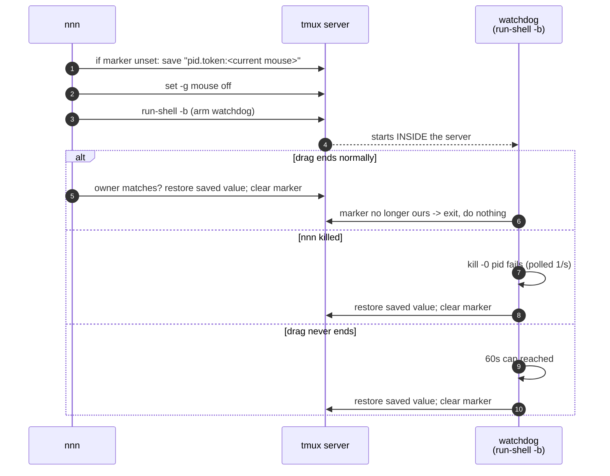

```
ASCII Table 13.5: Fix components
+-------------------------+------------------------------+----------------------------+
| Component               | Where it lives               | Failure mode it closes     |
+-------------------------+------------------------------+----------------------------+
| @nnn_dnd_mouse marker   | tmux server option           | F1, F3 (saved value)       |
| run-shell -b watchdog   | tmux SERVER process          | F1 (~1s), F2 (60s cap)     |
| <pid> in the marker     | ownership                    | F4                         |
| <token> in the marker   | per-grab generation counter  | stale watchdog vs new drag |
| Ownership check on every| grab / release / watchdog /  | F4, double restore         |
| restore path            | repair                       |                            |
| Startup repair          | first EnableDrag, once/proc  | watchdog itself never ran  |
+-------------------------+------------------------------+----------------------------+
```

Three functions in [src/nnn.c](../src/nnn.c) replace the old
`dnd_tmux_mouse(bool)`:

- `dnd_grab_tmux_mouse()` -- records the marker **only if nobody already holds
  it** (so a second grabber cannot save the already-off value as the one to
  restore), turns the mouse off, arms the watchdog.
- `dnd_release_tmux_mouse()` -- restores **only if we still own the marker**.
- `dnd_repair_tmux_mouse()` -- run once per process on the first `EnableDrag`:
  if the marker names a pid that no longer exists, restore and clear it.

The watchdog polls with the shell's `kill -0` **builtin**, so the loop forks
nothing: it is a `sleep` plus a builtin, once a second, only while a drag is in
flight, capped at `DND_MOUSE_GRAB_MAX_SEC` (60).

**Why the token matters.** Without it, this sequence breaks: nnn grabs (watchdog
A armed), the drag ends normally, nnn grabs again 3 seconds later, then watchdog
A wakes at its cap, sees a marker with a matching pid, and restores the mouse in
the middle of the *second* drag. The token makes watchdog A's ownership test
fail, so it exits harmlessly. This is covered by test T6.

**What was deliberately not changed.** Narrowing the grab from `set -g mouse off`
to unbinding only `MouseDrag1Border` was considered and rejected: `mouse off` is
the form that was empirically verified against the original symptom in Problem 4,
and unbinding a key the user may have customised introduces a *new* restore
problem rather than removing one. The grab was made safe instead of narrower.

### 13.6 Verification

A regression test drives the exact shell the C code emits, against an isolated
tmux server on socket `mousetest`, so a live session is never touched:

```sh
misc/test/test-dnd-tmux-mouse.sh          # watchdog cap shortened to 4s
MAX=10 misc/test/test-dnd-tmux-mouse.sh   # slower machines
```

```
ASCII Table 13.6: Test coverage
+----+--------------------------------------------------+---------------------+
| T  | Scenario                                          | Asserts             |
+----+--------------------------------------------------+---------------------+
| T1 | Normal grab then release                          | off, marker, on     |
| T2 | Owner SIGKILLed mid-drag                          | restored in ~1s     |
| T3 | Drag never ends, owner alive                      | restored at the cap |
| T4 | User preference `mouse off` preserved             | stays off           |
| T5 | Dual pane: 2nd grabber does not overwrite         | only A restores     |
| T6 | Stale watchdog vs newer grab by the same pid      | new grab survives   |
| T7 | Startup repair of a marker with a dead pid        | restored, cleared   |
| T8 | Repair must NOT touch a live grab                 | left alone          |
+----+--------------------------------------------------+---------------------+
```

Actual run, 2026-08-03:

```
==================  PASS=21  FAIL=0  ==================
```

Build:

```sh
./build.sh
# clean; only the pre-existing 'fuzzyentrycmp defined but not used' warning
```

Isolation confirmed after the run: the live server still reports `mouse on`, and
`tmux show -gv @nnn_dnd_mouse` reports `invalid option` (no marker present).

**Not verified:** an end-to-end kill of a real nnn process during a real mouse
drag. The kill path is covered at the shell level by T2, which drives the same
script with a real process that is really `kill -9`ed, but the full-stack
rehearsal was not performed on the live dual-pane session.

### 13.7 Manual escape hatch

Should the mouse ever be stranded anyway, the state is now inspectable rather
than invisible:

```sh
tmux show -gv @nnn_dnd_mouse   # e.g. "38608.1:on" -- pid 38608 holds it, it was 'on'
tmux set -g mouse on
tmux set -gu @nnn_dnd_mouse
```

Needing this is now itself a bug report: note whether the marker was set and
which pid it named.

### 13.8 Lesson

A protection whose failure mode is worse than the thing it protects against is a
bad trade, however rare the failure. The fix was not to make the grab less
likely to strand, but to **move the release out of the process that can die** --
tmux was already a long-lived, always-present state holder, so the marker and the
watchdog belong there. The generic form: when a short-lived process mutates
long-lived global state, the recovery must be owned by something at least as
long-lived as the state.

---

## Problem 14 -- "Too many open files" again: the third recurrence, an unapplied fix, and 110 Gradle daemons

### 14.1 Symptom (as reported)

> I run the script `start_dual_nnn.sh` inside the current tmux session
> `main_fish`. However, when running the `nnn_left` command, it reports the error
> `12449: Too many open files`.

### 14.2 TL;DR root cause

This is the **third** occurrence of Problem 8, and it happened because **two
separate things stacked**:

```
ASCII Table 14.2: The two stacked causes
+---+--------------------------------------+------------------------------------+
| A | The fix recommended in 8.5 was NEVER  | max_user_instances was still the   |
|   | APPLIED                              | kernel default 128, and            |
|   |                                      | /etc/sysctl.d/40-inotify.conf did  |
|   |                                      | not exist. The doc had recorded    |
|   |                                      | "Not verified end-to-end" and that |
|   |                                      | turned out to mean "not done".     |
+---+--------------------------------------+------------------------------------+
| B | A new consumer, far larger than any   | 110 idle Gradle daemons across 67  |
|   | seen before, had appeared             | distinct Gradle versions, holding  |
|   |                                      | 47 inotify descriptors and 15.5 GB |
|   |                                      | of RSS.                            |
+---+--------------------------------------+------------------------------------+
```

Net effect, measured directly: **zero** free inotify instances. Every
`inotify_init()` on the machine returned `EMFILE`, so nnn could not start at all.

### 14.3 Confirming the exact failure point

The number in the message is a **source line, not a file-descriptor count**:

```c
#define xerror() perror(xitoa(__LINE__))       /* src/nnn.c:912 */
```

and [src/nnn.c:12449](../src/nnn.c#L12449) is the `xerror();` inside the
`inotify_init1()` failure branch:

```c
#ifdef LINUX_INOTIFY
	/* Initialize inotify */
	inotify_fd = inotify_init1(IN_NONBLOCK | IN_CLOEXEC);
	if (inotify_fd < 0) {
		xerror();               /* <-- line 12449 */
		return EXIT_FAILURE;
	}
```

`Fact`: nnn treats this as **fatal**. There is no degraded no-watch mode, so an
exhausted instance cap is a hard "cannot start".

`Fact`: `EMFILE`'s canonical string is "Too many open files", which is why the
message points the reader at `ulimit -n` -- a dead end here. `ulimit -Sn` and
`-Hn` on this machine are both `100000`.

### 14.4 How to measure this correctly (and a correction to 8.5)

The recipe used in Problem 8.5, and repeated all over the internet, is:

```sh
find /proc/*/fd -lname 'anon_inode:inotify' 2>/dev/null | wc -l
```

**It does not measure what the cap limits.** Three distinct errors:

```
ASCII Table 14.4: Why the common recipe is wrong
+---+-------------------------------------+---------------------------------------+
| 1 | It counts DESCRIPTORS, not instances| A descriptor inherited through fork()  |
|   |                                     | or dup() refers to ONE instance the    |
|   |                                     | kernel charges ONCE. The count is an   |
|   |                                     | upper bound only.                      |
+---+-------------------------------------+---------------------------------------+
| 2 | It does not filter by UID           | The cap is enforced PER UID. Root's    |
|   |                                     | systemd/tracker/snapd instances are in |
|   |                                     | the total but not in your budget.      |
+---+-------------------------------------+---------------------------------------+
| 3 | Its result can EXCEED the cap, which| Measured here: 143 descriptors total,  |
|   | silently signals it is not the      | 142 for uid 1000 -- against a cap of   |
|   | quantity being capped               | 128. A real instance count can never   |
|   |                                     | exceed the cap.                        |
+---+-------------------------------------+---------------------------------------+
```

**Deduplicating by inode does not rescue it either.** Every anonymous inode comes
from the single `anon_inodefs` superblock, so they all share one inode:

```sh
# measured 2026-08-03: 142 descriptors ...
stat -Lc '%i' <each fd> | sort -u | wc -l      # ... and exactly 1 distinct inode
```

And the kernel's per-user instance counter (`ucounts`) is **not exposed anywhere
in /proc**.

**So ask the kernel instead.** Open instances until it refuses, count them, close
them. This is the only reliable measurement, and it answers the question that
actually matters -- *is there headroom right now* -- rather than a proxy for it:

```sh
misc/test/inotify-headroom.py
```

Output at the moment of failure:

```
fs.inotify.max_user_instances : 128
instances this UID could open : 0
stopped with                  : EMFILE (Too many open files)

VERDICT: cap is FULLY EXHAUSTED right now -- any program calling
         inotify_init() fails with EMFILE ('Too many open files').
```

`Decision`: the descriptor count is still useful for **attribution** (which
program is responsible), just not for **capacity**. Use the headroom script to
decide *whether* there is a problem, and the `/proc` scan to decide *who caused
it*.

### 14.5 The consumer changed completely between recurrences

Descriptor attribution, uid 1000, at the moment of failure, next to the figures
recorded for the previous recurrence:

```
ASCII Table 14.5: Top inotify descriptor holders, by recurrence
+------------------+---------------------+---------------------+
| Command          | 2026-07-31 (desc.)  | 2026-08-03 (desc.)  |
+------------------+---------------------+---------------------+
| java (Gradle)    |          -- (none)  |   47 (47 processes) |
| code-insiders    |   53 (37 processes) |   22 (15 processes) |
| systemd          |                   5 |                   5 |
| claude           |                  16 |                   2 |
| Typora           |                   9 |                  -- |
| others (1-3 ea.) |                 ~95 |                 ~66 |
+------------------+---------------------+---------------------+
| TOTAL            |                 178 |                 142 |
+------------------+---------------------+---------------------+
```

`Fact`: the *total* was actually **lower** than at the previous recurrence (142
vs 178 descriptors), yet the cap was fully exhausted this time and nnn had
started fine on other days at 178. That is the clearest possible evidence that
the descriptor count is not the quantity being capped (14.4), and that the real
instance usage had crossed 128 for the first time.

### 14.6 Why 110 Gradle daemons existed

```
ASCII Table 14.6: The daemon storm, measured
+----------------------------+---------------------------------------------------+
| Processes                  | 110, ALL in state S (sleeping) -- none building    |
| Distinct Gradle versions   | 67, from gradle-4.8.1 to gradle-9.2.0             |
| Age                        | 3297-4325 s -- all spawned inside one ~17 min burst|
| Resident memory            | 15 532 MB total                                    |
| CPU consumed               | 2056 cpu-seconds total, then idle                 |
| Launched by                | .vscode-insiders/extensions/redhat.java-1.55.0    |
|                            | .../jre/21.0.11/bin/java ... GradleDaemon         |
+----------------------------+---------------------------------------------------+
```

**Mechanism.** A Gradle daemon is **per Gradle version** (plus per JVM args
fingerprint). The Red Hat Java extension imports a workspace by running each
project's own Gradle **wrapper**, and a tree of long-lived projects accumulates
one wrapper version per project generation. Importing that workspace therefore
starts one JVM **per distinct wrapper version** -- 67 of them here -- and each
JVM opens its own file watchers.

`Fact`: there is no `~/.gradle/gradle.properties` on this machine, so
`org.gradle.daemon.idletimeout` is at its default of **3 hours**. The daemons had
been idle for roughly an hour and would have held their instances for two more.

`Assumption`: the burst was a workspace import or re-import in VS Code Insiders.
Not verified directly -- the extension's own logs were not consulted -- but the
17-minute spawn window, the single extension path shared by all 110 command
lines, and the one-daemon-per-wrapper-version pattern all fit and nothing else
does.

### 14.7 Solution -- three layers

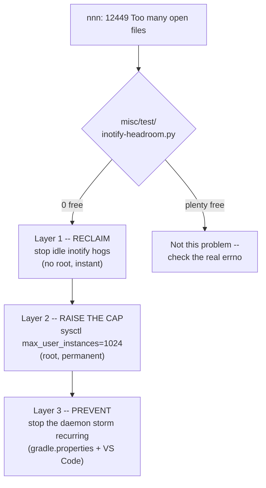

**Layer 1 -- reclaim now (no root needed).** All 110 daemons were idle, so
`SIGTERM` interrupts nothing and Gradle restarts one on the next build:

```sh
pkill -TERM -f 'org.gradle.launcher.daemon.bootstrap.GradleDaemon'
```

> **Trap, hit while doing exactly this.** `pkill -f` matches against the **full
> command line of every process, including the shell that is running the
> `pkill`** -- whose command line contains the pattern as an argument. The shell
> SIGTERMs itself and the command appears to fail (exit `144` = `128 + SIGTERM`)
> even though the daemons were signalled correctly. Either verify the outcome
> separately, or avoid the self-match by selecting on the executable instead:
>
> ```sh
> ps -o pid,cmd -C java --no-headers | awk '/GradleDaemon/{print $1}' | xargs -r kill -TERM
> ```

**Layer 2 -- raise the cap (root; permanent).** This is the fix 8.5 prescribed
and that was never applied:

```sh
# take effect now
sudo sysctl -w fs.inotify.max_user_instances=1024

# persist across reboots
echo 'fs.inotify.max_user_instances=1024' | sudo tee /etc/sysctl.d/40-inotify.conf
sudo sysctl --system
```

Confirm afterwards:

```sh
cat /proc/sys/fs/inotify/max_user_instances    # expect 1024
misc/test/inotify-headroom.py                  # expect a large free count
```

`Fact`: `/etc/sysctl.conf` on this machine already sets `max_user_watches` and
`max_queued_events`, but **not** `max_user_instances` -- which is why the other
two limits are generous (524288 each) while the one that actually broke nnn sat
at the 128 default. Do not assume "I raised my inotify limits" covers all three.

**Layer 3 -- stop the storm recurring.** Reclaiming and raising the cap both
treat the symptom; 110 JVMs holding 15.5 GB is worth preventing regardless:

```sh
# ~/.gradle/gradle.properties -- retire idle daemons after 30 min instead of 3 h
org.gradle.daemon.idletimeout=1800000
```

And in VS Code Insiders settings, stop the per-wrapper-version fan-out by
pinning one Gradle for import:

```jsonc
// use ONE Gradle for project import instead of each project's own wrapper
"java.import.gradle.wrapper.enabled": false,
"java.import.gradle.version": "8.14.1",

// or, for workspaces that do not need Gradle import at all:
"java.import.gradle.enabled": false
```

`Decision`: these are the user's own environment, outside this repo, so they are
recorded as recommendations. Only Layer 1 was executed here.

### 14.8 Verification

Measured, in order, on 2026-08-03:

```
ASCII Table 14.8: Before and after
+--------------------------------------+-----------+-----------+
| Measurement                           | Before    | After L1  |
+--------------------------------------+-----------+-----------+
| GradleDaemon processes                |       110 |         0 |
| inotify descriptors (uid 1000)        |       142 |        95 |
| instances the UID could still open    |         0 |        47 |
| max_user_instances                    |       128 |       128 |
+--------------------------------------+-----------+-----------+
```

Then the failing command itself, in an **isolated** tmux server so the live
session was untouched:

```sh
tmux -L nnnstart -f /dev/null new-session -d -x 200 -y 50 \
  "/home/tripham/bin/nnn -e -a -o -r -R -i -d -H -P a -P p -s probe -S -f ~/Downloads 2>err"
```

Result: the nnn process was **alive**, `err` was **empty** (no `xerror` output),
and the pane rendered the context bar and directory listing:

```
1 2 3 4 5 6 7 8 ~/Downloads

>2024-04-22 20:49  700       4K  .fr-6cD6aQ/
 2026-07-01 16:26  755       4K  .hist/
```

**PASS** -- nnn starts again. The probe server and its `probe` session file were
removed afterwards.

`Not verified`: Layer 2 and Layer 3. `sudo` on this machine requires a password
that could not be supplied non-interactively, so the sysctl was **not** changed;
the commands in 14.7 are for the user to run. Until Layer 2 is applied the
machine is running on the 47 slots Layer 1 freed, and the next workspace import
will consume them again.

### 14.9 Quick triage for the next time

```sh
# 1. Is it really the instance cap?  (the ONLY reliable check)
misc/test/inotify-headroom.py

# 2. If exhausted: who is holding them?  (attribution, not capacity)
find /proc/*/fd -lname 'anon_inode:inotify' 2>/dev/null | awk -F/ '{print $3}' \
  | sort | uniq -c | while read -r c p; do echo "$c $(cat /proc/$p/comm 2>/dev/null)"; done \
  | awk '{a[$2]+=$1} END {for (k in a) printf "%-22s %5d\n", k, a[k]}' | sort -k2 -rn | head

# 3. Reclaim the biggest idle offender, then re-run step 1.
```

Candidate hogs seen on this machine so far, in order of appetite: Gradle daemons
(one JVM per wrapper version), `code-insiders` (one per window plus extension
hosts), language servers (`cpptools`, `jdtls`), `claude` sessions, note apps.

### 14.10 Lesson

**A documented fix that was never applied is not a fix.** Problem 8.5 diagnosed
this correctly a second time, wrote the exact commands, and honestly labelled
itself `Not verified end-to-end`. Three days later the same failure returned
because that label meant "nobody ran it" and nothing in the workflow closed the
loop. Entries that end in a system change the author cannot make should say so in
the *status*, not only in a verification footnote -- which is why 8.5 now carries
a forward pointer to this entry, and why 14.8 states plainly which layers are
still outstanding.

**Second lesson: measure the quantity that is actually capped.** The descriptor
count had gone *down* between recurrences while the situation got *worse*. Every
minute spent comparing 142 against 128 was wasted; the one command that settled
it in a second was asking the kernel for an instance and reading the errno. When
a proxy metric can exceed the limit it supposedly tracks, that is not a rounding
error -- it is proof the proxy is measuring something else.
