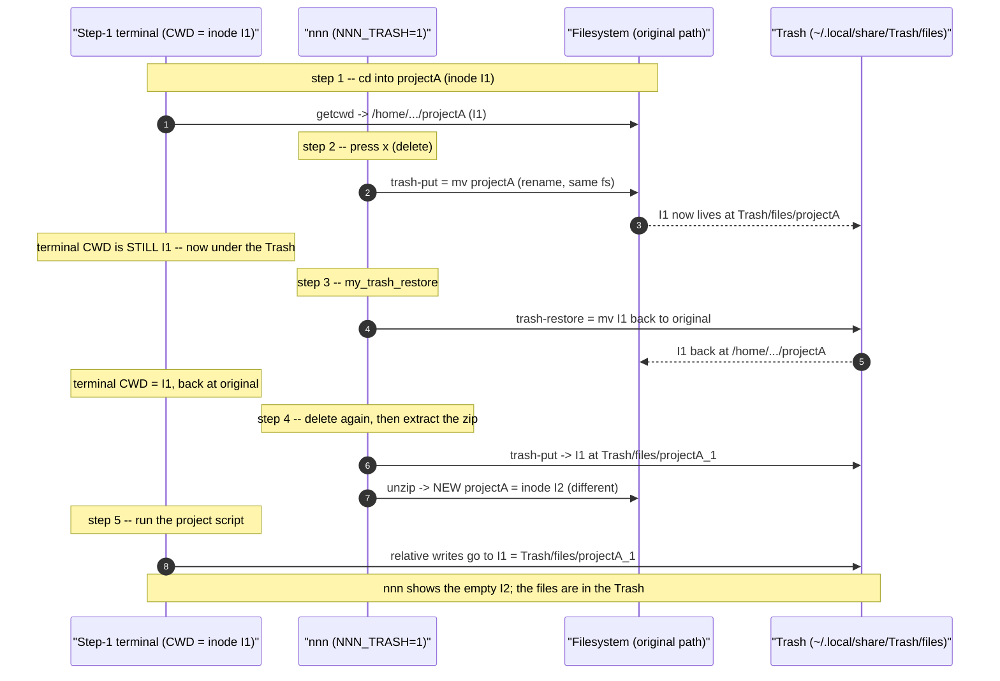
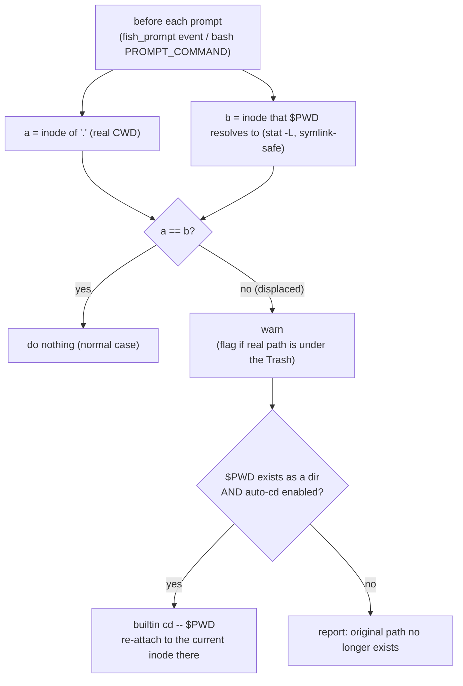
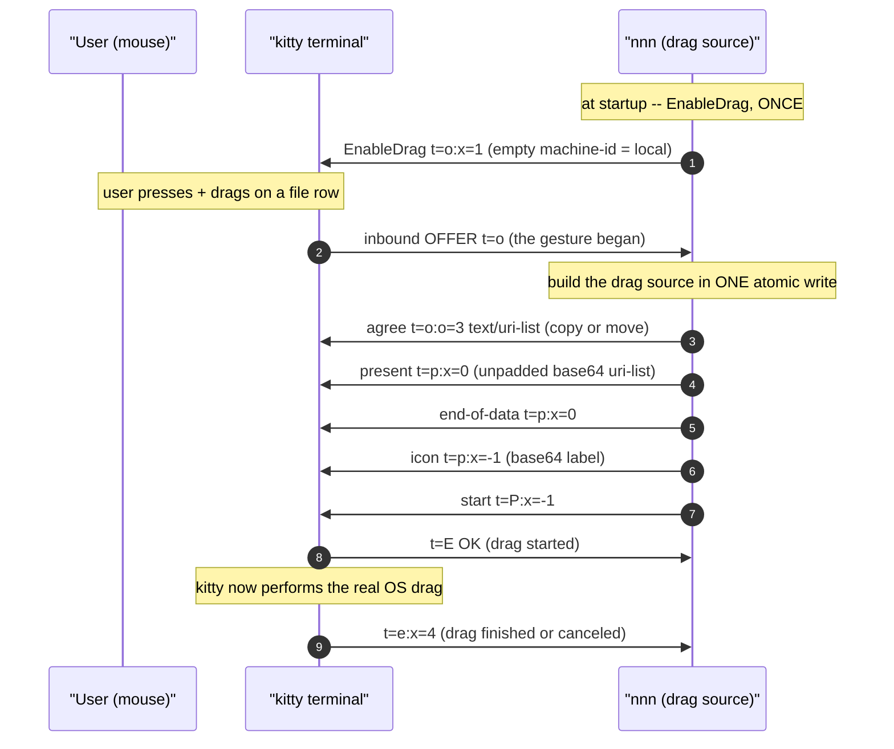
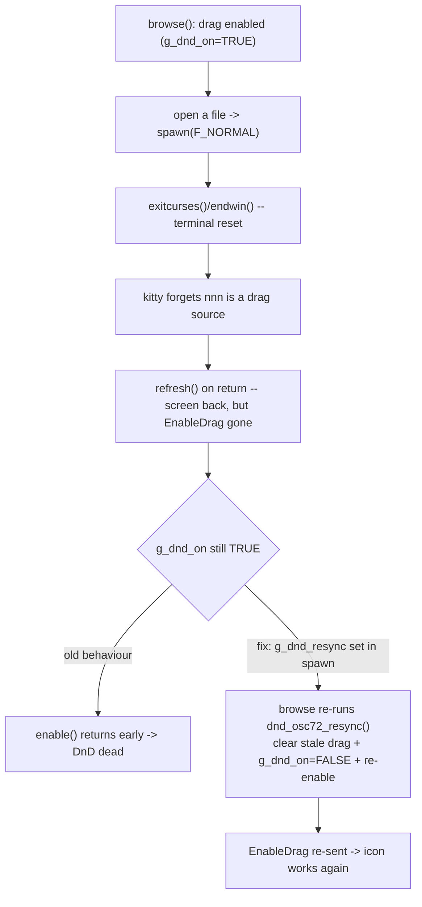
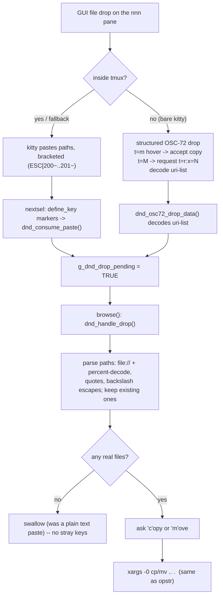
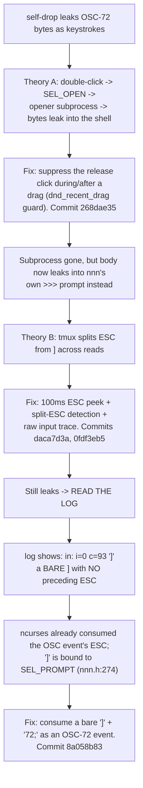

# nnn -- Problems and Solutions

A running log of real problems hit while using this nnn setup, the
investigations behind them, and the fixes. Each entry is self-contained.

---

## Problem 1 -- New files silently land inside the Trash after deleting and re-creating a directory you are `cd`'d into

### 1.1 Symptom (as reported)

1. Open a terminal and `cd` into `projectA` (created by extracting `projectA.zip`).
2. In nnn, delete `projectA` with `x` (confirm yes).
3. Run the `my_trash_restore` plugin (`Alt+r` / `;r`) and restore `projectA`.
4. Delete `projectA` again, then extract `projectA.zip` to create a fresh `projectA`.
5. Back in the **step-1 terminal**, run the project script. The new files are
   **not visible** in nnn or any file manager -- they were actually created in
   `/home/tripham/.local/share/Trash/files/projectA_1`.

A crucial extra clue from the user:

> Inside the terminal, `pwd -P` still shows the **correct** directory, not the
> one in Trash.

### 1.2 TL;DR root cause

A shell's "current directory" is an **open reference to a directory inode**, not
a path string. With `NNN_TRASH=1`, nnn's `x` delete runs `trash-put`, which
**moves** the directory into the Trash. On the same filesystem a move is a
*rename*: the inode is unchanged, it just lives under the Trash now. The step-1
terminal's working directory **silently follows that inode into the Trash**.
Re-extracting the zip creates a **brand-new directory with a different inode** at
the original path; the old terminal is still attached to the *trashed* inode, so
everything it writes lands in the Trash.

The bash/fish **builtin `pwd -P`** made this invisible: after the directory is
re-created, the stale `$PWD` string again names a real (but different) directory,
so the builtin happily prints the original path -- while the kernel's real
`getcwd()` (and therefore every file write) points into the Trash.

This is **inherent Unix behaviour**, not a bug in nnn, the plugin, or the
config. It cannot be prevented from the nnn side, but it can be **detected and
auto-repaired** by a shell prompt hook (the fix in 1.10).

### 1.3 Background -- how a shell's "current directory" really works

```
ASCII Table 1.3: Two different notions of "where am I"
+----------------------+--------------------------------------------------------+
| Notion               | What it is                                             |
+----------------------+--------------------------------------------------------+
| Kernel CWD (real)    | An open handle to a directory INODE. Used by every     |
|                      | relative-path syscall (open, mkdir, getcwd...). If the |
|                      | directory is renamed/moved, this handle follows it --  |
|                      | the path changes, the inode does not.                  |
| $PWD (logical)       | A STRING the shell caches when you `cd`. It is NOT      |
|                      | updated when the directory is moved out from under the |
|                      | shell by some other process (nnn, trash-put, mv).      |
+----------------------+--------------------------------------------------------+
```

The two normally agree. They **diverge** the moment something moves your current
directory without your shell knowing -- exactly what trashing does.

### 1.4 The trigger -- `NNN_TRASH=1` makes delete a *move*

`~/.dotfiles/nnn/nnn_config.sh` sets:

```sh
export NNN_TRASH=1   # x / Ctrl-X route deletes to trash-put instead of rm -rf
```

`trash-put` (and `gio trash`, `NNN_TRASH=2`) **move** the target into
`~/.local/share/Trash/files/`. Because `$HOME` and the Trash are on the **same
filesystem** (`/dev/nvme0n1p5`, ext4), the move is a pure rename -- the inode is
preserved and merely relocated. That preserved inode is what the step-1 terminal
is still holding onto.

> Note: this is trash-method-agnostic. `gio trash` moves too. The issue is
> "delete = move", not the specific tool.

### 1.5 Step-by-step mechanism (with inode tracking)

Let `I1` = the inode of the original `projectA`, `I2` = the inode of the
re-extracted `projectA`.



### 1.6 Why `pwd -P` "looked correct" (the key confusion)

The builtin `pwd -P` does **not** always call `getcwd()`. It canonicalises the
cached `$PWD` string and, if that path still names a valid directory, prints it.
After step 4 re-creates `projectA`, `$PWD` (the original path) is valid again --
so the builtin prints the **original** path even though the real CWD is the
Trash. The external `/bin/pwd` (true `getcwd()`) tells the truth.

Reproduced directly (directory trashed, then re-created at the original path):

```
ASCII Table 1.6: What each "where am I" command reports vs. reality
+----------------------------+------------------------------------+-----------+
| Command                    | Output                             | Truthful? |
+----------------------------+------------------------------------+-----------+
| $PWD                       | /home/.../projectA  (original)     | no (stale)|
| builtin pwd -P             | /home/.../projectA  (original)     | NO  <-- the
|                            |                                    | misleading|
|                            |                                    | clue      |
| /bin/pwd  (real getcwd)    | /home/.../Trash/files/projectA     | YES       |
| stat -c %i .  (CWD inode)  | I1 (the trashed inode)             | YES       |
| stat -c %i $PWD            | I2 (the new, different directory)  | YES       |
| touch newfile -> lands in  | /home/.../Trash/files/projectA     | reality   |
+----------------------------+------------------------------------+-----------+
```

The inode mismatch -- `stat .` (I1) != `stat $PWD` (I2) -- is the reliable,
symlink-safe signal that the working directory has been displaced. The fix in
1.10 keys off exactly this.

### 1.7 Why the files were in `projectA_1` (the `_1` suffix)

`trash-put` avoids name collisions in the Trash by appending `_1`, `_2`, ... When
`projectA` was trashed the second time (step 4), a `projectA` already existed in
the Trash (from earlier delete/restore cycles that were not fully emptied), so
the inode `I1` was stored as `projectA_1`. The suffix is **incidental** -- the
terminal follows `I1` to whatever name it currently has in the Trash.

### 1.8 Minimal reproduction

This reproduces the whole effect with plain `mv` (no nnn/trash-cli needed),
proving it is generic Unix behaviour. Run it with `bash script.sh` (a script,
not your interactive shell, so the `cd` is the real builtin):

```sh
R=/tmp/cwd_repro; rm -rf "$R"; mkdir -p "$R/trash"
mkdir -p "$R/projectA"; cd "$R/projectA"
mv "$R/projectA" "$R/trash/projectA"     # "trash" it (move)
mkdir "$R/projectA"                       # "extract the zip again" (new inode)

echo "builtin pwd -P : $(pwd -P)"         # -> $R/projectA   (looks fine!)
echo "/bin/pwd       : $(/bin/pwd)"       # -> $R/trash/projectA  (the truth)
touch created_here
ls "$R/projectA"        # empty  -- what nnn shows
ls "$R/trash/projectA"  # created_here  -- where the write actually went
```

### 1.9 Is this a bug in nnn / the plugin / the config?

No. Every component behaves correctly:

```
ASCII Table 1.9: Responsibility analysis
+----------------------+------------------------------------------------------+
| Component            | Verdict                                              |
+----------------------+------------------------------------------------------+
| nnn + NNN_TRASH=1    | Correct: routes delete to trash-put as configured.   |
| trash-put / restore  | Correct: a same-fs trash is a move (rename) by design.|
| my_trash_restore     | Correct: restores the inode to its original path.    |
| The terminal shell   | Correct per POSIX: CWD is an inode handle that        |
|                      | follows a rename.                                     |
+----------------------+------------------------------------------------------+
```

The surprise is the *interaction*: a long-lived terminal sitting inside a
directory that gets trashed. nnn cannot know about, or fix, an unrelated
terminal's working directory. The right place to handle it is the **shell**.

### 1.10 Solution -- the `cwd-guard` prompt hook

Install a tiny hook that runs **before every prompt**, compares the inode the
shell is really in against the inode `$PWD` names, and -- on a mismatch --
**warns** and (by default) **re-attaches** to `$PWD`.



Why this is safe and correct:

- It only acts on a genuine **inode mismatch**, so normal navigation and
  symlinked directories never trigger it (`stat -L` resolves `$PWD` the same way
  the kernel resolved your `cd`).
- Re-attaching is just `cd "$PWD"`: it re-resolves the *logical* path string to
  whatever inode is there **now** (the re-extracted `I2`), fixing the terminal.
- If the path is gone (trashed, not re-created), it cannot re-attach and instead
  tells you your directory no longer exists.

#### What was installed, and where

```
ASCII Table 1.10: Installed fixes (this machine uses fish as the main shell)
+--------------------------------------------------+------------------------------+
| File                                             | Role                         |
+--------------------------------------------------+------------------------------+
| ~/.config/fish/conf.d/nnn_cwd_guard.fish         | fish guard, runs on the      |
|   (function __nnn_cwd_guard --on-event           | fish_prompt event. PRIMARY   |
|    fish_prompt)                                   | fix for the main shell.      |
| ~/.dotfiles/nnn/nnn_config.sh  (appended block)  | bash guard via PROMPT_COMMAND|
|   installed only in INTERACTIVE bash, so it is a  | for bash sessions. No-op when|
|   no-op when fish loads the file via `bass`.      | imported through `bass`.     |
+--------------------------------------------------+------------------------------+
```

Both read the same toggles:

```
ASCII Table 1.10b: Toggles (set in fish with `set -Ux`, in bash with `export`)
+--------------------------+-------------------------------------------------+
| Variable                 | Effect                                          |
+--------------------------+-------------------------------------------------+
| NNN_CWD_GUARD=0          | disable the guard entirely                      |
| NNN_CWD_GUARD_AUTOCD=0   | warn only -- do NOT auto re-attach              |
| (unset / default)        | enabled, with auto re-attach                    |
+--------------------------+-------------------------------------------------+
```

The fish function (installed file):

```fish
function __nnn_cwd_guard --on-event fish_prompt \
        --description 'Detect/repair a working directory displaced into the Trash'
    test "$NNN_CWD_GUARD" = 0; and return
    set -l cur (command stat -c '%d:%i' -- . 2>/dev/null)
    test -n "$cur"; or return
    set -l logical (command stat -Lc '%d:%i' -- "$PWD" 2>/dev/null)
    test "$cur" = "$logical"; and return            # CWD matches $PWD -> done
    set -l here (env pwd -P 2>/dev/null)            # real getcwd, not builtin
    switch "$here"
        case "*/.local/share/Trash/*" "*/.Trash-*/*"
            echo "[cwd-guard] Warning: this shell is physically inside the Trash:" >&2
            echo "            $here" >&2
        case "*"
            echo "[cwd-guard] Warning: working directory was moved/replaced under this shell (real: $here)" >&2
    end
    if test -d "$PWD"; and test "$NNN_CWD_GUARD_AUTOCD" != 0
        builtin cd -- "$PWD" 2>/dev/null; and echo "[cwd-guard] re-attached to $PWD" >&2
    else if not test -d "$PWD"
        echo "[cwd-guard] its original path no longer exists: $PWD" >&2
    end
end
```

#### Immediate manual remedy (no hook)

If you ever notice the symptom, in the affected terminal run:

```sh
cd "$PWD"        # re-resolves the logical path to the current inode there
# or:
cd ..; cd projectA
```

Note: `cd .` does **not** help -- `.` is the (trashed) inode you are already on.
You must re-resolve the **path string**.

#### Prevention habits

- After restoring or re-extracting a directory you have terminals sitting in,
  re-enter it in those terminals (`cd "$PWD"`).
- Prefer not to keep a terminal parked inside a directory you are about to
  delete/recreate from nnn; or rely on the guard above to repair it.

### 1.11 Secondary finding -- `trash-cli` version vs. `my_trash_restore`

This machine has **`trash-cli 0.17.1.14`**, but
[plugins/my_trash_restore](../plugins/my_trash_restore) documents itself as
needing **`>= ~0.22`** for the comma-separated **multi**-restore
(`trash-restore` accepting `1,3,5`). On 0.17:

- **Single** restore (pick one item) works -- this is the path used in the
  reported steps.
- **Multi**-select restore may be rejected as an invalid index. If multi-restore
  is needed, upgrade trash-cli (e.g. `pipx install trash-cli`) or restore one
  item at a time.

This is unrelated to Problem 1, but worth recording since the plugin and the
installed tool version disagree.

### 1.12 Verification

```
ASCII Table 1.12: Tests run while fixing this (all passing)
+------------------------------------------+----------------------------------+
| Case                                     | Result                           |
+------------------------------------------+----------------------------------+
| Normal directory                         | guard does NOT trigger           |
| Symlinked directory                      | guard does NOT trigger           |
| Trashed then re-created (the bug)        | warns + auto re-attaches to the  |
|                                          | new inode; files then land in    |
|                                          | the real directory               |
| Trashed and NOT re-created               | warns "original path gone"       |
| fish: emit fish_prompt after displacement| re-attaches (event hook fires)   |
| bash: PROMPT_COMMAND after displacement  | re-attaches in the main shell    |
| fish `bass source nnn_config.sh`         | imports env only; bash guard is  |
|                                          | NOT installed (no interference)  |
+------------------------------------------+----------------------------------+
```

---

## Problem 2 -- Native drag-and-drop from nnn never produced a drag (garbled OSC, EPERM, no icon)

### 2.1 Symptom (as reported)

Adding kitty's OSC-72 drag-and-drop to nnn so a file could be dragged onto a GUI
app (browser upload box, chat window, file manager). Early attempts failed in
several distinct ways across iterations:

- Pressing a "start drag" key and then mouse-dragging printed a garbled OSC
  string and `EPERM` into the pane, leaving an empty `tabbed-0.6 ::` window.
- Just mouse-dragging (no key) produced the same empty window.
- Later, the `1 file(s)` drag icon appeared but the drag was rejected with
  `error while decoding base64 pre-sent data`.
- Later still, the icon appeared but on release the drag was **canceled**
  (`t=e:x=4:y=1`) and the icon lingered; releasing on another app did nothing.

### 2.2 TL;DR root cause

kitty's OSC-72 drag-and-drop ([kitty >= 0.47.1](https://sw.kovidgoyal.net/kitty/))
is **mouse-gesture-driven and bidirectional**, not a fire-once escape. The app
declares itself a drag source **once** (EnableDrag); the **terminal** detects the
mouse gesture and sends the app an inbound offer, which the app answers. Five
independent mistakes each broke a different stage of that handshake:

```
ASCII Table 2.2: The five drag-OUT bugs, each at a different protocol stage
+---+--------------------------------+--------------------------------------+----------+
| # | Mistake                        | Effect                               | Commit   |
+---+--------------------------------+--------------------------------------+----------+
| 1 | Emitted the whole drag on a    | Wrong model -- garbage + EPERM. The  | e6d29667 |
|   | keypress                       | terminal drives the gesture, not us. |          |
| 2 | Wrote agree/present/start as   | Interleaved bytes corrupt the drag-  | 107259f8 |
|   | separate writes                | source "build" -> rejected.          |          |
| 3 | Emitted PADDED base64 ("=")    | kitty's decoder is unpadded (like    | db1dc51e |
|   |                                | Yazi); "error decoding base64".      |          |
| 4 | Advertised the hostname as the | kitty treats the drag as REMOTE and  | 555042a9 |
|   | machine-id                     | asks for file CONTENTS (t=k) we do   |          |
|   |                                | not serve -> drag canceled.          |          |
| 5 | No drag icon                   | Worked, but no visual feedback.      | 7361258a |
+---+--------------------------------+--------------------------------------+----------+
```

It is **opt-in** via `NNN_DND_OSC72=1` because enabling it changes the terminal's
mouse-gesture handling.

### 2.3 Background -- why a terminal program cannot "just drag" a file

A GUI drag is an X11/Wayland protocol (XDND) between **windows**. nnn is a
pty-bound process: it has no drawing surface the display server can address, and
no X connection. Everything it can do flows as bytes through the pty. Two ways
out exist: (a) spawn a helper GUI window that owns the real XDND drag (Approach
B, the `nnn-dnd` libX11 helper -- see the brainstorm doc), or (b) ask a
**protocol-aware terminal** to perform the drag on the app's behalf. kitty's
OSC-72 is option (b), and the only one that also works over SSH and inside tmux
(for the drag-OUT direction).

### 2.4 The protocol (drag-OUT direction)



```
ASCII Table 2.4: OSC-72 metadata used by the drag-OUT path (all under "OSC 72 ;")
+-----------------+------------------------------------------------------------+
| Field           | Meaning                                                    |
+-----------------+------------------------------------------------------------+
| t=o:x=1;<id>    | EnableDrag. Empty <id> => LOCAL drag (kitty hands the drop |
|                 | target the file:// path; no t=k contents request).         |
| t=o (inbound)   | The terminal's OFFER: a drag gesture was detected.         |
| t=o:o=3;<mime>  | Agree-drag, operation 3 = copy-or-move, offering <mime>.   |
| t=p:x=0:m=N;..  | Present data for MIME index 0, chunked (m=1 => more).      |
| t=p:x=-1:...    | The drag icon (a small UTF-8 label, base64).               |
| t=P:x=-1        | Start the drag.                                            |
| t=e:x=N         | Status: x=4 finished, x=5 data requested (local: none).    |
| t=E;OK / EINVAL | Result: OK = started; otherwise an error string.           |
+-----------------+------------------------------------------------------------+
```

### 2.5 The base64 and machine-id findings (the two subtle ones)

- **Unpadded base64.** kitty decodes the pre-sent payload with an unpadded
  alphabet (matching Yazi's `BASE64_SANE`, `with_encode_padding(false)`). nnn's
  encoder originally appended `=`/`==`. The fix drops the padding entirely
  ([dnd_b64, src/nnn.c:3683](../src/nnn.c#L3683)). Verified by capturing the
  emitted bytes: `...eHQNCg` (no trailing `=`).
- **Empty machine-id = local.** EnableDrag may carry a machine-id so the
  terminal can tell a local drag from a remote (SSH) one. If nnn advertised the
  real hostname, kitty assumed the file lived on a *different* machine and asked
  nnn to stream the file **contents** via a `t=k` request; nnn only serves the
  `file://` path, so the drag stalled and was canceled. Sending an **empty**
  machine-id (exactly Yazi's `EnableDrag("")`) makes kitty treat it as local and
  use the path directly ([dnd_osc72_enable, src/nnn.c:4228](../src/nnn.c#L4228)).

### 2.6 Diagnostic technique

Because there is no kitty+mouse in the dev environment, the emitted bytes were
captured by feeding nnn a *simulated* inbound offer and logging exactly what it
wrote (ESC rendered as `\e`):

```sh
tmux send-keys -t SESS -l $'\e]72;t=o:x=10:y=5\e\\'   # fake the terminal's offer
# then inspect /tmp/nnn-dnd.log for the "out: ..." lines and base64-decode them
```

This made the padded-base64 and machine-id bugs visible without a real drag.
The file-based debug log (`NNN_DND_DEBUG=/tmp/nnn-dnd.log`, or `=1` for that
default path) never corrupts the curses screen.

### 2.7 Solution summary

nnn declares itself a drag source once at `browse()` start, parses inbound
OSC-72 events out of the input stream in `nextsel()`, and answers an offer with
one atomic, unpadded, empty-machine-id batch plus a text icon. Opt-in via
`NNN_DND_OSC72=1`; inside tmux it additionally needs `set -g allow-passthrough
on` so the outbound escapes reach kitty. Confirmed working: the `N file(s)` icon
appears and dropping on an external target delivers the file.

---

## Problem 3 -- Drag stops working after opening a file (and never recovers)

### 3.1 Symptom

After dragging worked, opening any file with the configured opener and then
returning to nnn left drag-and-drop **dead**: the `N file(s)` icon never appeared
again until nnn was restarted.

### 3.2 Root cause

Opening a file runs a **curses-suspending** subprocess. nnn calls
`exitcurses()` (= `endwin()`) before the child and `refresh()` after. That
terminal reset makes kitty **forget nnn is a drag source** -- the EnableDrag
registration is dropped. Because nnn's `g_dnd_on` flag stayed `TRUE`, the
one-shot `dnd_osc72_enable()` never re-sent EnableDrag.



### 3.3 Solution

A `g_dnd_resync` flag ([src/nnn.c:2646](../src/nnn.c#L2646)) is set in `spawn()`
right after the `F_NORMAL` `refresh()`. On its next iteration `browse()` (before
reading input) calls `dnd_osc72_resync()` ([src/nnn.c:4272](../src/nnn.c#L4272)),
which drops any half-built drag and re-sends EnableDrag. No-op unless
`NNN_DND_OSC72` is enabled. Commit `f4d75e81`.

---

## Problem 4 -- Dragging across a tmux pane border resizes the panes

### 4.1 Symptom

With the dual-pane tmux layout (`start_dual_nnn.sh`), dragging a file whose path
crossed the tmux pane separator made tmux **resize** the panes instead of
continuing the drag.

### 4.2 Root cause

nnn's `mousemask` subscribes only to **button-press** events, not motion. tmux,
with `mouse on`, independently grabs pointer **motion** for its own pane-border
drag-to-resize. nnn cannot suppress that through its own mouse mask -- the two
mouse consumers are layered (kitty -> tmux -> nnn).

### 4.3 Solution

For the duration of an in-flight drag, turn tmux's mouse off and restore it when
the drag ends:

```
ASCII Table 4.3: tmux-mouse toggle lifecycle (src/nnn.c:3633)
+----------------------------+-------------------------------------------------+
| Event                      | Action                                          |
+----------------------------+-------------------------------------------------+
| drag goes in flight        | spawn "tmux set -g mouse off" (F_NOWAIT --      |
| (offer answered)           | no curses suspend), set g_dnd_tmux_grabbed.     |
| any drag-end path          | dnd_clear_data() -> dnd_release_tmux_mouse() -> |
| (finish/error/disable)     | "tmux set -g mouse on".                          |
| abnormal end / subprocess  | the resync (Problem 3) also releases the mouse, |
|                            | so it can never be left disabled.               |
+----------------------------+-------------------------------------------------+
```

`F_NOWAIT` is essential: it forks without `endwin()`, so the toggle is safe
mid-gesture. No-op outside tmux. Commit `96e4b092`.

---

## Problem 5 -- Dropping files INTO nnn from another app typed "strange key sequences"

### 5.1 Symptom

Dragging files from a GUI file manager and dropping them onto the nnn pane
dumped the file paths into nnn as if typed, triggering random keybindings,
instead of importing the files.

### 5.2 Root cause

nnn never *claimed* the drop, so kitty fell back to its default: **paste the
dropped paths as text**. With bracketed paste off (nnn's default), those bytes
arrived as raw keystrokes.

### 5.3 The tmux routing constraint (why two mechanisms are needed)

```
ASCII Table 5.3: Where each drop-IN mechanism works
+--------------------------+-------------------+----------------------------------+
| Mechanism                | Works in tmux?    | Notes                            |
+--------------------------+-------------------+----------------------------------+
| Native OSC-72 EnableDrop | NO                | tmux does not route the inbound  |
| (structured drop)        |                   | drop events (t=m/t=M/t=r) to the |
|                          |                   | pane. Worse: announcing it via   |
|                          |                   | passthrough makes kitty STOP     |
|                          |                   | pasting, so the drop vanishes.   |
| Bracketed-paste capture  | YES               | kitty wraps the drop-paste in    |
|                          |                   | ESC[200~..ESC[201~, which tmux   |
|                          |                   | forwards. Portable.              |
+--------------------------+-------------------+----------------------------------+
```

So nnn enables **EnableDrop only outside tmux**, and the **bracketed-paste
fallback always**.

### 5.4 Solution



Key pieces:

- Bracketed paste is enabled (`ESC[?2004h`) when `NNN_DND_OSC72` is set, and the
  paste markers are registered with `define_key()` so ncurses surfaces them as
  single keycodes (`KEY_DND_PASTE_START/END`,
  [src/nnn.c:3613](../src/nnn.c#L3613)).
- `dnd_handle_drop()` ([src/nnn.c:4338](../src/nnn.c#L4338)) parses paths
  robustly (newline/space separated, quotes, backslash escapes, `file://` URIs
  with percent-decoding), keeps only existing paths, asks copy/move via
  `get_input(messages[MSG_CP_MV_AS])`, then reuses the exact NUL-separated
  `xargs -0 ... cp/mv ... .` command `opstr()` uses for selection copy.
- A paste with **no** existing paths is silently swallowed -- so a plain text
  paste no longer leaks as keystrokes either.

Commits `b12851d8` (bracketed-paste path), `b0416e90` (native OSC-72 drop).

---

## Problem 6 -- A file dropped into nnn does not bring its window to the front

### 6.1 Symptom

After dropping files onto the nnn window from another app, focus stays on the
source app; the user must Alt+Tab to nnn.

### 6.2 Root cause -- a pty program cannot focus its own window

This is a hard ceiling, not a missing feature:

- kitty implements **no** window-manipulation escape (XTWINOPS `CSI 5 t` is a
  no-op in kitty), by design.
- X11 input focus is an EWMH client message (`_NET_ACTIVE_WINDOW`) that needs a
  **display connection** -- which a pty app does not have (the whole reason
  OSC-72 exists).
- Window managers deliberately prevent apps from stealing focus.

### 6.3 Solution (best effort, honest about the limit)

On a real drop, `dnd_focus_window()` ([src/nnn.c:4322](../src/nnn.c#L4322)):

1. emits **BEL**, which makes kitty set the window **urgency hint** (taskbar/dock
   flash) -- always works;
2. runs `kitten @ focus-window`, which *actually* focuses the window **only if**
   kitty remote control is enabled (`allow_remote_control yes`).

Both are no-ops/ignored otherwise. True focus-switching depends on kitty remote
control being reachable; the flash is the reliable fallback. Commit `daca7d3a`.

---

## Problem 7 -- Dropping a drag back onto nnn's own pane opened the `>>>` prompt and leaked OSC bytes

This was the hardest bug; it took three iterations and a direct read of the live
debug log to pin down. It is worth recording the full investigation because two
plausible-but-wrong theories preceded the real cause.

### 7.1 Symptom (evolved across fixes)

1. First report: dropping a drag on nnn's own window **opened the file** (the
   nuke opener), and afterwards DnD was dead.
2. After a click fix: the file no longer opened, but the pane showed
   `>>> 72;t=e:x=4:y=0` and pressing Enter produced
   `fish: Unsupported use of '='. ... 'set t e:x=4:y=0'`.

### 7.2 Investigation -- two wrong theories, then the log



### 7.3 Root cause (confirmed from the log)

The decisive log line was:

```
in: i=0 c=93 ']'
```

`i=0` means `get_wch()` returned a *regular character* (not `KEY_CODE_YES`),
`c=93` is `]`. So nnn read a **bare `]` with no preceding ESC** -- ncurses had
already swallowed the leading ESC of the inbound OSC-72 event
(`ESC ] 72 ; t=e:x=4 ... ST`). And in
[src/nnn.h:274](../src/nnn.h#L274), `]` is bound to **`SEL_PROMPT`**:

```
{ ']', SEL_PROMPT },
```

So the chain was: lost ESC -> bare `]` -> `SEL_PROMPT` opens the `>>> ` prompt
-> the following `72;t=e:x=4:y=0` body is typed straight into it. Pressing Enter
sent that line to the shell (fish), producing the `'='` errors. The two earlier
fixes could not catch it because both keyed off an ESC that was no longer there.

### 7.4 Why the earlier theories were not the whole story

- **Theory A (double-click open) was real but secondary.** A self-drop does
  generate two `BUTTON1_PRESSED` on the same row within the double-click window,
  which nnn read as a double-click -> `SEL_OPEN` -> opener. Suppressing that
  (the `dnd_recent_drag()` guard, [src/nnn.c:3654](../src/nnn.c#L3654)) was
  correct and is kept -- it stops the file opening and the phantom re-drag -- but
  it only moved the leak from "into the shell" to "into the `>>>` prompt".
- **Theory B (split ESC) was plausible but not the cause.** The log proved the
  ESC was *gone*, not merely delayed, so a longer peek could never help.

### 7.5 Solution

When a drag source is active, a **bare `]`** (read as a normal key) whose next
byte begins the OSC body (`7` of `72;`) is consumed as an OSC-72 event instead
of opening the prompt; a genuine `]` keypress (no OSC body following) still falls
through to `SEL_PROMPT`. See the `nextsel()` guard around
[src/nnn.c:4493](../src/nnn.c#L4493). Commit `8a058b83`.

```
ASCII Table 7.5: The three inbound-OSC entry points nnn now handles
+--------------------------------+-----------------------------------------------+
| What nnn reads                 | Handling                                      |
+--------------------------------+-----------------------------------------------+
| ESC then ']' (same read)       | ESC handler peeks ']' -> dnd_osc72_consume()  |
| ESC alone, then ']' (split)    | 100ms peek catches the late ']' (kept)        |
| bare ']' (ESC already eaten)   | peek '7' of "72;" -> dnd_osc72_consume()      |
|                                | (the real fix for the self-drop leak)         |
+--------------------------------+-----------------------------------------------+
```

### 7.6 Diagnostic lesson

The breakthrough was reading `/tmp/nnn-dnd.log` directly instead of reasoning
about terminal timing. The temporary raw-input trace (`in:`/`esc-peek:` lines,
gated on `NNN_DND_DEBUG`) turned an invisible byte stream into evidence; it was
removed once the cause was confirmed. When a terminal-interaction bug resists
two reasoned fixes, **capture the actual bytes** before guessing a third time.

---

## Problem 8 -- A freshly started nnn dies with "Too many open files"

### 8.1 Symptom

During DnD testing, launching a new nnn instance printed `<line>: Too many open
files` and exited immediately, even though `ulimit -n` was high (100000).

### 8.2 Root cause

The exhausted limit was **`fs.inotify.max_user_instances`** (default 128), not
the file-descriptor limit. Long-running apps (VS Code, Teams, a JVM) had
consumed all per-user inotify instances. nnn calls `inotify_init1()` at startup
([src/nnn.c:11271](../src/nnn.c#L11271)) and treats failure as **fatal**
(`return EXIT_FAILURE`), so it cannot start when the cap is hit. `EMFILE` from
`inotify_init1` is reported as "Too many open files", which misleadingly points
at file descriptors.

### 8.3 Solution

Raise the per-user inotify instance cap (not an nnn bug):

```sh
sudo sysctl -w fs.inotify.max_user_instances=512
# persist:
echo 'fs.inotify.max_user_instances=512' | sudo tee /etc/sysctl.d/40-inotify.conf
```

### 8.4 Note

This is a common developer-machine condition (VS Code's docs recommend raising
the same limit). It is unrelated to the DnD feature but blocked testing it, so
it is recorded here.
