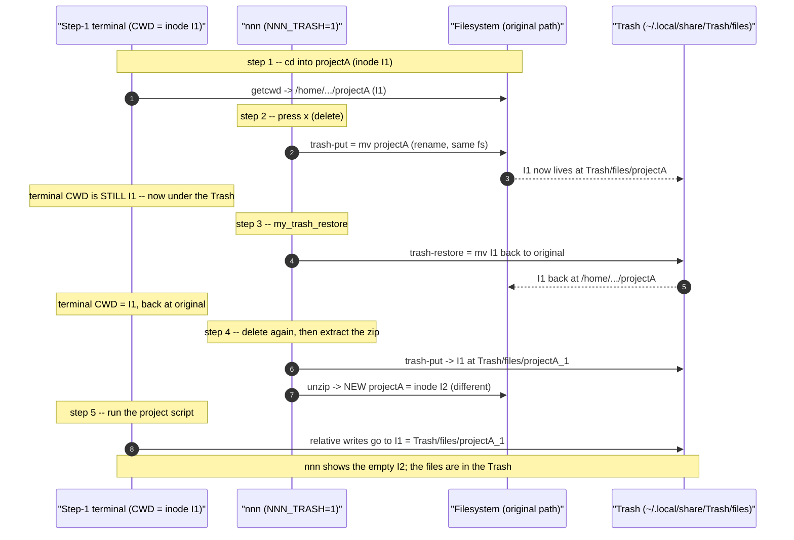
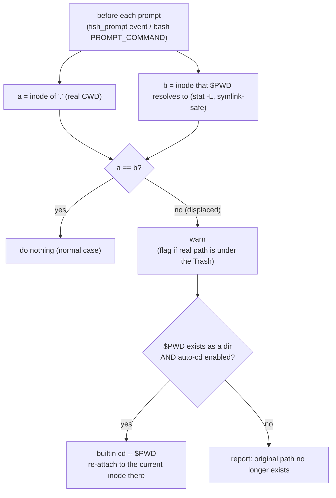

# nnn -- Problems and Solutions

A running log of real problems hit while using this nnn setup, the
investigations behind them, and the fixes. Each entry is self-contained.

---

## Problem 1 -- New files silently land inside the Trash after deleting and re-creating a directory you are `cd`'d into

### 1.1 Symptom (as reported)

1. Open a terminal and `cd` into `projectA` (created by extracting `projectA.zip`).
2. In nnn, delete `projectA` with `x` (confirm yes).
3. Run the `my_trash_restore` plugin (`Alt+r` / `;r`) and restore `projectA`.
4. Delete `projectA` again, then extract `projectA.zip` to create a fresh `projectA`.
5. Back in the **step-1 terminal**, run the project script. The new files are
   **not visible** in nnn or any file manager -- they were actually created in
   `/home/tripham/.local/share/Trash/files/projectA_1`.

A crucial extra clue from the user:

> Inside the terminal, `pwd -P` still shows the **correct** directory, not the
> one in Trash.

### 1.2 TL;DR root cause

A shell's "current directory" is an **open reference to a directory inode**, not
a path string. With `NNN_TRASH=1`, nnn's `x` delete runs `trash-put`, which
**moves** the directory into the Trash. On the same filesystem a move is a
*rename*: the inode is unchanged, it just lives under the Trash now. The step-1
terminal's working directory **silently follows that inode into the Trash**.
Re-extracting the zip creates a **brand-new directory with a different inode** at
the original path; the old terminal is still attached to the *trashed* inode, so
everything it writes lands in the Trash.

The bash/fish **builtin `pwd -P`** made this invisible: after the directory is
re-created, the stale `$PWD` string again names a real (but different) directory,
so the builtin happily prints the original path -- while the kernel's real
`getcwd()` (and therefore every file write) points into the Trash.

This is **inherent Unix behaviour**, not a bug in nnn, the plugin, or the
config. It cannot be prevented from the nnn side, but it can be **detected and
auto-repaired** by a shell prompt hook (the fix in 1.10).

### 1.3 Background -- how a shell's "current directory" really works

```
ASCII Table 1.3: Two different notions of "where am I"
+----------------------+--------------------------------------------------------+
| Notion               | What it is                                             |
+----------------------+--------------------------------------------------------+
| Kernel CWD (real)    | An open handle to a directory INODE. Used by every     |
|                      | relative-path syscall (open, mkdir, getcwd...). If the |
|                      | directory is renamed/moved, this handle follows it --  |
|                      | the path changes, the inode does not.                  |
| $PWD (logical)       | A STRING the shell caches when you `cd`. It is NOT      |
|                      | updated when the directory is moved out from under the |
|                      | shell by some other process (nnn, trash-put, mv).      |
+----------------------+--------------------------------------------------------+
```

The two normally agree. They **diverge** the moment something moves your current
directory without your shell knowing -- exactly what trashing does.

### 1.4 The trigger -- `NNN_TRASH=1` makes delete a *move*

`~/.dotfiles/nnn/nnn_config.sh` sets:

```sh
export NNN_TRASH=1   # x / Ctrl-X route deletes to trash-put instead of rm -rf
```

`trash-put` (and `gio trash`, `NNN_TRASH=2`) **move** the target into
`~/.local/share/Trash/files/`. Because `$HOME` and the Trash are on the **same
filesystem** (`/dev/nvme0n1p5`, ext4), the move is a pure rename -- the inode is
preserved and merely relocated. That preserved inode is what the step-1 terminal
is still holding onto.

> Note: this is trash-method-agnostic. `gio trash` moves too. The issue is
> "delete = move", not the specific tool.

### 1.5 Step-by-step mechanism (with inode tracking)

Let `I1` = the inode of the original `projectA`, `I2` = the inode of the
re-extracted `projectA`.



### 1.6 Why `pwd -P` "looked correct" (the key confusion)

The builtin `pwd -P` does **not** always call `getcwd()`. It canonicalises the
cached `$PWD` string and, if that path still names a valid directory, prints it.
After step 4 re-creates `projectA`, `$PWD` (the original path) is valid again --
so the builtin prints the **original** path even though the real CWD is the
Trash. The external `/bin/pwd` (true `getcwd()`) tells the truth.

Reproduced directly (directory trashed, then re-created at the original path):

```
ASCII Table 1.6: What each "where am I" command reports vs. reality
+----------------------------+------------------------------------+-----------+
| Command                    | Output                             | Truthful? |
+----------------------------+------------------------------------+-----------+
| $PWD                       | /home/.../projectA  (original)     | no (stale)|
| builtin pwd -P             | /home/.../projectA  (original)     | NO  <-- the
|                            |                                    | misleading|
|                            |                                    | clue      |
| /bin/pwd  (real getcwd)    | /home/.../Trash/files/projectA     | YES       |
| stat -c %i .  (CWD inode)  | I1 (the trashed inode)             | YES       |
| stat -c %i $PWD            | I2 (the new, different directory)  | YES       |
| touch newfile -> lands in  | /home/.../Trash/files/projectA     | reality   |
+----------------------------+------------------------------------+-----------+
```

The inode mismatch -- `stat .` (I1) != `stat $PWD` (I2) -- is the reliable,
symlink-safe signal that the working directory has been displaced. The fix in
1.10 keys off exactly this.

### 1.7 Why the files were in `projectA_1` (the `_1` suffix)

`trash-put` avoids name collisions in the Trash by appending `_1`, `_2`, ... When
`projectA` was trashed the second time (step 4), a `projectA` already existed in
the Trash (from earlier delete/restore cycles that were not fully emptied), so
the inode `I1` was stored as `projectA_1`. The suffix is **incidental** -- the
terminal follows `I1` to whatever name it currently has in the Trash.

### 1.8 Minimal reproduction

This reproduces the whole effect with plain `mv` (no nnn/trash-cli needed),
proving it is generic Unix behaviour. Run it with `bash script.sh` (a script,
not your interactive shell, so the `cd` is the real builtin):

```sh
R=/tmp/cwd_repro; rm -rf "$R"; mkdir -p "$R/trash"
mkdir -p "$R/projectA"; cd "$R/projectA"
mv "$R/projectA" "$R/trash/projectA"     # "trash" it (move)
mkdir "$R/projectA"                       # "extract the zip again" (new inode)

echo "builtin pwd -P : $(pwd -P)"         # -> $R/projectA   (looks fine!)
echo "/bin/pwd       : $(/bin/pwd)"       # -> $R/trash/projectA  (the truth)
touch created_here
ls "$R/projectA"        # empty  -- what nnn shows
ls "$R/trash/projectA"  # created_here  -- where the write actually went
```

### 1.9 Is this a bug in nnn / the plugin / the config?

No. Every component behaves correctly:

```
ASCII Table 1.9: Responsibility analysis
+----------------------+------------------------------------------------------+
| Component            | Verdict                                              |
+----------------------+------------------------------------------------------+
| nnn + NNN_TRASH=1    | Correct: routes delete to trash-put as configured.   |
| trash-put / restore  | Correct: a same-fs trash is a move (rename) by design.|
| my_trash_restore     | Correct: restores the inode to its original path.    |
| The terminal shell   | Correct per POSIX: CWD is an inode handle that        |
|                      | follows a rename.                                     |
+----------------------+------------------------------------------------------+
```

The surprise is the *interaction*: a long-lived terminal sitting inside a
directory that gets trashed. nnn cannot know about, or fix, an unrelated
terminal's working directory. The right place to handle it is the **shell**.

### 1.10 Solution -- the `cwd-guard` prompt hook

Install a tiny hook that runs **before every prompt**, compares the inode the
shell is really in against the inode `$PWD` names, and -- on a mismatch --
**warns** and (by default) **re-attaches** to `$PWD`.



Why this is safe and correct:

- It only acts on a genuine **inode mismatch**, so normal navigation and
  symlinked directories never trigger it (`stat -L` resolves `$PWD` the same way
  the kernel resolved your `cd`).
- Re-attaching is just `cd "$PWD"`: it re-resolves the *logical* path string to
  whatever inode is there **now** (the re-extracted `I2`), fixing the terminal.
- If the path is gone (trashed, not re-created), it cannot re-attach and instead
  tells you your directory no longer exists.

#### What was installed, and where

```
ASCII Table 1.10: Installed fixes (this machine uses fish as the main shell)
+--------------------------------------------------+------------------------------+
| File                                             | Role                         |
+--------------------------------------------------+------------------------------+
| ~/.config/fish/conf.d/nnn_cwd_guard.fish         | fish guard, runs on the      |
|   (function __nnn_cwd_guard --on-event           | fish_prompt event. PRIMARY   |
|    fish_prompt)                                   | fix for the main shell.      |
| ~/.dotfiles/nnn/nnn_config.sh  (appended block)  | bash guard via PROMPT_COMMAND|
|   installed only in INTERACTIVE bash, so it is a  | for bash sessions. No-op when|
|   no-op when fish loads the file via `bass`.      | imported through `bass`.     |
+--------------------------------------------------+------------------------------+
```

Both read the same toggles:

```
ASCII Table 1.10b: Toggles (set in fish with `set -Ux`, in bash with `export`)
+--------------------------+-------------------------------------------------+
| Variable                 | Effect                                          |
+--------------------------+-------------------------------------------------+
| NNN_CWD_GUARD=0          | disable the guard entirely                      |
| NNN_CWD_GUARD_AUTOCD=0   | warn only -- do NOT auto re-attach              |
| (unset / default)        | enabled, with auto re-attach                    |
+--------------------------+-------------------------------------------------+
```

The fish function (installed file):

```fish
function __nnn_cwd_guard --on-event fish_prompt \
        --description 'Detect/repair a working directory displaced into the Trash'
    test "$NNN_CWD_GUARD" = 0; and return
    set -l cur (command stat -c '%d:%i' -- . 2>/dev/null)
    test -n "$cur"; or return
    set -l logical (command stat -Lc '%d:%i' -- "$PWD" 2>/dev/null)
    test "$cur" = "$logical"; and return            # CWD matches $PWD -> done
    set -l here (env pwd -P 2>/dev/null)            # real getcwd, not builtin
    switch "$here"
        case "*/.local/share/Trash/*" "*/.Trash-*/*"
            echo "[cwd-guard] Warning: this shell is physically inside the Trash:" >&2
            echo "            $here" >&2
        case "*"
            echo "[cwd-guard] Warning: working directory was moved/replaced under this shell (real: $here)" >&2
    end
    if test -d "$PWD"; and test "$NNN_CWD_GUARD_AUTOCD" != 0
        builtin cd -- "$PWD" 2>/dev/null; and echo "[cwd-guard] re-attached to $PWD" >&2
    else if not test -d "$PWD"
        echo "[cwd-guard] its original path no longer exists: $PWD" >&2
    end
end
```

#### Immediate manual remedy (no hook)

If you ever notice the symptom, in the affected terminal run:

```sh
cd "$PWD"        # re-resolves the logical path to the current inode there
# or:
cd ..; cd projectA
```

Note: `cd .` does **not** help -- `.` is the (trashed) inode you are already on.
You must re-resolve the **path string**.

#### Prevention habits

- After restoring or re-extracting a directory you have terminals sitting in,
  re-enter it in those terminals (`cd "$PWD"`).
- Prefer not to keep a terminal parked inside a directory you are about to
  delete/recreate from nnn; or rely on the guard above to repair it.

### 1.11 Secondary finding -- `trash-cli` version vs. `my_trash_restore`

This machine has **`trash-cli 0.17.1.14`**, but
[plugins/my_trash_restore](../plugins/my_trash_restore) documents itself as
needing **`>= ~0.22`** for the comma-separated **multi**-restore
(`trash-restore` accepting `1,3,5`). On 0.17:

- **Single** restore (pick one item) works -- this is the path used in the
  reported steps.
- **Multi**-select restore may be rejected as an invalid index. If multi-restore
  is needed, upgrade trash-cli (e.g. `pipx install trash-cli`) or restore one
  item at a time.

This is unrelated to Problem 1, but worth recording since the plugin and the
installed tool version disagree.

### 1.12 Verification

```
ASCII Table 1.12: Tests run while fixing this (all passing)
+------------------------------------------+----------------------------------+
| Case                                     | Result                           |
+------------------------------------------+----------------------------------+
| Normal directory                         | guard does NOT trigger           |
| Symlinked directory                      | guard does NOT trigger           |
| Trashed then re-created (the bug)        | warns + auto re-attaches to the  |
|                                          | new inode; files then land in    |
|                                          | the real directory               |
| Trashed and NOT re-created               | warns "original path gone"       |
| fish: emit fish_prompt after displacement| re-attaches (event hook fires)   |
| bash: PROMPT_COMMAND after displacement  | re-attaches in the main shell    |
| fish `bass source nnn_config.sh`         | imports env only; bash guard is  |
|                                          | NOT installed (no interference)  |
+------------------------------------------+----------------------------------+
```
