# nnn -- Software Design Document (HLD + LLD)

> Comprehensive High-Level and Low-Level Design of
> [nnn](https://github.com/jarun/nnn), the terminal file manager, reconstructed
> from the source at `origin-old/master` (`ecf6d9a8`). Line references point to
> [src/nnn.c](../src/nnn.c) (10,821 LOC) and [src/nnn.h](../src/nnn.h) (293 LOC).
>
> nnn is written in **C**, not an object-oriented language. This document treats
> each major `struct` together with the function-group that operates on it as a
> "class/module" -- the standard way to apply UML/5W1H to idiomatic C. Where a
> diagram type has no native Mermaid form (collaboration), an annotated
> `flowchart` with numbered messages is used.

---

## Table of Contents

1. Introduction and Scope
2. High-Level Design (HLD)
   - 2.1 System Context
   - 2.2 Layered Architecture
   - 2.3 Module Decomposition
   - 2.4 Process and Concurrency Model
   - 2.5 Runtime Data Flow
   - 2.6 External Interface Contract
3. Low-Level Design (LLD)
   - 3.1 Core Data Structures -- Class Diagram
   - 3.2 Class/Struct Summary Table
   - 3.3 Collaboration Diagram
   - 3.4 5W1H Analysis of the Main Classes
   - 3.5 Dynamic Behaviour (activity, sequence, state, flowchart)
   - 3.6 Keyboard and Input Event Handling (Deep Dive)
4. Cross-Cutting Concerns
5. Traceability to the Fork Features (Part I and Part II)

---

## 1. Introduction and Scope

nnn is a single-binary, ncurses-based file manager. It is a **monolithic C
program** organised around one long-lived event loop (`browse()`) that owns the
terminal, renders a directory listing, reads key events, and delegates real work
(copy, move, open, archive, mount, preview) to **external processes** (coreutils,
the user's `$EDITOR`/opener, and shell-script *plugins*). nnn keeps a small set
of **global state structs** in memory and persists a little of it to disk
(sessions, selection, bookmarks).

Two fork features are designed in companion documents and referenced here for
traceability:

- **Part I** -- auto-save the session on directory change
  ([Brainstorm_nnn_Update.md, Part I](Brainstorm_nnn_Update.md)).
- **Part II** -- FileZilla-style copy/move conflict resolution
  ([Brainstorm_nnn_Update.md, Part II](Brainstorm_nnn_Update.md)).

---

## 2. High-Level Design (HLD)

### 2.1 System Context

The diagram below places nnn between the **user at a terminal** and the
**operating system / external programs** it orchestrates. nnn itself holds no
business logic for file operations -- it is a *coordinator* that turns key
presses into process invocations and screen updates.

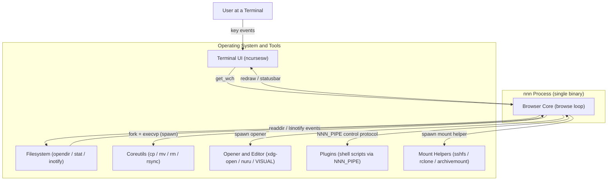

**Explanation.** Every arrow into `Browser Core` is an *event* (a key, an
inotify notification, or a plugin command on the control pipe); every arrow out
is either a *render* (to ncurses) or a *delegation* (a `fork`+`execvp` via
`spawn()`). This single fact -- "coordinate, don't compute" -- shapes the whole
design: nnn stays small and fast, and capability is added by writing plugins and
relying on standard tools.

### 2.2 Layered Architecture

Although physically one `.c` file, nnn is logically layered. Higher layers
depend on lower ones; lower layers never call up.

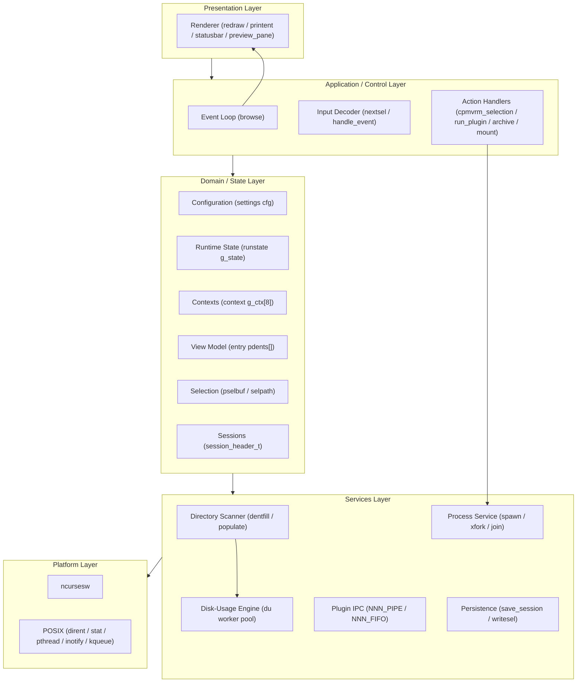

**Explanation.** The **Control Layer** (`browse`) is the only place that ties
everything together. The **State Layer** is pure data (the structs of section
3.1). The **Services Layer** is stateless-ish machinery (scan a dir, run a
process, write a file). Keeping `browse()` as the sole orchestrator is *why* a
one-line hook there (Part I) or in `opstr()` (Part II) can change behaviour
globally with minimal code.

### 2.3 Module Decomposition

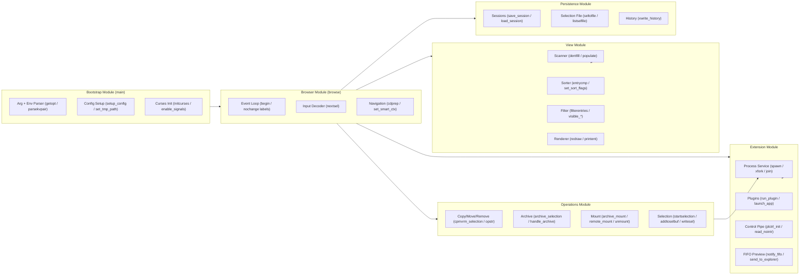

**Explanation.** Six modules, each fronted by a small number of entry-point
functions. The arrows are *call* dependencies at runtime. Note that both `Ops`
and `Ext` funnel into the **Process Service** (`spawn`) -- that is nnn's single
gateway to the OS for anything heavier than a syscall.

### 2.4 Process and Concurrency Model

nnn is **mostly single-threaded** (one UI thread runs `browse()`), with two
forms of concurrency:

1. **Child processes** -- created by `spawn()` (`fork`+`execvp`) for every
   external tool, opener, editor, and plugin.
2. **A disk-usage worker thread pool** -- created on demand by `prep_threads()`
   when the listing is sorted by disk usage (`blkorder`), to parallelise the
   recursive `du`-style walk.

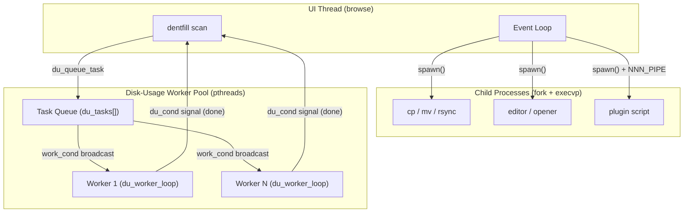

**Explanation.** The UI thread blocks in `join()` while a child runs
(foreground tools) -- nnn deliberately yields the terminal to `cp`/`$EDITOR` and
resumes after. The worker pool is a classic **producer/consumer**: `dentfill()`
produces directory tasks, workers consume them, and the producer waits on
`du_cond` until `du_tasks_pending` reaches zero. Mutexes `running_mutex` /
`du_count_mutex` and condition variables `work_cond` / `du_cond` coordinate them
(declared at [src/nnn.c:513-519](../src/nnn.c#L513)).

### 2.5 Runtime Data Flow

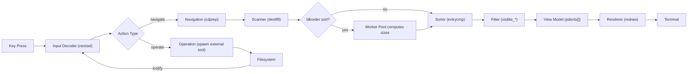

**Explanation.** A navigation flows left-to-right into the in-memory **view
model** `pdents[]` and out to the screen. Operations branch off to child
processes that mutate the filesystem; the resulting **inotify** event re-enters
the loop and triggers a re-scan, keeping the view live without polling.

### 2.6 External Interface Contract

nnn communicates with plugins and child processes through **environment
variables** and **named pipes**, not function calls. This is the public ABI of
the extension system.

```
ASCII Table 2.6: External interface contract (selected)
+----------------------+--------------------------------------------------------+
| Channel              | Purpose                                                |
+----------------------+--------------------------------------------------------+
| NNN_PIPE (FIFO)      | Plugin -> nnn control protocol (cd, select, refresh)   |
| NNN_FIFO (FIFO)      | nnn -> previewer: hovered/opened path stream           |
| NNN_SEL (file)       | Path to the NUL-separated selection file               |
| NNN_BMS / NNN_PLUG   | Bookmark / plugin key:value maps (parsekvpair)         |
| NNN_OPENER           | Program used to open files                             |
| NNN_LIST / NNNLVL    | Listing root / nesting level for nested nnn            |
| env_cfg[] (src:762)  | The full table of NNN_* names nnn reads/exports        |
+----------------------+--------------------------------------------------------+
```

**Explanation.** Because the contract is env + pipes, plugins can be written in
any language and nnn need not link them. The control protocol is decoded by
`read_nointr()` / `run_plugin()` ([src/nnn.c:6474](../src/nnn.c#L6474)); the
preview stream is written by `notify_fifo()` ([src/nnn.c:7416](../src/nnn.c#L7416)).

---

## 3. Low-Level Design (LLD)

### 3.1 Core Data Structures -- Class Diagram

The static (structural) UML view. Each "class" is a C `struct`; the global
instance that embodies it is noted in the summary table (3.2). Bit-field members
are shown as `bool` for readability.

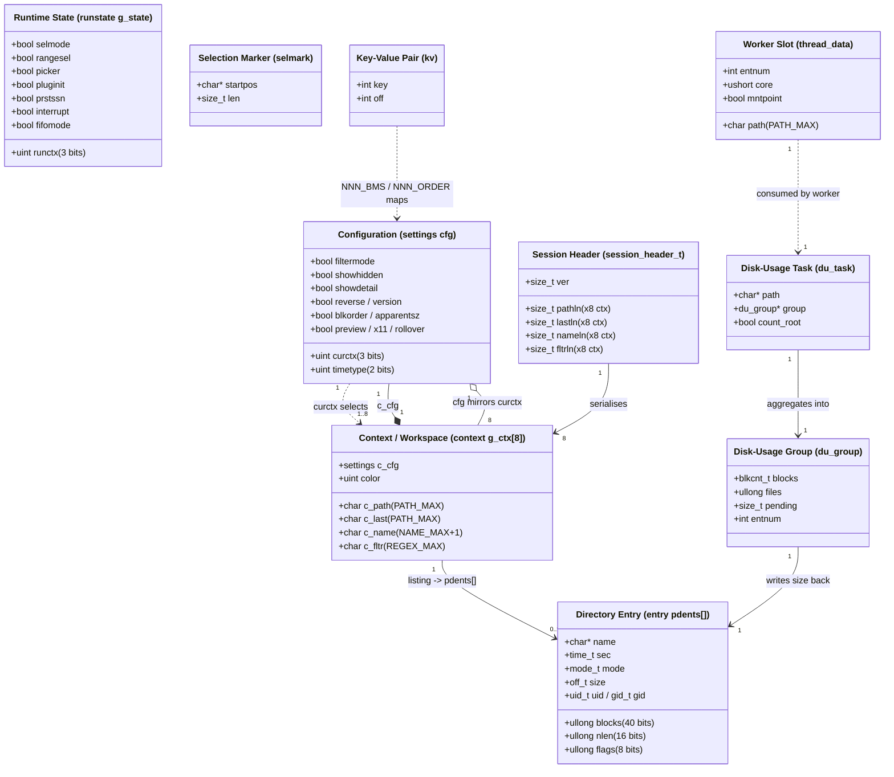

**Explanation.** The center of gravity is **`context`**: nnn keeps an array of 8
of them (workspaces), each a self-contained snapshot of "where I am and how I am
viewing it" (path, last dir, hovered name, filter, and a per-context `settings`
copy). The *global* `cfg` mirrors the active context's `c_cfg`; switching
context swaps `cfg` in and out (`savecurctx`/`setcfg`). The **`entry`** array
`pdents[]` is the transient *view model* rebuilt on every scan. **`session_header_t`**
is purely a serialisation descriptor for persisting all 8 contexts. The
disk-usage trio (`du_task`/`du_group`/`thread_data`) exists only while a
`blkorder` scan is running.

### 3.2 Class/Struct Summary Table

```
ASCII Table 3.2: Summary of the core "classes" (structs)
+----------------------+-------------------+----------+--------------------------------+
| Class (struct)       | Global instance   | Lifetime | Responsibility                 |
+----------------------+-------------------+----------+--------------------------------+
| settings             | cfg               | program  | Active view + sort + mode flags|
| runstate             | g_state           | program  | Transient program-internal     |
|                      |                   |          | state (modes, picker, plugin)  |
| context              | g_ctx[CTX_MAX=8]  | program  | Per-workspace navigation state |
| entry                | pdents[] (ndents) | per-scan | One row of the listing (view   |
|                      |                   |          | model)                         |
| session_header_t     | (stack, on save)  | per-op   | On-disk session layout header  |
| selmark              | (stack)           | per-op   | A run inside the selection buf |
| kv                   | bookmark/plug/    | program  | Parsed key:value env maps      |
|                      | order             |          |                                |
| du_task              | du_tasks[]        | per-scan | Queued dir for the du pool     |
| du_group             | (per top entry)   | per-scan | Aggregated size/file counters  |
| thread_data          | core_data[]       | per-scan | A worker's current assignment  |
| fltrexp_t            | (stack)           | per-key  | Compiled filter (regex/pcre)   |
+----------------------+-------------------+----------+--------------------------------+
```

Supporting **global buffers** that are not structs but behave like fields of an
implicit "Selection" and "Paths" object:

```
ASCII Table 3.2b: Key global buffers (implicit state)
+------------------+----------------------------------------------------------+
| Global           | Role                                                     |
+------------------+----------------------------------------------------------+
| pselbuf/selbufpos| In-memory NUL-separated selection buffer + write head    |
| selpath          | Path of the on-disk selection file (NNN_SEL)             |
| curssn           | Active session name ("" = none) -- Part I guard          |
| cp / mv          | The cp/mv command strings -- Part II chokepoint via opstr|
| g_buf / g_tmpfpath| Scratch command/temp-path buffers                       |
| pnamebuf         | Backing store for all entry.name pointers in pdents[]    |
+------------------+----------------------------------------------------------+
```

### 3.3 Collaboration Diagram

UML collaboration (communication) diagram for the **navigate-into-a-directory**
use case. Numbers are message sequence; this is the same scenario as the
sequence diagram in 3.5.3 but emphasises *who talks to whom*.

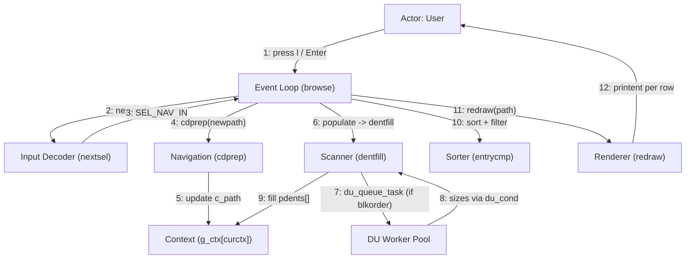

**Explanation.** The collaboration makes the **central role of `browse()`**
explicit: messages 3, 4, 6, 10, 11 all originate from the loop. No service calls
another service directly except the scanner-to-pool hand-off (7/8). This star
topology (everything through the loop) is what keeps the control flow auditable
and is the architectural reason a single hook can implement a cross-cutting
feature.

### 3.4 5W1H Analysis of the Main Classes

Each main "class" is analysed with **What / Who / Where / When / Why / How**.

#### 3.4.1 Configuration (`settings cfg`)

```
ASCII Table 3.4.1: 5W1H -- settings / cfg
+-------+----------------------------------------------------------------------+
| What  | A 32-bit packed bit-field of the active view, sort order and modes    |
|       | (hidden files, detail, reverse, time type, blkorder, preview, x11).  |
| Who   | Read by the Renderer, Sorter, Scanner; written by action handlers    |
|       | (toggles) and by load_session/setcfg.                                |
| Where | Global `cfg` (src/nnn.c:439); mirrored per workspace in context.c_cfg.|
| When  | Read on every redraw and sort; written on a setting toggle, context  |
|       | switch, or session load.                                             |
| Why   | One compact, copyable value lets a whole view configuration be saved, |
|       | restored and swapped between contexts cheaply.                       |
| How   | Bit-fields keep it small (fits a register-ish word); savecurctx()     |
|       | copies cfg into the context and setcfg() copies it back on switch.   |
+-------+----------------------------------------------------------------------+
```

#### 3.4.2 Runtime State (`runstate g_state`)

```
ASCII Table 3.4.2: 5W1H -- runstate / g_state
+-------+----------------------------------------------------------------------+
| What  | Non-persistent program-internal flags: selection mode, range select, |
|       | picker mode, plugin-init, persistent-session, interrupt, fifomode.   |
| Who   | Mutated by nearly every handler; read by browse() to branch.         |
| Where | Global `g_state` (src/nnn.c:576).                                    |
| When  | Throughout a session; never written to disk (unlike cfg/context).    |
| Why   | Separates *ephemeral* mode bits from *persistable* view config, so    |
|       | sessions never accidentally store transient UI state.                |
| How   | A second bit-field struct, distinct from settings precisely so the    |
|       | session serializer can ignore it.                                    |
+-------+----------------------------------------------------------------------+
```

#### 3.4.3 Context / Workspace (`context g_ctx[8]`)

```
ASCII Table 3.4.3: 5W1H -- context / g_ctx[]
+-------+----------------------------------------------------------------------+
| What  | A workspace: current dir, last dir, hovered file name, active filter, |
|       | a private settings copy, and a directory color.                      |
| Who   | The Event Loop and Navigation own it; the Session serializer reads   |
|       | all 8; set_smart_ctx/savecurctx switch between them.                 |
| Where | Global array `g_ctx[CTX_MAX]` (src/nnn.c:446); CTX_MAX = 8.          |
| When  | The active one (cfg.curctx) is live continuously; others are dormant |
|       | snapshots until selected.                                            |
| Why   | Lets the user keep 8 independent "tabs" and restore them as a unit    |
|       | via sessions -- the unit of persistence.                            |
| How   | Switching saves cfg into the old context and loads the new context's |
|       | c_cfg into cfg; paths are fixed-size PATH_MAX buffers for easy I/O.  |
+-------+----------------------------------------------------------------------+
```

#### 3.4.4 Directory Entry / View Model (`entry pdents[]`)

```
ASCII Table 3.4.4: 5W1H -- entry / pdents[]
+-------+----------------------------------------------------------------------+
| What  | One listing row: name pointer, mtime, mode, size, block count, name   |
|       | length, per-file flags, and (optionally) uid/gid.                    |
| Who   | Produced by the Scanner (dentfill); consumed by Sorter, Filter,      |
|       | Renderer; indexed by `cur` (the hovered row).                       |
| Where | Heap array `pdents` (src/nnn.c:489), count `ndents`; names packed in |
|       | the shared `pnamebuf` arena.                                         |
| When  | Rebuilt from scratch on every scan (navigation or refresh); discarded|
|       | on the next populate().                                             |
| Why   | A compact, cache-friendly array makes sort/filter/scroll over very   |
|       | large directories fast; bit-packed fields shrink per-row footprint.  |
| How   | dentfill() readdir+lstat each entry into a growable array (ENTRY_INCR|
|       | chunks); names are appended to pnamebuf and referenced by pointer.   |
+-------+----------------------------------------------------------------------+
```

#### 3.4.5 Selection Subsystem (`pselbuf` / `selpath` / `selmark`)

```
ASCII Table 3.4.5: 5W1H -- Selection subsystem
+-------+----------------------------------------------------------------------+
| What  | The set of marked file paths, held as a NUL-separated in-memory buf   |
|       | (pselbuf) and flushed to an on-disk file (selpath / NNN_SEL).        |
| Who   | startselection/addtoselbuf/rmfromselbuf write it; cpmvrm_selection,  |
|       | archive, and plugins read selpath; the cpmv plugin (Part II) parses  |
|       | it.                                                                 |
| Where | pselbuf/selbufpos (src/nnn.c:477,455); selpath file under tmp.       |
| When  | Built as the user presses Space/'m'; flushed (writesel) on each      |
|       | change and consumed by an operation.                                |
| Why   | Decouples *what is selected* from *what to do*: any op (cp, mv, tar, |
|       | plugin) reads the same selection file.                              |
| How   | writesel() writes selbufpos-1 bytes (drops the trailing NUL) -- the  |
|       | subtlety the Part II cpmv helper must handle when parsing.          |
+-------+----------------------------------------------------------------------+
```

#### 3.4.6 Process Service (`spawn` / `xfork` / `join`)

```
ASCII Table 3.4.6: 5W1H -- Process Service
+-------+----------------------------------------------------------------------+
| What  | The single gateway that runs every external program (tools, opener,  |
|       | editor, plugins, mount helpers).                                    |
| Who   | Called by all Operation and Extension handlers; never bypassed.      |
| Where | spawn() (src/nnn.c:2640), xfork(), join().                          |
| When  | Whenever work exceeds a syscall: copy, move, open, archive, mount,   |
|       | run plugin.                                                         |
| Why   | Centralising fork/exec gives one place to manage flags (suppress     |
|       | output, detach, give the tty, confirm-on-return) and signal state.  |
| How   | fork(); in the child optionally redirect std fds per flags, then     |
|       | execvp(); the parent join()s (waitpid) unless F_NOWAIT (detached).  |
+-------+----------------------------------------------------------------------+
```

#### 3.4.7 Disk-Usage Engine (`du_task` / `du_group` / worker pool)

```
ASCII Table 3.4.7: 5W1H -- Disk-Usage Engine
+-------+----------------------------------------------------------------------+
| What  | An on-demand pthread pool that recursively sums block/file counts for |
|       | each top-level entry when sorting by disk usage.                    |
| Who   | Producer: dentfill(). Consumers: du_worker_loop() threads. Results   |
|       | written back into entry.blocks.                                     |
| Where | du_tasks[] queue, core_data[] slots, worker_tids[] (src/nnn.c:543+). |
| When  | Only while cfg.blkorder (or apparentsz) is set; torn down after.    |
| Why   | A recursive du over big trees is I/O-bound; parallel workers hide    |
|       | latency and keep the UI responsive.                                 |
| How   | Producer enqueues dirs and broadcasts work_cond; workers walk dirs,  |
|       | dedup inodes via a hash bitmap, and signal du_cond when pending=0.  |
+-------+----------------------------------------------------------------------+
```

#### 3.4.8 Browser / Event Loop (`browse`)

```
ASCII Table 3.4.8: 5W1H -- Browser Event Loop
+-------+----------------------------------------------------------------------+
| What  | The long-lived control loop that owns the terminal and orchestrates   |
|       | scan -> render -> read-key -> dispatch.                             |
| Who   | The only caller of the Renderer and Input Decoder; the hub every     |
|       | action returns to via `goto begin` / `goto nochange`.              |
| Where | browse() (src/nnn.c:8425); labels begin: and nochange:.             |
| When  | From just after curses init until the user quits.                   |
| Why   | A single loop with two re-entry labels makes control flow explicit   |
|       | and gives natural single-point hooks (Part I auto-save sits here).  |
| How   | begin: chdir+populate+render; nochange: read key, switch(action),   |
|       | mutate state, goto the right label.                                |
+-------+----------------------------------------------------------------------+
```

### 3.5 Dynamic Behaviour

#### 3.5.1 Program Startup -- Activity Diagram

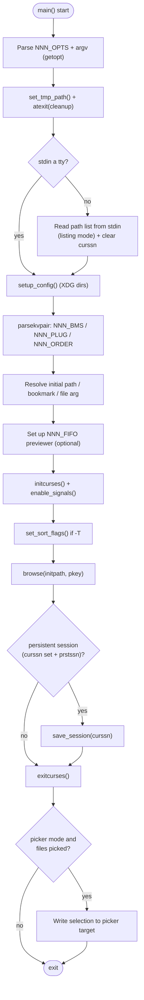

**Explanation.** Startup is linear and fail-fast: each setup step returns
`EXIT_FAILURE` on error before curses is initialised, so the terminal is never
left in a broken state. The branch at "stdin a tty?" is how nnn enters **listing
mode** (reading a file list from a pipe). Note the two session touch-points
(clear on listing mode, save on persistent exit) that Part I builds on.

#### 3.5.2 Browser Main Loop -- State Diagram

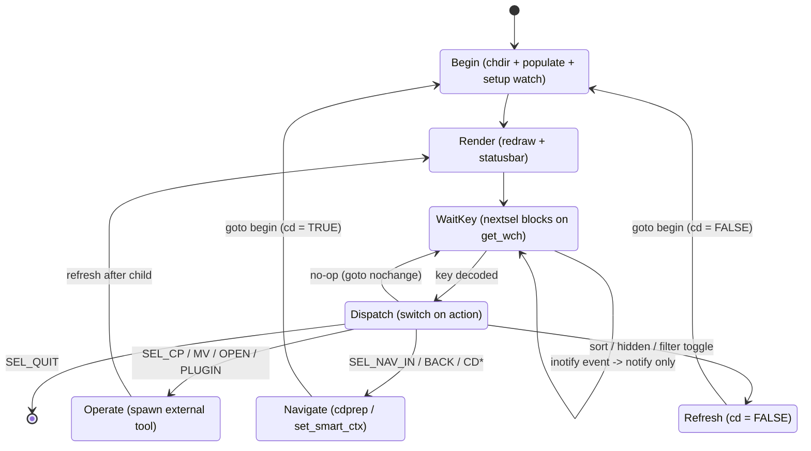

**Explanation.** Two re-entry points correspond to the two labels in the source:
**Begin** (full re-scan, used after a real directory change) and the implicit
return to **WaitKey** (`nochange`, no re-scan). The `cd` boolean distinguishes a
real `chdir` (`Navigate -> Begin`, `cd = TRUE`) from an in-place refresh
(`Refresh -> Begin`, `cd = FALSE`) -- the exact flag Part I's auto-save hook
keys off.

#### 3.5.3 Navigate Into Directory -- Flowchart

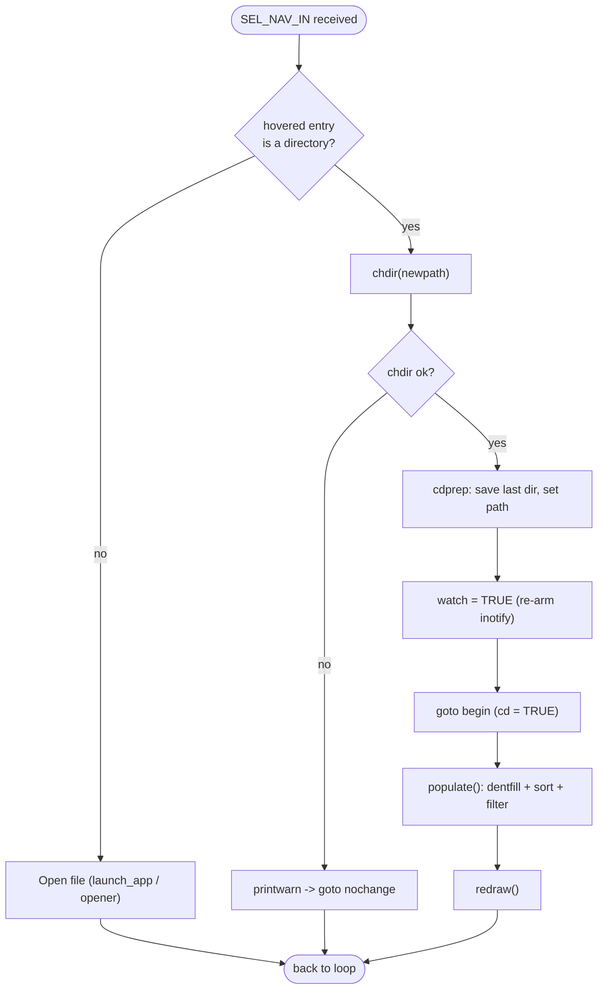

**Explanation.** This is the concrete control flow behind the "Navigate" state.
`cdprep()` ([src/nnn.c:8395](../src/nnn.c#L8395)) records the previous directory
(for `cd -`-style back) and swaps `path`; the `goto begin` re-enters the scan.
Part I inserts its `save_session()` call at the top of `begin:` precisely so it
runs after every such transition.

#### 3.5.4 Directory Scan with Disk-Usage Pool -- Sequence Diagram

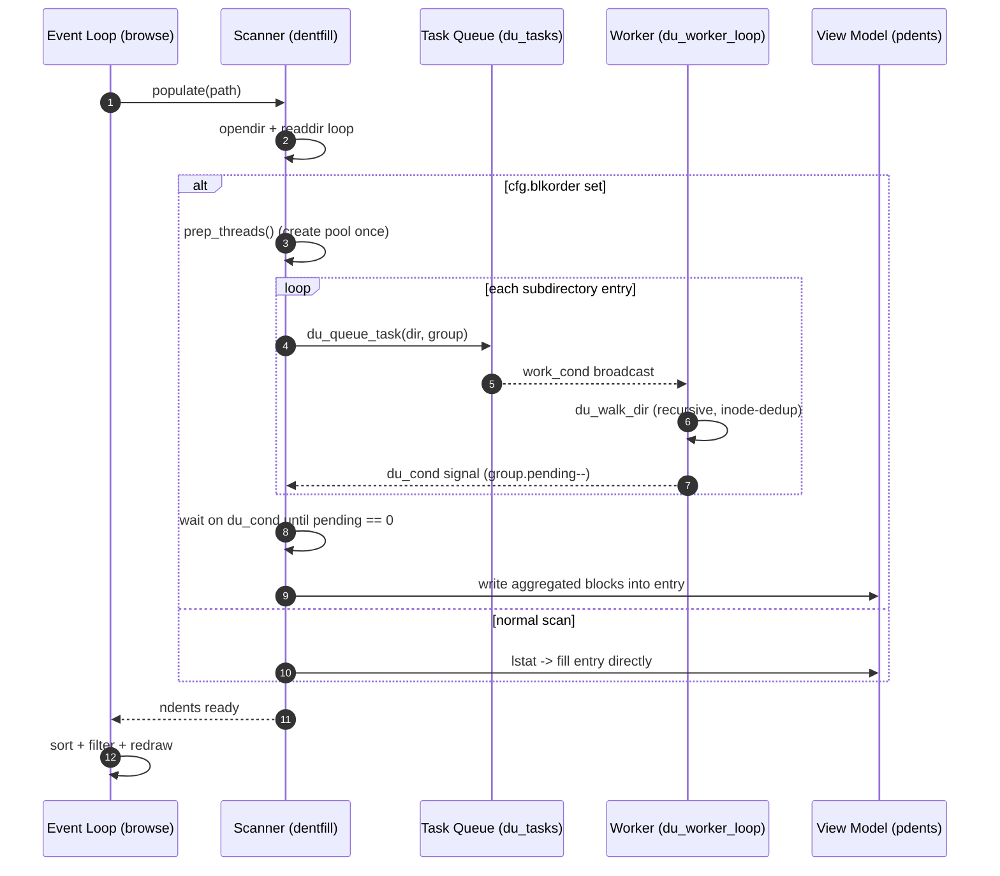

**Explanation.** The `alt` fragment shows the two scan paths. In `blkorder`
mode the scanner is a **producer** that fans subdirectory walks out to the pool
and blocks on `du_cond` until every `du_group.pending` counter hits zero, then
copies the summed `blocks` into each `entry`. This is the only place nnn uses
threads, and it is fully torn down when the user leaves disk-usage sort.

#### 3.5.5 Process Service -- Sequence Diagram

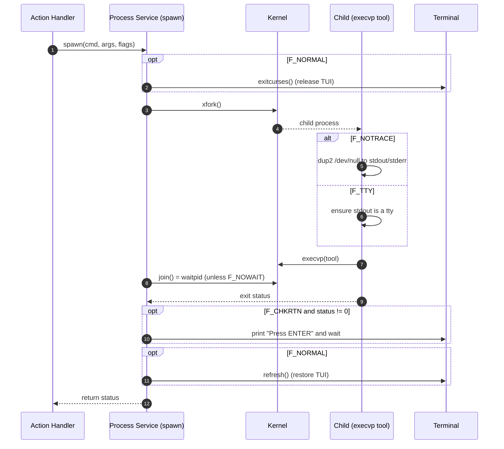

**Explanation.** Flags compose to express intent: `F_NORMAL` hands the terminal
to the child and takes it back; `F_NOTRACE`/`F_NOSTDIN` silence background jobs;
`F_NOWAIT` detaches (no `waitpid`); `F_CHKRTN`/`F_CONFIRM` pause so the user can
read tool output. The cp/mv/cpmv operations (Part II) run through this exact path
with `F_CLI | F_CHKRTN`.

#### 3.5.6 Filter Mode -- State Diagram

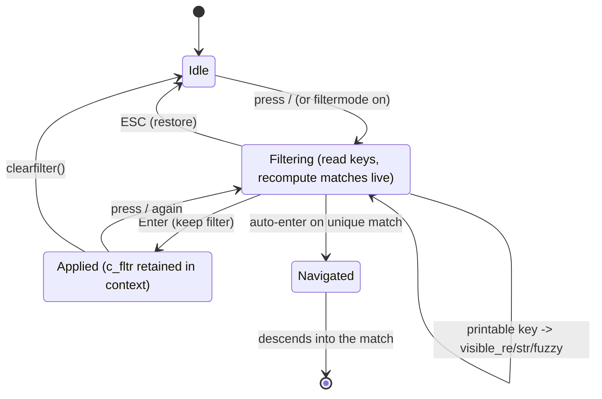

**Explanation.** `filterentries()` ([src/nnn.c:3810](../src/nnn.c#L3810)) runs a
mini event loop that recomputes the visible set on each keystroke using one of
three matchers (`visible_re`, `visible_str`, `visible_fuzzy`) chosen by `cfg`.
The retained filter lives in `context.c_fltr`, which is *why* it is persisted in
sessions.

#### 3.5.7 Session Save / Load -- Sequence Diagram (Part I tie-in)

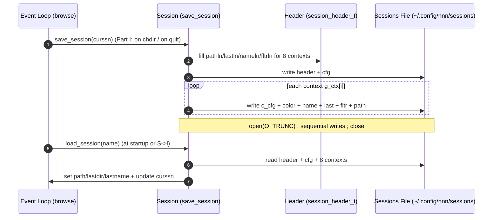

**Explanation.** A session is a flat snapshot of **all 8 contexts** plus the
global `cfg`. The header stores per-context field lengths so the reader can
parse variable-length names/paths. Part I's contribution is calling
`save_session(curssn[0] ? curssn : "@", NULL)` from the `begin:` label so this
snapshot is refreshed on every directory change, not only at clean exit.

#### 3.5.8 Copy/Move with Conflict Resolution -- Sequence Diagram (Part II tie-in)

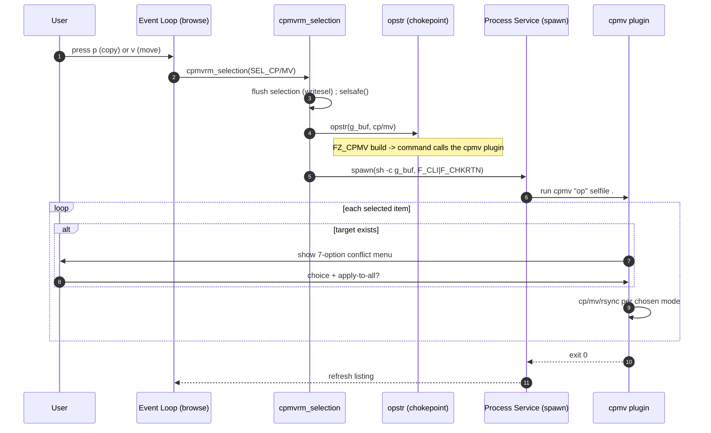

**Explanation.** `opstr()` ([src/nnn.c:2737](../src/nnn.c#L2737)) is the single
chokepoint both `p` and `v` pass through; Part II rewrites its one command line
(under `-DFZ_CPMV`) to invoke the `cpmv` plugin, which implements the per-file
menu and the "apply to all" loop. Everything still flows through the standard
`spawn()` path, so terminal handling and return-code checking are unchanged.

#### 3.5.9 Plugin Control Protocol -- Sequence Diagram

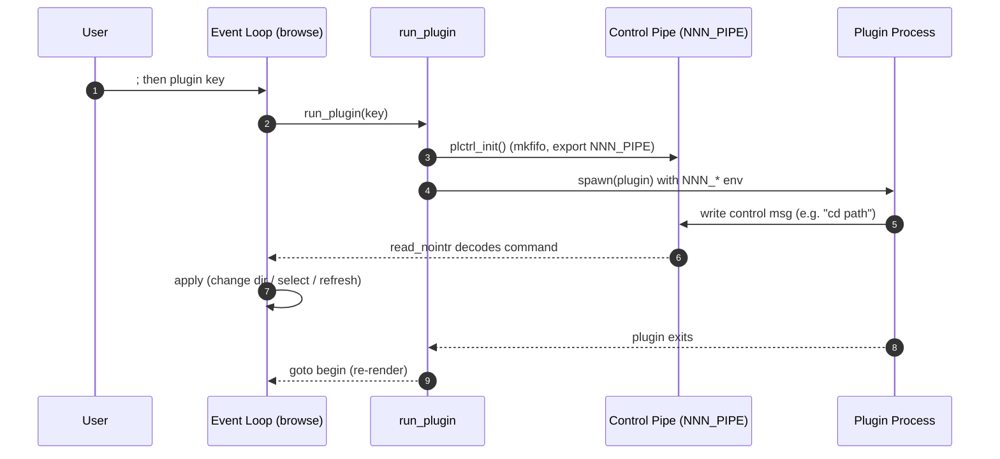

**Explanation.** Plugins are not linked in; they are child processes that speak a
tiny **control protocol** back to nnn over the `NNN_PIPE` FIFO. `read_nointr()`
([src/nnn.c:6474](../src/nnn.c#L6474)) decodes single-byte opcodes followed by a
payload (e.g. change directory, select entries, refresh). This is how a shell
script can make nnn navigate -- the basis of Approach B in Part II.

#### 3.5.10 Rendering Pipeline -- Flowchart


**Explanation.** `redraw()` ([src/nnn.c:8249](../src/nnn.c#L8249)) is pure
presentation: it reads `pdents[]`, `cur`, and `cfg`, and writes ncurses cells. It
never mutates model state, which keeps rendering idempotent and cheap to call on
every loop iteration.

---

### 3.6 Keyboard and Input Event Handling (Deep Dive)

This section traces a keystroke end-to-end: **how nnn acquires a raw key, how it
decodes/interprets it into an action, and how it executes that action** -- the
core interactive contract of the program. Five functions own this pipeline:
`initcurses()` (configure the terminal), `nextsel()` (acquire + decode),
`bindings[]` (key->action table, [src/nnn.h:133](../src/nnn.h#L133)), the
`switch (sel)` in `browse()` (dispatch), and the modal sub-loops `get_input()` /
`xreadline()` / `filterentries()` (capture richer input).

#### 3.6.1 The Input Stack

nnn does not read the terminal directly; it configures **ncurses** once at
startup and then pulls *wide characters* one at a time. The relevant settings
(from `initcurses()`, [src/nnn.c:2420](../src/nnn.c#L2420)) define the entire
input behaviour:

```
ASCII Table 3.6.1: ncurses input configuration and its effect
+------------------------+----------------------------------------------------+
| Call                   | Effect on input                                    |
+------------------------+----------------------------------------------------+
| cbreak()               | Disable line buffering -- each key is available    |
|                        | immediately, no Enter required.                    |
| noecho()               | Typed keys are NOT echoed -- nnn draws everything. |
| nonl()                 | Do not translate Enter; distinguish CR from LF.    |
| keypad(stdscr, TRUE)   | Decode escape sequences into KEY_* constants        |
|                        | (KEY_LEFT, KEY_UP, KEY_NPAGE, KEY_MOUSE, ...).      |
| mousemask(...)         | Subscribe to button/scroll events as KEY_MOUSE.    |
| mouseinterval(0)       | Disable curses click timing -- nnn times its own   |
|                        | double-clicks (DBLCLK_INTERVAL_NS).                |
| curs_set(FALSE)        | Hide the hardware cursor.                          |
| set_escdelay(25)       | Wait 25 ms after a lone ESC to detect Alt/escape   |
|                        | sequences.                                         |
| settimeout()=timeout(  | get_wch() blocks at most 1000 ms, then returns ERR |
|   1000)                | -- this is the heartbeat that drives idle polling.  |
+------------------------+----------------------------------------------------+
```

```mermaid
%% The input stack: from physical key to a dispatched action
flowchart LR
    Term["Terminal / TTY (raw bytes)"] --> Ncurses["ncurses Input (get_wch + keypad)"]
    Ncurses --> Decoder["Input Decoder (nextsel)"]
    Decoder --> Table["Key-Action Table (bindings[])"]
    Table --> Dispatch["Dispatcher (switch sel in browse)"]
    Dispatch --> Handler["Action Handler (navigate / operate / mode)"]
    Handler --> Effect["Effect (state change / spawn / redraw)"]
```

ASCII view of the same five-stage pipeline, showing the data type handed across
each boundary:

```
  bytes            wint_t              SEL_* enum            mutation
+--------+      +-----------+       +-------------+       +-----------+      +---------+
|Terminal| ---> |  ncurses  | ----> |  nextsel()  | ----> |  browse   | ---> | Effect: |
|  (tty) |  KB  | get_wch   | wide  |  decode +   |action |  switch   | call | state / |
|        |      | keypad on | char  |  bindings[] |       |  (sel)    |      | spawn   |
+--------+      +-----------+       +-------------+       +-----------+      +---------+
                                          ^                     |
                                          |   presel (synthetic key, no read)
                                          +---------------------+
```

**Explanation.** Each stage narrows the signal: raw bytes become one `wint_t`
wide char, the wide char becomes a bounded `enum action`, and the action becomes
a concrete state mutation or process spawn. The feedback arrow is the **presel**
channel (3.6.6): a handler can inject the next "key" without touching the
keyboard.

#### 3.6.2 Acquisition and Decode -- `nextsel()`

`nextsel(presel)` ([src/nnn.c:3571](../src/nnn.c#L3571)) is the heart of input.
It returns a bound `SEL_*` action (or `0` if the key is unbound). Its logic:

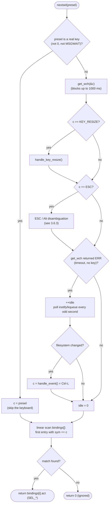

**Explanation.** Three subtleties make this robust:

1. **Blocking with a deadline.** `get_wch()` returns `ERR` after 1 s
   (`settimeout`). That is not an error -- it is the **idle tick** that lets nnn
   poll the filesystem watcher and refresh without a busy loop.
2. **Wide characters.** `get_wch()` yields a `wint_t`, so multibyte/UTF-8 keys
   and `KEY_*` curses constants share one code path.
3. **Linear lookup.** The `bindings[]` table is scanned top-to-bottom
   ([src/nnn.c:3668](../src/nnn.c#L3668)); the **first** match wins. The table is
   small (~90 rows) so a linear scan is cheaper than a hash and keeps multiple
   aliases (e.g. `h` and `KEY_LEFT`) trivially mapping to the same action.

#### 3.6.3 ESC / Alt / Double-ESC Disambiguation

A bare `ESC` byte is ambiguous in terminals: it can be a standalone Escape, the
prefix of an **Alt+key** combination, or the start of a function-key sequence
(already absorbed by `keypad`). nnn resolves this with a tiny timed state
machine inside `nextsel()`:

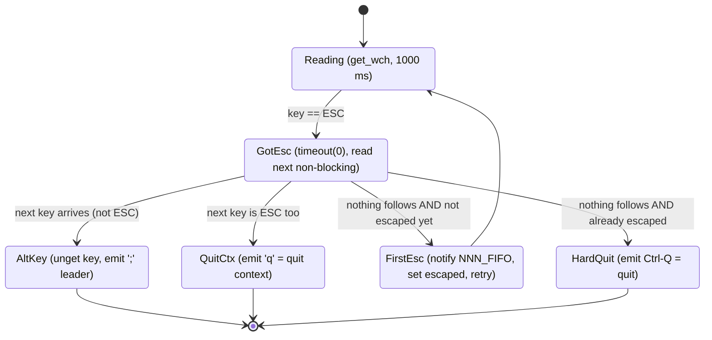

```
ASCII Table 3.6.3: ESC sequence outcomes
+----------------------------+--------------------------------------------------+
| Sequence observed          | Interpretation                                   |
+----------------------------+--------------------------------------------------+
| ESC then another key K     | Alt+K -> push K back, return ';' (plugin leader) |
| ESC then ESC               | 'q' -> quit the current context                  |
| ESC alone (first time)     | Send hovered path to NNN_FIFO, mark escaped,     |
|                            | loop and wait once more                          |
| ESC alone (second time)    | Ctrl-Q -> quit nnn                               |
+----------------------------+--------------------------------------------------+
```

ASCII timeline of the "double ESC to quit" path:

```
  t0            t1 (<25ms)      t0+1s          t1' (<25ms)
  ESC  -------> (no key?) ----> escaped=TRUE   ESC -------> (no key?) ----> Ctrl-Q (quit)
   |             timeout(0)        FIFO notify   |            timeout(0)
   |                                             |
   +--- set_escdelay(25) governs how long -------+
```

**Explanation.** `timeout(0)` makes the *follow-up* read non-blocking so nnn can
tell "Alt+key" (a key is already in the buffer) from "lone ESC" (nothing
follows). The first lone ESC is deliberately *non-destructive* -- it streams the
hovered path to the preview FIFO and waits; only a second confirms quit. This is
why a single ESC never accidentally exits.

#### 3.6.4 Key -> Action Binding Table (`bindings[]`)

The mapping is **data, not code**: a flat array of `{ wint_t sym, enum action act }`
([src/nnn.h:128](../src/nnn.h#L128)). Adding a shortcut is one row. Keys are
plain chars, `CONTROL('X')` (the `& 0x1f` macro), or ncurses `KEY_*` constants.

```
ASCII Table 3.6.4: Binding categories (representative keys -> action)
+----------------+------------------------------------------+----------------------+
| Category       | Keys                                     | Action (SEL_*)       |
+----------------+------------------------------------------+----------------------+
| Navigate       | h / Left                                 | SEL_BACK             |
|                | l / Right                                | SEL_NAV_IN           |
|                | Enter / CR                               | SEL_OPEN             |
|                | j / Down , k / Up                        | SEL_NEXT / SEL_PREV  |
|                | g/Home , G/End , PgDn/PgUp               | SEL_HOME/END/PGDN/UP |
| Jump-to-dir    | ~ , @ , - , `                            | SEL_CDHOME/BEGIN/    |
|                |                                          | LAST/ROOT            |
| Contexts       | 1..8 , Tab , Shift-Tab                    | SEL_CTX1..8 / CYCLE  |
| Selection      | Space / + , m , a , A , E                 | SEL_SEL/SELMUL/      |
|                |                                          | SELALL/SELINV/SELEDIT|
| File ops       | p , v , w , x , X , n , Ctrl-R , r        | SEL_CP/MV/CPMVAS/    |
|                |                                          | TRASH/RM_RF/NEW/...  |
| View/Mode      | . , d , t , / , Ctrl-N , P                | SEL_HIDDEN/DETAIL/   |
|                |                                          | SORT/FLTR/MFLTR/PREV |
| Extend         | ; , ! , = , ] , e , o                     | SEL_PLUGIN/SHELL/    |
|                |                                          | LAUNCH/PROMPT/EDIT   |
| Sessions/etc   | s , B , b , c , z , f                     | SEL_SESSIONS/BMARK/  |
|                |                                          | BMOPEN/REMOTE/ARCH   |
| Quit           | q , Ctrl-G , Ctrl-Q , Q                   | SEL_QUITCTX/QUITCD/  |
|                |                                          | QUIT/QUITERR         |
| Mouse          | KEY_MOUSE                                | SEL_CLICK            |
+----------------+------------------------------------------+----------------------+
```

**Explanation.** Several keys alias one action (e.g. `h` and `KEY_LEFT` both ->
`SEL_BACK`; `p` and `Ctrl-P` both -> `SEL_CP`) -- the linear scan makes aliases
free. Some rows are compiled out by build flags (`KEY_MOUSE` only `#ifndef
NOMOUSE`). Because the table is the single source of truth, a feature like Part
II changes behaviour *behind* an existing key (`p`/`v`) without touching this
table at all.

#### 3.6.5 Dispatch and Execute -- the `browse()` switch

The decoded action returns to the loop, which executes it in one giant
`switch (sel)` ([src/nnn.c:8618](../src/nnn.c#L8618)). Each case mutates state and
then jumps to one of two labels: **`begin`** (re-scan + redraw) or **`nochange`**
(just read the next key).

```mermaid
%% Sequence: one key from press to executed effect
sequenceDiagram
    autonumber
    participant U as User
    participant NC as ncurses (get_wch)
    participant NS as Decoder (nextsel)
    participant BR as Dispatcher (browse switch)
    participant HD as Action Handler
    participant SV as Services (state / spawn / redraw)

    U->>NC: press a key
    NC-->>NS: wint_t wide char
    NS->>NS: ESC/Alt decode + bindings[] lookup
    NS-->>BR: SEL_* action (or 0)
    BR->>BR: reset presel = 0
    alt navigation action
        BR->>HD: cdprep / move_cursor
        HD->>SV: update path/cur
        BR->>SV: goto begin (re-scan + redraw)
    else operation action
        BR->>HD: cpmvrm_selection / run_plugin
        HD->>SV: spawn external tool
        BR->>SV: goto nochange (redraw on return)
    else mode toggle
        BR->>SV: flip cfg bit -> goto begin (cd = FALSE)
    else unbound (0)
        BR->>SV: goto nochange (ignore)
    end
```

```
ASCII Table 3.6.5: The two re-entry labels (the execute contract)
+-------------+---------------------------------+-------------------------------+
| Label       | Meaning                         | Typical actions               |
+-------------+---------------------------------+-------------------------------+
| begin:      | chdir + populate + redraw       | navigate, context switch,     |
|             | (full refresh of the listing)   | sort/hidden toggle (cd=FALSE) |
| nochange:   | read next key only (no re-scan) | cursor move, prompts, ops that|
|             |                                 | refresh themselves            |
+-------------+---------------------------------+-------------------------------+
```

**Explanation.** The `switch` is the *execution engine*: it contains no input
logic (that is all in `nextsel`) and no rendering logic (that is in `redraw`);
it only routes an action to a handler and chooses a re-entry label. This clean
split is why a navigation feature hooks `begin:` (Part I) and a copy/move feature
hooks the handler/`opstr()` (Part II), each without disturbing the others.

#### 3.6.6 `presel` -- Synthetic Keystrokes

Sometimes a handler needs to *inject the next key* without the user pressing
anything -- e.g. after entering a directory in filter mode, nnn should jump
straight back into filtering. The `presel` variable is that channel. At the top
of the loop: `sel = nextsel(presel); if (presel) presel = 0;` -- so a non-zero
`presel` is consumed exactly once.

```mermaid
%% presel injection cycle
flowchart TD
    A["Handler sets presel = X<br/>(e.g. FILTER, MSGWAIT)"] --> B["goto begin / nochange"]
    B --> C["nextsel(presel)"]
    C --> D{"presel is a<br/>real key?"}
    D -->|"yes"| E["return its action<br/>WITHOUT reading keyboard"]
    D -->|"MSGWAIT"| F["read a key, but after<br/>showing a status message"]
    E --> G["switch executes it"]
    F --> G
    G --> H["presel = 0 (consumed)"]
```

```
ASCII Table 3.6.6: Common presel values (synthetic keys)
+------------------+--------------+---------------------------------------------+
| presel value     | Acts as key  | Purpose                                     |
+------------------+--------------+---------------------------------------------+
| FILTER ('/')     | SEL_FLTR     | Re-enter incremental filter after a nav     |
| RFILTER ('\\')   | regex filter | Re-enter filter in regex/inverse mode       |
| MSGWAIT ('$')    | (read key)   | Show a message, then wait for a real key    |
| CONTROL('L')     | SEL_REDRAW   | Force a redraw (after interrupt / fs event) |
| middle_click_key | configurable | Action bound to mouse middle-click          |
| CREATE_NEW_KEY   | 'n' path     | Jump straight to "create new" on launch     |
+------------------+--------------+---------------------------------------------+
```

**Explanation.** `presel` turns the event loop into a tiny **co-routine**: a
handler can schedule the next iteration's input. `setdirwatch()`
([src/nnn.c:895](../src/nnn.c#L895)) uses it to re-arm filter mode
(`cfg.filtermode ? (presel = FILTER) : (watch = TRUE)`), which is exactly the
behaviour the user sees when type-to-navigate keeps the filter active across
directory changes.

#### 3.6.7 Modal Sub-Loops (Capturing Richer Input)

The main loop reads **one key -> one action**. When an action needs *more* input
(a filename, a menu pick, a yes/no, a live filter), it spins up a focused
sub-loop that temporarily takes over the keyboard, then returns control.

```mermaid
%% Main loop delegating to modal input sub-loops
flowchart TD
    Main["Main Loop (browse + nextsel)"] -->|"single key menu"| GI["get_input()<br/>one keypress (e.g. s/l/r?)"]
    Main -->|"line of text"| RL["xreadline()<br/>name / command (readline)"]
    Main -->|"y / N"| CF["confirm_force()<br/>destructive-op guard"]
    Main -->|"type to filter"| FE["filterentries()<br/>live match recompute"]
    GI --> Ret["return value -> handler resumes"]
    RL --> Ret
    CF --> Ret
    FE --> Ret
    Ret --> Main
```

```
ASCII Table 3.6.7: Input modes compared
+-------------------+------------------+-------------------+---------------------+
| Sub-loop          | Captures         | Blocking model    | Example trigger     |
+-------------------+------------------+-------------------+---------------------+
| nextsel (main)    | 1 key -> action  | 1000 ms timeout   | every navigation    |
| get_input()       | 1 key (menu)     | blocks (clear     | 's' sessions menu   |
|                   |                  | timeout)          | (s/l/r?)            |
| xreadline()       | a text line      | blocks, editable  | 'n' new, ':' prompt |
| confirm_force()   | y / N            | blocks            | 'X' rm -rf guard    |
| filterentries()   | keys, live       | per-key recompute | '/' filter          |
+-------------------+------------------+-------------------+---------------------+
```

**Explanation.** Each sub-loop manages its own `cleartimeout()`/`settimeout()`
bracket so it can block indefinitely for deliberate input (a menu choice) while
the main loop stays on its 1 s heartbeat. `filterentries()`
([src/nnn.c:3810](../src/nnn.c#L3810)) is special: it re-runs the matcher
(`visible_re` / `visible_str` / `visible_fuzzy`) on *every* keystroke and can
auto-descend on a unique match -- the "type to navigate" experience.

#### 3.6.8 Idle, Timeout, and Filesystem-Event Interleaving

Because `get_wch()` is bounded to 1 s, the input loop doubles as a low-frequency
**poller** for external filesystem changes -- no separate thread is needed for
liveness.

```mermaid
%% How the 1s key timeout drives inotify polling
sequenceDiagram
    autonumber
    participant L as Event Loop (nextsel)
    participant K as ncurses (get_wch)
    participant N as inotify / kqueue
    participant R as Renderer

    L->>K: get_wch (timeout 1000 ms)
    alt key pressed within 1 s
        K-->>L: wide char
        L->>L: idle = 0 #59; decode to action
    else 1 s elapsed (ERR)
        K-->>L: ERR
        L->>L: ++idle
        opt every odd second AND not in du mode
            L->>N: read pending events
            N-->>L: directory changed
            L->>L: c = handle_event() = Ctrl-L
            L->>R: redraw (listing refreshed)
        end
        opt idle == idletimeout
            L->>L: lock terminal (screensaver)
        end
    end
```

**Explanation.** The `idle` counter increments on each timeout; on odd seconds
nnn drains the inotify (Linux) / kqueue (BSD) / Haiku queue and, if the current
directory changed underneath it, synthesises a `Ctrl-L` (`handle_event()`,
[src/nnn.c:3559](../src/nnn.c#L3559)) to repaint. If `idletimeout` is configured
and reached, nnn locks the terminal. Disk-usage mode skips polling because a
redraw there re-triggers an expensive recount.

#### 3.6.9 Mouse Events (`SEL_CLICK`)

Mouse input arrives as a single `KEY_MOUSE` key that maps to `SEL_CLICK`; the
handler then calls `getmouse()` to retrieve button and coordinates and decodes
the gesture ([src/nnn.c:8620](../src/nnn.c#L8620)).

```mermaid
%% Mouse gesture decoding under SEL_CLICK
flowchart TD
    A(["SEL_CLICK"]) --> B["getmouse(&event)"]
    B --> C{"button + position?"}
    C -->|"Left on row 0 (header)"| D{"x maps to a context?"}
    D -->|"yes"| E["savecurctx + switch context"]
    D -->|"no (past contexts)"| F["treat as SEL_BACK (go to parent)"]
    C -->|"Left on an entry"| G{"second click within<br/>DBLCLK_INTERVAL_NS?"}
    G -->|"no"| H["move cursor to row"]
    G -->|"yes"| I["SEL_OPEN (open / enter)"]
    C -->|"Middle"| J["presel = middle_click_key"]
    C -->|"Right"| K["toggle selection (SEL_SEL)"]
    C -->|"Wheel up/down"| L["scroll listing"]
```

**Explanation.** nnn implements its **own** double-click detection (it set
`mouseinterval(0)` to disable ncurses' timing) by comparing the timestamps of
the last two left clicks against `DBLCLK_INTERVAL_NS` (400 ms,
[src/nnn.c:226](../src/nnn.c#L226)). A single left click positions the cursor; a
fast second click on the same row opens the entry -- the familiar file-manager
gesture. Middle-click feeds a configurable action through `presel` (reusing the
3.6.6 channel), unifying mouse and keyboard dispatch.

#### 3.6.10 Worked End-to-End Examples

Three concrete traces tie the whole pipeline together.

```
ASCII Table 3.6.10: Keystroke -> effect traces
+----------+-------------------------------------------------------------------+
| Keypress | Pipeline trace                                                    |
+----------+-------------------------------------------------------------------+
| l        | get_wch -> 'l' -> bindings[] -> SEL_NAV_IN -> switch: chdir +      |
|          | cdprep -> goto begin -> populate + redraw. New listing shown.     |
| p        | get_wch -> 'p' -> SEL_CP -> cpmvrm_selection -> opstr (chokepoint) |
|          | -> spawn(sh -c, F_CLI) -> cp / cpmv plugin runs -> redraw.         |
| / a b c  | '/' -> SEL_FLTR -> filterentries() sub-loop: each of a,b,c         |
|          | recomputes visible_* matches live; Enter keeps filter (c_fltr),   |
|          | ESC restores. Unique match may auto-descend.                      |
| Alt+key  | ESC then key -> nextsel emits ';' leader -> SEL_PLUGIN path        |
|          | (Alt shortcuts route through the plugin/leader mechanism).        |
+----------+-------------------------------------------------------------------+
```

```mermaid
%% End-to-end: pressing 'l' to enter a directory (focus on the key path)
sequenceDiagram
    autonumber
    participant U as User
    participant NS as Decoder (nextsel)
    participant BR as Dispatcher (browse)
    participant NV as Navigation (cdprep)
    participant SC as Scanner (populate)
    participant RD as Renderer (redraw)

    U->>NS: press 'l'
    NS->>NS: get_wch -> 'l' #59; bindings[] -> SEL_NAV_IN
    NS-->>BR: SEL_NAV_IN
    BR->>BR: hovered entry is a directory?
    BR->>NV: chdir(newpath) + cdprep()
    NV-->>BR: path updated (cd = TRUE)
    BR->>SC: goto begin -> populate()
    SC-->>BR: pdents[] rebuilt
    BR->>RD: redraw() + statusbar()
    RD-->>U: new directory shown
```

**Explanation.** Every example follows the same spine -- *acquire* (`nextsel`),
*decode* (`bindings[]`), *dispatch* (`switch`), *execute* (handler), *re-enter*
(`begin`/`nochange`) -- differing only in which handler runs and which label it
returns to. That uniformity is the design's core strength: new interactive
behaviour slots into a well-defined pipeline rather than ad-hoc input code.

---

## 4. Cross-Cutting Concerns

```
ASCII Table 4: Cross-cutting design concerns
+--------------------+-------------------------------------------------------------+
| Concern            | Approach in nnn                                             |
+--------------------+-------------------------------------------------------------+
| Memory             | Growable arenas: pdents grows by ENTRY_INCR; names packed   |
|                    | in pnamebuf; selection in pselbuf. Few small heap objects.  |
| Signals            | enable_signals() installs SIGINT/SIGTSTP/SIGWINCH handlers;  |
|                    | SIGWINCH -> handle_key_resize(); old actions saved/restored.|
| Error handling     | Fail-fast at startup (return EXIT_FAILURE before curses);   |
|                    | in-loop errors call printwarn/printwait and goto nochange.  |
| Terminal safety    | atexit(cleanup); spawn() brackets foreground children with  |
|                    | exitcurses()/refresh() so the TUI is always restored.       |
| Filesystem watch   | inotify (Linux) / kqueue (BSD) / Haiku NM -- re-scan on     |
|                    | external change instead of polling.                        |
| Portability        | Bit-fields, POSIX calls, and #ifdef blocks (NOSSN, NOX11,   |
|                    | NOFIFO, PCRE2, advcpmv) gate optional features at build.    |
| Security           | execvp with argv arrays (no shell) where possible; shell    |
|                    | only via explicit sh -c with quoted selpath.               |
+--------------------+-------------------------------------------------------------+
```

```mermaid
%% Signal handling overview
flowchart LR
    SIGWINCH["SIGWINCH (resize)"] --> RH["handle_key_resize()"]
    RH --> RD["redraw()"]
    SIGINT["SIGINT (Ctrl-C)"] --> IH["g_state.interrupt = 1"]
    IH --> Stop["abort long op (e.g. du), reset flags"]
    SIGTSTP["SIGTSTP (Ctrl-Z)"] --> TH["restore tty, suspend, resume curses"]
```

**Explanation.** Signal handlers do the minimum and set flags or trigger a
redraw; the loop notices `g_state.interrupt` and aborts long operations (like a
disk-usage walk) gracefully rather than from within the handler.

---

## 5. Traceability to the Fork Features

```
ASCII Table 5: How the fork features map onto this design
+----------+----------------------------+------------------------------------------+
| Feature  | Touch point in the design  | Mechanism                                |
+----------+----------------------------+------------------------------------------+
| Part I   | Browser Event Loop (3.4.8, | One guarded line at the begin: label     |
| auto-    | 3.5.2) + Session (3.5.7)    | calls save_session(curssn|"@") whenever  |
| save ssn |                            | cd == TRUE (a real directory change).    |
| Part II  | opstr() chokepoint (3.5.8) | One gated line rewrites the cp/mv command|
| cpmv     | + Process Service (3.5.5)  | to invoke the cpmv plugin; conflict menu |
|          | + Selection (3.4.5)        | + apply-to-all live in the plugin.       |
+----------+----------------------------+------------------------------------------+
```

```mermaid
%% Where the two fork hooks attach to the core design
flowchart TB
    subgraph Core["nnn Core"]
        Begin["begin: label (browse)"]
        Opstr["opstr() (copy/move command builder)"]
    end
    Begin -->|"Part I: 1 line"| Hook1["save_session on chdir"]
    Opstr -->|"Part II: 1 gated line"| Hook2["cpmv plugin (FileZilla-style)"]
    Hook1 --> Ssn["Session file (all 8 contexts)"]
    Hook2 --> Sel["Selection file -> cp/mv/rsync"]
```

**Explanation.** Both fork features exploit the same architectural property: nnn
funnels a whole category of behaviour through **one** function/label (the
`begin:` label for navigation, `opstr()` for copy/move). That is the deeper
design lesson of this document -- the single-orchestrator, single-chokepoint
structure is what makes nnn both small and cheap to extend.

---

## Appendix A -- Source Map (selected)

```
ASCII Table A: Where to find each design element in the source
+--------------------------------+-----------------------------------------------+
| Element                        | Location (src/nnn.c unless noted)             |
+--------------------------------+-----------------------------------------------+
| Core structs                   | 312-433                                       |
| Globals (cfg / g_state / g_ctx)| 439-576                                       |
| Key bindings table             | src/nnn.h:200-293                             |
| spawn / xfork / join           | 2640                                          |
| opstr (copy/move chokepoint)   | 2737                                          |
| cpmvrm_selection               | 2849                                          |
| nextsel (input decoder)        | 3571                                          |
| filterentries                  | 3810                                          |
| save_session / load_session    | 5075 / 5132                                   |
| set_smart_ctx / savecurctx     | 5235 / 5049                                   |
| run_plugin / plctrl_init       | 6542 / 6446                                   |
| du_worker_loop / prep_threads  | 6935 / 7032                                   |
| dentfill / populate            | 7100 / 7386                                   |
| notify_fifo / send_to_explorer | 7416 / 7451                                   |
| redraw                         | 8249                                          |
| cdprep                         | 8395                                          |
| browse (event loop)            | 8425                                          |
| main                           | 10255                                         |
+--------------------------------+-----------------------------------------------+
```
