# nnn -- Software Design Document (HLD + LLD)

> Comprehensive High-Level and Low-Level Design of
> [nnn](https://github.com/jarun/nnn), the terminal file manager, reconstructed
> from the source at `origin-old/master` (`ecf6d9a8`). Line references point to
> [src/nnn.c](../src/nnn.c) (10,821 LOC) and [src/nnn.h](../src/nnn.h) (293 LOC).
>
> nnn is written in **C**, not an object-oriented language. This document treats
> each major `struct` together with the function-group that operates on it as a
> "class/module" -- the standard way to apply UML/5W1H to idiomatic C. Where a
> diagram type has no native Mermaid form (collaboration), an annotated
> `flowchart` with numbered messages is used.

---

## Table of Contents

1. Introduction and Scope
2. High-Level Design (HLD)
   - 2.1 System Context
   - 2.2 Layered Architecture
   - 2.3 Module Decomposition
   - 2.4 Process and Concurrency Model
   - 2.5 Runtime Data Flow
   - 2.6 External Interface Contract
3. Low-Level Design (LLD)
   - 3.1 Core Data Structures -- Class Diagram
   - 3.2 Class/Struct Summary Table
   - 3.3 Collaboration Diagram
   - 3.4 5W1H Analysis of the Main Classes
   - 3.5 Dynamic Behaviour (activity, sequence, state, flowchart)
   - 3.6 Keyboard and Input Event Handling (Deep Dive)
   - 3.7 Drag-and-Drop Subsystem (kitty OSC-72)
4. Cross-Cutting Concerns
5. Traceability to the Fork Features (Part I and Part II)

---

## 1. Introduction and Scope

nnn is a single-binary, ncurses-based file manager. It is a **monolithic C
program** organised around one long-lived event loop (`browse()`) that owns the
terminal, renders a directory listing, reads key events, and delegates real work
(copy, move, open, archive, mount, preview) to **external processes** (coreutils,
the user's `$EDITOR`/opener, and shell-script *plugins*). nnn keeps a small set
of **global state structs** in memory and persists a little of it to disk
(sessions, selection, bookmarks).

Two fork features are designed in companion documents and referenced here for
traceability:

- **Part I** -- auto-save the session on directory change
  ([Brainstorm_nnn_Update.md, Part I](Brainstorm_nnn_Update.md)).
- **Part II** -- FileZilla-style copy/move conflict resolution
  ([Brainstorm_nnn_Update.md, Part II](Brainstorm_nnn_Update.md)).

---

## 2. High-Level Design (HLD)

### 2.1 System Context

The diagram below places nnn between the **user at a terminal** and the
**operating system / external programs** it orchestrates. nnn itself holds no
business logic for file operations -- it is a *coordinator* that turns key
presses into process invocations and screen updates.

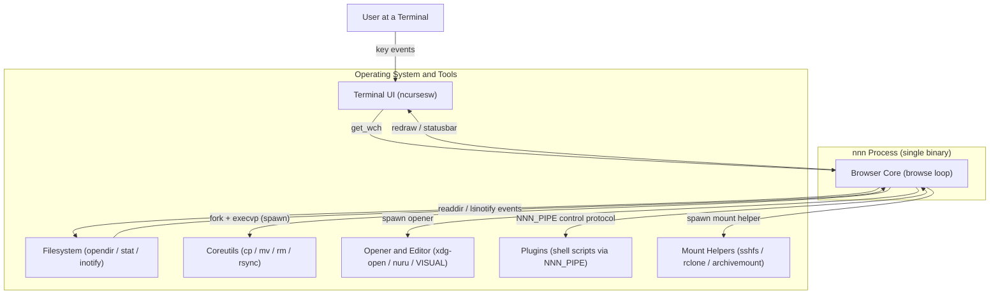

**Explanation.** Every arrow into `Browser Core` is an *event* (a key, an
inotify notification, or a plugin command on the control pipe); every arrow out
is either a *render* (to ncurses) or a *delegation* (a `fork`+`execvp` via
`spawn()`). This single fact -- "coordinate, don't compute" -- shapes the whole
design: nnn stays small and fast, and capability is added by writing plugins and
relying on standard tools.

### 2.2 Layered Architecture

Although physically one `.c` file, nnn is logically layered. Higher layers
depend on lower ones; lower layers never call up.

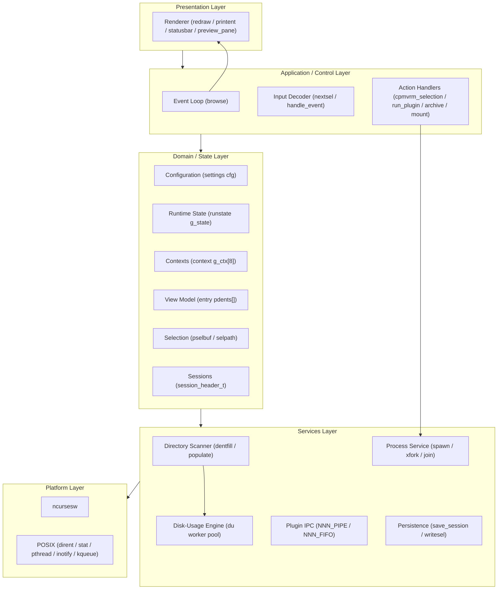

**Explanation.** The **Control Layer** (`browse`) is the only place that ties
everything together. The **State Layer** is pure data (the structs of section
3.1). The **Services Layer** is stateless-ish machinery (scan a dir, run a
process, write a file). Keeping `browse()` as the sole orchestrator is *why* a
one-line hook there (Part I) or in `opstr()` (Part II) can change behaviour
globally with minimal code.

### 2.3 Module Decomposition

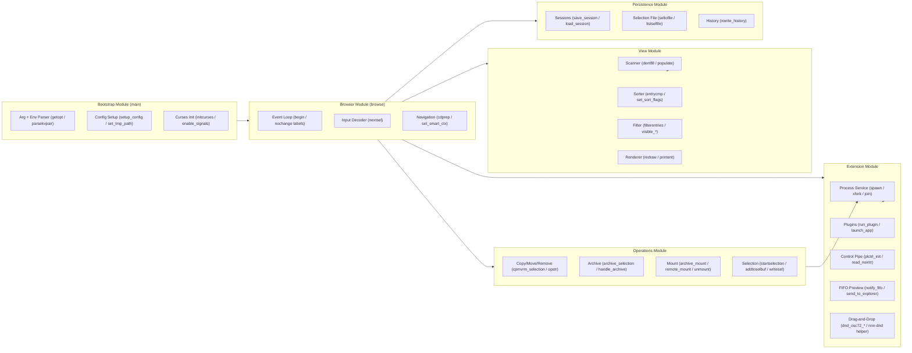

**Explanation.** Six modules, each fronted by a small number of entry-point
functions. The arrows are *call* dependencies at runtime. Note that both `Ops`
and `Ext` funnel into the **Process Service** (`spawn`) -- that is nnn's single
gateway to the OS for anything heavier than a syscall.

### 2.4 Process and Concurrency Model

nnn is **mostly single-threaded** (one UI thread runs `browse()`), with two
forms of concurrency:

1. **Child processes** -- created by `spawn()` (`fork`+`execvp`) for every
   external tool, opener, editor, and plugin.
2. **A disk-usage worker thread pool** -- created on demand by `prep_threads()`
   when the listing is sorted by disk usage (`blkorder`), to parallelise the
   recursive `du`-style walk.

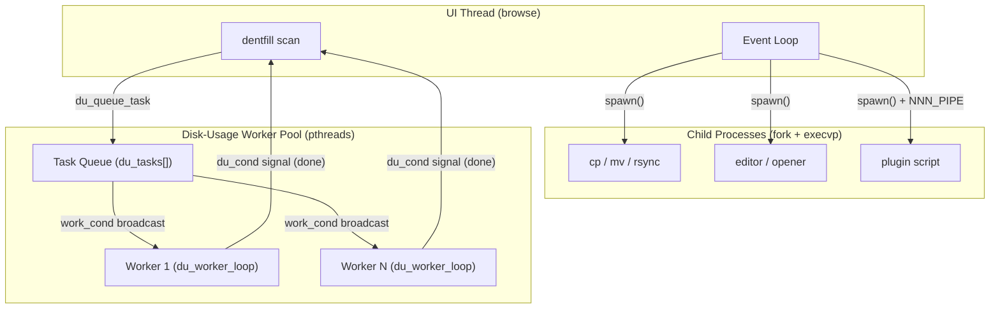

**Explanation.** The UI thread blocks in `join()` while a child runs
(foreground tools) -- nnn deliberately yields the terminal to `cp`/`$EDITOR` and
resumes after. The worker pool is a classic **producer/consumer**: `dentfill()`
produces directory tasks, workers consume them, and the producer waits on
`du_cond` until `du_tasks_pending` reaches zero. Mutexes `running_mutex` /
`du_count_mutex` and condition variables `work_cond` / `du_cond` coordinate them
(declared at [src/nnn.c:513-519](../src/nnn.c#L513)).

### 2.5 Runtime Data Flow

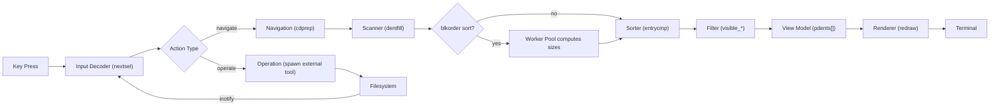

**Explanation.** A navigation flows left-to-right into the in-memory **view
model** `pdents[]` and out to the screen. Operations branch off to child
processes that mutate the filesystem; the resulting **inotify** event re-enters
the loop and triggers a re-scan, keeping the view live without polling.

### 2.6 External Interface Contract

nnn communicates with plugins and child processes through **environment
variables** and **named pipes**, not function calls. This is the public ABI of
the extension system.

```
ASCII Table 2.6: External interface contract (selected)
+----------------------+--------------------------------------------------------+
| Channel              | Purpose                                                |
+----------------------+--------------------------------------------------------+
| NNN_PIPE (FIFO)      | Plugin -> nnn control protocol (cd, select, refresh)   |
| NNN_FIFO (FIFO)      | nnn -> previewer: hovered/opened path stream           |
| NNN_SEL (file)       | Path to the NUL-separated selection file               |
| NNN_BMS / NNN_PLUG   | Bookmark / plugin key:value maps (parsekvpair)         |
| NNN_OPENER           | Program used to open files                             |
| NNN_LIST / NNNLVL    | Listing root / nesting level for nested nnn            |
| NNN_DND_OSC72        | Opt-in: enable kitty OSC-72 drag-and-drop (3.7)        |
| NNN_DND_DEBUG        | DnD debug log path (or 1 = /tmp/nnn-dnd.log)           |
| NNN_DND_MODE         | dragdrop plugin: select nnn-dnd helper vs fallback     |
| env_cfg[] (src:762)  | The full table of NNN_* names nnn reads/exports        |
+----------------------+--------------------------------------------------------+
```

**Explanation.** Because the contract is env + pipes, plugins can be written in
any language and nnn need not link them. The control protocol is decoded by
`read_nointr()` / `run_plugin()` ([src/nnn.c:6474](../src/nnn.c#L6474)); the
preview stream is written by `notify_fifo()` ([src/nnn.c:7416](../src/nnn.c#L7416)).

---

## 3. Low-Level Design (LLD)

### 3.1 Core Data Structures -- Class Diagram

The static (structural) UML view. Each "class" is a C `struct`; the global
instance that embodies it is noted in the summary table (3.2). Bit-field members
are shown as `bool` for readability.


**Explanation.** The center of gravity is **`context`**: nnn keeps an array of 8
of them (workspaces), each a self-contained snapshot of "where I am and how I am
viewing it" (path, last dir, hovered name, filter, and a per-context `settings`
copy). The *global* `cfg` mirrors the active context's `c_cfg`; switching
context swaps `cfg` in and out (`savecurctx`/`setcfg`). The **`entry`** array
`pdents[]` is the transient *view model* rebuilt on every scan. **`session_header_t`**
is purely a serialisation descriptor for persisting all 8 contexts. The
disk-usage trio (`du_task`/`du_group`/`thread_data`) exists only while a
`blkorder` scan is running.

### 3.2 Class/Struct Summary Table

```
ASCII Table 3.2: Summary of the core "classes" (structs)
+----------------------+-------------------+----------+--------------------------------+
| Class (struct)       | Global instance   | Lifetime | Responsibility                 |
+----------------------+-------------------+----------+--------------------------------+
| settings             | cfg               | program  | Active view + sort + mode flags|
| runstate             | g_state           | program  | Transient program-internal     |
|                      |                   |          | state (modes, picker, plugin)  |
| context              | g_ctx[CTX_MAX=8]  | program  | Per-workspace navigation state |
| entry                | pdents[] (ndents) | per-scan | One row of the listing (view   |
|                      |                   |          | model)                         |
| session_header_t     | (stack, on save)  | per-op   | On-disk session layout header  |
| selmark              | (stack)           | per-op   | A run inside the selection buf |
| kv                   | bookmark/plug/    | program  | Parsed key:value env maps      |
|                      | order             |          |                                |
| du_task              | du_tasks[]        | per-scan | Queued dir for the du pool     |
| du_group             | (per top entry)   | per-scan | Aggregated size/file counters  |
| thread_data          | core_data[]       | per-scan | A worker's current assignment  |
| fltrexp_t            | (stack)           | per-key  | Compiled filter (regex/pcre)   |
+----------------------+-------------------+----------+--------------------------------+
```

Supporting **global buffers** that are not structs but behave like fields of an
implicit "Selection" and "Paths" object:

```
ASCII Table 3.2b: Key global buffers (implicit state)
+------------------+----------------------------------------------------------+
| Global           | Role                                                     |
+------------------+----------------------------------------------------------+
| pselbuf/selbufpos| In-memory NUL-separated selection buffer + write head    |
| selpath          | Path of the on-disk selection file (NNN_SEL)             |
| curssn           | Active session name ("" = none) -- Part I guard          |
| cp / mv          | The cp/mv command strings -- Part II chokepoint via opstr|
| g_buf / g_tmpfpath| Scratch command/temp-path buffers                       |
| pnamebuf         | Backing store for all entry.name pointers in pdents[]    |
+------------------+----------------------------------------------------------+
```

### 3.3 Collaboration Diagram

UML collaboration (communication) diagram for the **navigate-into-a-directory**
use case. Numbers are message sequence; this is the same scenario as the
sequence diagram in 3.5.3 but emphasises *who talks to whom*.

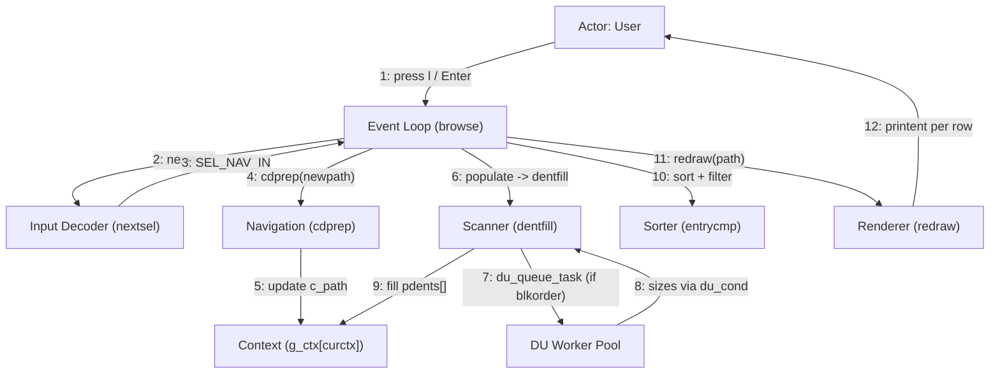

**Explanation.** The collaboration makes the **central role of `browse()`**
explicit: messages 3, 4, 6, 10, 11 all originate from the loop. No service calls
another service directly except the scanner-to-pool hand-off (7/8). This star
topology (everything through the loop) is what keeps the control flow auditable
and is the architectural reason a single hook can implement a cross-cutting
feature.

### 3.4 5W1H Analysis of the Main Classes

Each main "class" is analysed with **What / Who / Where / When / Why / How**.

#### 3.4.1 Configuration (`settings cfg`)

```
ASCII Table 3.4.1: 5W1H -- settings / cfg
+-------+----------------------------------------------------------------------+
| What  | A 32-bit packed bit-field of the active view, sort order and modes    |
|       | (hidden files, detail, reverse, time type, blkorder, preview, x11).  |
| Who   | Read by the Renderer, Sorter, Scanner; written by action handlers    |
|       | (toggles) and by load_session/setcfg.                                |
| Where | Global `cfg` (src/nnn.c:439); mirrored per workspace in context.c_cfg.|
| When  | Read on every redraw and sort; written on a setting toggle, context  |
|       | switch, or session load.                                             |
| Why   | One compact, copyable value lets a whole view configuration be saved, |
|       | restored and swapped between contexts cheaply.                       |
| How   | Bit-fields keep it small (fits a register-ish word); savecurctx()     |
|       | copies cfg into the context and setcfg() copies it back on switch.   |
+-------+----------------------------------------------------------------------+
```

#### 3.4.2 Runtime State (`runstate g_state`)

```
ASCII Table 3.4.2: 5W1H -- runstate / g_state
+-------+----------------------------------------------------------------------+
| What  | Non-persistent program-internal flags: selection mode, range select, |
|       | picker mode, plugin-init, persistent-session, interrupt, fifomode.   |
| Who   | Mutated by nearly every handler; read by browse() to branch.         |
| Where | Global `g_state` (src/nnn.c:576).                                    |
| When  | Throughout a session; never written to disk (unlike cfg/context).    |
| Why   | Separates *ephemeral* mode bits from *persistable* view config, so    |
|       | sessions never accidentally store transient UI state.                |
| How   | A second bit-field struct, distinct from settings precisely so the    |
|       | session serializer can ignore it.                                    |
+-------+----------------------------------------------------------------------+
```

#### 3.4.3 Context / Workspace (`context g_ctx[8]`)

```
ASCII Table 3.4.3: 5W1H -- context / g_ctx[]
+-------+----------------------------------------------------------------------+
| What  | A workspace: current dir, last dir, hovered file name, active filter, |
|       | a private settings copy, and a directory color.                      |
| Who   | The Event Loop and Navigation own it; the Session serializer reads   |
|       | all 8; set_smart_ctx/savecurctx switch between them.                 |
| Where | Global array `g_ctx[CTX_MAX]` (src/nnn.c:446); CTX_MAX = 8.          |
| When  | The active one (cfg.curctx) is live continuously; others are dormant |
|       | snapshots until selected.                                            |
| Why   | Lets the user keep 8 independent "tabs" and restore them as a unit    |
|       | via sessions -- the unit of persistence.                            |
| How   | Switching saves cfg into the old context and loads the new context's |
|       | c_cfg into cfg; paths are fixed-size PATH_MAX buffers for easy I/O.  |
+-------+----------------------------------------------------------------------+
```

#### 3.4.4 Directory Entry / View Model (`entry pdents[]`)

```
ASCII Table 3.4.4: 5W1H -- entry / pdents[]
+-------+----------------------------------------------------------------------+
| What  | One listing row: name pointer, mtime, mode, size, block count, name   |
|       | length, per-file flags, and (optionally) uid/gid.                    |
| Who   | Produced by the Scanner (dentfill); consumed by Sorter, Filter,      |
|       | Renderer; indexed by `cur` (the hovered row).                       |
| Where | Heap array `pdents` (src/nnn.c:489), count `ndents`; names packed in |
|       | the shared `pnamebuf` arena.                                         |
| When  | Rebuilt from scratch on every scan (navigation or refresh); discarded|
|       | on the next populate().                                             |
| Why   | A compact, cache-friendly array makes sort/filter/scroll over very   |
|       | large directories fast; bit-packed fields shrink per-row footprint.  |
| How   | dentfill() readdir+lstat each entry into a growable array (ENTRY_INCR|
|       | chunks); names are appended to pnamebuf and referenced by pointer.   |
+-------+----------------------------------------------------------------------+
```

#### 3.4.5 Selection Subsystem (`pselbuf` / `selpath` / `selmark`)

```
ASCII Table 3.4.5: 5W1H -- Selection subsystem
+-------+----------------------------------------------------------------------+
| What  | The set of marked file paths, held as a NUL-separated in-memory buf   |
|       | (pselbuf) and flushed to an on-disk file (selpath / NNN_SEL).        |
| Who   | startselection/addtoselbuf/rmfromselbuf write it; cpmvrm_selection,  |
|       | archive, and plugins read selpath; the cpmv plugin (Part II) parses  |
|       | it.                                                                 |
| Where | pselbuf/selbufpos (src/nnn.c:477,455); selpath file under tmp.       |
| When  | Built as the user presses Space/'m'; flushed (writesel) on each      |
|       | change and consumed by an operation.                                |
| Why   | Decouples *what is selected* from *what to do*: any op (cp, mv, tar, |
|       | plugin) reads the same selection file.                              |
| How   | writesel() writes selbufpos-1 bytes (drops the trailing NUL) -- the  |
|       | subtlety the Part II cpmv helper must handle when parsing.          |
+-------+----------------------------------------------------------------------+
```

#### 3.4.6 Process Service (`spawn` / `xfork` / `join`)

```
ASCII Table 3.4.6: 5W1H -- Process Service
+-------+----------------------------------------------------------------------+
| What  | The single gateway that runs every external program (tools, opener,  |
|       | editor, plugins, mount helpers).                                    |
| Who   | Called by all Operation and Extension handlers; never bypassed.      |
| Where | spawn() (src/nnn.c:2640), xfork(), join().                          |
| When  | Whenever work exceeds a syscall: copy, move, open, archive, mount,   |
|       | run plugin.                                                         |
| Why   | Centralising fork/exec gives one place to manage flags (suppress     |
|       | output, detach, give the tty, confirm-on-return) and signal state.  |
| How   | fork(); in the child optionally redirect std fds per flags, then     |
|       | execvp(); the parent join()s (waitpid) unless F_NOWAIT (detached).  |
+-------+----------------------------------------------------------------------+
```

#### 3.4.7 Disk-Usage Engine (`du_task` / `du_group` / worker pool)

```
ASCII Table 3.4.7: 5W1H -- Disk-Usage Engine
+-------+----------------------------------------------------------------------+
| What  | An on-demand pthread pool that recursively sums block/file counts for |
|       | each top-level entry when sorting by disk usage.                    |
| Who   | Producer: dentfill(). Consumers: du_worker_loop() threads. Results   |
|       | written back into entry.blocks.                                     |
| Where | du_tasks[] queue, core_data[] slots, worker_tids[] (src/nnn.c:543+). |
| When  | Only while cfg.blkorder (or apparentsz) is set; torn down after.    |
| Why   | A recursive du over big trees is I/O-bound; parallel workers hide    |
|       | latency and keep the UI responsive.                                 |
| How   | Producer enqueues dirs and broadcasts work_cond; workers walk dirs,  |
|       | dedup inodes via a hash bitmap, and signal du_cond when pending=0.  |
+-------+----------------------------------------------------------------------+
```

#### 3.4.8 Browser / Event Loop (`browse`)

```
ASCII Table 3.4.8: 5W1H -- Browser Event Loop
+-------+----------------------------------------------------------------------+
| What  | The long-lived control loop that owns the terminal and orchestrates   |
|       | scan -> render -> read-key -> dispatch.                             |
| Who   | The only caller of the Renderer and Input Decoder; the hub every     |
|       | action returns to via `goto begin` / `goto nochange`.              |
| Where | browse() (src/nnn.c:8425); labels begin: and nochange:.             |
| When  | From just after curses init until the user quits.                   |
| Why   | A single loop with two re-entry labels makes control flow explicit   |
|       | and gives natural single-point hooks (Part I auto-save sits here).  |
| How   | begin: chdir+populate+render; nochange: read key, switch(action),   |
|       | mutate state, goto the right label.                                |
+-------+----------------------------------------------------------------------+
```

### 3.5 Dynamic Behaviour

#### 3.5.1 Program Startup -- Activity Diagram


**Explanation.** Startup is linear and fail-fast: each setup step returns
`EXIT_FAILURE` on error before curses is initialised, so the terminal is never
left in a broken state. The branch at "stdin a tty?" is how nnn enters **listing
mode** (reading a file list from a pipe). Note the two session touch-points
(clear on listing mode, save on persistent exit) that Part I builds on.

#### 3.5.2 Browser Main Loop -- State Diagram

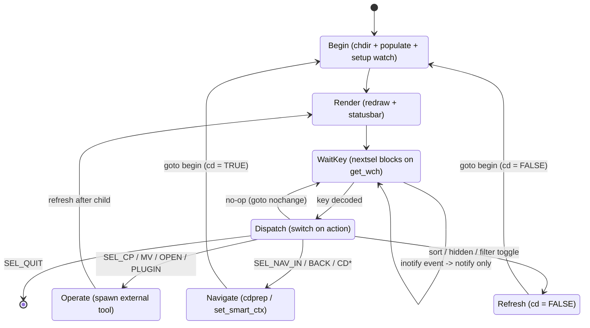

**Explanation.** Two re-entry points correspond to the two labels in the source:
**Begin** (full re-scan, used after a real directory change) and the implicit
return to **WaitKey** (`nochange`, no re-scan). The `cd` boolean distinguishes a
real `chdir` (`Navigate -> Begin`, `cd = TRUE`) from an in-place refresh
(`Refresh -> Begin`, `cd = FALSE`) -- the exact flag Part I's auto-save hook
keys off.

#### 3.5.3 Navigate Into Directory -- Flowchart


**Explanation.** This is the concrete control flow behind the "Navigate" state.
`cdprep()` ([src/nnn.c:8395](../src/nnn.c#L8395)) records the previous directory
(for `cd -`-style back) and swaps `path`; the `goto begin` re-enters the scan.
Part I inserts its `save_session()` call at the top of `begin:` precisely so it
runs after every such transition.

#### 3.5.4 Directory Scan with Disk-Usage Pool -- Sequence Diagram

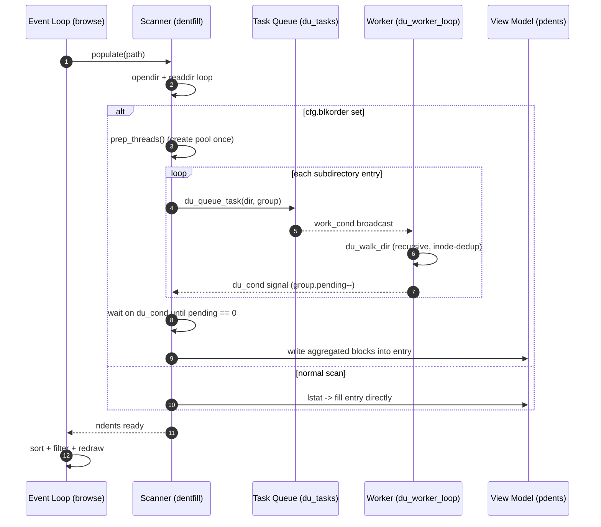

**Explanation.** The `alt` fragment shows the two scan paths. In `blkorder`
mode the scanner is a **producer** that fans subdirectory walks out to the pool
and blocks on `du_cond` until every `du_group.pending` counter hits zero, then
copies the summed `blocks` into each `entry`. This is the only place nnn uses
threads, and it is fully torn down when the user leaves disk-usage sort.

#### 3.5.5 Process Service -- Sequence Diagram

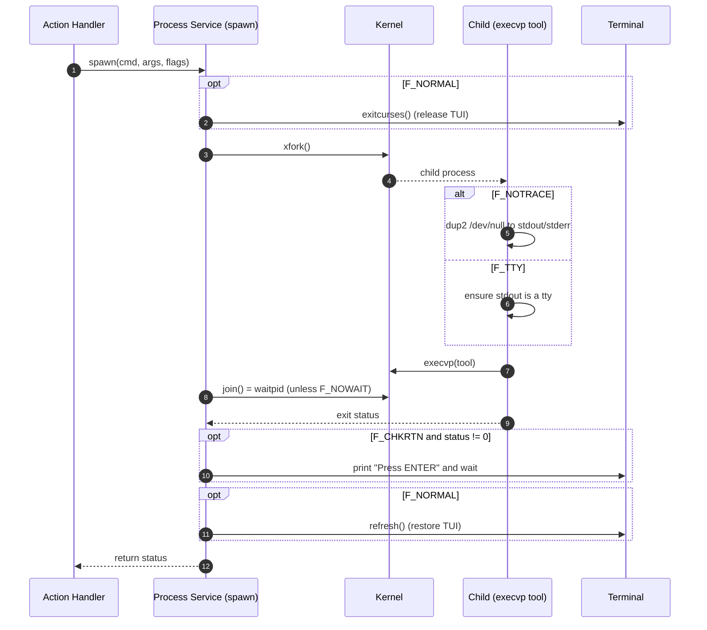

**Explanation.** Flags compose to express intent: `F_NORMAL` hands the terminal
to the child and takes it back; `F_NOTRACE`/`F_NOSTDIN` silence background jobs;
`F_NOWAIT` detaches (no `waitpid`); `F_CHKRTN`/`F_CONFIRM` pause so the user can
read tool output. The cp/mv/cpmv operations (Part II) run through this exact path
with `F_CLI | F_CHKRTN`.

#### 3.5.6 Filter Mode -- State Diagram

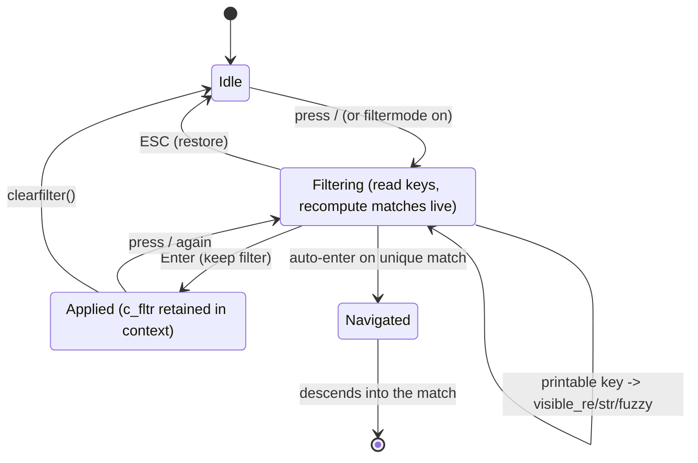

**Explanation.** `filterentries()` ([src/nnn.c:3810](../src/nnn.c#L3810)) runs a
mini event loop that recomputes the visible set on each keystroke using one of
three matchers (`visible_re`, `visible_str`, `visible_fuzzy`) chosen by `cfg`.
The retained filter lives in `context.c_fltr`, which is *why* it is persisted in
sessions.

#### 3.5.7 Session Save / Load -- Sequence Diagram (Part I tie-in)

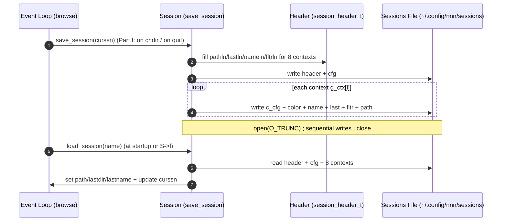

**Explanation.** A session is a flat snapshot of **all 8 contexts** plus the
global `cfg`. The header stores per-context field lengths so the reader can
parse variable-length names/paths. Part I's contribution is calling
`save_session(curssn[0] ? curssn : "@", NULL)` from the `begin:` label so this
snapshot is refreshed on every directory change, not only at clean exit.

#### 3.5.8 Copy/Move with Conflict Resolution (Part II tie-in)

This is the most behaviour-rich fork feature, so it is documented in depth: the
**invocation path** (C side), the **conflict-resolution policy** (plugin side),
the **mode table**, the **behaviour matrix**, and the **helper hardening**.

##### 3.5.8.1 Invocation Path -- Sequence Diagram

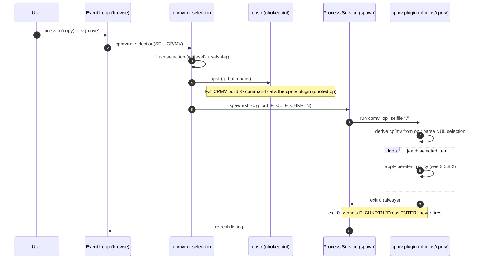

**Explanation.** `opstr()` ([src/nnn.c:2737](../src/nnn.c#L2737)) is the single
chokepoint both `p` (SEL_CP) and `v` (SEL_MV) pass through; under `-DFZ_CPMV` it
rewrites its one command line to invoke the `cpmv` plugin, passing nnn's `op`
string (e.g. `cp -iRp --`) **quoted** so the helper receives it as one argument
and derives cp-vs-mv (and advcpmv `cpg`/`mvg`) from its first token. Everything
still flows through the standard `spawn()` path with `F_CLI | F_CHKRTN`, so
terminal hand-off and return-code checking are unchanged. Because the helper
**always exits 0**, nnn's own "Press ENTER" pause (triggered by `F_CHKRTN` on a
non-zero status) never fires -- the plugin alone decides whether to pause.

##### 3.5.8.2 Conflict-Resolution Policy -- Flowchart

The plugin processes each selected item independently. The prompt it shows
depends on **how many items** there are and **whether the item is a file or a
directory**; the tail of the loop decides whether to ask "apply to all" and
whether to pause before returning to nnn.

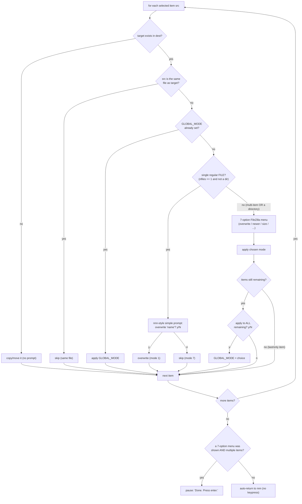

**Explanation.** Three deliberate UX rules are encoded here:

1. **Single regular file -> simple `y/N`.** A lone file conflict reproduces
   nnn's original `cp -i`/`mv -i` feel (`overwrite 'name'? [y/N]`), not the rich
   menu -- the menu's size/newer/resume modes add nothing for one file.
2. **Single directory -> full menu.** A lone *directory* conflict is treated like
   a multi-item conflict and gets the 7-option menu, because reconciling a tree
   genuinely benefits from "different size", "newer only", "resume" and
   "rename/keep-both".
3. **Apply-to-all only while items remain; pause only for multi-item conflicts.**
   The "apply to all" question is skipped for the last/only item (so a single
   item never asks it), and the terminal **auto-returns to nnn with no keypress**
   except after resolving conflicts across *several* items, where a moment to
   review is useful.

##### 3.5.8.3 The Seven Modes

```
ASCII Table 3.5.8a: Conflict mode -> implementation
+---+----------------------------+--------------------------------------------+
| # | Menu entry                 | Implementation (cp/mv, or cpg/mvg, or rsync)|
+---+----------------------------+--------------------------------------------+
| 1 | overwrite                  | cp -f  /  mv -f                            |
| 2 | newer only                 | cp -u  /  mv -u   (source mtime newer)     |
| 3 | different size only        | rsync -a --size-only                       |
| 4 | different size or newer    | rsync -a --update                          |
| 5 | resume (interrupted)       | rsync -a --partial --append-verify         |
| 6 | rename (keep both)         | copy to "stem (n)ext" -- next free suffix  |
| 7 | skip                       | do nothing                                 |
+---+----------------------------+--------------------------------------------+
```

For a **move**, the rsync-based modes (3/4/5) are an emulated move: rsync to the
destination, then remove the source **only on a successful transfer** (see
3.5.8.5). The simple `y/N` "yes" maps to mode 1, "no" to mode 7.

##### 3.5.8.4 Behaviour Matrix

```
ASCII Table 3.5.8b: What the user sees, by selection shape and conflict
+--------------------------------+----------------------+-----------+-------------+
| Scenario                       | Conflict prompt      | apply-to- | Return to   |
|                                |                      | all asked | nnn         |
+--------------------------------+----------------------+-----------+-------------+
| No conflict (any count)        | none                 | no        | auto (no key)|
| Single regular file, conflict  | simple y/N overwrite | no        | auto (no key)|
| Single directory, conflict     | 7-option menu        | no        | auto (no key)|
| Multiple items, >= 1 conflict  | 7-option menu / item | while     | pause        |
|                                |                      | items     | (Press enter)|
|                                |                      | remain    |             |
+--------------------------------+----------------------+-----------+-------------+
```

##### 3.5.8.5 Helper Hardening and Correctness

The plugin guards several subtle failure modes discovered while integrating with
nnn's real selection format and cross-platform tools:

```
ASCII Table 3.5.8c: cpmv plugin correctness guards
+----------------------------+------------------------------------------------+
| Concern                    | Handling in plugins/cpmv                        |
+----------------------------+------------------------------------------------+
| NUL-truncated selection    | nnn writes the selection with the trailing NUL  |
|                            | truncated (writesel(buf, selbufpos-1),         |
|                            | src/nnn.c:2065), so the LAST path is not        |
|                            | NUL-terminated. The parse loop uses             |
|                            | `read -r -d '' f || [ -n "$f" ]` so the final   |
|                            | unterminated path is not dropped (a single-file |
|                            | selection would otherwise yield 0 items).      |
| Move data-loss             | rsync MOVE modes run `rsync ... && rm_src`      |
|                            | (never `;`) so the source is removed ONLY on a  |
|                            | successful transfer.                           |
| stat(1) portability        | GNU `stat -c` vs BSD `stat -f` are detected at  |
|                            | startup (nnn runs on Linux and *BSD/macOS).    |
| Copy onto self             | items where `src -ef target` are skipped.      |
| rsync absent               | size/resume modes (3/4/5) skip with a message  |
|                            | rather than silently overwriting.              |
| Return code                | always `exit 0` so nnn's F_CHKRTN pause is not  |
|                            | triggered -- the plugin owns the pause policy.  |
| advcpmv progress           | uses cpg/mvg for a progress bar when present.   |
+----------------------------+------------------------------------------------+
```

**Explanation.** These guards are the difference between a demo script and a
shippable plugin. The NUL-truncation and the `&&` move-fix in particular are
non-obvious: the first is a quirk of how nnn flushes its in-memory selection to
disk; the second prevents data loss if a transfer fails mid-move. All conflict
logic lives in the plugin ([plugins/cpmv](../plugins/cpmv)), keeping the C change
to the single gated line in `opstr()`.

#### 3.5.9 Plugin Control Protocol -- Sequence Diagram

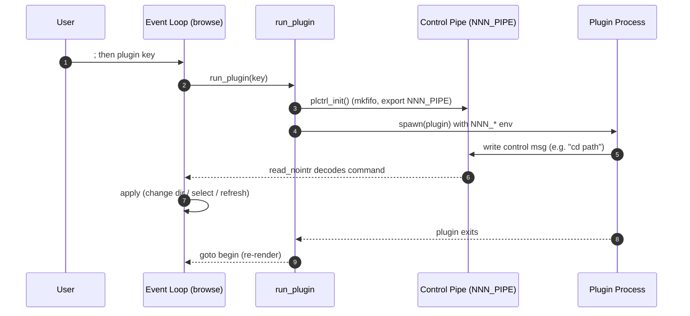

**Explanation.** Plugins are not linked in; they are child processes that speak a
tiny **control protocol** back to nnn over the `NNN_PIPE` FIFO. `read_nointr()`
([src/nnn.c:6474](../src/nnn.c#L6474)) decodes single-byte opcodes followed by a
payload (e.g. change directory, select entries, refresh). This is how a shell
script can make nnn navigate -- the basis of Approach B in Part II.

#### 3.5.10 Rendering Pipeline -- Flowchart

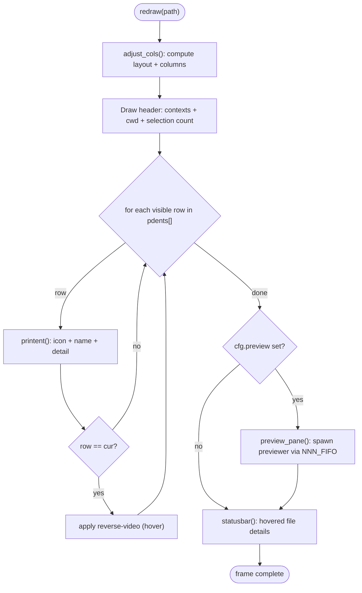

**Explanation.** `redraw()` ([src/nnn.c:8249](../src/nnn.c#L8249)) is pure
presentation: it reads `pdents[]`, `cur`, and `cfg`, and writes ncurses cells. It
never mutates model state, which keeps rendering idempotent and cheap to call on
every loop iteration.

#### 3.5.11 Delete-to-Trash and Restore (plugin tie-in)

This fork routes deletes to a **trash can** (via `NNN_TRASH`) and adds a
fuzzy **restore** plugin. It reuses nnn's existing delete plumbing (3.4.6) and
the plugin/process model -- no core C change is needed for either.

##### 3.5.11.1 Delete -> Trash

`NNN_TRASH=1` (set in the fork's `nnn_config.sh`) makes the `x` / `Ctrl-X`
delete (`SEL_TRASH`) build its command through `rmmulstr()` /
`xrm()` ([src/nnn.c:2742](../src/nnn.c#L2742)) using `trash-put` instead of
`rm -rf`. (`NNN_TRASH=2` uses `gio trash`.) The uppercase `X` (`SEL_RM_RF`)
remains a permanent `rm -rf` regardless.

```
ASCII Table 3.5.11: Delete keys under NNN_TRASH=1
+-----------+-------------+----------------------------------------------------+
| Key       | Action      | Effect                                             |
+-----------+-------------+----------------------------------------------------+
| x, Ctrl-X | SEL_TRASH   | trash-put -> MOVE into ~/.local/share/Trash/files/ |
| X         | SEL_RM_RF   | permanent rm -rf (irreversible) -- unaffected      |
+-----------+-------------+----------------------------------------------------+
```

Key design fact: on the same filesystem, trashing is a **move (rename)** -- the
inode is preserved and merely relocated under the Trash. This is what makes
restore lossless, but it also creates a sharp pitfall (3.5.11.3).

##### 3.5.11.2 Restore -- the `my_trash_restore` plugin

[plugins/my_trash_restore](../plugins/my_trash_restore) (bound to `;r` / `Alt-r`)
delegates entirely to trash-cli's own `trash-restore`, so restoring is 100%
consistent with how trashing was done (correct `.trashinfo` cleanup, no manual
inode juggling).

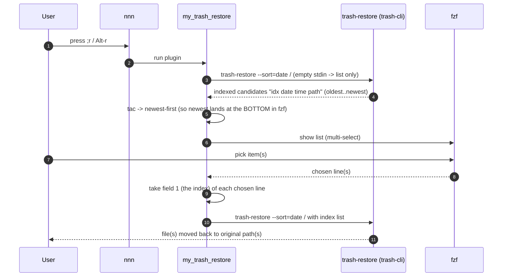

**Why index-by-field-1 is robust.** trash-restore assigns each candidate an
index *in its own sort order*; the plugin lists and restores with the **same**
`--sort=date`, so the indices are stable across the two calls. Because the index
travels with each line (field 1), the plugin can **re-order the display freely**
without affecting which item is restored.

##### Newest-deleted shown at the bottom

`trash-restore --sort=date` lists **oldest -> newest**. fzf's **default layout**
anchors the *first* input line at the **bottom** of the screen (with the cursor
on it). To put the most-recently-deleted item there -- the one you most likely
want to restore -- the plugin pipes the list through `tac` (reverse), making the
newest the first line:

```
ASCII Table 3.5.11b: Ordering -> what fzf shows
+----------------------------+-------------------+----------------------------+
| Plugin input order         | fzf default layout| Net effect                 |
+----------------------------+-------------------+----------------------------+
| oldest..newest (raw)       | first line=bottom | oldest at bottom (cursor), |
|                            |                   | newest at top -- BEFORE    |
| newest..oldest (after tac) | first line=bottom | newest at bottom (cursor), |
|                            |                   | oldest at top -- AFTER fix |
+----------------------------+-------------------+----------------------------+
```

##### 3.5.11.3 Pitfall -- a terminal's CWD follows a trashed directory

Because trashing **moves** a directory, any *other* terminal whose working
directory is inside it silently follows the inode into the Trash (CWD is an open
inode handle, not a path). The shell builtin `pwd -P` keeps showing the
(re-created) original path, masking it, so new files land in the Trash unnoticed.

This is inherent Unix behaviour, not an nnn defect, and is fixed shell-side by a
prompt hook (`cwd-guard`) that detects the inode mismatch and re-attaches. The
full root-cause analysis, reproduction and fix are documented separately in
[nnn_Problems_And_Solutions.md, Problem 1](nnn_Problems_And_Solutions.md).

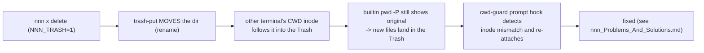

**Caveat (tooling).** The comma-separated multi-restore needs trash-cli
`>= ~0.22`; this machine runs `0.24.5.26`, so single and multi restore both work.

#### 3.5.12 Shared, Cross-Instance Directory History (plugin tie-in)

nnn natively keeps only **one** previous directory per context (`c_last`,
toggled by `-`). This fork adds an **unlimited** directory history that is shared
across all 8 contexts (tabs), both sessions (`left`/`right`) and both running
instances (the dual TMUX panes). The full design rationale is in
[Brainstorm_nnn_Support_Unlimited_History.md](Brainstorm_nnn_Support_Unlimited_History.md);
this section documents what shipped.

##### 3.5.12.1 Architecture

```mermaid
%% Two planes: a one-line C recorder feeds a shared log#59; plugins navigate it
flowchart TB
    subgraph Record["RECORD (one C line at begin:, gated by O_HIST + NNN_HIST)"]
        RecL["record_visit (instance L)"]
        RecR["record_visit (instance R)"]
    end
    Log["Shared Visit Log (~/.config/nnn/.dirhistory, append-only TSV)"]
    subgraph Navigate["NAVIGATE (plugins, no extra C)"]
        Picker["History Picker (nnn-history, key #59;h)"]
        Switcher["Context Switcher (ctx_switcher, Alt+w)"]
    end
    PipeL["NNN_PIPE of L"]
    PaneR["other pane (tmux)"]

    RecL --> Log
    RecR --> Log
    Picker -- "read + dedup" --> Log
    Picker -- "navigate: 0c<path>" --> PipeL
    Picker -- "switch this instance: Nc<path>" --> PipeL
    Picker -- "switch other pane: focus + ctx key" --> PaneR
    Switcher -- "list/switch contexts across panes" --> PaneR
```

**Explanation.** The **only** C change is one guarded line at the `begin:` choke
point (next to Part I's session auto-save) that appends the current directory to
a shared log. Everything navigable is a plugin reusing the `NNN_PIPE` control
protocol -- so cross-instance history needs no navigation code in nnn.

##### 3.5.12.2 The recorder and the store

`record_visit()` ([src/nnn.c, under `#ifdef HIST_LOG`]) is compiled in only with
the `O_HIST` make option (`-DHIST_LOG`) and active only when `NNN_HIST=global`
is exported -- off by default, so the default build is byte-for-byte upstream.

```
ASCII Table 3.5.12a: Visit-log record (TSV line in .dirhistory)
+-------------+--------------------------------------------------------------+
| Field       | Meaning                                                      |
+-------------+--------------------------------------------------------------+
| ts_nanos    | clock_gettime(CLOCK_REALTIME) nanoseconds -- global ordering.|
| instance_id | $TMUX_PANE if set (e.g. %12), else the pid.                  |
| session     | curssn ('left' / 'right' / '@'), or '-' if none.            |
| ctx         | the context (tab) number 1..8.                              |
| path        | the absolute directory visited.                             |
+-------------+--------------------------------------------------------------+
```

One atomic `O_APPEND` write per real chdir (gated on the existing `cd` flag), so
every navigation in every tab/session/instance lands in one shared file.

```mermaid
%% Sequence: record a visit (mirrors Part I's hook placement)
sequenceDiagram
    autonumber
    participant U as User
    participant B as Event Loop (browse, begin:)
    participant R as Visit Recorder (record_visit)
    participant L as Visit Log (.dirhistory)

    U->>B: navigate (any tab / instance)
    Note over B: at begin:, cd == TRUE
    alt O_HIST build AND NNN_HIST=global
        B->>R: record_visit(path)
        R->>L: append "ts id session ctx path"
    else disabled
        B-->>U: no-op (upstream behaviour)
    end
```

##### 3.5.12.3 The `nnn-history` picker -- navigate and switch

The picker ([plugins/nnn-history](../plugins/nnn-history), bound to `;h`) reads
the log, dedups by path (most-recent kept), and shows the list in fzf with the
newest at the bottom. Its key enhancement: for the **most-recent 20** entries it
checks whether the directory is **already open in a tab**, and if so offers
**two** actions instead of one.

```
ASCII Table 3.5.12b: Menu rows are TAB-delimited (fzf shows only the display)
+--------+-----------------------------------------------------------------+
| Field  | Meaning                                                         |
+--------+-----------------------------------------------------------------+
| kind   | NAV (navigate here) or SW (switch to an open tab)               |
| target | for SW: C = this instance, O = the other pane#59; NAV: unused    |
| ctx    | for SW: the tab number 1..8 to switch to                        |
| path   | the directory                                                   |
| display| the human label fzf renders (cd ... / > switch to [..]) ...     |
+--------+-----------------------------------------------------------------+
```

```mermaid
%% Per-entry menu-build decision (most-recent 20 get the switch check)
flowchart TD
    Start["for each unique history dir (newest-first)"] --> Rank{"within the<br/>most-recent 20?"}
    Rank -->|"no"| NavOnly["emit NAV (cd) only"]
    Rank -->|"yes"| Open{"open in a tab?<br/>(match $d1..$d8 or<br/>the other session)"}
    Open -->|"no"| NavOnly2["emit NAV (cd) only"]
    Open -->|"yes"| Both["emit NAV (cd)<br/>+ one SW per matching tab"]
    NavOnly --> Next["next dir"]
    NavOnly2 --> Next
    Both --> Next
```

**Open-tab detection.** This instance's open tabs come from nnn's exported
`$d1..$d8` (the active context paths -- authoritative and free). The **other**
pane's open tabs are read by **binary-parsing its session file** (`left` /
`right`, session format v1) exactly as `ctx_switcher` does -- kept current by the
`-S` persistent session plus Part I's auto-save-on-chdir.

```mermaid
%% Where "currently open tabs" come from
flowchart LR
    This["this instance"] --> Dvars["$d1..$d8 (nnn setexports)"]
    Other["other pane"] --> Ssn["parse session file (left/right)"]
    Dvars --> Map["open-tab map: target ctx path"]
    Ssn --> Map
    Map --> Match["match a history dir -> offer 'switch'"]
```

##### 3.5.12.4 Acting on a selection

```
ASCII Table 3.5.12c: How each chosen row is executed
+----------------------+-----------------------------------------------------+
| Chosen row           | Action                                              |
+----------------------+-----------------------------------------------------+
| NAV (cd)             | navigate the current tab: write 0c<path> to NNN_PIPE |
| SW target=C (here)   | switch THIS instance to ctx N: write Nc<path> to     |
|                      | NNN_PIPE (re-cd to its own path == just switch)     |
| SW target=O (other)  | focus the other nnn pane (tmux select-pane) and send |
|                      | the context digit N to switch its tab               |
+----------------------+-----------------------------------------------------+
```

```mermaid
%% Sequence: picker offering navigate vs switch
sequenceDiagram
    autonumber
    participant U as User
    participant B as Event Loop (instance L)
    participant P as History Picker (nnn-history)
    participant L as Visit Log (.dirhistory)
    participant Pi as NNN_PIPE of L
    participant R as Other pane (instance R)

    U->>B: press #59;h
    B->>P: run plugin (with $d1..$d8, $NNN_PIPE)
    P->>L: dedup#59; for top-20 check open tabs ($d* + other session)
    P-->>U: fzf list (NAV + SW rows, newest at bottom)
    alt choose "cd"
        U->>P: select NAV
        P->>Pi: 0c<path>  (current tab navigates)
    else choose "switch [here ctxN]"
        U->>P: select SW target=C
        P->>Pi: Nc<path>  (this instance switches to ctx N)
    else choose "switch [right ctxN]"
        U->>P: select SW target=O
        P->>R: tmux focus + send "N" (other pane switches to ctx N)
    end
```

**Explanation.** Navigate and "switch to my own tab" both go through this
instance's pipe; only "switch to the other pane" needs tmux (a different
process's pipe is not addressable, so the keystroke route -- proven by
`ctx_switcher` -- is used). The companion `ctx_switcher` plugin (Alt+w) lists and
switches contexts across panes directly and is the source of the session-file
parser and the cross-pane switch technique reused here.

#### 3.5.13 Session Backup, Restore and Management (plugin tie-in)

Design rationale, approach scorecard and phased plan:
[Brainstorm_nnn_Support_Sessions_Management.md](Brainstorm_nnn_Support_Sessions_Management.md).

nnn's built-in session support (3.5.7) can only *save*, *load* and *restore* one
named file at a time, and `save_session()` opens with `O_TRUNC` -- so every save
(including each auto-save-on-cd) irreversibly overwrites the previous state.
This feature adds the missing **management layer**: enumerate, preview, version,
curate and coordinate sessions.

**The load-bearing insight.** Because this fork builds with `O_SSN_ON_CD`
(3.5.7), the on-disk session file is rewritten on every real chdir and is
therefore a **live mirror** of the running instance. A plain file copy is an
accurate point-in-time backup, and swapping the file plus reloading is an
accurate restore -- no IPC or shared memory needed.

##### 3.5.13.1 Architecture

```mermaid
%% Session management: plugin-first manager over a versioned file store
flowchart TB
    subgraph UI["User-facing (plugin, 0 C)"]
        Mgr["Session Manager (nnn-sessions, #59;S)"]
        Prev["Session Previewer (parse_session, all 8 ctx)"]
    end
    subgraph StorePlane["Backup Store (files under sessions/)"]
        Live["live sessions/&lt;name&gt;"]
        Bak[".backups/&lt;name&gt;/&lt;ts&gt; (+ .txt mirror)"]
        Tar[".snapshots/&lt;label&gt;.tar (workspace)"]
    end
    subgraph CoreC["Running nnn (C)"]
        AutoCd["auto-save on cd (O_SSN_ON_CD, existing)"]
        LoadC["load_session() (existing)"]
        PipeC["readpipe() + 's' op (NEW, gated O_SSN_PIPE)"]
    end

    AutoCd -- "mirrors live state" --> Live
    Mgr -- "cp + decode + prune" --> Bak
    Mgr -- "tar left+right+@" --> Tar
    Prev -- "read" --> Live
    Mgr -- "faithful: write '0s&lt;name&gt;'" --> PipeC
    Mgr -- "quick: write '0c&lt;dir&gt;'" --> PipeC
    PipeC --> LoadC
```

**Explanation.** The UI is entirely a plugin; the store is plain files; the only
new C is one **gated** pipe op. `NNN_SSN_PIPE=1` and `NNN_SESSION=<name>` are
exported (both under `-DSSN_PIPE`) so the plugin can feature-detect the op and
know which session it is running as.

##### 3.5.13.2 The `s` pipe op (the only C change)

```
ASCII Table 12: NNN_PIPE ops after this feature
+-----+--------------------+------------------------------------------------+
| Op  | Wire format        | Effect                                         |
+-----+--------------------+------------------------------------------------+
| c   | <ctx>c<abs/path>   | chdir a context (existing)                     |
| l   | <ctx>l<listpath>   | load a file list (existing)                    |
| p   | <ctx>p             | finish picker mode (existing)                  |
| s   | <ctx>s<name>       | NEW, gated: load_session(name). <ctx> ignored. |
+-----+--------------------+------------------------------------------------+
```

`readpipe()` only *stashes* the name (`g_ssnpipe`); `run_plugin()` performs the
load **after** `waitpid()` + `refresh()`, so the plugin has exited and curses is
ours again before `load_session()` can print any error. `browse()` then does its
normal `goto begin`, which repopulates and draws the restored session.

Deliberately, **no `save_session()` runs before the load**: the restore flow
swaps the session file on disk *before* sending `s`, so saving first would
overwrite the very bytes about to be loaded.

##### 3.5.13.3 One op per plugin run (a hard constraint)

`run_plugin()` opens the pipe once and calls `readpipe()` **exactly once**, then
closes the read end and blocks in `waitpid()`. A plugin therefore gets **one**
message per invocation; a second write **deadlocks** (the plugin blocks in
`open(FIFO, O_WRONLY)` for a reader that never returns, while nnn waits for the
plugin to exit). Verified experimentally.

```mermaid
%% Why a plugin may send only one pipe message per run
sequenceDiagram
    participant P as plugin (child)
    participant F as FIFO ($NNN_PIPE)
    participant N as nnn (run_plugin)

    N->>F: open(O_RDONLY)
    P->>F: open(O_WRONLY) + write op #1
    F->>N: readpipe() reads op #1 -- ONCE
    N->>F: close(read end)
    N->>N: waitpid(plugin)
    P-->>F: open(O_WRONLY) for op #2 -- BLOCKS
    Note over P,N: deadlock#59; every action must send at most ONE message
```

This is why "activate" is a single `s` op, and why the zero-C fallback cd-s only
the **current** context rather than replaying all eight.

##### 3.5.13.4 Activate: faithful vs quick

```
ASCII Table 13: Faithful restore vs quick cd
+--------------------------+--------------------------+------------------------+
| Aspect                   | Faithful (s op)          | Quick cd (c op)        |
+--------------------------+--------------------------+------------------------+
| Restores dirs            | all 8 contexts           | current context only   |
| Restores sort/filter/    | yes                      | no                     |
|   cursor/colors          |                          |                        |
| Adopts the session name  | yes (curssn <- name)     | no (stays on yours)    |
| Needs build flag         | yes (O_SSN_PIPE)         | no (any build)         |
+--------------------------+--------------------------+------------------------+
```

The quick path reads the session's saved current context from `settings.curctx`
-- bits **13..15** of the 4-byte global cfg that follows the 264-byte header (13
single-bit fields precede it) -- and cd-s there with one `c` op.

##### 3.5.13.5 Store layout and retention

```
ASCII Table 14: On-disk layout under sessions/
+-------------------------------------------+-----------------------------------+
| Path                                      | Contents                          |
+-------------------------------------------+-----------------------------------+
| sessions/<name>                           | live session (mirrors the         |
|                                           |   instance via O_SSN_ON_CD)       |
| sessions/.backups/<name>/<ts>             | timestamped snapshot (blob copy)  |
| sessions/.backups/<name>/<ts>.txt         | decoded, greppable mirror         |
| sessions/.snapshots/<label>.tar           | workspace: left + right + @       |
+-------------------------------------------+-----------------------------------+
```

Writes are **atomic** (write `.tmp` in the same directory, then `rename()`), and
retention keeps the newest `NNN_SSN_KEEP` snapshots per session (default 20,
`0` = unlimited), pruning blob and mirror as a pair. `NNN_SSN_GIT=1` additionally
commits `sessions/` after each snapshot -- the nnn config dir is already a git
submodule -- giving unlimited, diffable history via the `.txt` mirrors.

##### 3.5.13.6 Restore sequence

```mermaid
%% Restoring a snapshot into the live instance
sequenceDiagram
    actor U as User
    participant P as nnn-sessions (#59;S)
    participant S as .backups store
    participant F as sessions/<name>
    participant N as nnn (run_plugin)
    participant C as load_session()

    U->>P: pick a snapshot, confirm
    P->>S: snapshot the CURRENT state first (undo point)
    P->>S: read chosen blob
    P->>F: cp blob -> live (tmp + rename)
    P->>N: write "0s<name>" to $NNN_PIPE
    N->>N: waitpid(plugin) + refresh()
    N->>C: load_session(name)
    C-->>N: cfg + all 8 contexts restored
    N-->>U: goto begin -> restored session drawn
```

**Explanation.** The order matters: back up, swap, *then* reload. The plugin exits
before the load runs, so the screen is never contended. Restoring is itself
undoable because the pre-restore state was snapshotted in step 2.

##### 3.5.13.7 Safety rails

```
ASCII Table 15: Session-management safety rails
+----------------------------------+------------------------------------------+
| Risk                             | Rail                                     |
+----------------------------------+------------------------------------------+
| Restore destroys current state   | snapshot the live file first (undo)      |
| Delete loses a session outright  | snapshot before rm; backups are kept     |
| Activating the other pane's ssn  | warn: with O_SSN_ON_CD both panes would  |
|                                  |   then auto-save onto the same file      |
| Torn/partial backup              | write .tmp then rename() (same FS)       |
| Non-session file in sessions/    | is_session(): require ver == 1           |
| Unsupported format version       | preview refuses; blob backup still works |
| Automation (cron) blocking on a  | pause() probes /dev/tty in a subshell    |
|   prompt                         |   and no-ops without a terminal          |
+----------------------------------+------------------------------------------+
```

##### 3.5.13.8 Preview: fitting 8 contexts into a narrow pane

A full session preview is ~40 lines, but the preview pane is short and narrow --
it sits beside the list, inside what is already one half of a tmux split. Two
measures keep it usable, because scrolling alone is a poor answer to "I cannot
see my 8 paths".

**Layout.** The decoded view is ordered so the **8 context paths form one block
at the top** (~14 lines including the header), which fits without scrolling;
the per-context `cursor`/`last`/`filter` details follow underneath. `$HOME` is
abbreviated to `~` (~13 columns back per line), the context that was current is
marked `*` (read from `settings.curctx`, 3.5.13.4), and directories that no
longer exist are flagged `[missing]`.

```
ASCII Table 16: Preview keys (fzf --bind)
+-------------------+--------------------------------------------------------+
| Key               | Action                                                 |
+-------------------+--------------------------------------------------------+
| alt-j / alt-k     | preview-down / preview-up (one line)                   |
| alt-u / alt-d     | preview-half-page-up / -down                           |
| alt-b / alt-f     | preview-page-up / -down                               |
| alt-g / alt-G     | preview-top / preview-bottom                           |
| alt-p             | cycle preview size (down,75% -> right,80% -> default)  |
| alt-z             | toggle-preview-wrap                                    |
| alt-h             | toggle-preview (hide/show)                             |
| shift-up/down     | fzf's own preview scroll, where the terminal passes it |
+-------------------+--------------------------------------------------------+
```

**Why alt-*.** `ctrl-{s,d,r,y,b,x,w}` are already bound to the actions, and
shift+arrow / wheel are unreliable through tmux and some terminals -- so the
dependable bindings are `alt-*`, with fzf's own defaults left in place as a
bonus. `NNN_SSN_PREVIEW` overrides the geometry (any `--preview-window` spec).

**One subtlety.** `change-preview-window(A|B|C)` applies the listed geometries in
order, so if `A` equals the *current* geometry the first keypress is a visible
no-op. The cycle therefore **excludes** the active window (and `hidden`, which is
`alt-h`'s job) and ends on `$PREVIEW_WIN`, so every press changes something and
the cycle returns to the configured default.

---

### 3.6 Keyboard and Input Event Handling (Deep Dive)

This section traces a keystroke end-to-end: **how nnn acquires a raw key, how it
decodes/interprets it into an action, and how it executes that action** -- the
core interactive contract of the program. Five functions own this pipeline:
`initcurses()` (configure the terminal), `nextsel()` (acquire + decode),
`bindings[]` (key->action table, [src/nnn.h:133](../src/nnn.h#L133)), the
`switch (sel)` in `browse()` (dispatch), and the modal sub-loops `get_input()` /
`xreadline()` / `filterentries()` (capture richer input).

#### 3.6.1 The Input Stack

nnn does not read the terminal directly; it configures **ncurses** once at
startup and then pulls *wide characters* one at a time. The relevant settings
(from `initcurses()`, [src/nnn.c:2420](../src/nnn.c#L2420)) define the entire
input behaviour:

```
ASCII Table 3.6.1: ncurses input configuration and its effect
+------------------------+----------------------------------------------------+
| Call                   | Effect on input                                    |
+------------------------+----------------------------------------------------+
| cbreak()               | Disable line buffering -- each key is available    |
|                        | immediately, no Enter required.                    |
| noecho()               | Typed keys are NOT echoed -- nnn draws everything. |
| nonl()                 | Do not translate Enter; distinguish CR from LF.    |
| keypad(stdscr, TRUE)   | Decode escape sequences into KEY_* constants        |
|                        | (KEY_LEFT, KEY_UP, KEY_NPAGE, KEY_MOUSE, ...).      |
| mousemask(...)         | Subscribe to button/scroll events as KEY_MOUSE.    |
| mouseinterval(0)       | Disable curses click timing -- nnn times its own   |
|                        | double-clicks (DBLCLK_INTERVAL_NS).                |
| curs_set(FALSE)        | Hide the hardware cursor.                          |
| set_escdelay(25)       | Wait 25 ms after a lone ESC to detect Alt/escape   |
|                        | sequences.                                         |
| settimeout()=timeout(  | get_wch() blocks at most 1000 ms, then returns ERR |
|   1000)                | -- this is the heartbeat that drives idle polling.  |
+------------------------+----------------------------------------------------+
```

```mermaid
%% The input stack: from physical key to a dispatched action
flowchart LR
    Term["Terminal / TTY (raw bytes)"] --> Ncurses["ncurses Input (get_wch + keypad)"]
    Ncurses --> Decoder["Input Decoder (nextsel)"]
    Decoder --> Table["Key-Action Table (bindings[])"]
    Table --> Dispatch["Dispatcher (switch sel in browse)"]
    Dispatch --> Handler["Action Handler (navigate / operate / mode)"]
    Handler --> Effect["Effect (state change / spawn / redraw)"]
```

ASCII view of the same five-stage pipeline, showing the data type handed across
each boundary:

```
  bytes            wint_t              SEL_* enum            mutation
+--------+      +-----------+       +-------------+       +-----------+      +---------+
|Terminal| ---> |  ncurses  | ----> |  nextsel()  | ----> |  browse   | ---> | Effect: |
|  (tty) |  KB  | get_wch   | wide  |  decode +   |action |  switch   | call | state / |
|        |      | keypad on | char  |  bindings[] |       |  (sel)    |      | spawn   |
+--------+      +-----------+       +-------------+       +-----------+      +---------+
                                          ^                     |
                                          |   presel (synthetic key, no read)
                                          +---------------------+
```

**Explanation.** Each stage narrows the signal: raw bytes become one `wint_t`
wide char, the wide char becomes a bounded `enum action`, and the action becomes
a concrete state mutation or process spawn. The feedback arrow is the **presel**
channel (3.6.6): a handler can inject the next "key" without touching the
keyboard.

#### 3.6.2 Acquisition and Decode -- `nextsel()`

`nextsel(presel)` ([src/nnn.c:3571](../src/nnn.c#L3571)) is the heart of input.
It returns a bound `SEL_*` action (or `0` if the key is unbound). Its logic:

```mermaid
%% nextsel(): acquire a key and decode it to an action
flowchart TD
    A(["nextsel(presel)"]) --> B{"presel is a real key<br/>(not 0, not MSGWAIT)?"}
    B -->|"yes"| L["c = presel<br/>(skip the keyboard)"]
    B -->|"no"| C["get_wch(&c)<br/>(blocks up to 1000 ms)"]
    C --> D{"c == KEY_RESIZE?"}
    D -->|"yes"| D2["handle_key_resize()"]
    D2 --> E
    D -->|"no"| E{"c == ESC?"}
    E -->|"yes"| F["ESC / Alt disambiguation<br/>(see 3.6.3)"]
    E -->|"no"| G{"get_wch returned ERR<br/>(timeout, no key)?"}
    F --> G
    G -->|"yes"| H["++idle<br/>poll inotify/kqueue every odd second"]
    H --> I{"filesystem changed?"}
    I -->|"yes"| H2["c = handle_event() = Ctrl-L"]
    I -->|"no"| J
    G -->|"no"| J["idle = 0"]
    H2 --> J
    L --> K
    J --> K["linear scan bindings[]:<br/>first entry with sym == c"]
    K --> M{"match found?"}
    M -->|"yes"| N(["return bindings[i].act (SEL_*)"])
    M -->|"no"| O(["return 0 (ignored)"])
```

**Explanation.** Three subtleties make this robust:

1. **Blocking with a deadline.** `get_wch()` returns `ERR` after 1 s
   (`settimeout`). That is not an error -- it is the **idle tick** that lets nnn
   poll the filesystem watcher and refresh without a busy loop.
2. **Wide characters.** `get_wch()` yields a `wint_t`, so multibyte/UTF-8 keys
   and `KEY_*` curses constants share one code path.
3. **Linear lookup.** The `bindings[]` table is scanned top-to-bottom
   ([src/nnn.c:3668](../src/nnn.c#L3668)); the **first** match wins. The table is
   small (~90 rows) so a linear scan is cheaper than a hash and keeps multiple
   aliases (e.g. `h` and `KEY_LEFT`) trivially mapping to the same action.

#### 3.6.3 ESC / Alt / Double-ESC Disambiguation

A bare `ESC` byte is ambiguous in terminals: it can be a standalone Escape, the
prefix of an **Alt+key** combination, or the start of a function-key sequence
(already absorbed by `keypad`). nnn resolves this with a tiny timed state
machine inside `nextsel()`:

```mermaid
%% ESC disambiguation state machine inside nextsel
stateDiagram-v2
    [*] --> Reading
    Reading: Reading (get_wch, 1000 ms)
    Reading --> GotEsc: key == ESC
    GotEsc: GotEsc (timeout(0), read next non-blocking)
    GotEsc --> AltKey: next key arrives (not ESC)
    GotEsc --> QuitCtx: next key is ESC too
    GotEsc --> FirstEsc: nothing follows AND not escaped yet
    GotEsc --> HardQuit: nothing follows AND already escaped
    AltKey: AltKey (unget key, emit '#59;' leader)
    QuitCtx: QuitCtx (emit 'q' = quit context)
    FirstEsc: FirstEsc (notify NNN_FIFO, set escaped, retry)
    HardQuit: HardQuit (emit Ctrl-Q = quit)
    AltKey --> [*]
    QuitCtx --> [*]
    HardQuit --> [*]
    FirstEsc --> Reading
```

```
ASCII Table 3.6.3: ESC sequence outcomes
+----------------------------+--------------------------------------------------+
| Sequence observed          | Interpretation                                   |
+----------------------------+--------------------------------------------------+
| ESC then another key K     | Alt+K -> push K back, return ';' (plugin leader) |
| ESC then ESC               | 'q' -> quit the current context                  |
| ESC alone (first time)     | Send hovered path to NNN_FIFO, mark escaped,     |
|                            | loop and wait once more                          |
| ESC alone (second time)    | Ctrl-Q -> quit nnn                               |
+----------------------------+--------------------------------------------------+
```

ASCII timeline of the "double ESC to quit" path:

```
  t0            t1 (<25ms)      t0+1s          t1' (<25ms)
  ESC  -------> (no key?) ----> escaped=TRUE   ESC -------> (no key?) ----> Ctrl-Q (quit)
   |             timeout(0)        FIFO notify   |            timeout(0)
   |                                             |
   +--- set_escdelay(25) governs how long -------+
```

**Explanation.** `timeout(0)` makes the *follow-up* read non-blocking so nnn can
tell "Alt+key" (a key is already in the buffer) from "lone ESC" (nothing
follows). The first lone ESC is deliberately *non-destructive* -- it streams the
hovered path to the preview FIFO and waits; only a second confirms quit. This is
why a single ESC never accidentally exits.

#### 3.6.4 Key -> Action Binding Table (`bindings[]`)

The mapping is **data, not code**: a flat array of `{ wint_t sym, enum action act }`
([src/nnn.h:128](../src/nnn.h#L128)). Adding a shortcut is one row. Keys are
plain chars, `CONTROL('X')` (the `& 0x1f` macro), or ncurses `KEY_*` constants.

```
ASCII Table 3.6.4: Binding categories (representative keys -> action)
+----------------+------------------------------------------+----------------------+
| Category       | Keys                                     | Action (SEL_*)       |
+----------------+------------------------------------------+----------------------+
| Navigate       | h / Left                                 | SEL_BACK             |
|                | l / Right                                | SEL_NAV_IN           |
|                | Enter / CR                               | SEL_OPEN             |
|                | j / Down , k / Up                        | SEL_NEXT / SEL_PREV  |
|                | g/Home , G/End , PgDn/PgUp               | SEL_HOME/END/PGDN/UP |
| Jump-to-dir    | ~ , @ , - , `                            | SEL_CDHOME/BEGIN/    |
|                |                                          | LAST/ROOT            |
| Contexts       | 1..8 , Tab , Shift-Tab                    | SEL_CTX1..8 / CYCLE  |
| Selection      | Space / + , m , a , A , E                 | SEL_SEL/SELMUL/      |
|                |                                          | SELALL/SELINV/SELEDIT|
| File ops       | p , v , w , x , X , n , Ctrl-R , r        | SEL_CP/MV/CPMVAS/    |
|                |                                          | TRASH/RM_RF/NEW/...  |
| View/Mode      | . , d , t , / , Ctrl-N , P                | SEL_HIDDEN/DETAIL/   |
|                |                                          | SORT/FLTR/MFLTR/PREV |
| Extend         | ; , ! , = , ] , e , o                     | SEL_PLUGIN/SHELL/    |
|                |                                          | LAUNCH/PROMPT/EDIT   |
| Sessions/etc   | s , B , b , c , z , f                     | SEL_SESSIONS/BMARK/  |
|                |                                          | BMOPEN/REMOTE/ARCH   |
| Quit           | q , Ctrl-G , Ctrl-Q , Q                   | SEL_QUITCTX/QUITCD/  |
|                |                                          | QUIT/QUITERR         |
| Mouse          | KEY_MOUSE                                | SEL_CLICK            |
+----------------+------------------------------------------+----------------------+
```

**Explanation.** Several keys alias one action (e.g. `h` and `KEY_LEFT` both ->
`SEL_BACK`; `p` and `Ctrl-P` both -> `SEL_CP`) -- the linear scan makes aliases
free. Some rows are compiled out by build flags (`KEY_MOUSE` only `#ifndef
NOMOUSE`). Because the table is the single source of truth, a feature like Part
II changes behaviour *behind* an existing key (`p`/`v`) without touching this
table at all.

#### 3.6.5 Dispatch and Execute -- the `browse()` switch

The decoded action returns to the loop, which executes it in one giant
`switch (sel)` ([src/nnn.c:8618](../src/nnn.c#L8618)). Each case mutates state and
then jumps to one of two labels: **`begin`** (re-scan + redraw) or **`nochange`**
(just read the next key).

```mermaid
%% Sequence: one key from press to executed effect
sequenceDiagram
    autonumber
    participant U as User
    participant NC as ncurses (get_wch)
    participant NS as Decoder (nextsel)
    participant BR as Dispatcher (browse switch)
    participant HD as Action Handler
    participant SV as Services (state / spawn / redraw)

    U->>NC: press a key
    NC-->>NS: wint_t wide char
    NS->>NS: ESC/Alt decode + bindings[] lookup
    NS-->>BR: SEL_* action (or 0)
    BR->>BR: reset presel = 0
    alt navigation action
        BR->>HD: cdprep / move_cursor
        HD->>SV: update path/cur
        BR->>SV: goto begin (re-scan + redraw)
    else operation action
        BR->>HD: cpmvrm_selection / run_plugin
        HD->>SV: spawn external tool
        BR->>SV: goto nochange (redraw on return)
    else mode toggle
        BR->>SV: flip cfg bit -> goto begin (cd = FALSE)
    else unbound (0)
        BR->>SV: goto nochange (ignore)
    end
```

```
ASCII Table 3.6.5: The two re-entry labels (the execute contract)
+-------------+---------------------------------+-------------------------------+
| Label       | Meaning                         | Typical actions               |
+-------------+---------------------------------+-------------------------------+
| begin:      | chdir + populate + redraw       | navigate, context switch,     |
|             | (full refresh of the listing)   | sort/hidden toggle (cd=FALSE) |
| nochange:   | read next key only (no re-scan) | cursor move, prompts, ops that|
|             |                                 | refresh themselves            |
+-------------+---------------------------------+-------------------------------+
```

**Explanation.** The `switch` is the *execution engine*: it contains no input
logic (that is all in `nextsel`) and no rendering logic (that is in `redraw`);
it only routes an action to a handler and chooses a re-entry label. This clean
split is why a navigation feature hooks `begin:` (Part I) and a copy/move feature
hooks the handler/`opstr()` (Part II), each without disturbing the others.

#### 3.6.6 `presel` -- Synthetic Keystrokes

Sometimes a handler needs to *inject the next key* without the user pressing
anything -- e.g. after entering a directory in filter mode, nnn should jump
straight back into filtering. The `presel` variable is that channel. At the top
of the loop: `sel = nextsel(presel); if (presel) presel = 0;` -- so a non-zero
`presel` is consumed exactly once.

```mermaid
%% presel injection cycle
flowchart TD
    A["Handler sets presel = X<br/>(e.g. FILTER, MSGWAIT)"] --> B["goto begin / nochange"]
    B --> C["nextsel(presel)"]
    C --> D{"presel is a<br/>real key?"}
    D -->|"yes"| E["return its action<br/>WITHOUT reading keyboard"]
    D -->|"MSGWAIT"| F["read a key, but after<br/>showing a status message"]
    E --> G["switch executes it"]
    F --> G
    G --> H["presel = 0 (consumed)"]
```

```
ASCII Table 3.6.6: Common presel values (synthetic keys)
+------------------+--------------+---------------------------------------------+
| presel value     | Acts as key  | Purpose                                     |
+------------------+--------------+---------------------------------------------+
| FILTER ('/')     | SEL_FLTR     | Re-enter incremental filter after a nav     |
| RFILTER ('\\')   | regex filter | Re-enter filter in regex/inverse mode       |
| MSGWAIT ('$')    | (read key)   | Show a message, then wait for a real key    |
| CONTROL('L')     | SEL_REDRAW   | Force a redraw (after interrupt / fs event) |
| middle_click_key | configurable | Action bound to mouse middle-click          |
| CREATE_NEW_KEY   | 'n' path     | Jump straight to "create new" on launch     |
+------------------+--------------+---------------------------------------------+
```

**Explanation.** `presel` turns the event loop into a tiny **co-routine**: a
handler can schedule the next iteration's input. `setdirwatch()`
([src/nnn.c:895](../src/nnn.c#L895)) uses it to re-arm filter mode
(`cfg.filtermode ? (presel = FILTER) : (watch = TRUE)`), which is exactly the
behaviour the user sees when type-to-navigate keeps the filter active across
directory changes.

#### 3.6.7 Modal Sub-Loops (Capturing Richer Input)

The main loop reads **one key -> one action**. When an action needs *more* input
(a filename, a menu pick, a yes/no, a live filter), it spins up a focused
sub-loop that temporarily takes over the keyboard, then returns control.

```mermaid
%% Main loop delegating to modal input sub-loops
flowchart TD
    Main["Main Loop (browse + nextsel)"] -->|"single key menu"| GI["get_input()<br/>one keypress (e.g. s/l/r?)"]
    Main -->|"line of text"| RL["xreadline()<br/>name / command (readline)"]
    Main -->|"y / N"| CF["confirm_force()<br/>destructive-op guard"]
    Main -->|"type to filter"| FE["filterentries()<br/>live match recompute"]
    GI --> Ret["return value -> handler resumes"]
    RL --> Ret
    CF --> Ret
    FE --> Ret
    Ret --> Main
```

```
ASCII Table 3.6.7: Input modes compared
+-------------------+------------------+-------------------+---------------------+
| Sub-loop          | Captures         | Blocking model    | Example trigger     |
+-------------------+------------------+-------------------+---------------------+
| nextsel (main)    | 1 key -> action  | 1000 ms timeout   | every navigation    |
| get_input()       | 1 key (menu)     | blocks (clear     | 's' sessions menu   |
|                   |                  | timeout)          | (s/l/r?)            |
| xreadline()       | a text line      | blocks, editable  | 'n' new, ':' prompt |
| confirm_force()   | y / N            | blocks            | 'X' rm -rf guard    |
| filterentries()   | keys, live       | per-key recompute | '/' filter          |
+-------------------+------------------+-------------------+---------------------+
```

**Explanation.** Each sub-loop manages its own `cleartimeout()`/`settimeout()`
bracket so it can block indefinitely for deliberate input (a menu choice) while
the main loop stays on its 1 s heartbeat. `filterentries()`
([src/nnn.c:3810](../src/nnn.c#L3810)) is special: it re-runs the matcher
(`visible_re` / `visible_str` / `visible_fuzzy`) on *every* keystroke and can
auto-descend on a unique match -- the "type to navigate" experience.

#### 3.6.8 Idle, Timeout, and Filesystem-Event Interleaving

Because `get_wch()` is bounded to 1 s, the input loop doubles as a low-frequency
**poller** for external filesystem changes -- no separate thread is needed for
liveness.

```mermaid
%% How the 1s key timeout drives inotify polling
sequenceDiagram
    autonumber
    participant L as Event Loop (nextsel)
    participant K as ncurses (get_wch)
    participant N as inotify / kqueue
    participant R as Renderer

    L->>K: get_wch (timeout 1000 ms)
    alt key pressed within 1 s
        K-->>L: wide char
        L->>L: idle = 0 #59; decode to action
    else 1 s elapsed (ERR)
        K-->>L: ERR
        L->>L: ++idle
        opt every odd second AND not in du mode
            L->>N: read pending events
            N-->>L: directory changed
            L->>L: c = handle_event() = Ctrl-L
            L->>R: redraw (listing refreshed)
        end
        opt idle == idletimeout
            L->>L: lock terminal (screensaver)
        end
    end
```

**Explanation.** The `idle` counter increments on each timeout; on odd seconds
nnn drains the inotify (Linux) / kqueue (BSD) / Haiku queue and, if the current
directory changed underneath it, synthesises a `Ctrl-L` (`handle_event()`,
[src/nnn.c:3559](../src/nnn.c#L3559)) to repaint. If `idletimeout` is configured
and reached, nnn locks the terminal. Disk-usage mode skips polling because a
redraw there re-triggers an expensive recount.

#### 3.6.9 Mouse Events (`SEL_CLICK`)

Mouse input arrives as a single `KEY_MOUSE` key that maps to `SEL_CLICK`; the
handler then calls `getmouse()` to retrieve button and coordinates and decodes
the gesture ([src/nnn.c:8620](../src/nnn.c#L8620)).

```mermaid
%% Mouse gesture decoding under SEL_CLICK
flowchart TD
    A(["SEL_CLICK"]) --> B["getmouse(&event)"]
    B --> C{"button + position?"}
    C -->|"Left on row 0 (header)"| D{"x maps to a context?"}
    D -->|"yes"| E["savecurctx + switch context"]
    D -->|"no (past contexts)"| F["treat as SEL_BACK (go to parent)"]
    C -->|"Left on an entry"| G{"second click within<br/>DBLCLK_INTERVAL_NS?"}
    G -->|"no"| H["move cursor to row"]
    G -->|"yes"| I["SEL_OPEN (open / enter)"]
    C -->|"Middle"| J["presel = middle_click_key"]
    C -->|"Right"| K["toggle selection (SEL_SEL)"]
    C -->|"Wheel up/down"| L["scroll listing"]
```

**Explanation.** nnn implements its **own** double-click detection (it set
`mouseinterval(0)` to disable ncurses' timing) by comparing the timestamps of
the last two left clicks against `DBLCLK_INTERVAL_NS` (400 ms,
[src/nnn.c:226](../src/nnn.c#L226)). A single left click positions the cursor; a
fast second click on the same row opens the entry -- the familiar file-manager
gesture. Middle-click feeds a configurable action through `presel` (reusing the
3.6.6 channel), unifying mouse and keyboard dispatch.

#### 3.6.10 Worked End-to-End Examples

Three concrete traces tie the whole pipeline together.

```
ASCII Table 3.6.10: Keystroke -> effect traces
+----------+-------------------------------------------------------------------+
| Keypress | Pipeline trace                                                    |
+----------+-------------------------------------------------------------------+
| l        | get_wch -> 'l' -> bindings[] -> SEL_NAV_IN -> switch: chdir +      |
|          | cdprep -> goto begin -> populate + redraw. New listing shown.     |
| p        | get_wch -> 'p' -> SEL_CP -> cpmvrm_selection -> opstr (chokepoint) |
|          | -> spawn(sh -c, F_CLI) -> cpmv plugin: per-item policy (3.5.8.2)   |
|          | -> auto-return or pause -> redraw.                                 |
| / a b c  | '/' -> SEL_FLTR -> filterentries() sub-loop: each of a,b,c         |
|          | recomputes visible_* matches live; Enter keeps filter (c_fltr),   |
|          | ESC restores. Unique match may auto-descend.                      |
| Alt+key  | ESC then key -> nextsel emits ';' leader -> SEL_PLUGIN path        |
|          | (Alt shortcuts route through the plugin/leader mechanism).        |
+----------+-------------------------------------------------------------------+
```

```mermaid
%% End-to-end: pressing 'l' to enter a directory (focus on the key path)
sequenceDiagram
    autonumber
    participant U as User
    participant NS as Decoder (nextsel)
    participant BR as Dispatcher (browse)
    participant NV as Navigation (cdprep)
    participant SC as Scanner (populate)
    participant RD as Renderer (redraw)

    U->>NS: press 'l'
    NS->>NS: get_wch -> 'l' #59; bindings[] -> SEL_NAV_IN
    NS-->>BR: SEL_NAV_IN
    BR->>BR: hovered entry is a directory?
    BR->>NV: chdir(newpath) + cdprep()
    NV-->>BR: path updated (cd = TRUE)
    BR->>SC: goto begin -> populate()
    SC-->>BR: pdents[] rebuilt
    BR->>RD: redraw() + statusbar()
    RD-->>U: new directory shown
```

**Explanation.** Every example follows the same spine -- *acquire* (`nextsel`),
*decode* (`bindings[]`), *dispatch* (`switch`), *execute* (handler), *re-enter*
(`begin`/`nochange`) -- differing only in which handler runs and which label it
returns to. That uniformity is the design's core strength: new interactive
behaviour slots into a well-defined pipeline rather than ad-hoc input code.

### 3.7 Drag-and-Drop Subsystem (kitty OSC-72)

This subsystem lets nnn act as both a **drag source** (drag a file out to a GUI
app) and a **drop target** (drop files in from a GUI app), entirely in-process,
over a pty -- including over SSH and (for drag-out) inside tmux. It is an
**opt-in** feature gated on `NNN_DND_OSC72=1` and built with `make O_DND=1`
(which also builds the separate `nnn-dnd` libX11 helper, see 3.7.8). All of it
lives in one contiguous block of `src/nnn.c` (functions prefixed `dnd_`) plus a
few hooks in `nextsel()`, `browse()`, `spawn()`, and `cleanup()`.

#### 3.7.1 Design constraint and the delegation model

A GUI drag is an X11/Wayland (XDND) protocol between **windows**. nnn is
pty-bound: no drawing surface the display server can address, no X connection.
It therefore **delegates** the real drag to a protocol-aware terminal (kitty
>= 0.47.1) via the **OSC-72** escape protocol -- the terminal owns the window,
so it can perform the OS-level drag/drop on nnn's behalf. The protocol is
**mouse-gesture-driven and bidirectional**: nnn announces intent once, then the
terminal sends events that nnn answers.

```mermaid
%% Why delegation is the only in-process option for a pty app
flowchart LR
    N["nnn (pty process)"] -->|"no X connection"| X["X11/Wayland XDND<br/>(window-to-window)"]
    N -->|"OSC-72 escapes over the pty"| K["kitty terminal<br/>(owns the window)"]
    K -->|"performs the real drag/drop"| G["GUI app (browser, file manager, chat)"]
    style X stroke-dasharray: 5 5
```

#### 3.7.2 How the kitty OSC-72 protocol works

kitty's drag-and-drop (added in kitty **0.47.0**) is built on a **single**
escape code:

```
OSC 72 ; metadata ; payload ST
```

where `OSC` = `ESC ]` (bytes `0x1b 0x5d`) and `ST` = `ESC \` (bytes
`0x1b 0x5c`). `metadata` is a colon-separated list of `key=value` pairs; the
`payload`'s meaning depends on the metadata. (The spec writes the introducer as
`OSC _dnd_code` -- here `_dnd_code` is the literal number `72`.)

Wire-format rules:

- **Chunking.** The payload (after encoding) must be <= 4096 bytes. Larger
  payloads are split: every non-final chunk carries `m=1`, and only the first
  chunk carries full metadata (later chunks may keep just `m` and `i`).
- **Encoding.** Binary payloads are base64 (RFC 4648); padding is optional.
- **Integers** are 32-bit, decimal.
- **Multiplexers.** If `i=<id>` is set on `t=a`/`t=o`, the terminal echoes the
  same `i` on every event it returns, so a multiplexer can route responses.

```
ASCII Table 3.7.2: OSC-72 metadata keys (kitty dnd-protocol spec)
+-----+-----------------------------+---------+-----------------------------------+
| Key | Value                       | Default | Meaning                           |
+-----+-----------------------------+---------+-----------------------------------+
| t   | single char (see below)     | a       | event type                        |
| m   | 0 or 1                      | 0       | chunking: 1 = more chunks follow  |
| i   | positive int                | 0       | multiplexer routing id            |
| o   | int                         | 0       | operation (0 reject / 1 copy /    |
|     |                             |         | 2 move), or image opacity/flags   |
| x   | int                         | 0       | cell x, or MIME / entry index     |
| y   | int                         | 0       | cell y, or sub-index              |
| X   | int                         | 0       | pixel x, or remote/handle flag    |
| Y   | int                         | 0       | pixel y                           |
+-----+-----------------------------+---------+-----------------------------------+
```

```
ASCII Table 3.7.2b: the t (type) values
+------+----------------------------------------------------------------------+
| t=   | Meaning                                                              |
+------+----------------------------------------------------------------------+
| a/A  | start / stop accepting drops (drop target)                          |
| m/M  | drop move (hover) / drop dropped (release)   [terminal -> app]       |
| r    | request dropped data / data response / end-drop                     |
| R    | report an error reading dropped data (POSIX error name)             |
| o    | start offering drags / start a drag (drag source)                  |
| p    | present (pre-send) data for a drag offer                            |
| P    | change drag image / start the drag (t=P:x=-1)                       |
| e    | a drag-offer status event (accepted/action/dropped/finished/data)  |
| E    | a drag-offer error, or the OK result (t=E;OK starts the drag)       |
| k    | data for uri-list items in a drag offer (remote dragging)          |
| q    | query whether the terminal supports the protocol                   |
+------+----------------------------------------------------------------------+
```

There are two directions, each with its own handshake.

**(a) Drop target (terminal -> app).** The app sends `t=a` (optionally with a
space-separated MIME list) to start accepting drops. While a drag hovers, the
terminal streams `t=m:x:y:X:Y:o` move events (with the offered MIME list on the
first one); the app answers `t=m:o=<1|2>;<accepted MIME list>` to accept (or
`o=0` to reject). On release the terminal sends `t=M;<MIME list>`; the app
requests a MIME by 1-based index with `t=r:x=idx`, receives `t=r:x=idx;<base64>`
chunks ending in an empty `m=0` payload, and finishes with `t=r:o=<operation>`.

```mermaid
%% Drop-target handshake (terminal -> app)
sequenceDiagram
    autonumber
    participant A as "app (nnn)"
    participant T as "terminal (kitty)"
    A->>T: t=a (+ accepted MIME list) -- EnableDrop
    T->>A: t=m:x:y hover (offered MIME list)
    A->>T: t=m:o=1 text/uri-list (accept as copy)
    T->>A: t=M drop released (full MIME list)
    A->>T: t=r:x=idx (request that MIME)
    T->>A: t=r:x=idx base64 data (chunked, ends m=0 empty)
    A->>T: t=r:o=1 (done, operation = copy)
```

**(b) Drag source (app -> terminal).** The app sends `t=o:x=1` (EnableDrag, with
an optional machine id). When the user gestures, the terminal sends back a bare
`t=o` offer; the app replies `t=o:o=<flags>;<MIME list>`, pre-sends data with
`t=p:x=idx` (0-based MIME index), optionally adds drag images, then starts the
drag with `t=P:x=-1`. The terminal replies `t=E;OK` and afterward reports
progress through `t=e` status events. Pre-sending `text/uri-list` lets the drag
work without a data round-trip.

```
ASCII Table 3.7.2c: t=e drag-source status events
+-----------------+-----------------------------------------------------------+
| Event           | Meaning                                                   |
+-----------------+-----------------------------------------------------------+
| t=e:x=1:y=idx   | accepted by a client (idx = the likely MIME)             |
| t=e:x=2:o=O     | the likely operation changed to O                        |
| t=e:x=3         | dropped onto a client (data requests likely to follow)   |
| t=e:x=4:y=0|1   | finished (y=1 = canceled by the user)                   |
| t=e:x=5:y=idx   | the terminal requests the data for MIME index idx        |
+-----------------+-----------------------------------------------------------+
```

**Drag images / icons.** Images are pre-sent with a negative `idx` (`-1`, `-2`,
...). The `y` key picks the format: `y=24`/`y=32` raw RGB/RGBA, `y=100` PNG, and
**`y=0` UTF-8 text** that the terminal renders itself -- then `X`/`Y` scale the
text as `base_font_size * X/Y` and `o` is opacity (`o/1024`). nnn uses the `y=0`
text form with a short `N file(s)` label.

**Machine id (local vs. remote).** The optional machine id on `t=a`/`t=o` lets
the terminal decide whether source and destination are the same machine. It is
`1:<HMAC-SHA256 of /etc/machine-id, key "tty-dnd-protocol-machine-id", hex>`
(RFC 2104 HMAC, RFC 6234 SHA-256) -- hashed so the real id never leaks. If the
ids differ (or the version is unknown), the terminal treats the transfer as
**remote** and streams file **contents** (`t=k` for drag-out;
`X=1`/directory-handle responses for drop-in) instead of handing over the path.
Sending an **empty** machine id forces the **local**, path-only fast path --
exactly what nnn does, since it has no file-streaming implementation.

**Same-window security rule.** For security, the terminal replies `EPERM` to a
data request when the drag **originated in the same window** as the drop: a
self-drop is meant to transfer nothing. This is the protocol-level reason a
self-drop in nnn must be a pure no-op (see 3.7.8).

**Capability detection.** A client may probe support with `t=q:i=<echo>`
followed by a primary device-attributes (DA1) query; if the DA1 reply arrives
first, the terminal does not support the protocol. nnn skips this probe and
instead treats the whole feature as **opt-in** (`NNN_DND_OSC72=1`), assuming a
kitty-class terminal.

#### 3.7.3 What nnn implements vs. the full protocol

nnn implements the **local, `text/uri-list`** subset that covers
dragging/dropping real files on one machine, and deliberately omits the heavier
remote- and directory-streaming machinery:

```
ASCII Table 3.7.3: protocol coverage in nnn
+-------------------------------+----------+---------------------------------------+
| Protocol capability           | In nnn?  | Notes                                 |
+-------------------------------+----------+---------------------------------------+
| Drag-out (t=o / p / P / e/E)  | yes      | local, empty machine-id, atomic batch |
| text/uri-list + pre-send      | yes      | the only MIME nnn offers/accepts      |
| Text drag icon (y=0)          | yes      | "N file(s)"                           |
| Drop-in (t=a / m / M / r)     | yes      | bare kitty only (tmux: see below)     |
| Bracketed-paste drop fallback | yes      | nnn-specific, for tmux + portability  |
| Remote file streaming (t=k)   | no       | the empty machine-id avoids it        |
| Remote drop (X=1, dir handles)| no       | local paths only                      |
| Image / PNG thumbnails        | no       | text icon only                        |
| Directory-traversal responses | no       | cp -R handles directories locally     |
| Protocol query (t=q) + DA1    | no       | replaced by the NNN_DND_OSC72 opt-in  |
| Multiplexer i key             | no       | tmux passthrough is used instead      |
+-------------------------------+----------+---------------------------------------+
```

The single most important simplification is the **empty machine id**: by always
declaring the transfer local, nnn never has to serve file contents or traverse
directories over the wire -- the terminal uses the `file://` path directly and
the OS performs the real copy/move.

#### 3.7.4 State and function inventory

```
ASCII Table 3.7.2: DnD globals (implicit "DnD session" object, src/nnn.c:3589+)
+-----------------------+----------------------------------------------------+
| Global                | Role                                               |
+-----------------------+----------------------------------------------------+
| g_dnd_on              | EnableDrag/EnableDrop announced to the terminal    |
| g_dnd_b64 / _b64len   | Unpadded base64 text/uri-list for the in-flight    |
|                       | drag-OUT                                           |
| g_dnd_count           | Number of files in the in-flight drag (for icon)   |
| g_dnd_tmux_grabbed    | tmux mouse turned off for this drag (Problem 4)    |
| g_dnd_drop_pending    | A paste/drop was captured; browse() must act       |
| g_dnd_drop_buf/_len/  | Growable capture buffer for an incoming drop       |
|   _cap                |                                                    |
| g_dnd_drop_collecting | Receiving a structured OSC-72 drop (bare kitty)    |
| g_dnd_drop_idx        | Offered-mime index requested for the drop          |
| g_dnd_end_ts          | When the last drag ended (self-drop guard)         |
| g_dnd_resync          | Set in spawn() to re-advertise after a subprocess  |
+-----------------------+----------------------------------------------------+
```

```
ASCII Table 3.7.2b: DnD functions grouped by responsibility
+------------------+--------------------------------------------------------------+
| Group            | Functions (src/nnn.c)                                        |
+------------------+--------------------------------------------------------------+
| Capability/IO    | dnd_osc72_capable, dnd_in_tmux, dnd_full_write,             |
|                  | dnd_osc72_write (tmux-passthrough wrap), dnd_log            |
| Encoding         | dnd_b64 (encode, unpadded), dnd_b64_rev / _decode_into_drop,|
|                  | dnd_unreserved, dnd_hexval                                  |
| Drag-OUT (source)| dnd_prepare_data, dnd_osc72_offer, dnd_osc72_send_request   |
| Drop-IN (target) | dnd_drop_enable, dnd_uri_index, dnd_osc72_drop_hover/       |
|                  | _start/_data, dnd_drop_putc, dnd_consume_paste,            |
|                  | dnd_handle_drop, dnd_focus_window                          |
| Event routing    | dnd_osc72_event (parse one body), dnd_osc72_consume (read   |
|                  | a sequence off the input stream)                           |
| Lifecycle        | dnd_osc72_enable, dnd_osc72_disable, dnd_osc72_resync,      |
|                  | dnd_clear_data, dnd_tmux_mouse, dnd_release_tmux_mouse,     |
|                  | dnd_recent_drag                                            |
+------------------+--------------------------------------------------------------+
```

#### 3.7.5 Drag-OUT (nnn is the drag source)

`dnd_osc72_enable()` announces EnableDrag once at `browse()` start with an
**empty machine-id** (local drag). When the user mouse-drags, the terminal sends
an inbound `t=o` offer; `dnd_osc72_event()` routes it to `dnd_osc72_offer()`,
which builds the agree + present + icon + start response as **one atomic,
unpadded** write (`dnd_osc72_write()` tmux-wraps it when needed).

```mermaid
%% Drag-OUT control flow inside nnn
sequenceDiagram
    autonumber
    participant K as "kitty"
    participant NS as "nextsel()"
    participant EV as "dnd_osc72_event()"
    participant OF as "dnd_osc72_offer()"
    Note over NS: ESC ] seen -> dnd_osc72_consume() reads the body
    K->>NS: offer t=o (gesture began)
    NS->>EV: body after the 72 prefix
    EV->>OF: case o
    OF->>OF: dnd_prepare_data() builds file uri-list, unpadded base64
    OF->>K: one atomic batch (agree+present+end+icon+start)
    OF->>OF: tmux set -g mouse off (g_dnd_tmux_grabbed)
    K->>NS: t=E OK (drag started)
    K->>NS: t=e:x=4 finished -> dnd_clear_data() restores tmux mouse
```

The two non-obvious correctness rules (see Problems doc 2.5) are encoded here:
the base64 is **unpadded** (`dnd_b64`), and the EnableDrag machine-id is **empty**
so kitty treats the drag as local and never asks for file contents.

#### 3.7.6 Drop-IN (nnn is the drop target) -- two mechanisms

Inbound drop events are **not routed through tmux**, so nnn uses two paths that
converge on one handler:

```
ASCII Table 3.7.4: Drop-IN mechanism selection
+----------------------------+----------------+--------------------------------+
| Environment                | Mechanism      | How nnn captures the paths     |
+----------------------------+----------------+--------------------------------+
| bare kitty (no tmux)       | OSC-72         | EnableDrop (t=a;text/uri-list);|
|                            | EnableDrop     | hover->accept->request->decode |
| inside tmux (and always as | bracketed      | ESC[?2004h; kitty pastes the   |
| a fallback)                | paste          | paths wrapped in ESC[200~..201~|
+----------------------------+----------------+--------------------------------+
```

EnableDrop is sent **only outside tmux** (`dnd_osc72_enable()` checks
`dnd_in_tmux()`): inside tmux it would make kitty stop pasting -- killing the
fallback -- while the structured events never reach the pane. Both paths set
`g_dnd_drop_pending`; `browse()` then calls `dnd_handle_drop()`.

```mermaid
%% Drop-IN: capture -> converge -> copy/move
flowchart TD
    subgraph Capture["Capture (in nextsel)"]
        BP["bracketed paste markers (define_key)<br/>-> dnd_consume_paste()"]
        OSC["t=m/t=M/t=r -> dnd_osc72_drop_hover/start/data"]
    end
    BP --> P["g_dnd_drop_pending = TRUE"]
    OSC --> P
    P --> HD["browse(): dnd_handle_drop()"]
    HD --> PR["parse: file:// + percent-decode, quotes,<br/>backslash escapes#59; keep paths that exist"]
    PR --> Z{"any existing files?"}
    Z -->|"no"| SW["swallow the paste (no stray keys)"]
    Z -->|"yes"| FW["dnd_focus_window(): BEL + kitten @ focus-window"]
    FW --> AM["get_input(MSG_CP_MV_AS): 'c' or 'm'"]
    AM --> RUN["xargs -0 cp/mv into '.'<br/>(same command shape as opstr)"]
    RUN --> BEGIN["goto begin -> re-read directory"]
```

`dnd_handle_drop()` deliberately reuses nnn's existing copy/move plumbing: it
writes the NUL-separated existing paths to a temp file and runs the same
`xargs -0 ... cp/mv ... .` command `opstr()` builds for selection copy, so
conflict handling and the `cp`/`mv` flags are identical to a normal paste.

#### 3.7.7 Inbound-event integration with nextsel (the fragile boundary)

OSC-72 events arrive interleaved with keystrokes. nnn intercepts them in
`nextsel()` before the `bindings[]` lookup. There are **three** ways an event's
framing can reach nnn, and all three are handled (the third was the root cause of
the self-drop leak, Problems doc 7):

```
ASCII Table 3.7.5: Inbound OSC-72 entry points in nextsel()
+--------------------------------+-----------------------------------------------+
| Bytes nnn sees                 | Handling                                      |
+--------------------------------+-----------------------------------------------+
| ESC then ']' (one read)        | ESC handler peeks ']' (100ms when g_dnd_on)   |
|                                | -> dnd_osc72_consume()                        |
| ESC alone, then ']' (split)    | the same 100ms peek catches the late ']'      |
| bare ']' (ncurses ate the ESC) | a bare ']' + peek '7' of "72;" is consumed as |
|                                | OSC-72; otherwise ']' falls through to        |
|                                | SEL_PROMPT (its real binding, nnn.h:274)      |
| ESC [ 200~ (bracketed paste)   | define_key -> KEY_DND_PASTE_START ->          |
|                                | dnd_consume_paste()                           |
+--------------------------------+-----------------------------------------------+
```

`dnd_osc72_consume()` reads the body until ST/BEL and dispatches to
`dnd_osc72_event()`, which parses the `key=val` metadata (`t`, `x`, `o`, `m`) and
the payload, then switches on `t`: `o` (drag offer), `e`/`E` (drag status),
`m`/`M`/`r` (drop hover/release/data).

#### 3.7.8 Lifecycle, robustness, and self-drop neutralisation

```
ASCII Table 3.7.6: DnD lifecycle hooks and the invariants they protect
+----------------------------+------------------------------------------------+
| Hook                       | Invariant protected                            |
+----------------------------+------------------------------------------------+
| browse() start: enable     | drag/drop announced once per session           |
| spawn() F_NORMAL: set      | a curses-suspending subprocess (opener) drops  |
|   g_dnd_resync             | EnableDrag; browse re-advertises next iteration|
| dnd_clear_data() on every  | restores tmux mouse so a drag can never leave  |
|   drag-end                 | it disabled (Problem 4)                        |
| dnd_recent_drag() (~600ms) | a drop onto our OWN window is a no-op: the      |
|                            | release click does not open a file, and the    |
|                            | spurious re-offer is ignored (Problem 7)       |
| cleanup(): disable         | StopOfferingDrags + bracketed paste off on exit|
+----------------------------+------------------------------------------------+
```

The self-drop case is the subtlest: dropping a drag back on nnn's own window
must do nothing. `dnd_recent_drag()` suppresses the release click (so no
`SEL_OPEN`) and the spurious follow-up offer, while the bare-`]` handling (3.7.7)
stops the inbound events leaking into the `SEL_PROMPT` prompt.

#### 3.7.9 Focus on drop -- a hard limitation

`dnd_focus_window()` can only **request** attention: a pty app cannot focus its
own OS window (kitty has no window-manipulation escape; X11 focus needs a display
connection; WMs block focus-stealing). It emits BEL (kitty urgency hint) and
tries `kitten @ focus-window` (works only with `allow_remote_control`).

#### 3.7.10 The nnn-dnd helper (Approach B, complementary)

`make O_DND=1` also builds `src/nnn-dnd.c`, a small **libX11** helper used by the
`dragdrop` plugin for terminals without OSC-72. In source mode it owns a real
`XdndAware` window and advertises `text/uri-list`; in target mode (`-t`) it
receives a drop and prints the paths. The OSC-72 path (in-process, kitty) and the
helper path (out-of-process, any X11 terminal) are complementary, selected by
the plugin and `NNN_DND_MODE`. See the brainstorm doc for the full approach
comparison.

#### 3.7.11 References and further reading

Primary sources for the kitty OSC-72 protocol:

- kitty drag-and-drop protocol spec --
  [sw.kovidgoyal.net/kitty/dnd-protocol](https://sw.kovidgoyal.net/kitty/dnd-protocol/)
- kitty `dnd` kitten (the reference client implementation) --
  [sw.kovidgoyal.net/kitty/kittens/dnd](https://sw.kovidgoyal.net/kitty/kittens/dnd/)
- kitty 0.47 changelog (feature announcement) --
  [sw.kovidgoyal.net/kitty/changelog](https://sw.kovidgoyal.net/kitty/changelog/)
- Yazi's implementation, which nnn's OSC-72 path mirrors (PR) --
  [github.com/sxyazi/yazi/pull/4005](https://github.com/sxyazi/yazi/pull/4005)
- kitty source for the wire codec: `kittens/dnd/` and `tools/tui/loop/` in
  [github.com/kovidgoyal/kitty](https://github.com/kovidgoyal/kitty)

Supporting standards:

- base64 -- [RFC 4648](https://www.rfc-editor.org/rfc/rfc4648)
- `text/uri-list` -- [RFC 2483 section 5](https://www.rfc-editor.org/rfc/rfc2483)
- HMAC -- [RFC 2104](https://www.rfc-editor.org/rfc/rfc2104); SHA-256 --
  [RFC 6234](https://www.rfc-editor.org/rfc/rfc6234)
- Primary Device Attributes (DA1) --
  [vt100.net/docs/vt510-rm/DA1.html](https://vt100.net/docs/vt510-rm/DA1.html)

Within this repository:

- nnn's implementation: this section (3.7) and the source map (Appendix A).
- The full debugging narrative behind every fix:
  [nnn_Problems_And_Solutions.md](nnn_Problems_And_Solutions.md) (Problems 2-8).
- Approach comparison (OSC-72 vs. the libX11 helper vs. other options):
  [Brainstorm_nnn_Support_Drag_and_Drop.md](Brainstorm_nnn_Support_Drag_and_Drop.md).

---

## 4. Cross-Cutting Concerns

```
ASCII Table 4: Cross-cutting design concerns
+--------------------+-------------------------------------------------------------+
| Concern            | Approach in nnn                                             |
+--------------------+-------------------------------------------------------------+
| Memory             | Growable arenas: pdents grows by ENTRY_INCR; names packed   |
|                    | in pnamebuf; selection in pselbuf. Few small heap objects.  |
| Signals            | enable_signals() installs SIGINT/SIGTSTP/SIGWINCH handlers;  |
|                    | SIGWINCH -> handle_key_resize(); old actions saved/restored.|
| Error handling     | Fail-fast at startup (return EXIT_FAILURE before curses);   |
|                    | in-loop errors call printwarn/printwait and goto nochange.  |
| Terminal safety    | atexit(cleanup); spawn() brackets foreground children with  |
|                    | exitcurses()/refresh() so the TUI is always restored.       |
| Filesystem watch   | inotify (Linux) / kqueue (BSD) / Haiku NM -- re-scan on     |
|                    | external change instead of polling.                        |
| Portability        | Bit-fields, POSIX calls, and #ifdef blocks (NOSSN, NOX11,   |
|                    | NOFIFO, PCRE2, advcpmv) gate optional features at build.    |
| Security           | execvp with argv arrays (no shell) where possible; shell    |
|                    | only via explicit sh -c with quoted selpath.               |
+--------------------+-------------------------------------------------------------+
```

```mermaid
%% Signal handling overview
flowchart LR
    SIGWINCH["SIGWINCH (resize)"] --> RH["handle_key_resize()"]
    RH --> RD["redraw()"]
    SIGINT["SIGINT (Ctrl-C)"] --> IH["g_state.interrupt = 1"]
    IH --> Stop["abort long op (e.g. du), reset flags"]
    SIGTSTP["SIGTSTP (Ctrl-Z)"] --> TH["restore tty, suspend, resume curses"]
```

**Explanation.** Signal handlers do the minimum and set flags or trigger a
redraw; the loop notices `g_state.interrupt` and aborts long operations (like a
disk-usage walk) gracefully rather than from within the handler.

---

## 5. Traceability to the Fork Features

```
ASCII Table 5: How the fork features map onto this design
+----------+----------------------------+------------------------------------------+
| Feature  | Touch point in the design  | Mechanism                                |
+----------+----------------------------+------------------------------------------+
| Part I   | Browser Event Loop (3.4.8, | One guarded line at the begin: label     |
| auto-    | 3.5.2) + Session (3.5.7)    | calls save_session(curssn|"@") whenever  |
| save ssn |                            | cd == TRUE (a real directory change).    |
| Part II  | opstr() chokepoint (3.5.8) | One gated line (-DFZ_CPMV) rewrites the  |
| cpmv     | + Process Service (3.5.5)  | cp/mv command to invoke the cpmv plugin. |
|          | + Selection (3.4.5)        | Policy lives in the plugin: single file  |
|          |                            | -> simple y/N; single dir or multi-item  |
|          |                            | -> 7-option menu + apply-to-all; auto-    |
|          |                            | return unless multi-item conflicts.      |
| Trash +  | Delete plumbing (3.4.6) +  | NNN_TRASH=1 routes x/Ctrl-X to trash-put |
| restore  | Plugins/Process (3.5.9,    | (no C change). my_trash_restore plugin   |
|          | 3.5.11)                    | lists via trash-restore, fzf-picks, and  |
|          |                            | restores by index; newest shown at the   |
|          |                            | bottom (tac). Trashed-CWD pitfall fixed  |
|          |                            | shell-side (see Problems doc).           |
| Shared   | Browser Event Loop         | One gated C line (-DHIST_LOG, NNN_HIST)   |
| history  | (begin:, 3.4.8) + Plugins/ | appends each chdir to a shared log. The   |
|          | Pipe (3.5.9) + Sessions    | nnn-history plugin (;h) navigates via     |
|          | (3.5.7, 3.5.12)            | NNN_PIPE and, for the recent 20 dirs open |
|          |                            | in a tab, offers switch-to-tab (this      |
|          |                            | instance via pipe, other pane via tmux,   |
|          |                            | like ctx_switcher). Cross tab/session/    |
|          |                            | instance.                                |
| Session  | Sessions (3.5.7, 3.5.13) + | O_SSN_ON_CD makes the on-disk session a  |
| mgmt     | Plugins/Pipe (3.5.9)       | live mirror, so a file copy is an        |
|          |                            | accurate backup. nnn-sessions (;S) lists |
|          |                            | sessions, previews all 8 contexts, and   |
|          |                            | snapshots/restores/renames/deletes/dups  |
|          |                            | them + captures left+right+@ as one tar. |
|          |                            | One gated C op (-DSSN_PIPE) '<ctx>s<name>'|
|          |                            | calls load_session for a faithful        |
|          |                            | activate; without it the plugin degrades |
|          |                            | to a one-op cd. Retention NNN_SSN_KEEP.  |
| Native   | DnD Subsystem (3.7) +       | NNN_DND_OSC72=1 makes nnn a kitty OSC-72  |
| drag &   | Process Service (3.5.5) +   | drag source / drop target in-process:     |
| drop     | Input (3.6, nextsel hooks)  | drag-out (unpadded base64, empty machine- |
|          |                            | id), drop-in (EnableDrop in bare kitty,   |
|          |                            | bracketed-paste fallback in tmux) asking  |
|          |                            | copy/move. nnn-dnd libX11 helper covers   |
|          |                            | non-OSC-72 terminals. See Problems 2-7.   |
+----------+----------------------------+------------------------------------------+
```

```mermaid
%% Where the two fork hooks attach to the core design
flowchart TB
    subgraph Core["nnn Core"]
        Begin["begin: label (browse)"]
        Opstr["opstr() (copy/move command builder)"]
    end
    Begin -->|"Part I: 1 line"| Hook1["save_session on chdir"]
    Opstr -->|"Part II: 1 gated line"| Hook2["cpmv plugin (FileZilla-style)"]
    Hook1 --> Ssn["Session file (all 8 contexts)"]
    Hook2 --> Sel["Selection file -> cp/mv/rsync"]
```

**Explanation.** Both fork features exploit the same architectural property: nnn
funnels a whole category of behaviour through **one** function/label (the
`begin:` label for navigation, `opstr()` for copy/move). That is the deeper
design lesson of this document -- the single-orchestrator, single-chokepoint
structure is what makes nnn both small and cheap to extend.

---

## Appendix A -- Source Map (selected)

```
ASCII Table A: Where to find each design element in the source
+--------------------------------+-----------------------------------------------+
| Element                        | Location (src/nnn.c unless noted)             |
+--------------------------------+-----------------------------------------------+
| Core structs                   | 312-433                                       |
| Globals (cfg / g_state / g_ctx)| 439-576                                       |
| Key bindings table             | src/nnn.h:200-293                             |
| spawn / xfork / join           | 2640                                          |
| opstr (copy/move chokepoint)   | 2737                                          |
| cpmvrm_selection               | 2849                                          |
| nextsel (input decoder)        | 3571                                          |
| filterentries                  | 3810                                          |
| save_session / load_session    | 5075 / 5132                                   |
| set_smart_ctx / savecurctx     | 5235 / 5049                                   |
| run_plugin / plctrl_init       | 6542 / 6446                                   |
| du_worker_loop / prep_threads  | 6935 / 7032                                   |
| dentfill / populate            | 7100 / 7386                                   |
| notify_fifo / send_to_explorer | 7416 / 7451                                   |
| redraw                         | 8249                                          |
| cdprep                         | 8395                                          |
| browse (event loop)            | 8425                                          |
| main                           | 10255                                         |
| DnD globals / g_dnd_resync     | 3589 / 2646                                   |
| DnD core block (dnd_osc72_*)   | 3619-4360                                     |
| DnD enable / disable / resync  | 4228 / 4252 / 4272                            |
| DnD inbound hooks in nextsel   | bare ']' ~4493, ESC ']' peek handler          |
| DnD browse hooks (resync/drop) | 9638 / 9647                                   |
| ']' -> SEL_PROMPT binding      | src/nnn.h:274                                 |
| nnn-dnd libX11 helper          | src/nnn-dnd.c (built with O_DND=1)            |
+--------------------------------+-----------------------------------------------+
```
